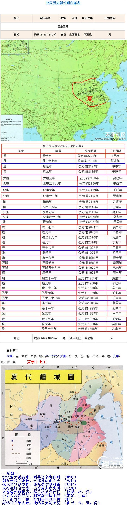

--夏朝--
承父业大禹治水，明奖惩皋陶作刑 （舜时）
分九州设立州牧，定邦基涂山之会 （禹时）
伐三苗华夏制胜，铸九鼎仿刻河山 （启时）
灭有扈钧台之享，出狩猎太康失国 （太康）
做傀儡仲康懦弱，驱子相后羿代夏 （仲康、相、羿）
杀后羿寒浞夺位，刺寒浞少康中兴 （寒浞、少康）
五十而贡什一税，杼制兽甲败东夷 （杼）
好淫乐孔甲乱政，战鸣条商汤灭夏 （孔甲，皋，发，癸）

在全唐诗中，以夏字结尾的诗句共有81句，其中颇有几句与夏朝有关。

--- 夏 有记录 81条---

[夏, {'禽言未知夏', '岳僧来坐夏', '洛水清奔夏', '法服应华夏', '竹亭阴合偏宜夏', '上异西河夏', '何如造区夏', '旅思又惊夏', '粗得御寒夏', '秦地雄西夏', '纷纭知近夏', '芰叶迎僧夏', '莲井偏宜夏', '坐经嵩顶夏', '积阳躔首夏', '有客有客名丘夏', '登楼逃盛夏', '祢生词赋抛江夏', '太白曾经夏', '暑候虽云夏', '月窟宾诸夏', '深仁浃夷夏', '兰若生春夏', '永愿坐长夏', '彼岸上人投结夏', '云景含初夏', '炎风每烧夏', '推诚抚诸夏', '阴山冰冻尝迎夏', '竹声寒不夏', '坐彻秦城夏', '野寺度残夏', '华缨羁大夏', '安居同僧夏', '瑶台既灭夏', '桃花欲经夏', '庭树蝉声初入夏', '何事留中夏', '大旆行当夏', '胡羯乱中夏', '山中应解夏', '瘴岭行冲夏', '公才掩诸夏', '王正会夷夏', '揭日昭东夏', '欲投莲岳夏', '山云随坐夏', '去腊催今夏', '齐竽混韶夏', '雨余清晚夏', '荷香销晚夏', '今日逢初夏', '摘荷才早夏', '好山逢过夏', '伴僧齐过夏', '有雪常经夏', '何山逢後夏', '此境无朱夏', '端午临中夏', '是时方盛夏', '虽云风景异华夏', '亦过春兼夏', '节变云初夏', '岂知名出偏诸夏', '色变云迎夏', '帝命泽诸夏', '床上水云随坐夏', '养病惬清夏', '蝉声怨炎夏', '布叶疑临夏', '兹山界夷夏', '罢郡归侵夏', '宁问春将夏', '皓气笼诸夏', '曾参与游夏', '石关清晚夏', '到家方坐夏', '何不遍西夏', '岭路分中夏', '初晴迎早夏', '燕国飞霜将破夏'}]