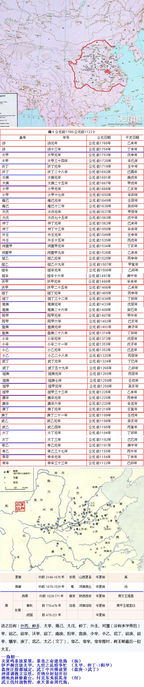

--商朝--
灭夏鸣条放夏桀，景亳之命建亳商 （汤）
伊尹桐宫拘太甲，九世之乱纷争忙 （太甲、仲丁->阳甲）
盘庚迁殷都城定，武丁中兴傅说贤 （盘庚->武丁）
神道调教立宗法，贡纳分封划井田
酒池肉林高鹿台，纣克东夷损其身 （纣）
武王伐纣战牧野，承天景命周代商。

在全唐诗中，以商字结尾的诗句共有45句，但是都与这个朝代无关。

[商, {'尽室逐渔商', '动如参与商', '岂期牛女为参商', '死灰弃置参与商', '雅奏在宫商', '萧萧飞雨助清商', '逸韵合宫商', '高歌浩唱发清商', '若遣趁宫商', '尘埃瑟上动清商', '雅韵乍含商', '有幸嫁盐商', '随钟嚼宫商', '津桥税海商', '地上修文待卜商', '瑶瑟清含商', '无因合宫商', '旦暮易渔商', '远将桃李作参商', '初律启金商', '有财不行商', '乐人先问调宫商', '玉吕灰飞含素商', '宝瑟韵清商', '一别似参商', '使君夫妇为参商', '一管妙清商', '灵娥鼓瑟韵清商', '宝瑟愁应商', '西河重卜商', '天上参与商', '隆隆远鼓集渔商', '夜夜吹清商', '西归律变商', '忽为宫别商', '津市半渔商', '松籁韵宫商', '所遇尽渔商', '万舞舍宫商', '金笳入暮应清商', '有时谐宫商', '况近秋天调是商', '乐变叶宫商', '官家不税商', '好风唯属往来商'}]