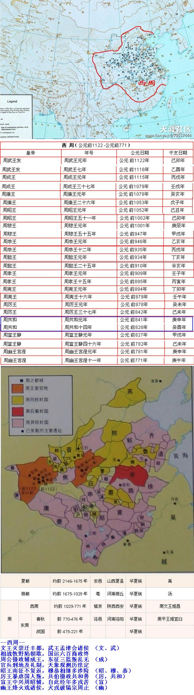

--西周--
文王灭崇迁丰都，武王孟津会诸侯 （文、武）
相战牧野陷朝歌，国运六百商政终
周公摄政辅成王，东征叛乱三监亡 （成）
官兵刑地及礼制，天象观测历法定
昭王南征不复返，穆恭相继多涉险 （昭、穆、恭）
厉王暴虐国人叛，共伯摄政共和善 （厉，共和）
宣王中兴周昭辅，自此经年多戎苦 （宣）
幽王烽火戏诸侯，犬戎破镐宗周止 （幽）

全唐诗中以周字结尾的诗句共有100句，颇有几句与周朝有关。

--- 周 有记录 100条---

[周, {'聿来及宗周', '六合朝行夕已周', '夕膳望东周', '九江归路隔东周', '我本长殷周', '拜揖曹与周', '名士礼能周', '夸作掩东周', '百一不及周', '其多弥道周', '独自忆庄周', '衣食常不周', '成道自衰周', '一日一万周', '戋戋贲帛周', '胡马满东周', '哀鸣惭不周', '年来岁六周', '晋室正藩周', '迨兹已一周', '一夜行一周', '星霜三四周', '目视远更周', '忽复四时周', '君怀明主去东周', '良时忽已周', '四象分明八卦周', '尽日悲宗周', '羡子去东周', '怀古圣情周', '糊口百家周', '一旦一再周', '万天俄已周', '天文七曜周', '从此化东周', '相送出东周', '两朝冠剑恨谯周', '悲令岁属周', '握手灵都周', '不归商受尽归周', '因此捐生触不周', '绵联杞树周', '公旦既思周', '都迷蝶与周', '日日三四周', '传我念京周', '何人识马周', '飞雨四溟周', '卑官到官年未周', '遐年越商周', '俯念忽已周', '四序忽已周', '秣马趋西周', '溪谷屡环周', '杂虏尽朝周', '智识仍未周', '事殷不事周', '星纪屡以周', '长安寒暑再环周', '颓颜惊岁周', '轮转夏殷周', '僵尸横道周', '亲戚拥道周', '生来岁未周', '天星已再周', '令人特地感庄周', '三十代宗周', '旧业向东周', '车轮马迹无不周', '疲瘵全苏岁又周', '三千上士满皇周', '万国仰宗周', '谋身智不周', '非独在隆周', '吾谓伊与周', '河润及东周', '池馆在东周', '日月不能周', '深隐始归周', '释难颇存周', '览新情屡周', '将命出东周', '老来东郡复西周', '鹤林权唱演功周', '天涯岁已周', '车法肇宗周', '野烟踪迹似东周', '玉烛几还周', '别来岁月周', '七见日星周', '病况不可周', '玉马遂朝周', '交喜岁才周', '自喜计虑周', '子欲适东周', '蹉跎属几周', '三杯兴已周', '果以此生周', '河洛越成周', '挥刀斫石恨谯周'}]