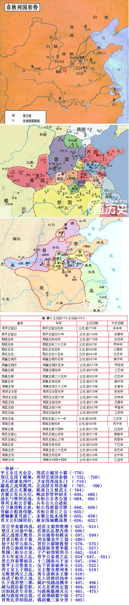

--春秋--
平王东迁灭余臣，郑武掘突小霸成（-770）
郑庄克段于鄢地，周郑交质因虢公 （-722，-720）
卫石碏谏宠州吁，卫宋伐郑战东门 （-719）
繻葛之战郑胜周，北戎侵齐显郑忽 （-707， -706）
曲沃武公灭翼城，熊通自立楚武王（-704）
齐襄公发兵灭纪，鲍叔荐管仲相齐（-693，-685）
战长勺曹刿论战，齐桓公北杏会盟（-684，-681）
尊周王桓公首霸，兵车会九合诸侯
存卫救邢败北狄，桓公伐楚盟召陵（-660，-656）
晋献公假道伐虢，齐桓公葵丘之会（-655）
避骊姬重耳流亡，宋襄公泓水战楚（-655，-638）
晋文公归国即位，救宋围城濮战楚（-636，-632）
盟践土文公二霸，崤之战秦晋争雄（-632，-627）
用百里秦霸西戎，抑楚穆赵盾主盟（-627，-613）
楚庄王问鼎中原，若敖氏乱楚内政（-606）
邲之战楚庄败晋，井田崩鲁初税亩（-597，-594）
晋景公败齐于鞌, 周室微虫牢之盟（-589）
劫子反华元弥兵，晋厉公鄢陵胜楚（-579，-575）
晋悼公新政和狄，战湛阪晋楚争霸（-572，-557）
鲁国三桓分公室，子产相郑铸刑书（-562，-554）
齐七年崔庆之乱，晋平公栾盈之乱（-554~-547，-551）
景公拜晏婴相齐，十三国弥兵于宋（-547，-546）
楚平王自娶秦女，伍子胥家破奔吴（-523，-522）
周王室王子朝乱，吴王僚攻楚州来（-520，-519）
吴败楚鸡父之战，勇专诸刺杀王僚（-519）
孙武子柏举之战，吴入郢楚昭西奔（-506）
孔子强君堕三都，阖闾伐越战槜李（-497，-496）
越勾践卧薪尝胆，吴夫差黄池会盟（-494，-482）
田恒弑君专齐权，勾践称霸越灭吴（-481，-475）
越勾践徐州会盟，迁琅琊末霸中原（-472）
晋智氏晋阳围赵，韩赵魏三家分晋（-457，-403）

全唐诗中以秋字结尾的诗句共有1295条，其中颇有一些是以春秋二字结尾的。

--- 秋 有记录 1295条---

[秋, {'风涛动地海山秋', '蝉噪野风秋', '背时容色入新秋', '笑插黄花满鬓秋', '日带残云一片秋', '空对白榆秋', '金台又度秋', '晴空万里秋', '云色渡河秋', '代马喷风秋', '帘卷半空秋', '少年初拜大长秋', '离思茫茫正值秋', '薄日蒙咙秋', '故林棠树秋', '微云疏雨淡新秋', '蝉噪六街秋', '鞍马信清秋', '燕支颗破麦风秋', '平临云鸟八窗秋', '两鬓当春却似秋', '冷澹过清秋', '延长应续鹤春秋', '古人犹悲秋', '把菊东山秋', '华清宫树不胜秋', '竟夕自悲秋', '客行悲清秋', '离家春是秋', '怀古对穷秋', '汉水月方秋', '碧树仍逢岫外秋', '上善湛然秋', '光似露涵秋', '却著寒衣过麦秋', '有时当暑如清秋', '节过清明却似秋', '那知瑞草秋', '月上重楼丝管秋', '满筵惊动玉关秋', '水烟波淡海门秋', '欲归还待海风秋', '月明应认旧江秋', '悲凉物已秋', '衙鼓未残兵卫秋', '责帅惧春秋', '尽日凝眸岳色秋', '此树独相两鬓秋', '萤散野风秋', '知掩山扉三十秋', '山阴古塞秋', '残照古山秋', '旧迹依然已十秋', '射马台深玉署秋', '未逾七十秋', '宿留洞庭秋', '天高星汉秋', '无奈每年秋', '蓟北乍惊秋', '雨鬓计应秋', '霜飞天苑御梨秋', '一举青云在早秋', '疏蝉橘岸秋', '猿啸野风秋', '正逢霄汉秋', '归卧故山秋', '地接潇湘畏及秋', '元和二年秋', '夫差亡国已千秋', '那得到深秋', '萧条楚地秋', '别筵欲尽秋', '绿阴寂寞汉陵秋', '年来鬓已秋', '上阳花木不曾秋', '晶明白日秋', '白须萧飒管弦秋', '楚客伤离不待秋', '高情鹤见秋', '梅天已思秋', '衡漳白露秋', '千古冥冥潭树秋', '路长应过秋', '快走踏清秋', '不知何事爱悲秋', '相思绿蕙秋', '萧萧万里秋', '戍城逢笛秋', '万里月明湘水秋', '烟含楚色秋', '茫茫边草秋', '荒庭白露秋', '萧条正值秋', '风江飒飒乱帆秋', '旁到五峰秋', '山光澹早秋', '蝉噪槐花已四秋', '秦吴烟月十经秋', '歌厌竹枝秋', '留得荆湘一片秋', '日月换新秋', '远会隔高秋', '连天草木秋', '堤草芦花万里秋', '羽客伴吟松韵秋', '疏柳影中秋', '天上喜新秋', '翠束寒声千里秋', '犹疑大漠秋', '凛凛如高秋', '自从江树秋', '蟋蟀床生半夜秋', '声断为兼秋', '玉蟾珠露两清秋', '十见罗浮秋', '潇洒江湖十过秋', '紫椴黄花故国秋', '园果让新秋', '海云含雨秋', '雁过古城秋', '华鬓集新秋', '金凤花开云鬓秋', '饮别岁方秋', '破窗残月五更秋', '林间水正秋', '秦树叶应秋', '落涧泉声长自秋', '昏垫弥今秋', '朔风吹叶雁门秋', '露槿已伤秋', '霜露几逢秋', '子牟衰鬓暗惊秋', '常恐百虫秋', '檐前山朵最宜秋', '行逢江海秋', '凛然中国秋', '秋非我独秋', '西岭松声落日秋', '观涛海门秋', '树色应无江北秋', '玉扇画堂凝夜秋', '久卧长安春复秋', '露白禁门秋', '写得松江岸上秋', '晴眺喜逢秋', '何以迎早秋', '浩然天地秋', '送君别有八月秋', '蓼花苹穗正含秋', '及此凡经十五秋', '寥落天地秋', '山回野云秋', '萧飒海树秋', '前峰当槛秋', '风蝉迎早秋', '肠断故园秋', '荷香送麦秋', '月净襄阳秋', '杳杳隙尘秋', '江干入夜杵声秋', '蓬鬓莫先秋', '属当赋敛秋', '今日相逢明日秋', '师经几夏我经秋', '弦管韵高山欲秋', '还看蓬鬓秋', '团扇无情不待秋', '管色凄凉似到秋', '青苔钵上秋', '长安城外白云秋', '白发我先秋', '吟味不如秋', '日落黄云秋', '养馆洞庭秋', '峰前峰後寺新秋', '珠露金风下界秋', '浓盖舜坟秋', '白榆风飒九天秋', '山当日落秋', '蝉吟堤树秋', '汉甲百万屯边秋', '井桐吟雨不胜秋', '松雨蒲风夜艇秋', '莎草缘墙绿藓秋', '稀逢岁有秋', '月华清兴秋', '伤心不独为悲秋', '水物轻明淡似秋', '风林两岸秋', '金花笑菊秋', '塞雪下中秋', '槐柳未知秋', '风帘似水满床秋', '孤圆冷莹秋', '纨扇曲中秋', '万里飘零十二秋', '眇然波上秋', '洞庭相逢十二秋', '松桂不停秋', '歌舞宜停织女秋', '萧条川气秋', '风雨送凉秋', '天子富春秋', '先惊鬓发秋', '菊气入新秋', '独树对悲秋', '战马闲来塞草秋', '江南为客正悲秋', '新月照边秋', '楚客怨逢秋', '帆挂隔年秋', '萧条边已秋', '何言轻数秋', '蔓草生来春复秋', '後岭香炉桂蕊秋', '羌胡正晚秋', '沧海成尘几万秋', '河汉岛前秋', '一辞兰省见清秋', '故园无信水云秋', '菊有精神为傍秋', '闲阻清谈又一秋', '泛叶建章秋', '单衣蓟北秋', '洞庭风软荻花秋', '时逢山水秋', '肯念高皇沐雨秋', '终念对穷秋', '客思先觉秋', '鸾凤分飞海树秋', '枕席如凉秋', '古木带蝉秋', '宿在孤城闻雨秋', '泛露忽惊秋', '商声清脆管弦秋', '思归鬓发秋', '更值楚山秋', '门前树已秋', '羞对镜中秋', '寒事飒高秋', '角咽海城秋', '人似隔河秋', '相见冷于秋', '寥落讵关秋', '野寺疏钟万木秋', '主人庭树秋', '夫婿大长秋', '徒御亦悲秋', '高殿晓风秋', '空怀汗漫秋', '再见洞庭秋', '衰鬓去经彭蠡秋', '六七年来春又秋', '花开草复秋', '十年分散剑关秋', '夏夜如凉秋', '露下南宫星汉秋', '茫茫晓日下长秋', '草木岸无秋', '去岁此悲秋', '雨声孤寺秋', '星畔白榆还报秋', '风递玉筝秋', '逃暑迎春复送秋', '独有曲江秋', '不似闲栖折苇秋', '海浸城根老树秋', '万户砧声水国秋', '明月照帷秋', '英华忽已秋', '松风直似秋', '砧声近报汉宫秋', '朝朝分散敬亭秋', '摇落岁时秋', '尽见四山秋', '却疑初梦镜湖秋', '团扇须防白露秋', '云边江树秋', '北风微雨虚堂秋', '行已及素秋', '蛩思静先秋', '空谷宜清秋', '千里书回碧树秋', '雁合碛西秋', '烟花春复秋', '家在荒陂长似秋', '箫鼓哀鸣白云秋', '声袅月中秋', '开襟五月似高秋', '片叶井梧秋', '机杼暗传秋', '窗竹夜鸣秋', '露气早知秋', '风凉运渎秋', '风高苇岸秋', '不到终南向几秋', '菊酒对金秋', '海门吟处水云秋', '先闻贺有秋', '一登高阁眺清秋', '寒蝉碧树秋', '两京春复秋', '烟树人间一片秋', '老圃寒香别有秋', '病寄南徐两度秋', '琉璃潭上新月秋', '凄凉枕席秋', '含风广泽秋', '朝看春色暮逢秋', '诗思动先秋', '醉卧凉风拂簟秋', '在夏亦如秋', '繁声四壁秋', '下杜乡园别五秋', '潭静菊花秋', '我来结绶未经秋', '淅然云景秋', '梦里换春秋', '今秋似去秋', '冷声萦枕野泉秋', '法筵会早秋', '白云吟过五湖秋', '与近高窗卧听秋', '读书凡几秋', '露桃华里不知秋', '密云郊外已回秋', '虫声迥映秋', '碧山长冻地长秋', '故垒萧萧芦荻秋', '万里胡天海塞秋', '水槛风凉不待秋', '霜庭景气秋', '还是一年秋', '白帝城边树色秋', '鹤辔赤茸秋', '飞去飞来烟雨秋', '萧飒不胜秋', '回日定非秋', '青山江上秋', '贱价买清秋', '久客病高秋', '吟当白露秋', '浩歌一曲兮林壑秋', '硬骨残形知几秋', '酒献菊花秋', '铎外风轻四境秋', '下帷常讨鲁春秋', '蔡琰归时鬓已秋', '共哂横汾歌吹秋', '潘岳双毛去值秋', '徒爱清华秋', '星垣松殿几千秋', '石烂松枯经几秋', '暮雨萧萧庭树秋', '此是千秋第一秋', '山色正矜秋', '簟卷两床琴瑟秋', '桑榆烟景两淮秋', '天气晚来秋', '苍翠剡中秋', '疑是世间秋', '卧病复高秋', '终年风雨秋', '旃檀碧树秋', '桐树心孤易感秋', '嘉禾看却报新秋', '水晶盘冷桂花秋', '风已报庭秋', '别来蓬鬓秋', '两逢霜节菊花秋', '废垒蝉鸣不待秋', '夜直河汉秋', '涿鹿茫茫白草秋', '歌钟声断梦千秋', '翠华宫树不胜秋', '黄河水白黄云秋', '还如骑省秋', '红蓼花疏水国秋', '此去风正秋', '又恐芭蕉不奈秋', '日照高情的的秋', '茹血衣毛十九秋', '西园杨柳暗惊秋', '照人肌发秋', '燕支山上暮云秋', '匈奴哂千秋', '浣衲海沙秋', '风静竹含秋', '南国正清秋', '新程逦迤秋', '碧芙蓉笑水宫秋', '何树落先秋', '野旆晴翻郢树秋', '摧残古木秋', '不因一叶秋', '画图兼列远山秋', '时当淮海秋', '夕阳衰草杜陵秋', '蝉报两京秋', '凉引簟先秋', '一别几千秋', '田家贺有秋', '红树谢村秋', '十二峰前一望秋', '崖谷飒已秋', '空山明月秋', '露滴玉盘青桂秋', '篷飞荒塞秋', '跳池四五秋', '别来林木秋', '三伏炎天凉似秋', '分明宫漏静兼秋', '长恨西风送早秋', '风雨兴中秋', '草木十年秋', '此地独先秋', '欲访因循二十秋', '雨滴梧桐山馆秋', '凝碧初高海气秋', '露压烟欺直到秋', '读自清如秋', '匈奴笑千秋', '围炉相忆杜陵秋', '寒塘坐见秋', '枫叶早惊秋', '一声长啸海山秋', '黄河不用更防秋', '钝碧顽青几万秋', '已隔前春复去秋', '壮士悲歌易水秋', '峰高玉蕊秋', '陇塞俨然秋', '天高气象秋', '凄凄天地秋', '西风九月草树秋', '璇舆御早秋', '久别鬓毛秋', '一曲商歌天地秋', '山形菡萏秋', '夜来砧杵六宫秋', '汀葭晦若秋', '心醉授衣秋', '物换星移几度秋', '归去海门秋', '宋玉怨三秋', '良宵复杪秋', '风流才器亦悲秋', '四绝堂前万木秋', '床下有蛩长信秋', '席箕风起雁声秋', '须避蒺藜秋', '孤情峭拔凌清秋', '闻猿岛岫秋', '碧落香销兰露秋', '笑声唯是说千秋', '松门预带秋', '李夫人病已经秋', '幢幢云树秋', '江上月华秋', '壶中天地不曾秋', '更无鹰隼与高秋', '雨暗转逢秋', '静对五峰秋', '九华晴望倚天秋', '来感长安秋', '门掩候虫秋', '木落雁门秋', '梦里故园秋', '倏尔过春秋', '月出沧溟世界秋', '春尽之官直到秋', '风急夜江秋', '今日因何独怨秋', '云物是清秋', '独照玉容秋', '含光万里秋', '客衣飘摇秋', '案白小窗秋', '调角断清秋', '黑也不禁秋', '时晚鬓将秋', '还当三千秋', '堪忆玉京秋', '听蝉满树秋', '秋浦长似秋', '风景一家秋', '月明陵树秋', '银汉横空万象秋', '光含万象秋', '次第看花直到秋', '天暖树无秋', '重忆别离秋', '岳麓云深麦雨秋', '自此无春秋', '咸阳草树八回秋', '风雨萧萧欲暮秋', '迢递岐山水石秋', '金井凉生梧叶秋', '凄凉天地秋', '萧条梧叶秋', '昏旦思兼秋', '一夜炎荒并觉秋', '边月空悲芦管秋', '见尔当何秋', '老僧传锡已千秋', '临水涧霜秋', '露竹风蝉昨夜秋', '虎倦龙疲白刃秋', '雨苔烟草古城秋', '行值洛阳秋', '芦花满眼秋', '无令壮志秋', '独爱前山秋', '白发惊看镜里秋', '无风一片秋', '官闲马病客深秋', '蜀国春与秋', '风月又清秋', '岂直日三秋', '天宝纪春秋', '频来一叶秋', '鹰隼柏台秋', '开济生灵校一秋', '骨冷禅中太华秋', '高天白露秋', '山色报新秋', '连空赵魏秋', '漫空正仲秋', '别浦雁宾秋', '胡风夏甚秋', '今夕阳春独换秋', '绿蒲红蓼练塘秋', '日照海山秋', '方验大椿秋', '雁行高送石城秋', '蝉急楚乡秋', '萤度远烟秋', '不得乡书又到秋', '枕簟即知秋', '迟于春日好于秋', '霜向锷中秋', '武昌鸿业土崩秋', '行看白草秋', '松雨蒲风野艇秋', '禅庭古树秋', '终南山色入城秋', '风神洒落占高秋', '风飙凝古秋', '风玉尚敲秋', '风散柳园秋', '剪雨裁烟一节秋', '离披风雨秋', '龙钟更是对穷秋', '广陵新月海亭秋', '牛女相期七夕秋', '寒岭镇迎秋', '无事住经秋', '声常占得秋', '走马曾防玉塞秋', '而我亦伤秋', '无事辞家雨度秋', '萧瑟後庭秋', '两三行雁帖云秋', '树色川光入暮秋', '萧萧落叶送残秋', '辞春不及秋', '三殿风高药树秋', '潘郎振藻秋', '淅淅野风秋', '云物是新秋', '浩歌气横秋', '谢守青山看入秋', '昨夜有兼秋', '轩辕厌代千万秋', '空林望已秋', '衡岳坐经秋', '菰蒲相与秋', '客思满穷秋', '沧海雁送秋', '临江洒素秋', '况当风月满庭秋', '郢南再悲秋', '一声歌动寺云秋', '山香松桂秋', '抱疾入高秋', '共工争帝力穷秋', '意欲住经秋', '长安夜半秋', '数茎霜鬓已惊秋', '行玩菊丛秋', '姓名兼显鲁春秋', '林泉已近暑天秋', '二气共含秋', '长信萤来一叶秋', '天恩禁旅秋', '鬓毛生麦秋', '吴丝蜀桐张高秋', '楚木向云秋', '榆落雕飞关塞秋', '晚麦芒乾风似秋', '不过五湖秋', '溪声凉傍客衣秋', '青林不换秋', '风雨萧萧旅馆秋', '更值一年秋', '月满骊山宫树秋', '高柳怯清秋', '寒菊年年照暮秋', '水国夜生秋', '雨开浔阳秋', '谁能脉脉待三秋', '帐开红旆照高秋', '朔雁衔边秋', '风紧云轻欲变秋', '不多说著洛阳秋', '汉家宫阙动高秋', '春还鬓已秋', '更饶君占一年秋', '柴门深掩古城秋', '共期罗浮秋', '尔来三千秋', '苍然云水秋', '草赤火山秋', '伏念已经秋', '风吹绢海秋', '枫树猿声报夜秋', '鹭起湖田片雨秋', '山门月对秋', '水关红叶秋', '诗魔又爱秋', '旷思孤云秋', '噪向残阳意度秋', '林薄委徂秋', '锡含风雨一枝秋', '苍苔满径竹斋秋', '金殿不胜秋', '病叶落非秋', '霜卧洛阳秋', '空赋白云秋', '边邑鸿声一例秋', '依旧汉家宫树秋', '风物坐含秋', '如看岛屿秋', '碛路天早秋', '翠岭明华秋', '瘴疠满冬秋', '月出西南露气秋', '波似洞庭秋', '豪家不见秋', '翠微苍藓几经秋', '江天寂历江枫秋', '莫待楚山秋', '敌君三万秋', '蝉柳响如秋', '山门月照秋', '饥鹰望到秋', '楚山萧萧笛竹秋', '置酒赏清秋', '万籁百泉相与秋', '宿莽竞含秋', '亭传理残秋', '连天烽火阵云秋', '白云红叶又新秋', '碧花菱角满潭秋', '萧萧梁栋秋', '千里家书动隔秋', '白草胡沙西塞秋', '风沙道路秋', '林风爽带秋', '四十字边秋', '岭外今来白露秋', '丁当急响涵清秋', '金尊玉柱对清秋', '鹤语记春秋', '宁知春与秋', '淅尔凉风非为秋', '晓簟觉新秋', '叶下洞庭秋', '大河平野正穷秋', '九月正乘秋', '万里书回碧树秋', '铸来几千秋', '况值江南秋', '贫家怯到秋', '行人巴草秋', '千声各为秋', '花谢汉宫秋', '佳人卧病动经秋', '此地烂熳火烧秋', '同向银床恨早秋', '伤古复兼秋', '岁月任春秋', '松韵自悲秋', '书到洛阳秋', '洞庭今更秋', '据此自千秋', '月入草堂秋', '南朝古木向人秋', '百战又防秋', '花满自然秋', '今日用贤秋', '野松孤月即千秋', '陇头一段气长秋', '深夜风清枕簟秋', '谁谓历三秋', '肯逐人间风露秋', '雪挂一丛秋', '怀归伤暮秋', '寂寂箕山春复秋', '天寒耐九秋', '遭逢兴运秋', '客程千里秋', '可堪分袂又经秋', '乱雨海门秋', '蒿莱满径秋', '薄日朦胧秋', '紫芝峰下更高秋', '公来第四秋', '天意在宜秋', '菡萏落红秋', '人归故国秋', '曾负秋风多少秋', '此生心气贯清秋', '木落识岁秋', '吹管白云秋', '带雾停风一亩秋', '当君乘兴秋', '鸡豚燕春秋', '看花亦似秋', '马嘶残雨晚程秋', '白雁啼残芦叶秋', '凉风满簟秋', '落花明月满宫秋', '心似澄江月正秋', '风惊折叶秋', '散随金磬泥清秋', '赖是春风不是秋', '况复大江秋', '一别心知两地秋', '从知历亿秋', '细雨二陵秋', '树落给园秋', '日往月来凡几秋', '皎镜方塘菡萏秋', '北风吹落满城秋', '珠彻汉江秋', '庭中竹撼一窗秋', '川光静高秋', '鸟外尘中四十秋', '衰鬓飒如秋', '也是无多过一秋', '翻觉夜成秋', '伊水晴光碧玉秋', '不觉隋家陵树秋', '鼯啼桂方秋', '宁祗庆重秋', '诗人旧怨秋', '青鸟西沈陇树秋', '不知经历几千秋', '潺潺濑响秋', '御马新骑禁苑秋', '朱槛低临众木秋', '摇成陇树秋', '陂塘五月秋', '孤城江上秋', '明朝桐树秋', '去日如三秋', '宦游三十秋', '泉台千万秋', '月照海门秋', '便是太平秋', '湖光共月秋', '江村摇落暂逢秋', '延眺属清秋', '万井千山海色秋', '虫声冬思苦于秋', '密树含凉镇似秋', '魂销四海秋', '真貌月悬秋', '渺渺荻花秋', '一叶随风忽报秋', '难防塞草秋', '二年征战剑山秋', '夏夜长于秋', '羸备我逢秋', '九天悬处正当秋', '犹胜菊花秋', '逢此北风秋', '此夜後池秋', '榛芜年貌秋', '枣巷风雨秋', '别家疑数秋', '满地槐花秋', '一坐经今四十秋', '日夕方高秋', '到邑早蝉秋', '风云已落秋', '枫叶满山秋', '白云犹似汉时秋', '桑叶先知胡地秋', '放逐南来泽国秋', '鱼戏石潭秋', '後夜磬声秋', '零陵香草露中秋', '鄱阳农事劝今秋', '寂寂坐中秋', '闻蛩教我独惊秋', '川清树欲秋', '象尺熏炉未觉秋', '夏来全占满床秋', '空山一磬秋', '下钓坐清秋', '多来自早秋', '无事莫经秋', '婺女星边气不秋', '萧萧帷箔秋', '栽松莫厌秋', '零陵芳草露中秋', '入海浮生汗漫秋', '旅馆再经秋', '松色不肯秋', '五月不热疑清秋', '前值东风後值秋', '阿童高议镇横秋', '吟过晓蝉秋', '月移山树秋', '虫声阴雨秋', '猿鸟暮声秋', '枫叶枝边一夕秋', '一簟临窗薤叶秋', '雁不平沙万里秋', '吹角楚天秋', '雨声孤馆秋', '吹笛桥边木叶秋', '烟光浩楚秋', '锁开阊阖万山秋', '应想故城秋', '水凉风似秋', '黄昏独上海风秋', '白草黄云塞上秋', '飒然云树满岩秋', '松节凌霜几换秋', '独此月前秋', '不见玉泉千万秋', '便须含泪对残秋', '黄河东注杏园秋', '朗咏临清秋', '兹事已千秋', '北窗人卧秋', '往来重见此塘秋', '爽气集高秋', '如报杜陵秋', '葛衣断碎赵城秋', '南中才忌秋', '欢拟济河秋', '星冷玉泉秋', '里社萧条旅馆秋', '又见芭蕉白露秋', '边风已报秋', '玉箫冷吟秋', '菡萏水中秋', '偶别已经秋', '苍茫万里秋', '遥知故国秋', '兹日奉千秋', '律正乾坤八月秋', '菌阁赋诗江树秋', '池空水月秋', '松风飒惊秋', '傍山寻水过却秋', '水色带江秋', '瘴浦不宜秋', '毛遂请行秋', '醉杀洞庭秋', '湖阔片帆秋', '此辈岂无秋', '江南岁有秋', '黄河东注荻花秋', '近南风景不曾秋', '钓鱼春复秋', '习静更宜秋', '蹉跎二十秋', '病身初起向残秋', '草芳崎岸不曾秋', '茧实麦小秋', '共谢洛阳秋', '独吟红药对残秋', '水净觉天秋', '战马识边秋', '月色澹新秋', '离声满竹秋', '蝉知秦树秋', '雨余风气秋', '流血千万秋', '庭寒渭水秋', '霜剪红兰不待秋', '土偶人前枳树秋', '陵柏无心竹变秋', '自别崔公四五秋', '双燕巢分白露秋', '碧海醒心秋', '长叹累冬秋', '无人不咏洛阳秋', '卷幔五湖秋', '红烛乍迎秋', '只有空床敌素秋', '光含万里秋', '茱萸满把秋', '句吴亭东千里秋', '红衣不耐秋', '砧声那似去年秋', '月明宫殿秋', '一日如三秋', '林邑山连瘴海秋', '卧簟觉新秋', '蝉急众山秋', '未秋为别已终秋', '吟经栈阁雨声秋', '闻说胡兵欲利秋', '家对旧山秋', '白衣四十秋', '微凉群树秋', '三田大有秋', '四十余帝三百秋', '一城砧杵捣残秋', '谁论春与秋', '移石太湖秋', '残莺何事不知秋', '凤历肇千秋', '窗外碧云秋', '风物最宜秋', '此时何异洞庭秋', '绝顶正清秋', '大抵花颜最怕秋', '微凉麦弄秋', '一节呼龙万里秋', '风烟废宫秋', '声繁高树秋', '江上枫林秋', '花乱正深秋', '出门天气秋', '石上泉声带雨秋', '清景期杪秋', '依稀三十秋', '哀鸣下界秋', '一叫云山秋', '疏雨似深秋', '一夜独当秋', '枇杷门向楚天秋', '时将四十秋', '清风占早秋', '楚词尚悲秋', '峨眉山月半轮秋', '江月值新秋', '八月洞庭秋', '巴陵一望洞庭秋', '霜髭拥颔对穷秋', '其来非一秋', '出郊山戍秋', '故山明月秋', '倏然经杪秋', '江皋芳树秋', '惆怅洞庭秋', '夜台归去便千秋', '远雁伤离几地秋', '若看琪树即须秋', '蝉鸣黄叶汉宫秋', '齐鲁西风草树秋', '去程雕鹗弄高秋', '猿叫洞庭秋', '林麓飒然秋', '清冷逆旅秋', '犹能三伏凛生秋', '青雀船横雁阵秋', '看月五陵秋', '华露湛新秋', '松合径先秋', '最团圆夜是中秋', '跳丸日月十经秋', '一年虚过秋', '忆著长安索米秋', '气助潇湘秋', '泉连石岸秋', '一别巫山树几秋', '长庆二年秋', '荒营野草秋', '婺女旧山秋', '物色近新秋', '倚处戟门秋', '兴尽荆吴秋', '鸟下梧桐秋', '得道年来八百秋', '天上琼花不避秋', '北风雁急浮云秋', '为说征南已五秋', '汉武迎仙紫禁秋', '尝忆江都大业秋', '风悲汉苑秋', '笑激风飙秋', '不让横汾秋', '草色向家秋', '已过六七秋', '後会必经秋', '再过兰杜秋', '萧萧天地秋', '树色轻含御水秋', '坛畔月明千古秋', '红蓼花前水驿秋', '人皆寿命得千秋', '竹深夏已秋', '主人杯馆秋', '销歇恐成秋', '古渡渺千秋', '云日关东秋', '空山独卧秋', '三五玉蟾秋', '双峰月色秋', '九重门锁禁城秋', '团扇复迎秋', '一星烽火朔云秋', '夏景似清秋', '长贫早觉秋', '山川当暮秋', '淮南木叶正惊秋', '击汰悲新秋', '蹉跎淮海秋', '更惜芳庭冷似秋', '风传渭北秋', '一夕绕山秋', '摇落鼎湖秋', '江枫见早秋', '荆门树色秋', '堪得几回秋', '香径佛宫秋', '日暮戾园风雨秋', '菰蒲林下秋', '自闭长门经几秋', '翱翔鸣素秋', '空园卧见秋', '万物已惊秋', '皓月牵吟又入秋', '白帝霜舆欲御秋', '言念忽悲秋', '白草黄榆六十秋', '苇色鹭鸶秋', '岚光入素秋', '乔木不知秋', '宋玉亭前悲暮秋', '人间四十秋', '破镜悬清秋', '独倚长剑凌清秋', '别来逾十秋', '孤吟月色秋', '犹隔洞庭秋', '千家淮水秋', '感时琴瑟秋', '石床苔色几经秋', '皆传玉露秋', '蛩思蝉声满耳秋', '妇姑城南风雨秋', '此夕未知秋', '一为取新秋', '城角泣断关河秋', '真伤白帝秋', '遥哭苍梧山江上秋', '合欢叶堕梧桐秋', '兰摧菊暗不胜秋', '蝉急两河秋', '彼此不胜秋', '醉听洞庭秋', '琪树西风枕簟秋', '菊花枫叶向谁秋', '紫殿几含秋', '年深椿欲秋', '湘燕远迎秋', '麦凉江气秋', '黄蘖作驴秋', '关山落叶秋', '清商一部管弦秋', '雁下平沙万里秋', '夜色涵早秋', '江南想暮秋', '野水浮云处处秋', '潮过金陵落叶秋', '人忆故乡山正秋', '九重深锁禁城秋', '诗思碧云秋', '石室烟含古桂秋', '桐江到未秋', '西入潼关云木秋', '遥悲水国秋', '柿叶翻红霜景秋', '林色葱笼玉露秋', '月皎霜寒大漠秋', '白草四郊秋', '草木从春又到秋', '片时已过十经秋', '摇落江天欲尽秋', '月带楚城秋', '清江月色傍林秋', '风起洞庭秋', '风来万物秋', '草色古城秋', '水泥红衣白露秋', '後书乾宁三年秋', '窗中海月早知秋', '更度一年秋', '不似去年秋', '沦弃即千秋', '未便阴崖秋', '笑谈华发镜中秋', '洛水流千秋', '门闭莓苔秋', '锦筵歌板拍清秋', '又度一年秋', '雨簟更深满背秋', '万方同乐奏千秋', '新萤落晚秋', '穷愁暮雨秋', '惆怅梁园秋', '回风吹早秋', '归望山云秋', '登高但忆秋', '一岁又残秋', '江雨麦田秋', '露白蟾明又到秋', '边草夏先秋', '白发又经秋', '埋没已经秋', '不到又逢秋', '极美宜于秋', '苇声骚屑水天秋', '湘云拂雁秋', '握节悲阳秋', '浮淮一雁秋', '一声歌发满城秋', '萧条斋舍秋', '翻成黯澹秋', '离别相逢四十秋', '鹦林对晚秋', '家临海树秋', '江澄水浴秋', '帐殿别阳秋', '宋玉本悲秋', '云水更宜秋', '绵春历夏复经秋', '婕妤团扇苦悲秋', '况乃潇湘秋', '充国大田秋', '洞庭霜落水云秋', '莲花峰翠湿凝秋', '恨咽离筵管吹秋', '萧萧到海秋', '借问榆花早晚秋', '笑他长信女悲秋', '黔阳贡物秋', '不听笙歌直到秋', '月满洞庭秋', '霜翦红兰不待秋', '又逢团圆秋', '病来犹作晋春秋', '壮气横三秋', '猿到三声月为秋', '临轩御早秋', '大河风物飒然秋', '和烟飞下禁城秋', '不觉颓年秋更秋', '迟暮更逢秋', '今夜银河万里秋', '江蓠春尽岸枫秋', '存亡三十秋', '忍看烟草茂陵秋', '新月始临秋', '离思返如秋', '淮南木落早惊秋', '十指宫商膝上秋', '萧萧荆楚秋', '谁教计会一时秋', '东南仞仞秋', '白黄黄榆六十秋', '今夕山上秋', '涛落浙江秋', '洞隐鱼龙月浸秋', '芙蓉新落蜀山秋', '风知升杜秋', '归梦不宜秋', '深隐天台不记秋', '猿鸣江树秋', '江声已似秋', '凤归林正秋', '寻山石径秋', '林水已迎秋', '是时山水秋', '焉能待高秋', '三年官罢杜陵秋', '三十二悲秋', '黄帝二载秋', '政成应未秋', '西风袅袅秋', '一从出守五经秋', '断猿寒啼秋', '霜鬓度年秋', '连江雨送秋', '烟村社树鹭湖秋', '露中黄叶飒然秋', '洞庭云梦秋', '沙边唯览月华秋', '衣寒地下秋', '此时方见秋', '传庆百千秋', '风悲兰杜秋', '何用读春秋', '上皇行处不曾秋', '清风亦似秋', '雨声如别秋', '仆射陂寒树影秋', '关河碛气秋', '秣马轻前秋', '忘形为九秋', '登位富春秋', '十见红蕖秋', '皎皎白林秋', '古木带高秋', '飘萧松桂秋', '芳草不知秋', '还将大笔注春秋', '复此萍蓬二十秋', '云白海天秋', '城孤白帝秋', '每到仙宫即是秋', '江上雨兼秋', '落日连村好望秋', '骨肉分飞又入秋', '孤飞一雁秦云秋', '阁倚碧天秋', '始复知天秋', '爱火老春秋', '便到攀辕卧辙秋', '呜咽难声管吹秋', '凤历启千秋', '嬴政鲸吞六合秋', '波涛西接洞庭秋', '冷雨凉风拂面秋', '嵩云白入秋', '婵娟春尽暮心秋', '草白见边秋', '野色遍呈秋', '韩信庙前枫叶秋', '人别十三秋', '声入碧云枫叶秋', '乡思岂唯秋', '歌回石城秋', '如病如痴二十秋', '悬圃清虚乍过秋', '猿叫远思鄂渚秋', '空堂寂寞秋', '微凉麦正秋', '星河耿耿正新秋', '落帆江雨秋', '高人梦断一床秋', '织女分明银汉秋', '早是他乡值早秋', '轻裾海雾秋', '归期眇凉秋', '汉宫纨扇岂禁秋', '灵源紫阁秋', '江看剑影秋', '洛下三分红叶秋', '叶坠空阶折早秋', '我意如百秋', '孤猿衔恨叫中秋', '路傍空为感千秋', '琴响碧天秋', '晚雨霏微思杪秋', '岩泉冷似秋', '深入乱山秋', '伤春复怨秋', '蝉声觉送秋', '伤春未已复悲秋', '吴公台下别经秋', '夏禹崩来一万秋', '巴塞连山万里秋', '牧龙丈人病高秋', '芙蓉苑里起清秋', '况值菊花秋', '谢豹声催麦陇秋', '应似古来秋', '长涯烟水又含秋', '名重晋阳秋', '加年须喜鬓毛秋', '岸柳萧疏野荻秋', '蝉噪已先秋', '从春复到秋', '零露竹风秋', '奔腾千万秋'}]