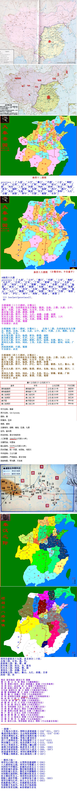

--秦朝--
#秦四十二郡
province = ['九原', '云中', '雁门', '代郡', '上谷', '渔阳', '右北平', '辽西', '辽东', '广阳', '河间', '恒山', '太原', '上郡', '河东', '上党', '赵郡', '河内', '清河', '济北', '临淄', '胶东', '城阳', '薛郡', '东郡', '砀郡', '四川', '颖川', '三川', '内史', '北地', '陇西', '汉中', '南阳', '淮阳', '九江', '会稽', '南郡', '黔中', '巴郡', '蜀郡', '长沙']

#秦四十八郡
province = ['九原', '云中', '雁门', '代郡', '上谷', '渔阳', '右北平', '辽西', '辽东', '广阳', '钜鹿', '恒山', '太原', '上郡', '河东', '上党', '邯郸', '河内',  '东郡', '济北', '临淄', '胶东', '琅琊', '薛郡', '东海', '泗水', '砀郡', '陈郡', '颖川', '三川', '内史', '北地', '陇西', '汉中', '南阳', '衡山', '九江', '鄣郡', '会稽', '南郡', '黔中', '巴郡', '蜀郡', '长沙', '庐江', '闽中', '南海', '桂林', '象郡']

分郡规则（三十六郡时，计数36）
北境十二郡，自西南往东北分别是：陇西，北地，上郡，九原，云中，雁门，代郡，上谷，渔阳，右北平，辽西，辽东。
原齐境三郡：齐郡，薛郡，琅琊
原吴楚六郡：黔中，长沙，九江，故鄣，会稽，南郡
汉水北七郡：汉中，南阳，四川，砀郡，东郡，颖川，三川
黄河北五郡：河东，上党，太原，邯郸，钜鹿
西南部两郡：巴郡，蜀郡
中央部分：内史

分郡规刚（四十二郡时，计数42）：北境十二郡，自西南往东北分别是：陇西，北地，上郡，九原，云中，雁门，代郡，上谷，渔阳，右北平，辽西，辽东。
原齐境五郡：济北，临淄，胶东，薛郡，城阳
原吴楚五郡：黔中，长沙，九江，会稽，南郡
汉水北八郡：汉中，南阳，淮阳，四川，砀郡，东郡，颖川，三川
黄河北九郡：河东，河内，上党，太原，恒山，赵郡，清河，河间，广阳
西南部两郡：巴郡，蜀郡
中央部分：内史

分郡规则（四十八郡时，计数49）：
北境十二郡，自西南往东北分别是：陇西，北地，上郡，九原，云中，雁门，代郡，上谷，渔阳，右北平，辽西，辽东。
原齐境五郡：济北，临淄，胶东，薛郡，琅琊
原吴楚九郡：黔中，长沙，庐江，闽中，会稽，鄣郡，九江，衡山，南郡
汉水北九郡：汉中，南阳，陈郡，泗水，东海，砀山，东郡，颖川，三川
黄河北八郡：河东，河内，上党，太原，恒山，邯郸，钜鹿，广阳
西南部五郡：南海，桂林，象郡，巴郡，蜀郡
中央部分：内史

项羽分诸侯共十九国，连义帝计二十区：
北境三国：辽东，燕，代，
原秦地三国：塞，翟，雍
原齐地三国：济北，齐，胶东
汉水北三国：河南，韩，殷
黄河北二国：西魏，常山
原楚地五国：临江，衡山，九江，西楚，义帝
西南一国：汉

--秦朝--
十年鲸吞六国灭，荆轲无谋难刺秦（-230~-221，-227）
驰道同轨兵强运，北击匈奴却胡骑（-222，-215~-214）
灵渠连通珠江水，蒙恬北境筑长城（-214）
始皇统一度量衡，李斯小篆书同文
四十八郡尊内史，焚书坑儒罪千古（-213~-212）
阿房覆压三百里，始皇巡游天下走（-212，-210）
沙丘之变胡亥立，章邯监工骊山陵（-210）
废绝卫祀诸侯怨，陈涉首义大泽乡（-209，-209）
赵高专政李斯死，刘邦巧计入武关（-208，-207）
赵高谋变望夷宫，项羽巨鹿败章邯（-207）
子婴灞上纳降表，沛公秦地约三章（-207）

--楚汉之际--
项羽无心鸿门宴，火焚阿房屠咸阳（-206）
十八诸侯似儿戏，项羽自号楚霸王（-206）
刘邦汉中拜韩信，彭越攻杀济北王（-206）
项羽彭城失谋划，韩信暗里渡陈仓（-206）
刘邦彭城大折兵，韩信安邑掳魏豹（-205）
刘项雄兵战荥阳，韩信潍水斩龙且（-204）
汉立韩信作齐王，项羽罢兵欲东归（-203）
固陵之战汉军败，十面埋伏垓下战（-203，-202）
项羽自刎乌江岸，沛公九五当汉皇（-202）
贵族游戏已终止，皇族游戏自此始
为国覆灭为家兴，沛县老少执权柄
世道有常柔克刚，血泪谱就生存史