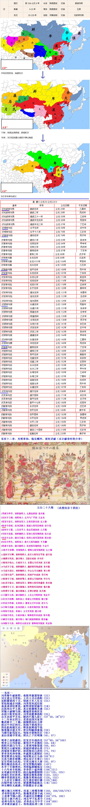

中文名称：汉朝
英文名称：The Han Dynasty
简称：汉
所属洲：亚洲
主要城市：成都，南阳，邯郸，临淄
国土面积：1400万(西汉)，600万(东汉)
首都：长安，洛阳
货币：五铢钱
人口数量：约6000万左右
主要民族：汉族
主要宗教：道教、佛教(东汉时期)
政治体制：君主专制政体
中央官制：内外朝制度，三公九卿
监察机构：刺史，州牧
选官制度：察举制，征辟制
科技发明：造纸术地动仪
文化形式：汉赋、汉文化形成

--东汉--
刘秀骑牛破新野，舂陵举旗盟绿林（22）
刘玄建元号更始，王邑王寻出洛阳（23）
昆阳摧莽四十万，绿林大军入长安（23）
更始宛城杀刘縯，刘秀受封武信侯
曲意逢迎结曹竟，新野迎娶阴丽华（24）
出抚河北平王郎，真定联姻郭圣通（25）
突骑大破铜马部，鄗城登基称汉皇
赤眉大败更始帝，刘秀南渡都洛阳（25）
击灭赤眉平关东，陇西巴蜀九原亡（27~30，34~37）
十二年来定四方，柔道治国兴家邦
偃武修文二十载，励精图治民力养
政出中央臣闲乐，权柄下移尚书台
简化机构裁冗员，释放奴婢倡节俭
独尊儒术建太学，度田均赋抑豪强（39）
马援交趾伐征氏，匈奴分裂称汉臣（43）
易后改储寻常戏，阴氏之子汉明继（41，57）

明章之治续盛世，汉室百年战西羌（57~88，56~169）
明帝云台列星宿，蔡愔天竺求佛经（60，64）
洛阳兴建白马寺，王景黄河修渠堤（68，69）
窦固天山破匈奴，班超西域说众酋（73）
西域重开都护府，班固集结白虎经（73，79）
章帝身死和帝继，外戚窦氏震朝廷（89）
窦宪耿秉击匈奴，匈奴败走迁乌孙（89~91）
兄弟当朝多骄横，郑众设计灭窦门（92）
宦官用政自此始，甘英无缘至大秦（92，97）
蔡伦精进造纸术，汉室罢黜西域区（107）
水旱十年继绝世，邓绥临朝辅殇安（106）
十六年来专权柄，享寿四十谥和熹（106~121）
安帝戚宦同重用，阎氏临朝揽朝纲（121~125，125）
西域长史任班勇，蜀郡设教张道陵（123，125）
顺帝登基阎显死，张衡发明地动仪（125，132）
十九宦官立顺帝，民生凄苦朝臣微（125~144）
历辖冲质与恒帝，梁冀搏得跋扈名（141~159）
和安顺恒无威德，怀隐愍后非正嫡

檀石槐主兴鲜卑，汉家三度罹党锢（150，166/168/176）
灵帝即位耽声色，陈藩窦武事不成（168）
王甫曹节随心欲，外戚何氏荣耀极（168~179，180）
宦官士族不两立，河北甲子乱黄巾（184）
凉州乌恒兵戈起，灵帝改元号中平（184~189）
灵帝难奈戚宦士，纷纷战乱迎三国（189）