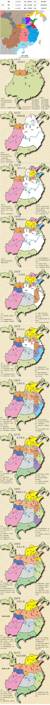
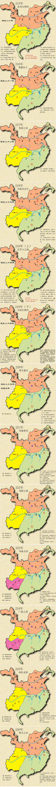
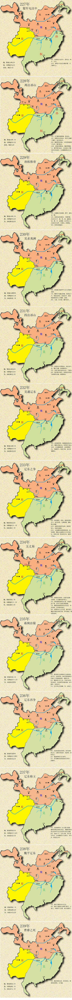
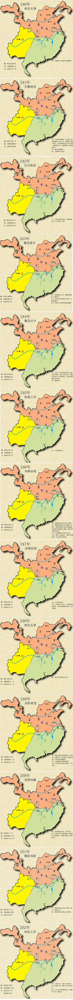
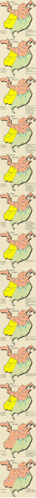
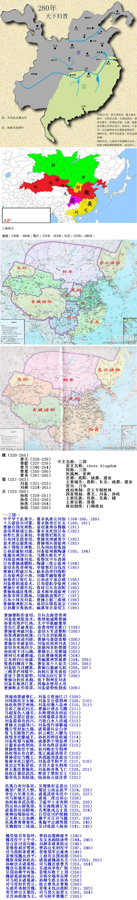

魏（220-265）  
曹丕（220-226）  
曹叡（227-239）  
曹芳（240-254）  
曹耄（255-260）  
曹奂（261-265）  
蜀（221-263）  
刘备（221-223）  
刘禅（224-263）  
吴（222-280）  
孙权（229-251）  
孙亮（252-258）  
孙休（259-264）  
孙皓（265-280）  
  
  
  
--三国--  
中平甲子乱黄巾，董卓执政立刘协（184-186，189）  
十八诸侯共讨董，董卓挟帝迁长安（190，191）  
曹操自领兖州牧，袁绍冀州吞韩馥（191）  
袁绍界桥战公孙，董卓身死因吕布（192）  
孙坚江夏击黄祖，李催郭汜陷长安  
吕布河北投袁绍，曹操兖州破黄巾（192）  
袁术部众据淮南，曹操领兵困徐州（193）  
高干领取并州牧，吕布河内投张扬  
公孙居庸斩刘虞，刘备徐州救陶谦（193，194）  
张邈兖州迎吕布，马腾兵败长平关  
刘璋益州继刘焉，张鲁汉中乐逍遥  
吕布曹操战濮阳，陶谦三度让徐州（194）  
袁绍东收青州境，李催郭汜自伐攻（195）  
曹操巨野破吕布，杨奉劫帝归洛阳  
吕布徐州居小沛，刘繇笮融取豫章  
孙策密计取江东，公孙退守易京楼（195）  
刘备淮阴战袁术，吕布借机夺徐州（196）  
曹操迁帝都许昌，张济引兵攻南阳（196）  
曹操宛城征张绣，袁术称帝战徐州（197）  
孙策夺得吴郡地，刘繇病故郭汜亡（197）  
吕布小沛攻刘备，曹操占据三秦地（198）  
曹操徐州斩吕布，袁绍兵锋指易京（198）  
公孙覆灭张扬死，幽冀青并袁绍主（199）  
  
  
曹操黎阳拒袁绍，分兵北海望青州  
刘备徐州阻袁术，张绣宛城降曹操  
孙策攻取庐江地，太守华歆献豫章  
复仇江夏破黄祖，袁曹对峙官渡口（199）  
曹操徐州破刘备，袁绍大军进黎阳（200）  
孙策遇刺孙权继，白马关羽斩颜良  
刘备汝南说刘辟，曹操乌巢烧袁粮（200）  
曹操仓亭破袁绍，刘备汝南奔刘表（201）  
袁绍身死地四分，庞德河东斩郭援（202）  
孙权南下讨山越，曹操北上攻邺城（203）  
漳河引水灌邺城，自此曹操领冀州（204）  
辽东政归公孙康，青幽冀州皆属曹（204，205）  
张燕归顺高干叛，曹征高干入壶关（205，206）  
刘备跃马过檀溪，曹操白狼破乌桓（206，207）  
三顾茅庐对隆中，孙权江夏攻黄祖（207）  
夏侯于禁攻新野，刘琦出任江夏守（208）  
曹操功封汉丞相，南下荆州征刘表  
刘备长坂逃江夏，周瑜赤壁用火攻  
曹操败走华容道，刘备借势收荆南（208）  
  
  
周瑜南郡破曹仁，刘备立营油江口（209）  
刘琦病死吴女嫁，刘备吴会借荆州（209，210）  
孙权收得交州地，刘备应邀入益州（210，211）  
吴侯之妹还归吴，曹操计诱杀马腾（211）  
马超复仇入潼关，兵败渭南弃西凉（211）  
孙权吴郡迁建业，刘璋蜀郡杀张松（212）  
刘备葭萌攻西川，巧取白水入涪城（212）  
曹操无功濡须口，刘备绵竹逼雒城（213）  
魏公受封加九锡，诸葛援兵定白帝  
张飞北路取巴西，赵云岷江入犍为（213）  
庞统身死雒城下，孙权挥师征皖城（214）  
刘备收蜀马超降，成都拱手领益州（214）  
吕蒙奉命收荆南，关羽布阵居益阳（215）  
曹操收取汉中地，孙刘湘水分荆州  
孙权领兵攻合肥，张辽威震逍遥关（215）  
曹操进位当魏王，再战濡须获虚功（216）  
鲁肃身死吕蒙代，刘备进军阳平关（217，218）  
黄忠定军斩夏侯，关羽大意失荆州（219）  
曹丕篡汉曹操死，刘备称帝张飞亡（220，221）  
孙权迁都居武昌，释放于禁封吴王（221）  
蜀帝伐吴夷陵战，陆逊纵火烧连营（222）  
  
  
托孤白帝刘备死，吴蜀修好孟获出（223）  
魏望广陵吴人惧，蜀征云南孟获平（224，225）  
享位六年曹丕死，诸葛武侯屯汉中（226，227）  
司马新城灭孟达，诸葛二度出祁山（228）  
孙权称帝武昌郡，卫温甲士求夷洲（229，230）  
四出祁山射张郃，东吴海路通辽东（231，232）  
诸葛斜谷治邸阁，孔明秋风五丈原（233，234）  
蒋琬治蜀杨仪死，吕岱征讨庐陵贼（235）  
辽东称王公孙渊，襄平灭辽司马懿（237，238）  
托孤曹爽曹睿死，张嶷平定越隽郡（239，240）  
吴魏相攻三线战，吴讨珠崖入海南（241，242）  
  
  
魏受倭贡卑弥呼，费祎治蜀顾雍卒（243）  
魏攻汉中王平守，东吴丞相陆逊终（244，245）  
毌丘征讨高句丽，刘禅亲政黄皓出（246）  
姜维收胡步骘死，费祎出屯到汉中（247，248）  
司马洛阳诛曹爽，姜维领军出雍州（249）  
姜维伐魏出西平，王昶攻吴围南郡（250）  
魏取夷陵孙权死，诸葛破魏战东关（251/252，252）  
孙峻伏杀诸葛恪，司马魏宫废曹芳（253，254）  
魏攻乐嘉淮南反，吴战高亭收广陵（255）  
吴国孙琳平内叛，姜维兵败于上邽（256）  
魏诸葛诞扬州反，吴将全端率众降（257）  
司马昭杀诸葛诞，孙琳专恣立孙休（258）  
司马受封作晋公，扶立曹奂杀曹髦（260）  
乐浪外夷朝贡魏，姜维末伐出洮阳（261，262）  
邓艾钟会灭蜀汉，司马晋公加晋王（263，264）  
吴宫孙皓继为主，司马昭卒曹魏亡（265）