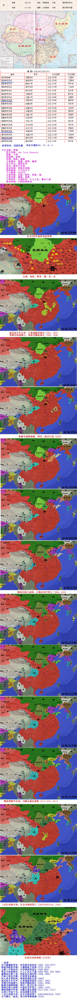

--西晋--
司马篡魏称晋皇，秃发鲜卑扰西凉（265，270-277）
陆抗西陵斩步阐，王濬楼船下益州（272，279）
太康十年称治世，石崇荆州得富足（280-289）
贾后专权废杨氏，八王之乱天下崩（290-300，291-306）
郝散起兵叛上党，匈奴羌兵围泾阳（294，296）
竹林七贤各失散，江统著书论徙戎
赵王诛杀贾南风，绿珠坠楼斩石崇（300）
流民起义长江岸，江夏城破因张昌（301，303）
李雄自封成都王，匈奴刘渊起离石（303，304）
陈敏吴越图割据，周玘二度定江南（305）
蜀地乐称大成国，石勒苦县歼晋王（306，310）
陶侃荆湘平杜弢，刘聪永嘉乱洛阳（311-315，311）
五胡入华起干戈，衣冠南渡无奈何
三定江南战不休，长安失陷西晋亡（303/305/310，316）
五马渡江一成龙，晋元阿睿都建康（316）

