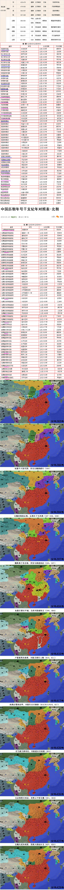
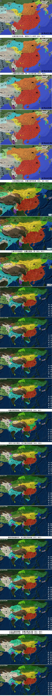
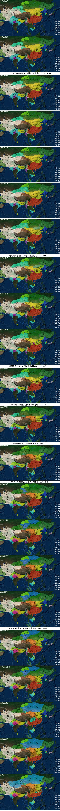
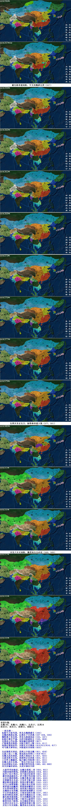

--南北朝--  
拓拔牛川复代国，更名北魏都盛乐（386）  
北魏西燕敌后燕，后燕长子灭西燕（387-394，394）  
魏败燕于叁合坡，秃发乌孤建南凉（395，397）  
拓拔迁都至平城，北府刘裕破桓玄（398，404）  
北燕高云代后燕，匈奴赫连建胡夏（407）  
卢循番禺攻秦淮，刘裕义熙行土断（410，411）  
南燕后蜀南凉终，刘裕长安灭姚秦（410/413/414，417）  
司马德文禅帝位，刘裕建宋开南朝（420）  
  
  
北凉敦煌灭西凉，柔然云中侵北魏（421，424）  
元嘉之治三十载，策试选官用寒门（424-453）  
北魏太武攻胡夏，柔然大漠起兵戈（427，429）  
元嘉首度兴北伐，胡夏阿定吞西秦（430，431）  
土谷浑王擒赫连，临川谢公受斩刑（431，433）  
北魏太武灭北燕，一统北方征北凉（436，439）  
北凉西缩后北凉，宋魏兴师争仇池（440，441-444）  
刘义庆编世说语，太武灭佛信天师  
  
  
元嘉草草封狼居，北魏宗爱弑二帝（450，452）  
刘骏改铸四铢钱，柔然阚氏建高昌（454，460）  
祖冲之创大明历，刘子勋讨宋废帝（462，466）  
萧帝道成建南齐，孝文推行均田制（479，485）  
元宏迁都居洛阳，北魏开凿龙门窟（493，494）  
齐明萧鸾杀齐武，少室孝文敕少林（494，495）  
萧衍称帝建南梁，菩提达摩东渡江（502，520）  
司马大和置佛像，六镇兵变反汉装（522，523）  
葛荣建齐向瀛州，阴盘殒命郦道元（526，527）  
尔朱荣河阴谋变，高欢领六镇起兵（528，531）  
北魏剖分东西魏，高欢阿泰拥静文（534）  
宇文沙苑战高欢，大统首创府兵制（537，543）  
侯景寿阳乱南梁，高洋东魏建北齐（548，550）  
霸先称帝建南陈，宇文西魏禅北周（557）  
长恭晋阳却突厥，兰陵邙山破周军（560，564）  
斛律光死兰陵鸩，北齐娴技害贤良（572，573）  
北周灭齐定北方，杨坚称帝建大隋（577，581）  
开皇八年灭南陈，魏晋南北自此结（588，589）  
  
  
享国年数：  
北魏148，东魏16，西魏21，北齐27，北周24  
南宋59，南齐23，南梁55，南陈32