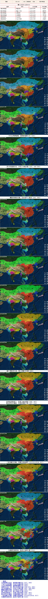

--隋朝--
北周破邺灭北齐，杨坚挟帝施号令（577，580）
千金公主和突厥，关东平定尉迟迥（580）
宇文后周禅杨隋，建筑新城都大兴（582）
黄淮长江连一体，朔方灵武连长城（584-610，585）
秀才科选拔官吏，开皇八年隋灭陈（587，588-589）
雕版印刷始见载，日本使节入隋来（593，600）
杨广登基开大业，塞上巡游下江都（605）
科举始设取进士，朱宽入海访琉球（606，607）
陕北晋北长城起，夸富西域显大国（607，610）
三征高丽无兵略，李渊太原起唐军（612/613/614，617）
东都群臣拥皇泰，炀帝才浅死江都（618）

享国年数：38年