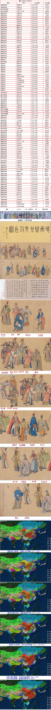
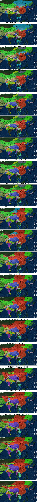
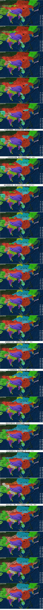
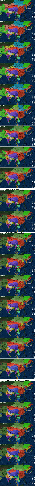
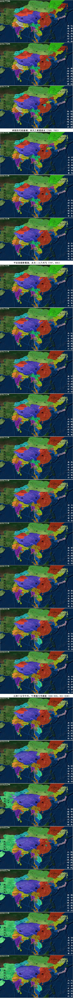
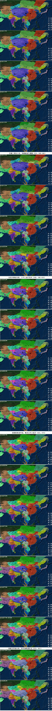
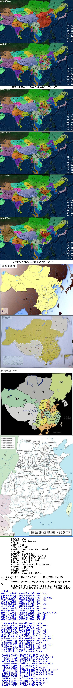

**唐朝行政区划简介**  
 618年，改郡为州。   
 627年，根据山河走向，分天下为10道。639年，唐朝有10道、358州、1551县。   
 713年，升雍州为京兆府，洛州为洛阳府。中国从此为了府的行政区划建制。府和州同级，但地位比州高。   
 733年，改天下为15道。

741年，唐朝有15道、328州（3府319州6都护府）、1573县。

742年，改州为郡。

758年，复改郡为州。   
 755-763年，安史之乱期间，唐朝大量设置藩镇。安史之乱结束后，藩镇成为一级行政区划，一个藩镇也称为一道。   
 807年，唐朝有48道、295州府（288州7府）1都护府，1453县。

741年各道治所   
 京畿道，治西京（首都）京兆府（今陕西省西安市）；   
 关内道，治西京（首都）京兆府（今陕西省西安市）；   
 都畿道，治东都（陪都）河南府（今河南省洛阳市）；   
 河南道，治汴州（今河南省开封市）；   
 河东道，治蒲州（今山西省永济市西）；   
 河北道，治魏州（今河北省大名县东北）；   
 山南西道，治梁州（今陕西省汉中市）；   
 山南东道，治襄州（今湖北省襄阳市）；   
 淮南道，治扬州（今江苏省扬州市）；   
 江南东道，治苏州（今江苏省苏州市）；   
 江南西道，治洪州（今江西省南昌市）；   
 黔中道，治黔州（今重庆市彭水苗族土家族自治县）；   
 陇右道，治鄯州（今青海省乐都县）；   
 剑南道，治益州（今四川省成都市）；   
 岭南道，治广州（今广东省广州市）。   
  
  
 **唐朝各州地名古今对照（741年，郡制地名以742年以准）**

  
 <1>京畿道 辖1府4州   
 今属陕西省 京兆府京兆郡 西安市   
 华州华阴郡 渭南市华县   
 同州冯翊郡 渭南市大荔县   
 歧州扶凤郡 宝鸡市凤翔县   
 邠州新平郡 咸阳市彬县   
  
  
 <2>关内道 辖18州2都护府   
 今属陕西省 陇州汧阳郡 宝鸡市陇县   
 鄜州洛交郡 延安市富县   
 坊州中部郡 延安市黄陵县   
 丹州咸宁郡 延安市宜川县   
 延州延安郡 延安市   
 盐州五原郡 榆林市定边县   
 夏州朔方郡 榆林市靖边县   
 绥州上郡 榆林市绥德县   
 银州银川郡 榆林市横山县党岔镇   
 今属甘肃省 泾州安定郡 平凉市泾川县北   
 庆州安化郡 庆阳市   
 宁州彭原郡 庆阳市宁县   
 会州会宁郡 白银市靖远县   
 今属宁夏回族自治区 原州平凉郡 固原市   
 灵州灵武郡 银川市灵武市   
 今属内蒙古自治区 宥州宁朔郡 鄂尔多斯市鄂托克旗   
 胜州榆林郡 呼和浩特市托克托县西南   
 丰州九原郡 包头市五原县南   
 单于都护府（治所在云中故城） 呼和浩特市和林格尔县北   
 安北都护府（治所在中受降城） 包头市西南   
  
  
 <3>都畿道 辖1府4州   
 今属河南省 河南府河南郡 洛阳市   
 汝州临汝郡 平顶山市汝州市   
 陕州陕郡 三门峡市陕县   
 怀州河内郡 焦作市沁阳县   
 郑州荥阳郡 郑州市   
  
  
 <4>河南道 辖23州   
 今属河南省 滑州灵昌郡 安阳市滑县城关镇   
 汴州陈留郡 开封市   
 宋州睢阳郡 商丘市睢阳区古宋镇   
 许州颍川郡 许昌市   
 陈州淮阳郡 周口市淮阳县   
 豫州汝南郡 驻马店市汝南县   
 今属山东省 濮州濮阳郡 荷泽市鄄城县旧城镇   
 曹州济阴郡 荷泽市定陶县马集镇   
 郓州东平郡 泰安市东平县州城镇   
 济州济阳郡 聊城市茌平县曹集镇   
 兖州鲁郡 济宁市兖州市   
 齐州临淄郡 济南市   
 淄州淄川郡 淄博市淄川区   
 青州北海郡 潍坊市青州市   
 密州高密郡 潍坊市诸城市   
 沂州琅邪郡 临沂市   
 莱州东莱郡 烟台市莱州市   
 登州东牟郡 烟台市蓬莱市   
 今属安徽省 亳州谯郡 亳州市   
 颍州汝阴郡 阜阳市   
 今属江苏省 徐州彭城郡 徐州市   
 泗州临淮郡 淮安市盱眙县   
 海州东海郡 连云港市海州区   
  
  
 <5>河东道 辖1府18州   
 今属山西省 云州云中郡 大同市   
 蔚州安边郡 大同市灵丘县   
 朔州马邑郡 朔州市   
 代州雁门郡 忻州市代县   
 忻州定襄郡 忻州市   
 岚州楼烦郡 吕梁市岚县北   
 石州昌化郡 吕梁市   
 汾州西河郡 吕梁市汾阳市   
 太原府太原郡 太原市   
 仪州乐平郡 晋中市左权县   
 隰州大宁郡 临汾市隰县   
 慈州文城郡 临汾市吉县   
 晋州平阳郡 临汾市   
 沁州阳城郡 长治市沁源县   
 潞州上党郡 长治市   
 泽州高平郡 晋城市   
 绛州绛郡 运城市新绛县   
 蒲州河东郡 运城市永济市蒲州镇   
 今属河南省 虢州弘农郡 三门峡市灵宝市   
  
  
 <6>河北道 辖24州1都护府   
 今属河北省 妫州妫川郡 张家口市怀来县狼山乡   
 平州北平郡 秦皇岛市卢龙县   
 定州博陵郡 保定市定州市   
 易州上谷郡 保定市易县   
 莫州文安郡 沧州市任丘市鄚州镇   
 瀛州河间郡 沧州市河间市   
 沧州景城郡 沧州市沧县旧州镇   
 冀州信都郡 衡水市冀州市   
 深州饶阳郡 衡水市深州市旧州镇   
 恒州常山郡 石家庄市正定县   
 赵州赵郡 石家庄市赵县   
 邢州钜鹿郡 刑台市   
 贝州清河郡 刑台市清河县西   
 洺州广平郡 邯郸市永年县旧永年镇   
 魏州魏郡 邯郸市大名县东北   
 安东都护府（驻平州） 秦皇岛市卢龙县   
 今属北京市、天津市、辽河省 幽州范阳郡 北京市   
 檀州密云郡 北京市密云县   
 蓟州渔阳郡 天津市蓟县   
 营州柳城郡 辽宁省朝阳市   
 今属河南省 卫州汲郡 新乡市卫辉市   
 相州邺郡 安阳市   
 今属山东省 博州博平郡 聊城市   
 德州平原郡 德州市陵县   
 棣州乐安郡 滨州市惠民县辛店镇   
  
  
 <7>山南东道 辖16州   
 今属陕西省 商州上洛郡 商洛市   
 金州汉阴郡 安康市   
 今属河南省 邓州南阳郡 南阳市邓州市   
 唐州淮安郡 驻马店市泌阳县   
 今属湖北省 均州武当郡 十堰市丹江口市均县镇   
 房州房陵郡 十堰市房县   
 襄州襄阳郡 襄阳市   
 隋州汉东郡 随州市   
 归州巴东郡 宜昌市秭归县归州镇   
 峡州夷陵郡 宜昌市   
 荆州江陵郡 荆州市   
 郢州富水郡 荆门市京山县   
 复州竟陵郡 仙桃市沔城镇   
 今属重庆市 夔州云安郡 奉节县   
 万州南浦郡 万州区   
 忠州南宾郡 忠县   
  
  
 <8>山南西道 辖17州   
 今属陕西省 凤州河池郡 宝鸡市凤县凤州镇   
 兴州顺政郡 汉中市略阳县   
 梁州汉中郡 汉中市   
 洋州洋川郡 汉中市西乡县   
 今属四川省 利州益昌郡 广元市   
 集州符阳郡 巴中市南江县   
 壁州始宁郡 巴中市通江县   
 巴州清化郡 巴中市   
 阆州阆中郡 南充市阆中市   
 蓬州蓬山郡 南充市仪陇县大寅镇   
 果州南充郡 南充市   
 通州通川郡 达州市   
 渠州潾山郡 达州市渠县   
 今属重庆市 开州盛山郡 开县   
 涪州涪陵郡 涪陵区   
 渝州南平郡 重庆市   
 合州巴川郡 合川区   
  
  
 <9>陇右道 辖20州2都护府   
 今属甘肃省 秦州天水郡 天水市   
 武州武都郡 陇南市   
 成州同谷郡 陇南市礼县南   
 渭州陇西郡 定西市陇西县   
 岷州和政郡 定西市岷县   
 河州安昌郡 临夏州临夏市   
 洮州临洮郡 甘南州临潭县   
 叠州合川郡 甘南州迭部县   
 宕州怀道郡 甘南州舟曲县   
 兰州金城郡 兰州市   
 凉州武威郡 武威市   
 甘州张掖郡 张掖市   
 肃州酒泉郡 酒泉市   
 沙州敦煌郡 酒泉市敦煌市   
 瓜州晋昌郡 酒泉市瓜州县东南   
 今属青海省 鄯州西平郡 海东地区乐都县   
 廓州宁塞郡 海南州尖扎县   
 今属新疆维吾尔自治区 伊州伊吾郡 哈密市   
 西州交河郡 吐鲁番市   
 庭州金满郡 昌吉州吉木萨尔县庭州镇   
 北庭都护府（治所在庭州） 昌吉州吉木萨尔县庭州镇   
 安西都护府（治所在龟兹镇） 阿克苏地区库车县   
  
  
 <10>淮南道 辖14州   
 今属江苏省 扬州广陵郡 扬州市   
 楚州淮阴郡 淮安市淮安区 今属安徽省   
 滁州永阳郡 滁州市   
 濠州钟离郡 滁州市凤阳县   
 和州历阳郡 马鞍山市和县   
 寿州寿春郡 六安市寿县   
 庐州庐江郡 合肥市   
 舒州同安郡 安庆市潜山县   
 今属河南省 光州弋阳郡 信阳市潢川县   
 申州义阳郡 信阳市 今属湖北省   
 蕲州蕲春郡 黄冈市蕲春县蕲州镇   
 安州安陆郡 孝感市安陆市   
 黄州齐安郡 武汉市新洲区   
 沔州汉阳郡 武汉市汉阳   
  
  
 <11>江南东路 辖19州   
 今属江苏省 润州丹杨郡 镇江市   
 常州晋陵郡 常州市   
 苏州吴郡 苏州市   
 今属安徽省 歙州新安郡 黄山市歙县   
 今属浙江省 湖州吴兴郡 湖州市   
 杭州余杭郡 杭州市   
 睦州新定郡 杭州市建德市梅城镇   
 越州会稽郡 绍兴市   
 明州余姚郡 宁波市鄞州区鄞江镇   
 衢州信安郡 衢州市   
 括州缙云郡 丽水市   
 婺州东阳郡 金华市   
 温州永嘉郡 温州市   
 台州临海郡 台州市临海市   
 今属福建省 福州长乐郡 福州市   
 建州建安郡 南平市建瓯市   
 泉州清源郡 泉州市   
 汀州临汀郡 龙岩市长汀市   
 漳州漳浦郡 漳州市漳浦县   
  
  
 <12>江南西道 19州   
 今属安徽省 宣州宣城郡 宣城市   
 今属湖北省 鄂州江夏郡 武汉市武昌   
 今属江西省 洪州豫章郡 南昌市   
 江州浔阳郡 九江市   
 饶州鄱阳郡 上饶市鄱阳县   
 虔州南康郡 赣州市   
 吉州庐陵郡 吉安市   
 袁州宜春郡 宜春市   
 抚州临川郡 抚州市   
 今属湖南省 岳州巴陵郡 岳阳市   
 澧州澧阳郡 常德市津市市   
 朗州武陵郡 常德市   
 潭州长沙郡 长沙市   
 衡州衡阳郡 衡阳市   
 永州零陵郡 永州市零陵区   
 道州江华郡 永州市道县清塘镇   
 郴州桂阳郡 郴州市   
 邵州邵阳郡 邵阳市   
 今属广东省 连州连山郡 清远市连州市   
  
  
 <13>黔中道 辖15州   
 今属湖北省 施州清化郡 恩施州恩施市   
 今属湖南省 辰州卢溪郡 怀化市沅陵县   
 锦州卢阳郡 怀化市麻阳苗族自治县锦和镇   
 巫州潭阳郡 怀化市洪江市   
 业州龙溪郡 怀化市芷江侗族自治县西   
 溪州灵溪郡 湘西州永顺县东   
 今属贵州省 夷州义泉郡 遵义市凤冈县   
 播州播川郡 遵义市   
 珍州夜郎郡 遵义市桐梓县夜郎乡   
 思州宁夷郡 铜仁地区沿河土家族自治县   
 费州涪川郡 铜仁地区思南县   
 充州平蛮郡 铜仁地区石阡县   
 今属重庆市 黔州黔中郡 彭水苗族土家族自治县   
 南州南川郡 綦江区   
 溱州溱溪郡 綦江区狮溪镇   
  
  
 <14>剑南道 辖35州   
 今属甘肃省 文州阴平郡 陇南市文县   
 今属四川省 扶州同昌郡 阿坝州九寨沟县   
 松州交川郡 阿坝州松潘县   
 当州江源郡 阿坝州黑水县   
 柘州蓬山郡 阿坝州黑水县南   
 悉州归诚郡 阿坝州汶川县西   
 茂州通化郡 阿坝州茂县   
 翼州临翼郡 阿坝州茂县维城乡   
 静州静川郡 阿坝州茂县西北   
 维州维川郡 阿坝州理县薛城镇   
 奉州云山郡 阿坝州理县北   
 恭州恭化郡 阿坝州马尔康县   
 巂州越巂郡 凉山州西昌市   
 龙州江油郡 绵阳市平武县南坝镇   
 绵州巴西郡 绵阳市   
 梓州梓潼郡 绵阳市三台县   
 剑州普安郡 广元市剑阁县普安镇   
 遂州遂宁郡 遂宁市   
 汉州德阳郡 德阳市广汉市   
 益州蜀郡 成都市   
 彭州蒙阳郡 成都市彭州市   
 蜀州唐安郡 成都市崇州市   
 邛州临邛郡 成都市邛崃市   
 雅州卢山郡 雅安市   
 黎州洪源郡 雅安市汉源县清溪镇   
 嘉州犍为郡 乐山市   
 眉州通义郡 眉山市   
 陵州仁寿郡 眉山市仁寿县   
 简州阳安郡 资阳市简阳市   
 普州安岳郡 资阳市安岳县   
 资州资阳郡 内江市资中县   
 荣州和义郡 自贡市荣县   
 戎州南溪郡 宜宾市   
 泸州泸川郡 泸州市   
 今属云南省 姚州云南郡 楚雄州姚安县光禄镇   
  
  
 <15>岭南道 辖73州1都护府   
 今属广东省 广州南海郡 广州市   
 韶州始兴郡 韶关市   
 循州海丰郡 惠州市   
 潮州潮阳郡 潮州市   
 封州临封郡 肇庆市封开县封川镇   
 康州晋康郡 肇庆市德庆县   
 端州高要郡 肇庆市   
 新州新兴郡 云浮市新兴县   
 勤州云浮郡 云浮市云安县富林镇   
 春州南陵郡 阳江市阳春市   
 恩州恩平郡 江门市恩平市   
 冈州义宁郡 江门市新会区   
 泷州开阳郡 茂名市信宜市思贺镇   
 窦州怀德郡 茂名市信宜市镇隆镇   
 高州高凉郡 茂名市高州市东北   
 潘州南潘郡 茂名市高州市   
 辩州陵水郡 茂名市化州市   
 罗州招义郡 湛江市廉江市河唇镇   
 雷州海康郡 湛江市雷州市   
 今属海南省 崖州珠崖郡 海口市美兰区灵山镇   
 琼州琼山郡 海口市琼山区旧州镇   
 振州延德郡 三亚市崖城镇   
 儋州昌化郡 儋州市新州镇   
 万安州万安郡 陵水黎族自治县   
 今属广西壮族自治区 环州整平郡 河池市环江毛南族自治县   
 宜州龙水郡 河池市宜州市   
 融州融水郡 柳州市融水苗族自治县   
 柳州龙城郡 柳州市   
 桂州始安郡 桂林市   
 昭州平乐郡 桂林市平乐县   
 贺州临贺郡 贺州市贺街镇   
 富州开江郡 贺州市昭平县   
 梧州苍梧郡 梧州市   
 蒙州蒙山郡 梧州市蒙山县夏宜瑶族乡   
 藤州感义郡 梧州市藤县   
 义州连城郡 梧州市岑溪市东南   
 郁林州郁林郡 玉林市兴业县   
 平琴州平琴郡 玉林市兴业县大平山镇   
 党州宁仁郡 玉林市玉州区仁东镇   
 牢州定川郡 玉林市   
 容州普宁郡 玉林市北流县   
 禺州温水郡 玉林市北流市东南   
 白州南昌郡 玉林市博白县   
 贵州怀泽郡 贵港市   
 浔州浔江郡 贵港市贵平市   
 龚州临江郡 贵港市平南县   
 绣州常林郡 贵港市桂平市罗播乡   
 严州循德郡 来宾市   
 象州象郡 来宾市象州县罗秀镇   
 芝州忻城郡 来宾市忻城县   
 澄州贺水郡 南宁市上林县   
 宾州安城郡 南宁市宾阳县   
 横州宁浦郡 南宁市横县   
 淳州永定郡 南宁市横县峦城镇   
 邕州朗宁郡 南宁市   
 田州横山郡 百色市田东县祥周镇   
 钦州宁越郡 钦州市久隆镇   
 陆州玉山郡 钦州市犀牛脚镇   
 廉州合浦郡 钦州市浦北县旧州村   
 瀼州临潭郡 防城港市上思县西南   
 笼州扶南郡 崇左市扶绥县   
 山州龙池郡 玉林市博白县龙潭镇   
 岩州安乐郡 贵港市港南区木梓镇   
 今属越南 峰州承化郡 福寿省越池   
 福禄州唐林郡 清化省清化市西北   
 武峨州武峨郡 太原省太原东北   
 汤州汤泉郡 谅山省谅山东南   
 古州乐古郡 谅山省谅山东北   
 交州交趾郡 河内市   
 武安州武曲郡 海防市西   
 长州文杨郡 南定省南定   
 爱州九真郡 清化省清化市   
 驩州日南郡 义安省荣市   
 安南都护府（治所在交州） 河内市

唐（618年-907年）   
 第1任（9） 618-626年 高祖（李渊） -1-   
 第2任（23） 627-650年 太宗(李世民) -2-   
 第3任（34） 650-684年 高宗(李治) -3-   
 第4任（1） 684-684年 中宗(李显) -4-   
 第5任（1） 684-684年 睿宗(李旦) -5-   
 第6任（21） 684-705年 武则天 -21-   
 第7任（5） 705-710年 中宗(李显)   
 第8任（1）710-710年 殤帝(李重茂) -22-   
 第9任（2） 710-712年 睿宗(李旦)   
 第10任（44） 712-756年 玄宗(李隆基) -6-   
 第11任（6） 756-762年 肃宗(李亨) -7-   
 第12任（18） 762-780年 代宗(李豫) -8-   
 第13任（25） 780-805年 德宗(李适) -9-   
 第14任（1） 805-806年 顺宗(李诵) -10-   
 第15任（15） 806-821年 宪宗(李纯) -11-   
 第16任（4） 821-825年 穆宗(李恒) -12-   
 第17任（3） 825-827年 敬宗(李湛) -13-   
 第18任（13） 827-840年 文宗(李昂) -14-   
 第19任（6） 841-846年 武宗(李炎) -15-   
 第20任（14） 847-860年 宣宗(李忱) -16-   
 第21任（15） 860-874年 懿宗(李凗) -17-   
 第22任（14） 874-888年 僖宗(李儇) -18-   
 第23任（15） 889-904年 昭宗(李晔) -19-   
 第24任（4） 904-907年 哀帝(李柷) -20-   
    
  **唐朝共22帝：渊太高则，中殇睿玄，肃代德顺，宪穆敬文，武宣懿僖，昭哀。**

****

**唐朝  
唐朝（618—907年），是中国封建社会中统一时间最长，国力最强盛的朝代之一。618年由李渊建立，定都长安（今西安）。并且设有东都洛阳、北都太原等等陪都。627年，李世民登基后开创了“贞观之治”，唐高宗以后，武则天以周代唐，史称武周，705年神龙革命后恢复大唐国号。唐玄宗李隆基即位后，政治清明，经济雄厚，军事强盛，四夷宾服，万邦来朝，开创了全盛的“开元盛世”。安史之乱后，国力日趋衰败。907年朱温篡唐，唐朝灭亡，从此中国进入了进入五代十国时期。唐朝共历274年（包括武周是289年），20位皇帝。唐朝声誉远及海外，与南亚、西亚和欧洲国家均有往来。唐朝以后海外多称中国人为“唐人”。唐朝文化兼容并蓄，接纳各个民族与宗教，进行交流融合，成为了开放的国际文化。唐诗、科技、文化艺术极其繁盛，具有多元化的特点。  
中文名称：唐朝  
英文名称：Tang Dynasty  
简称：唐  
所属洲：亚洲  
首都：长安、洛阳  
主要城市：扬州，成都，洛阳，泉州等  
货币：开元通宝  
政治体制：君主专制政体  
国家领袖：李渊，李世民，李隆基等  
人口数量：8000－9000万（755年）  
主要民族：汉族、突厥、回纥  
主要宗教：道教，佛教  
国土面积：1251万平方千米（公元669年）  
政治制度：三省六部制  
选官制度：科举制  
监察机构：御史台  
文化形式：唐诗，壁画，雕塑等  
  
太宗为了表彰功臣，就命阎立本绘画《二十四功臣图》于凌烟阁。  
二十四功臣名字：  
长孙无忌 李孝恭 杜如晦 魏征 房玄龄 高士廉 尉迟敬德 李靖   
萧瑀 段志玄 刘弘基 屈突通 殷开山 柴绍 长孙顺德 张亮   
侯君集 张公瑾 程知节 虞世南 刘政会 唐俭 李世勣 秦叔宝**

****

**--唐朝--   
 晋阳起兵立杨侑，定都长安号武德（617，618）   
 陇西灭薛浅水原，租庸调制均田地（618，619）   
 柏壁攻灭刘武周，虎牢俘虏窦建德（619，620-621）   
 孝恭江陵平萧铣，世民洺水破黑闼（621，622）   
 刘氏下博击淮阳，建成洺州收河北（622）   
 唐灭淮南辅公祏，突厥南下五龙阪（623，624）   
 秦王兵变玄武门，尉迟泾阳战突厥（626）   
 太宗渭水盟颉利，柴绍北破梁师都（626，628）   
 灭东突厥俘颉利，世民荣称天可汗（630）   
 贞观律令氏族志，定襄阴山战突厥（637/638，639/640）   
 文成公主入吐蕃，六军无功高丽还（641，645）   
 撰成大唐西域记，著作帝范十二篇（646，648）   
 贞观之治开言路，羁縻政策抚异族（627-649）   
  
  
 突厥贺鲁叛庭州，高宗颁行永徽律（651）   
 五经正义擢秋举，永徽废王立武后（653，655）   
 大唐攻灭西突厥，沙钵兵败成俘虏（657）   
 唐置昆陵都护府，氏志更名姓氏录（657，659）   
 新修本草药典成，显庆渡海灭百济（659，660）   
 龙朔水战白江口，二圣临朝后垂帘（663，664）   
 麟德二年封泰山，唐联新罗灭高丽（665，666-668）   
 中宗睿宗相继废，徐氏扬州讨武曌（684/685，685）   
 中宗李显迁庐陵，则天祥瑞洛图出（685，688）   
 首创科举殿试制，打击关陇酷吏兴（689）   
 武氏登基称天授，嵩山封禅开武举（690，696/702）   
 神龙政变中宗继，吐蕃突厥乱边疆（705，706）   
 太子重俊图谋逆，金城公主入吐蕃（707，709）   
 韦后安乐毒中宗，唐隆政变立相王（710）   
  
  
 先天政变禅玄宗，姚崇要说献十事（712，713）   
 开元之治三十载，天宝八年弃府兵（713-742，749）   
 中亚战败怛罗斯，鉴真东渡至日本（751，753）   
 渔阳安史起乱军，史思明杀安庆绪（755，759）   
 代宗登基平安史，仆固怀恩兵叛唐（762/763，763）   
 两税法代租庸调，奉天之难盟清水（780，783）   
 平凉劫盟唐蕃战，永贞二王八司马（787，805）   
 元和十五号中兴，牛僧孺斗李德裕（806-820，821-824）   
 甘露之变仇士良，李德裕逐牛僧孺（835，840-846）   
 会昌灭佛宣宗复，大中之治牛党兴（845，846-859）   
 藩镇割据军难用，宦官执权立君王   
 庞勋桂林戍卒起，乾伏元年王仙芝（865，874）   
 黄巢义军起山东，冲天香阵透长安（878，881）   
 李克用胜黄巢死，朱温为祸白马驿（884，905）   
 哀帝禅位大梁建，五代开局唐朝终（907）**

