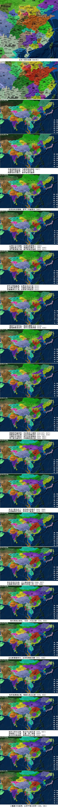
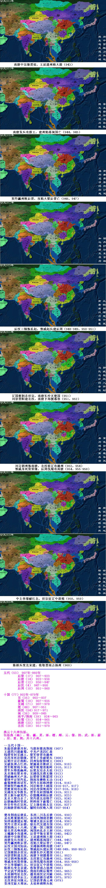

五代（53） 907年-960年   
后梁（17） 907～923   
后唐（14） 923～936   
后晋（12） 936～947   
后汉（4） 947～950   
后周（10） 951～960   
  
  
十国（77）902年-979年   
吴（35） 902～937   
前蜀（18） 907～925   
吴越（71） 907～978  
楚（44） 907～951   
南汉（54）917～971   
闽（36） 909～945   
南平/荆南（39） 924～963   
后蜀（31） 934～965   
南唐（22） 937～975   
北汉（28） 951～979   
  
燕云十六州包括：  
包括燕（幽）、蓟、瀛、莫、涿、檀、顺、云、儒、妫、武、新、蔚、应、寰、朔，共十六州。  
  
  
--五代十国--  
朱温窃唐都开封，马殷封楚高荆南（907）  
王建四川建前蜀，守光卢龙囚仁恭  
钱僇受封吴越王，梁军侵晋攻潞州  
克用身死存勖继，晋军上党破梁兵（908）  
后梁汴京迁洛阳，同州知俊附岐王（909）  
吴破抚州占江西，梁施诡诈欺赵王（909，910）  
晋军败梁柏乡地，岐军败蜀青泥岭（910，911）  
晋军兵锋抵幽州，后梁友珪杀太祖（912）  
友贞继位梁末帝，吴越伐吴溃无锡（913）  
晋破幽州灭卢龙，后梁侵吴败霍邱（913）  
耶律平定契丹乱，荆南攻夔败无功（914）  
前蜀挫败南诏军，契丹太祖称神册（914，916）  
晋御契丹幽州界，刘岩称帝大越国（916-917，917）  
晋渡黄河攻后梁，刘岩改国唤南汉（917-918，918）  
吴越攻吴争胜负，晋军攻赵围镇州（919，921）  
晋王新乐破契丹，存勖魏州称后唐（922，923）  
友贞大梁自杀了，契丹漠北逞锋芒（923，924）  
后唐幽燕时受扰，挥师南下前蜀亡（924，925）  
伶官作传庄宗死，辽主继位称太宗（926，927）  
历相唐晋称冯道，辗转归汉晚入周（927-954）  
  
  
楚攻荆南后唐乱，东西二川各反唐（928，930）  
孟氏胜董据两川，从珂凤翔清君侧（932，934）  
知祥成都建后蜀，敬瑭太原反后唐（934，936）  
契丹立晋灭后唐，徐氏代吴建齐国（936，937）  
晋割燕云十六州，辽施一国三制策（938）  
徐氏更名唤南唐，闽国内乱杀王昶（938，939）  
王曦施令攻建州，后晋平叛安重荣（940，942）  
南唐中宗继烮祖，王延建州称大殷（943）  
南唐发兵攻殷王，建州陷落闽国亡（944，945）  
契丹瀛州败后晋，攻陷大梁后晋亡（946，947）  
后汉立国刘知远，吴越福州败南唐（947）  
后汉三镇叛乱起，郭威起兵建后周（948-949，950-951）  
辽国察割杀世宗，南唐长沙灭楚国（951）  
刘崇晋阳建北汉，南唐下邳援慕容（951，952）  
刘言朗州叛南唐，北汉联辽攻潞州（952，954）  
郭威身死柴荣继，后周伐蜀攻南唐（954，955-958）  
中主李璟献江北，世宗征辽中道殂（958，959）  
陈桥兵变北宋建，收取晋南占扬州（960）  
平定武平周保权，荆南归降后蜀终（963，965）  
太祖御驾征北汉，潘美南汉定刘鋹（968，970）  
南唐俘虏李后主，吴越清源自请降（975，978）  
北汉再征刘继元，辽国仍掌燕云州（979）  
党项交趾大理远，太祖杯酒释兵权