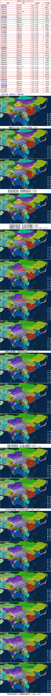
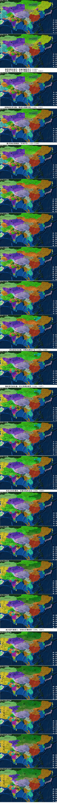
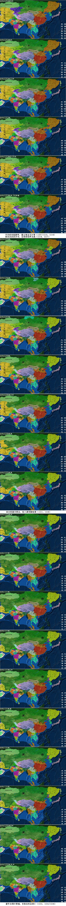
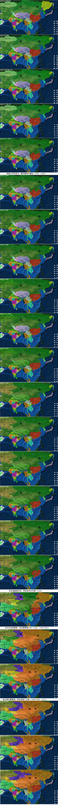
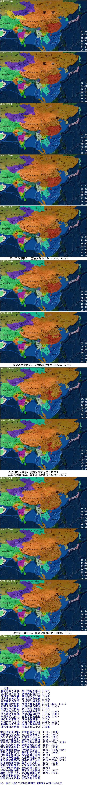

宋朝  
宋朝（960—1279年）是中国历史上承五代十国、下启元朝的时代，分北宋和南宋。960年，后周大将赵匡胤黄袍加身，建立宋朝。宋真宗、宋仁宗时期步入了盛世，北宋初期加强了中央集权，解决了藩镇割据问题。1127年靖康之耻，北宋灭亡。宋高宗赵构南迁建立了南宋。后期抗蒙战争连年，到1276年，元朝军队攻占临安，1279年，8岁的小皇帝赵昺被大臣陆秀夫背著跳海而死，厓山海战后，宋朝彻底灭亡。有学者认为宋朝灭亡是“崖山之后无中国”。宋朝是中国古代历史上经济、文化教育与科学创新最繁荣的时代，宋朝时中国GDP占世界比重60%，为各朝代第一，期间出现了宋明理学，科技发展亦突飞猛进，政治也较开明廉洁。人口至大观四年（1110年）的1亿1275万。西方与日本史学界中认为宋朝是中国历史上的文艺复兴与经济革命的人不在少数。宋朝是中国历史上的黄金时期。  
中文名称：大宋，宋朝  
英文名称：The Song Dynasty  
简称：宋  
所属洲：亚洲  
首都：开封、商丘、临安  
主要城市：汴京、洛阳、建康、宋州、成都  
货币：圆孔钱，交子  
政治体制：君主专制政体  
国家领袖：宋太祖，宋太宗，宋仁宗，宋孝宗  
人口数量：11275万，8060万  
主要民族：汉族  
主要宗教：儒学，道教，佛教  
国土面积：280万（北宋），200万（南宋）  
政治制度：两府三司  
监察机构：御史台  
文化形式：宋词  
  
  
南宋九帝：高孝光宁，理度恭端，另有流亡的卫王  
  
  
--南宋--  
靖康金军入汴京，康王商丘开南宋（1127）  
苗刘兵变诛宦侍，张浚擒苗复高宗（1129）  
杭州改作临安府，移驾绍兴称行在（1129）  
世忠败金黄天荡，岳飞宜兴复建康（1130）  
刘豫建立伪齐国，兀术富平战张浚（1130）  
钟相杨幺起洞庭，秦桧首任右丞相（1130-1135，1131）  
武穆北伐收襄阳，刘豫兴师攻南宋（1134，1136）  
淮西兵变废伪齐，岳飞议立建国公（1137）  
金释王伦开和议，南宋俯首称金臣（1137，1138）  
岳飞攻克朱仙镇，绍兴和议风波亭（1140，1141）  
朱熹求学武夷山，谋刺秦桧施全行（1144，1150）  
秦桧创始宋体字，死谥忠献封申王（1155）  
东南会子充货币，采石大捷虞允文（1160，1161）  
赵构退位孝宗继，张浚北伐败符离（1162，1163）  
隆兴和议改称叔，年奉岁币二十万（1164）  
  
  
孝宗退位光宗继，绍熙内禅传宁宗（1189，1194）  
韩侂胄代赵汝愚，庆元党禁害理学（1195，1197）  
光宗去世朱熹死，开禧北伐劳无功（1200，1206）  
成吉思汗建蒙古，史弥远杀韩侂胄（1206，1207）  
辛弃疾死陆游终，蒙古驱金至汴梁（1207/1210，1214）  
南宋从此拒岁币，金国南伐终无成（1214，1217）  
南宋联蒙共图金，始入通货膨胀期（1221，1224）  
蒙军合围汴梁城，史弥远死金国亡（1232，1233/1234）  
窝锅台军征四川，蒙哥御驾巴蜀地（1235，1258）  
钓鱼城前蒙哥死，贾似道君任宰相（1259）  
私自议和造捷报，南宋缺粮推公田（1259，1262/1263）  
度宗继位襄樊战，忽必烈建大元朝（1264/1268，1271）  
坚守五载襄阳陷，蒙古大军入长江（1273，1274）  
贾似道军遭覆灭，元军临安俘宋皇（1275，1276）  
丹心可叹大厦崩，临危为相文天祥（1276）  
赵昰福州作端宗，蒙军四川屠城民（1276，1277）  
朝廷迁往崖山去，大战投海南宋终（1278，1279）  
武林旧事伤繁华，东京梦华追前朝  
梦梁录尽临安事，犹忆清明上河图  
  
  
注：浙江卫视2015年12月制有《南宋》纪录片共八集

