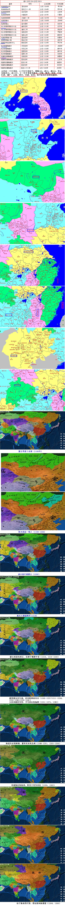
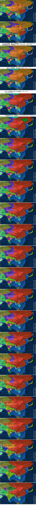
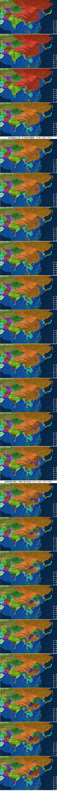
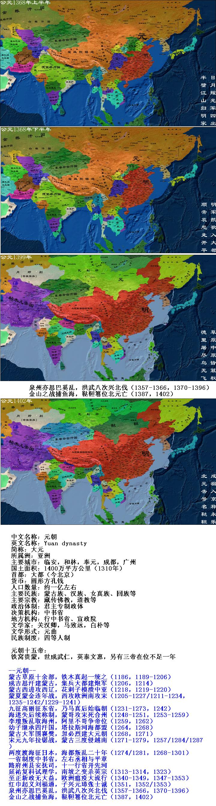

元朝（1271-1368)由蒙古族建立，是中国历史上第一个由少数民族建立的大一统帝国。定都大都（今北京市）。1260年忽必烈即位大汗并建元“中统”，1271年忽必烈取《易经》“大哉乾元”之意改国号为元，1279年灭南宋，统一中国。元朝的疆域空前广阔，北至北海、东到日本海，西藏和台湾第一次被纳入中国版图。元朝实行一省制，在中央设中书省，左右丞相和平章政事处理政务。造成了宰相专权和内乱频发。地方实行行省制度，开中国行省制度之先河。商品经济和海外贸易较繁荣。其间出现了元曲和散曲等文化形式。其整体生产力不如宋朝，后期因统治腐败和民族压迫，导致农民起义，1368年明军攻占大都，元朝在全国的统治结束，元政权退居漠称北元。1402年元臣鬼力赤篡位建国鞑靼，北元亡。  
  
  
元代在一个中书省、11个行中书省下，置路185，府33，州559，军4，安抚司15，县1127。十一行中书省为岭北、辽阳、陕西、河南、江浙、江西、湖广、云南、四川、甘肃、征东。其中征东行省即高丽国。  
  
  
中文名称：元朝  
英文名称：Yuan dynasty  
简称：大元  
所属洲：亚洲  
主要城市：临安，和林，奉元，成都，广州  
国土面积：1400万平方公里（1310年）  
首都：大都（今北京）  
货币：圆形方孔钱  
人口数量：约一亿左右  
主要民族：蒙古族、汉族、女真族、回族等  
主要宗教：藏传佛教，道教等  
政治体制：君主专制政体  
决策机构：中书省  
地方机构：行中书省、宣政院  
文学家：关汉卿，马致远，白朴等  
文学形式：元曲  
民族制度：四等人制  
  
  
元朝十五帝：  
铁窝贵蒙，世成武仁，英泰文惠，另有三帝在位不足一年  
  
  
--元朝--  
蒙古草原十余部，铁木真起一统之（1186，1189-1206）  
成吉思汗建蒙古，集兵大都建炮军（1206，1214）  
蒙古西进攻西辽，花剌子模溃中亚（1218，1219-1220）  
蒙夏蒙金连年战，西攻欧洲南攻宋（1205-1227/1211-1234，1235-1242/1229-1241）  
九征高丽征东省，乃马真后始临朝（1231-1273，1242）  
海迷失后续称制，蒙哥攻宋死合州（1248-1251，1253-1259）  
李璮叛乱取海州，阿里不哥争帝位（1259，1262）  
幼子继承四汗国，塔拉斯河海都盟（1264，1268）  
蒙古大军围襄樊，忽必烈建大元朝（1268，1271）  
宋元九年拉锯战，蒙古三度侵越南（1271-1279，1257/1284/1287）  
两度渡海征日本，海都叛乱三十年（1274/1281，1268-1301）  
一省制度中书省，左右丞相与平章  
路府州县安抚司，十一行省开先河  
延祐复科试理学，南坡之变杀英宗（1313-1314，1323）  
至正新政无大益，欧洲瘟疫大流行（1340-1349，1347-1353）  
红巾起义刘福通，子兴元璋张士诚（1351，1352/1353）  
泉州亦思巴奚乱，洪武八次兴北伐（1357-1366，1370-1396）  
金山之战捕鱼海，鞑靼篹位北元亡（1387，1402）