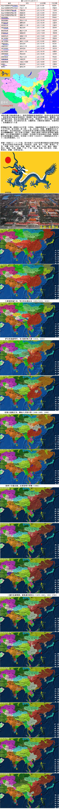
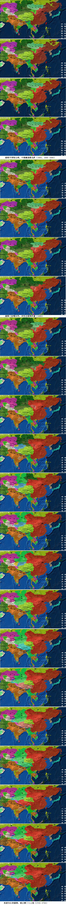
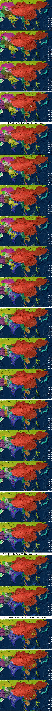
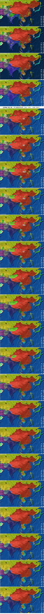
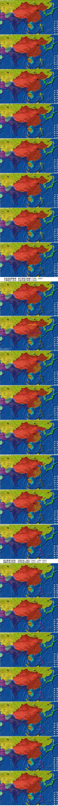
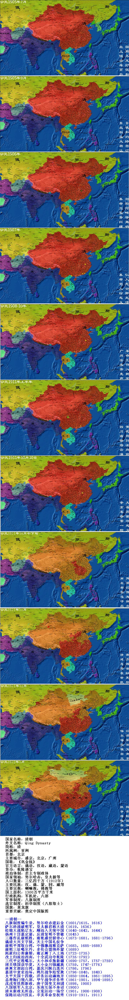

清朝  
清朝是中国历史上第二个由少数民族建立的统一政权，也是中国最后一个封建帝制国家，对中国历史产生了深远影响。1616年，建州女真部首领努尔哈赤建立后金。1636年，皇太极改国号为清。1644年入关，逐步统一全国。清朝前期，统一多民族国家得到巩固，基本上奠定了我国版图，同时君主专制发展到顶峰。1840年鸦片战争后进入近代，多遭列强入侵，主权严重丧失。1911年，辛亥革命爆发，清朝统治瓦解，从此结束了中国两千多年来的封建帝制。1912年2月12日，清帝被迫退位。清朝从后金建立开始算起，共有十二帝。自此之后，中国进入了民主时期。  
  
  
国家名称：清朝  
外文名称：Qing Dynasty  
简称：清  
所属洲：亚洲  
首都：北京  
主要城市：盛京，北京，广州  
国歌：《巩金瓯》  
官方语言：满语，汉语，藏语，蒙语  
货币：乾隆通宝  
政治体制：君主专制政体  
国家领袖：努尔哈赤，皇太极等  
人口数量：三亿四千万（1912年）  
主要民族：汉、满、蒙、回、藏等  
主要宗教：喇嘛教，佛教等  
国土面积：1300万平方千米  
行政机构：军机处，六部  
军事制度：八旗制度  
选官制度：科举制度（八股取士）  
国旗：黄龙旗  
重要贡献：奠定中国版图  
  
  
清朝十二帝：  
努尔哈赤，皇太极，  
顺治，康熙，雍正，乾隆，  
嘉庆，道光，咸丰，同治，  
光绪，宣统  
  
  
--清朝--  
八旗制度编牛录，努尔哈赤建后金（1601/1615，1616）  
萨尔浒战破明军，皇太极君称大清（1619，1636）  
松锦大战陷辽东，顺治入关统中国（1640-1642，1644）  
扬州十日嘉定屠，反清复明不曾歇（1645）  
三藩作乱康熙胜，雍乾盛世骄帝心（1673-1681，1681-1796）  
满清大兴文字狱，天主中国礼仪争  
康熙平郑取台湾，中俄激战雅克萨（1683，1685-1688）  
康熙三征噶尔丹，多伦会盟纳外蒙（1689）  
耗羡归公养廉银，雍正摊丁入土地（1723-1735）  
改土归流治西南，十全武功夸乾隆（1735-1792）  
三代平定准噶尔，大小和卓叛新疆（1690-1757，1757-1759）  
闭关锁国误华夏，大小金川镇藏族（1759，1747-1776）  
林爽文部起台湾，嘉庆川陕白莲兴（1786，1796）  
嘉道中衰吏治坏，鸦片战争始受欺（1796-1840，1840）  
太平天国十四载，洋务运动遍地开（1850-1864，1861-1895）  
总理衙门领六部，甲午战争洋务终（1861-1901，1894-1895）  
戊戌变法图新政，庚子国变义和团（1898，1900）  
八国联军入北京，东南互保不奉诏（1900）  
清末新政无所益，立宪运动一场空（1901，1906-1908）  
保路运动川汉乱，辛亥革命皇权终（1910-1911，1911）