## 第一层
#### 第一层第一步：十字架 1（还原 4 个棱块）

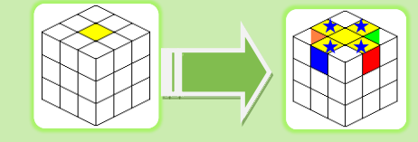

#### 第一层第二步：十字架 2（与侧面的 4 个中心块对色） 

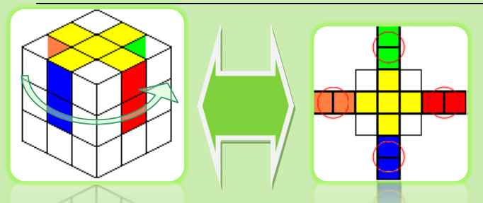

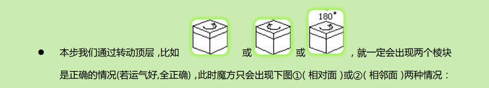

### R -> U'2 -> R' -> U'2 -> R 

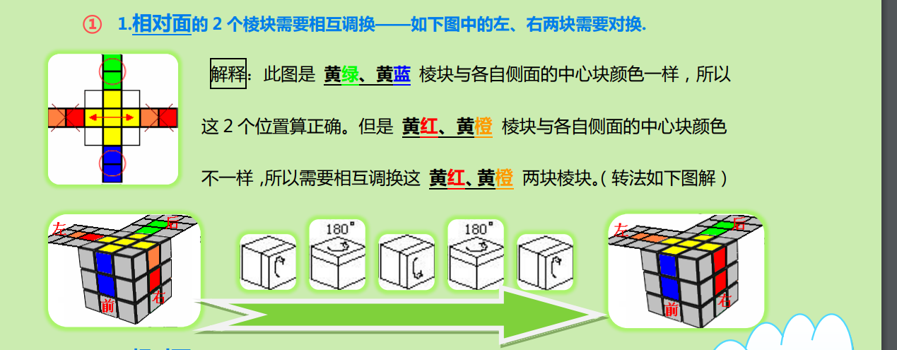

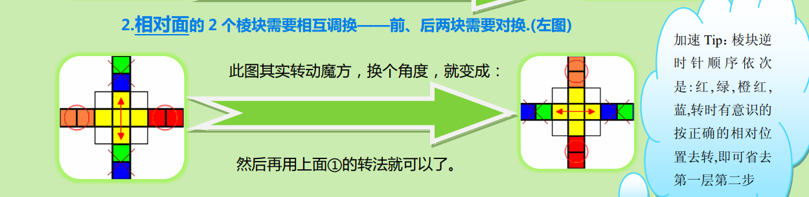

### R -> U' -> R' -> U -> R 

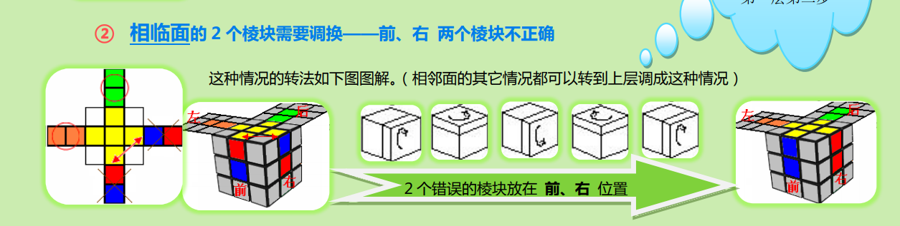

#### 第一层第三步：还原 4 个角 （完成本步，即可完成第层） 

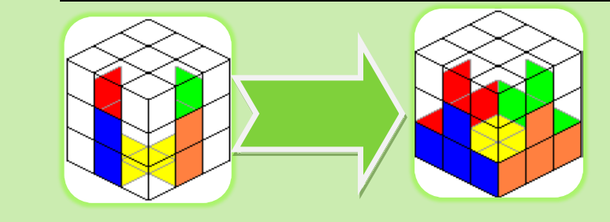

一共有 **5种情况**

### R -> U -> R'

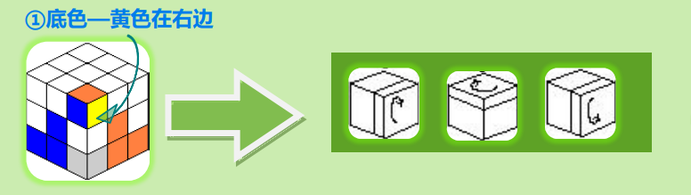

### U -> R -> U' -> R' 

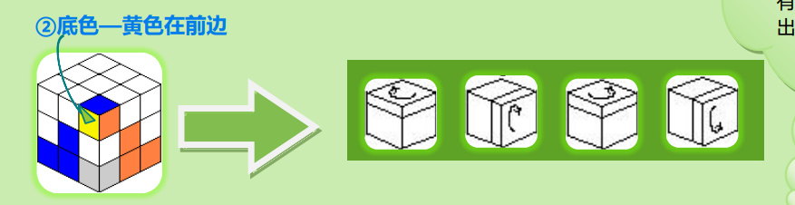

### R -> U' -> R' -> U'2

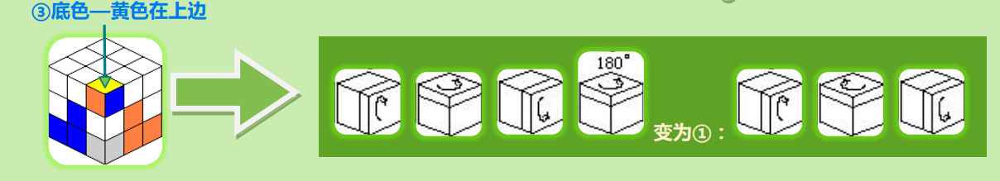

### R -> U -> R' -> U'

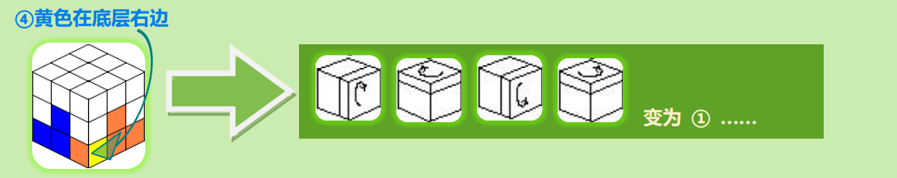

### R -> U' -> R'

## 第二层

公式一：
### R’ -> U’ -> R’ -> U’ -> R’ -> U -> R -> U -> R 

对称转法（即逆着转简称：“一逆法”）：
### R -> U -> R -> U -> R -> U’ -> R’ -> U’ -> R’ 

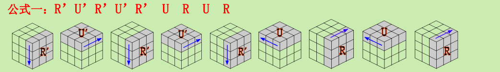

一、所需要的棱块在最上一层

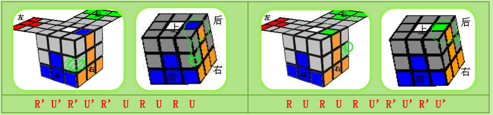

二、所需要的棱块就在中间的层

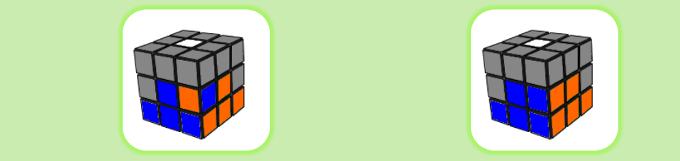

## 第三层

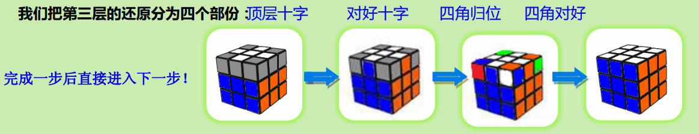

#### 顶层十字,其公式有 2 个。（可只学一个公式二） 

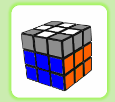

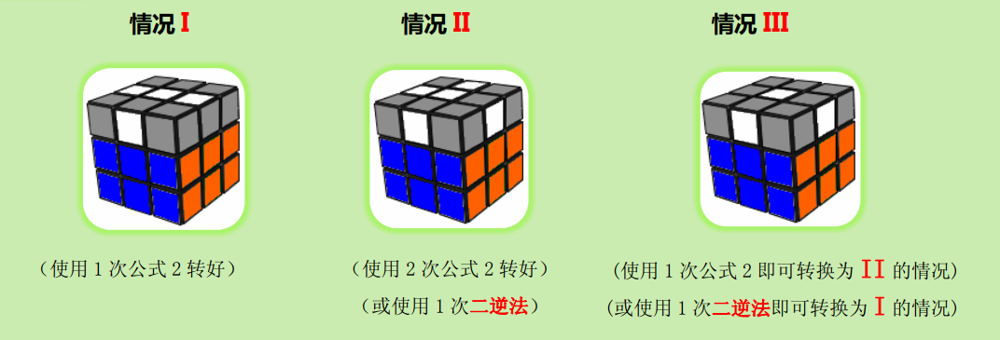

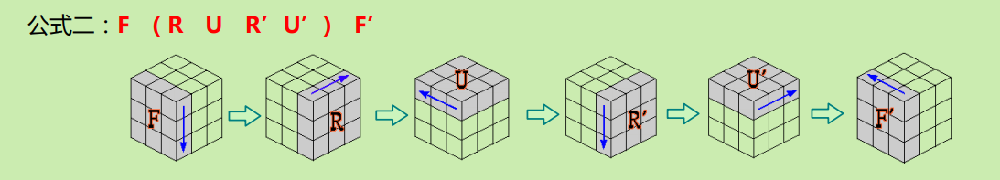

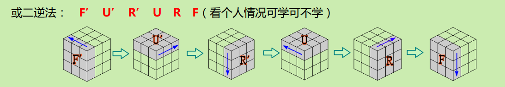

#### 对好十字。其公式有 1 个。 

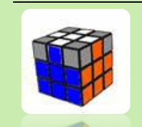

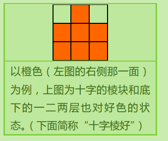

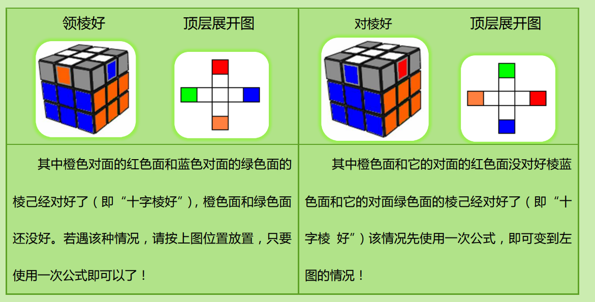

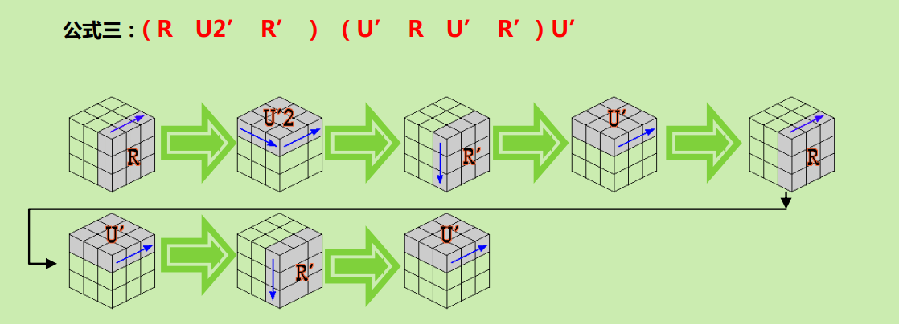

#### 上面四角各就各位

两种方法，每种方法**十步** 

方法1 
 
### L -> R' -> U -> L'U' -> R -> U -> L -> U' -> L'

方法2 

### B' -> F -> U' -> B -> U -> F' -> U' -> B' -> U -> B

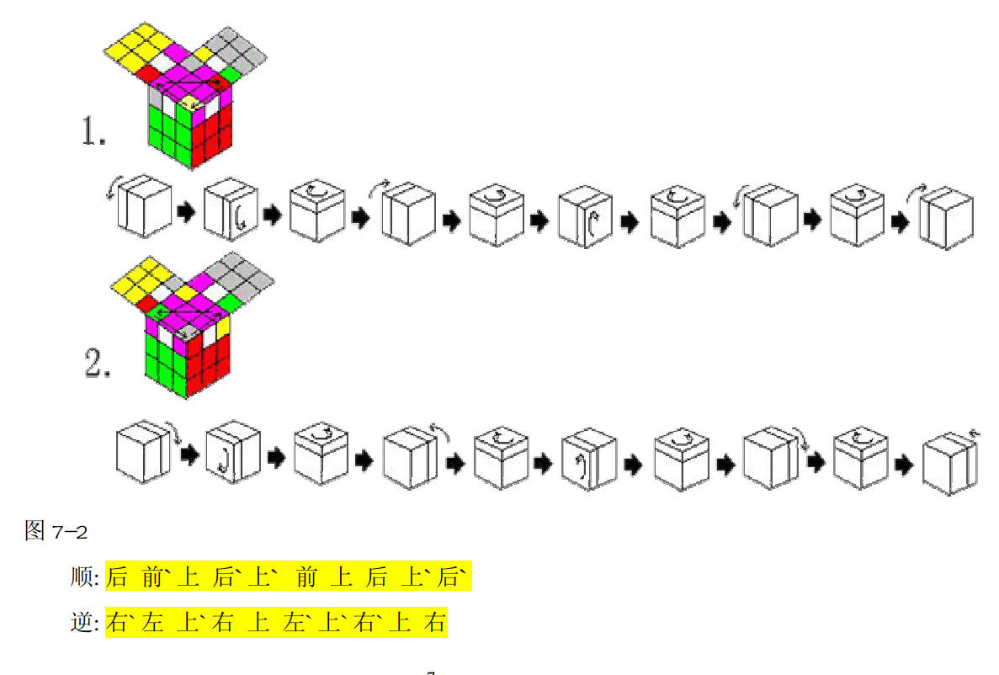

#### 上面角块颜色调整

方法1 
 
### R' -> U' -> R -> U' -> R' -> U'2 -> R -> U'2

方法2 

### F -> U -> F' -> U -> F -> U2 -> F' -> U2

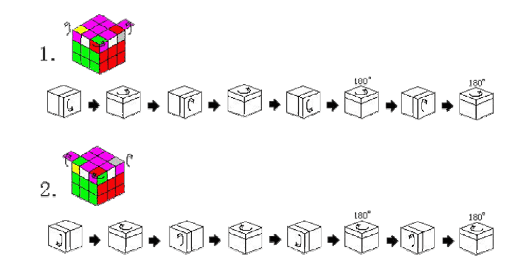

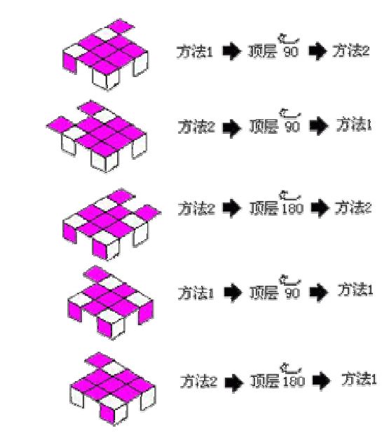

#### 终极还原

如果有四个不一致色块，可执行两次 **1**

逆时针时，一致面为前，执行 **1** 

### R' -> U' -> R -> U' -> R' -> U'2 -> R -> U'2 
### -> F -> U -> F' -> U -> F -> U2 -> F' -> U2 

顺时针时，一致面为右，执行 **2** 

### F -> U -> F' -> U -> F -> U2 -> F' -> U2 
### -> R' -> U' -> R -> U' -> R' -> U'2 -> R -> U'2

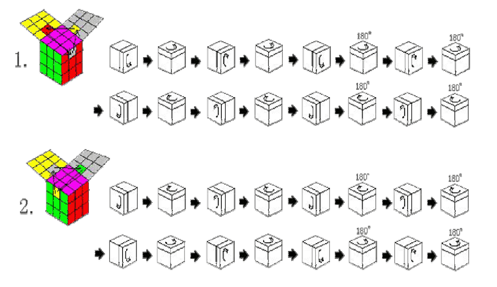