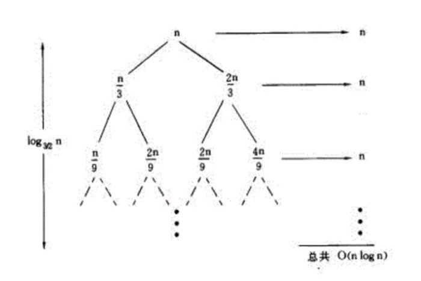
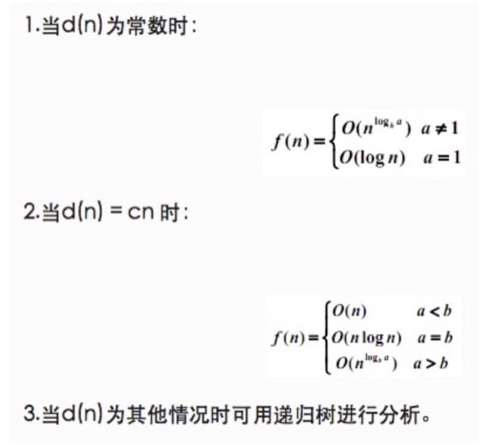

<script type="text/javascript" src="http://cdn.mathjax.org/mathjax/latest/MathJax.js?config=default"></script>

# 【不周山之算法与数据结构】贰 Big O 分析 

    发表于 2016-01-22  |    更新于 2016-11-27    |    分类于  [Technique][0]    |   |   652

前一讲大概了解了这个系列会涉及的内容，这一讲就从最重要的概念，Big O 开始讲起。既然我们要找到效率更高的算法，首先就得知道，怎么样才是高效率。

- - -


## 前条件/后条件

建议在写具体的函数之前，都要先想好（写好）前条件和后条件，这样可以确定问题的边界。

* 前条件：在函数调用之前一定为真的条件
* 后条件：在函数执行完之后为真的条件

例如：
```
// Precondition: x >= 0

// Postcondition: The square root of x has

// been written to the standard output

public void writeSqrt(double x){

...

}
```
## Big O

在具体介绍之前，先来一些基本的数学公式复习

$$log_b(x_1*x_2)=log_bx_1+log_bx_2$$

$$log_b(\frac{x_1}{x_2})=log_bx_1-log_bx_2$$

$$log_b(x^c)=c*log_bx$$


事实上除了我们常用的 Big O，还有另外两种表示的方法：Big Omega\\((Big-\Omega)\\)和 Big Theta\\((Big-\theta)\\)

这里只介绍它们的差别，具体的定义可以自行查看。

Big-O 实际上只表示上限，比如说，我们知道 \\(17n^2\in O(n^2)\\)，但是同时我们也可以说\\(17n^2\in O(n^37)\\) 和\\(17n^2\in O(2^n)\\)

Big omega 则是表示下限，例如 f(n)=n ，那么下面两个式子都成立 \\(f(n)\in O(n^2)\\) 与 \\(n^2\in \Omega(n)\\)

而 Big theta\\((Big\theta)\\) 则是前面两个的交集：

$$\theta(f)=O(f)\cap\Omega(f)$$

举例来说，函数 f(n)=4n ，则

$$f(n)\in O(n)$$
$$f(n)\in \Omega(n)$$

所以

$$f(n)\in \theta(n)$$

简单来说就是

1. Big O 是一个算法最坏情况的度量
1. Big Omega 是一个算法最好情况的度量
1. Big Theta 表达了一个算法的区间，给定了一个函数的渐近的逼近(asymptotically tight bound)

但是一般来说用 Big O 也就足够了

## 基本法则

我们先来了解一下程序分析的基本法则。一般来说，常见的输入输出以及简单的赋值语句，可以认为时间复杂度是 O(1)。在算复杂度的时候乘以一个常数复杂度不变，即 \\(O(Cf(n))=O(f(n))\\)  ，其中C是一个正常数。

我们知道，程序设计中无非是三种形态：顺序，选择和循环，只要能够算清楚这三种形态的复杂度，那么整个算法的复杂度也就不在话下了。

先来看看顺序结构，因为是顺序执行，所以可以通过求和法则来进行计算。若算法的 2 个部分时间复杂度分别为 T1(n)=O(f(n)) 和 T2(n)=O(g(n)) ,则T1(n)+T2(n)=O(max(f(n),g(n))) 。如果这两个部分的参数不一样的话，即 T1(m)=O(f(m)) 和 T2(n)=O(g(n)) ,则  T1(m)+T2(n)=O(f(m)+g(n))

然后是选择结构，选择本身判断是耗费 O(1) 时间的，但是主要时间还是在执行不同的子句上，所以转换为分析子句的时间复杂度。

最后来看看循环结构，一般来说可能包括多次循环，所以使用乘法法则。若算法的2个部分时间复杂度分别为 T1(n)=O(f(n)) 和 T2(n)=O(g(n)) ,则  T1×T2=O(f(n)×g(n)) 。

基本上理解了什么时候用求和法则，什么时候用乘法法则，再加上一点点运算，就可以推算出时间复杂度了。

## 递归

递归问题应该算是求复杂度问题中比较麻烦的了，并不像其他非递归的算法可以用上面提到的基本法则来进行分析。一般来说，遇到递归问题，有两种做法：

1. 主定理法
1. 递归树法

实际上主定理法可以看作是递归树法的一个总结，这里用一个例子来说明，假设我们的递归函数是： \\(T(n)=T(\frac{n}{3})+T(\frac{2n}{3})+n) \\)，那么画出递归树就是：

[](./img/14535025616030.jpg)

每层都会多出来一个 n，而从根到叶节点的最长路径是： \\(n\rightarrow\frac{2}{3}n\rightarrow(\frac{2}{3})^2n\rightarrow ... \rightarrow 1 \\) ，假设一共有 k 层，因为 \\((\frac{2}{3})^kn=1 \\)   ，所以 \\(k=log_{\frac{3}{2}}n \\)  ，也就是说\\(T(n)\leq\sum_{i=0}^kn =(k+1)n=n(log_{\frac{3}{2}}n + 1 ) \\)  ，即 \\(T(n)=O(nlog n) \\)  

我们来看看用主定理方法的话，这个复杂度要怎么算。首先我们要把递推公式转换为如下形式：

$$f(n)=af(\frac{n}{b})+d(n)$$

然后分情况进行讨论：

[](./img/14535029849534.jpg)

而这题中 \\(T(n)=T(\frac{n}{3})+T(\frac{2n}{3})+n \\)  ，化简之后相当于  a=3,b=3 ，于是在第二种情况中找到 a=b 的情况，就得到了最后的结果 \\(O(nlog n)\\)  

## 例题

这里主要是提及一些容易出错的地方。

> 不是出现了树结构，就一定会产生 log 的复杂度

假设代码如下：

    

    int sum(Node node){
    
        if (node == null){
    
            return 0;
    
        }
    
        return sum(node.left) + node.value + sum(node.right);
    
    }

因为实际上是遍历所有的节点一次，于是复杂度是 O(n)

> 有的时候可以通过这个代码的做用来进行复杂度判断

来看看下面这两个代码片段：

    

// 片段 1

    boolean isPrime(int n){
    
        for (int x = 2; x * x <= n; x++){
    
            if (n % x == 0){
    
                return false;
    
            }
    
        }
    
        return true;
    
    }

// 片段 2

    void permuation(String str){
    
        permutation(str, "");
    
    }
    
    void permutation(String str, String prefix){
    
        if (str.length() == 0){
    
            System.out.println(prefix);
    
        }
    
        else {
    
            for (int i = 0; i < str.length(); i++){
    
                String rem = str.substring(0,i) + str.substring(i+1);
    
                permutation(rem, prefix + str.charAt(i));
    
            }
    
        }
    
    }

第一题比较简单，因为是求质数，在 \\(\sqrt n\\)时间就可以完成，对应的时间复杂也就是出来了。

第二题做得是一个全排列，可以从两个思路：What It Means 和 What It Does。

* What It Means：因为是求排列，如果一个字符串有n个字符，那么所有的可能为 n*(n-1)*...*2*1 -> O(n!)
* What It Does：设一共有 n 个字符，第一次循环，有 n 次递归调用，第二次有 n-1 次，到最后一共有 n*(n-1)*...*2*1 -> O(n!)

最后再举一个递归的例子

    

    int fib(int n){
    
        if (n <= 0) return 0;
    
        else if (n == 1) return 1;
    
        return fib(n-1) + fib(n-2);
    
    }

这里每一次递归，都会由原来的一个分成两个，而一共有 n 层，于是时间复杂度为  O(2N)

## 总结

当然，很多时候还需要具体问题具体分析，最关键的，是对算法过程的清晰理解和掌握，有了这个，哪怕从头开始一点一点分析，也可以推导出正确答案。

[0]: /categories/Technique/