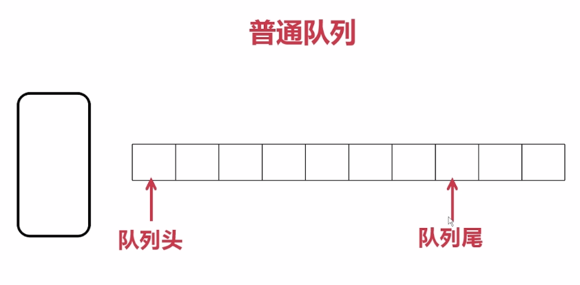
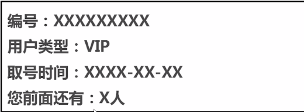
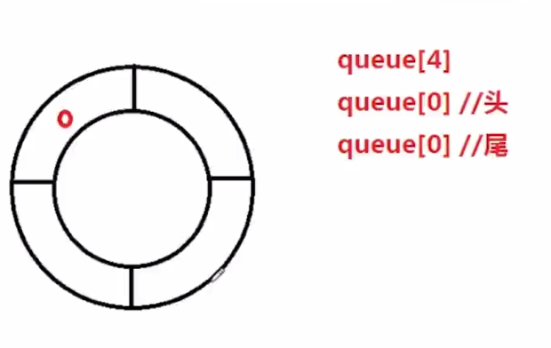

## 数据结构探险系列—队列篇

这是c++远征系列的进阶课程。

>少了基础语法，对于程序语言的应用，思考。

什么是数据结构？

>一群数据集合和数据之间的关系。
是指相互之间存在一种或多种特定关系的数据元素集合，

我们将学到：

- 数据结构的原理
- c++完整的实现每种数据结构的编码

### 队列

特点：先入先出（FIFO）

>例子: 火车站买票时，队头队尾。售票员从头开始卖票,先到的人先买到票就可以离开。

队列的分类：

- 普通队列
- 环形队列



>左侧窗口想象为售票员。然后第一个人排队，它既是队列头，又是队列尾。之后再进来人, 队列尾为最后一个人。由于内存的限制，队列不可能无限长。

两种方式：

- 售票员会动，卖完一个票往前走一位，浪费了已经走入的前半部分空间。
- 售票员不动，所有人走一位，速度慢。


环形队列的优缺点：

- 屏蔽了普通队列的缺点，充分利用空间
- 不好理解

>-有队列头，有队列尾。只有一个元素时，它既是队列头，又是队列尾，有顺时针排队和逆时针排队之说的，类似贪吃蛇自己吃自己尾巴

队列的用途；自动排号机

自动排号机的单子：



#### 面向对象的队列设计

实现环形队列,与c语言略有不同。

MyQueue设计(左边为c++,右侧注释情况为c语言):

```c
#ifndef MYQUEUE_H
#define MYQUEUE_H

class MyQueue 
{
public:
	MyQueue(int queueCapacity); //InitQueue(&Q)创建队列
	virtual ~MyQueue();		      //DestroyQueue(&Q)销毁队列
	void ClearQueue();		      //ClearQueue(&Q)清空队列
	bool QueueEmpty() const;    //QueueEmpty(Q)判空队列
	int  QueueLength() const;   //QueueLength(Q) 队列长度
	bool EnQueue(int element);  //EnQueue(&Q，&element) 新元素加入
	bool DeQueue(int &element); //DeQueue(&Q,&element) 首元素出队
	void QueueTraverse();       //QueueTraverse(Q,visit()) 遍历队列
	//简单类型不需要实现visit方法。
private:
	int *m_pQueue;             //队列数组指针
	int m_iQueueLen;		       //队列元素个数
	int m_iQueueCapacity;      //队列数组容量
	int m_iHead;               //数组的下标：队头
	int m_iTail;               //数组的下标：队尾
};

#endif

```

上述代码左侧为c++中队列实现所需要的函数，右侧注释部分为c语言。

一个队列的实现对于c++必须要有以下数据成员及成员函数：
  
- 创建队列的构造函数（传入队列容量）
- 销毁队列的析构函数
- 清空队列
- 判断队列是否为空
- 新元素加入
- 首元素出队
- 遍历队列
- 私有数据：容量、数组指针、容量

#### 环形队列代码实现



>编程思路: 红色圈为指定起始插入点。插入第一个时，头尾均为q[0].队尾指向的位置就是要插入的位置，队尾由q[0]变成了q[1]
每次插入之前判断有没有占满, 取出元素从队列头位置开始取。

4-1-CircleQueue

MyQueue.h:

```c
#ifndef MyQueue_h
#define MyQueue_h

class MyQueue
{
public:
    MyQueue(int queueCapacity);   //InitQueue(&Q)创建队列
    virtual ~MyQueue();           //DestroyQueue(&Q)销毁队列
    void ClearQueue();            //ClearQueue(&Q)清空队列
    bool QueueEmpty() const;      //QueueEmpty(Q)判空队列
    bool QueueFull() const;       //判断满
    int  QueueLength() const;     //QueueLength(Q) 队列长度
    bool EnQueue(int element);    //EnQueue(&Q，&element) 新元素加入
    bool DeQueue(int &element);   //DeQueue(&Q,&element) 首元素出队
    void QueueTraverse();         //QueueTraverse(Q,visit()) 遍历队列
    //简单类型不需要实现visit方法。
private:
    int *m_pQueue;             //队列数组指针
    int m_iQueueLen;           //队列元素个数
    int m_iQueueCapacity;      //队列数组容量
    int m_iHead;               //数组的下标：队头
    int m_iTail;               //数组的下标： 队尾
};

#endif /* MyQueue_h */
```

MyQueue.cpp:

```c
#include "MyQueue.h"
#include <iostream>
using namespace std;

MyQueue::MyQueue(int queueCapacity)
{
	m_iQueueCapacity = queueCapacity;//将用户定义的容积传递给内部变量容积
	
	//初始化队头队尾
	m_iHead = 0;
	m_iTail = 0;
	
	//队列元素个数初始化
	m_iQueueLen = 0;
	//分配内存，大小由容量决定
	m_pQueue = new int[m_iQueueCapacity]; // 申请内存的失败处理略
	ClearQueue();
}

MyQueue::~MyQueue()
{
	delete[]m_pQueue;
	m_pQueue = NULL;
}

void MyQueue::ClearQueue()
{
	// 重置队头队尾
	m_iHead = 0;
	m_iTail = 0;
	// 队列元素个数重置
	m_iQueueLen = 0;
}

bool MyQueue::QueueEmpty() const
{
	// 长度为0为空，head和tail会移动，此时id为0不一定是空
	/*if (m_iQueueLen == 0)
	{
		return true;
	}
	else
	{
		return false;
	}*/
	return (m_iQueueLen == 0) ? true : false;
}

int MyQueue::QueueLength() const
{
	return m_iQueueLen;
}

bool MyQueue::QueueFull() const
{
	return (m_iQueueLen == m_iQueueCapacity) ? true : false;
}


// 插入元素
bool MyQueue::EnQueue(int element)
{
	//先判断满，容量和长度相同
	if (QueueFull())
	{
		return false;
	}
	else
	{
		//插入新元素到当前队尾位置
		m_pQueue[m_iTail] = element;
		//队尾后移
		m_iTail++;
		m_iTail = m_iTail % m_iQueueCapacity;//循环
		//插入元素改变len
		m_iQueueLen++;
		return true;
	}

}


//这里的element必须是一个引用
bool MyQueue::DeQueue(int &element)
{
	if (QueueEmpty())
	{
		return false;
	}
	else {
		element = m_pQueue[m_iHead];
		m_iHead++;
		m_iHead = m_iHead % m_iQueueCapacity;
		m_iQueueLen--;
		return true;
	}
}

//使用const函数是为了防止这个函数对数据成员进行改变，这个函数只可以读取数据成员，所以，当不希望函数对数据成员改变时就需要使用从const函数

void MyQueue::QueueTraverse()
{
	for (int i=m_iHead;i<m_iHead+m_iQueueLen;i++)
		//要加上头的数字。不然次数不够
		//当前i是3.len是满。则i++越界
	{
		cout << m_pQueue[i%m_iQueueCapacity] << endl;
	}
}

```

几点要注意的地方：

- 遍历时的起始位置是队列头部，而不是0
- 要在队列的入队和出队操作中，对于队列的长度进行维护
- 遍历的循环次数为头部位置加上队列长度

入队时，如果此时的队尾位置已经超出长度了，就应该使用该数对于长度做取余操作，以此达成循环的效果(轮播图实现)

出队时，如果此时的队头位置已经超过长度了，也做相同处理。

```c
m_iTail = m_iTail % m_iQueueCapacity;//循环
bool MyQueue::DeQueue(int &element)
{
	if (QueueEmpty())
	{
		return false;
	}
	else {
		element = m_pQueue[m_iHead];
		m_iHead++;
		m_iHead = m_iHead % m_iQueueCapacity;
		m_iQueueLen--;
		return true;
	}
}
void MyQueue::QueueTraverse()
{
	for (int i=m_iHead;i<m_iHead+m_iQueueLen;i++)
		// 要加上头的数字。不然次数不够
		// 当前i是3.len是满，则i++越界。
	{
		cout << m_pQueue[i%m_iQueueCapacity] << endl
		//这里也要对于容量进行取余操作。否则因为我们的i并不是从0开始，加上长度会越界的。
	}
}

```

>注意循环终止条件添加m_ihead;否则会造成当前head位置为3，长度为4.只遍历一次。

main.cpp:

```c
#include <iostream>
#include <stdlib.h>
#include "MyQueue.h"
using namespace std;
int main()
{
    MyQueue *p = new MyQueue(4);
    p->EnQueue(10);
    p->EnQueue(12);
    p->EnQueue(16);
    p->EnQueue(18);
    p->EnQueue(20);
    p->QueueTraverse();
    
    int e = 0;
    p->DeQueue(e);
    cout << endl;
    cout << e << endl;
    
    p->DeQueue(e);
    cout << e << endl;
    cout << "**** del 10 12" <<endl;
    p->QueueTraverse();
    
    p->ClearQueue();
    cout << "**** after clear" << endl;
    p->QueueTraverse();
    cout << endl;
    
    p->EnQueue(20);
    p->EnQueue(30);
    cout << "**** after enqueue 20 30"<<endl;
    p->QueueTraverse();
    
    delete p;
    p = NULL;
    
    return 0;
}
```

运行结果:


#### 队列的实际应用

5-1-QueueCustomer

Customer.h

```c
#ifndef Customer_h
#define Customer_h
#include <string>
using namespace std;

class Customer
{
public:
    Customer(string name=" ", int age=0);
    void printInfo() const; // 打印顾客的个人信息
private:
    string m_strName;
    int m_iAge;
};

#endif /* Customer_h */

```

Customer.cpp

```c
#include <iostream>
#include "Customer.h"
using namespace std;

Customer::Customer(string name, int age)
{
	m_strName = name;
	m_iAge = age;
}

void Customer::printInfo() const
{
	cout << "姓名：" << m_strName << endl;
	cout << "年龄：" << m_iAge << endl;
	cout << endl;
}
```

MyQueue.h

>改造: 数据成员指针，插入时，出队时，遍历函数

```c
#ifndef MyQueue_h
#define MyQueue_h

#include "Customer.h"

class MyQueue
{
public:
    MyQueue(int queueCapacity);     //InitQueue(&Q)创建队列
    virtual ~MyQueue();             //DestroyQueue(&Q)销毁队列
    void ClearQueue();              //ClearQueue(&Q)清空队列
    bool QueueEmpty() const;        //QueueEmpty(Q)判空队列
    bool QueueFull() const;         //判断满
    int  QueueLength() const;       //QueueLength(Q) 队列长度
    bool EnQueue(Customer element); //EnQueue(&Q，&element) 新元素加入
    bool DeQueue(Customer &element);//DeQueue(&Q,&element) 首元素出队
    void QueueTraverse();           //QueueTraverse(Q,visit()) 遍历队列
    //简单类型不需要实现visit方法。
private:
    Customer *m_pQueue;        //队列数组指针
    int m_iQueueLen;           //队列元素个数
    int m_iQueueCapacity;      //队列数组容量
    int m_iHead;               //数组的下标：队头
    int m_iTail;               //数组的下标： 队尾
};
#endif /* MyQueue_h */
```

MyQueue.cpp

```c
#include "MyQueue.h"
#include <iostream>
using namespace std;

MyQueue::MyQueue(int queueCapacity)
{
	m_iQueueCapacity = queueCapacity;//将容积传递
									 ////初始化队头队尾
									 //m_iHead = 0;
									 //m_iTail = 0;
									 ////队列元素个数初始化
									 //m_iQueueLen = 0;
									 //分配内存
	m_pQueue = new Customer[m_iQueueCapacity];
	ClearQueue();
}

MyQueue::~MyQueue()
{
	delete[]m_pQueue;
	m_pQueue = NULL;
}

void MyQueue::ClearQueue()
{
	//重置队头队尾
	m_iHead = 0;
	m_iTail = 0;
	//队列元素个数重置
	m_iQueueLen = 0;
}

bool MyQueue::QueueEmpty() const
{
	return (m_iQueueLen == 0) ? true : false;
}

int MyQueue::QueueLength() const
{
	return m_iQueueLen;
}

bool MyQueue::QueueFull() const
{
	return (m_iQueueLen == m_iQueueCapacity) ? true : false;
}

bool MyQueue::EnQueue(Customer element)
{
	//先判断满
	if (QueueFull())
	{
		return false;
	}
	else
	{
		//插入尾部
		m_pQueue[m_iTail] = element;
		//队尾后移
		m_iTail++;
		m_iTail = m_iTail % m_iQueueCapacity;//循环
											 //插入元素改变len
		m_iQueueLen++;
		return true;
	}

}

bool MyQueue::DeQueue(Customer &element)
{
	if (QueueEmpty())
	{
		return false;
	}
	else {
		element = m_pQueue[m_iHead];
		m_iHead++;
		m_iHead = m_iHead % m_iQueueCapacity;
		m_iQueueLen--;
		return true;
	}
}
//使用const函数是为了防止这个函数对数据成员进行改变，这个函数只可以读取数据成员，所以，当不希望函数对数据成员改变时就需要使用从const函数

void MyQueue::QueueTraverse()
{
	for (int i = m_iHead; i<m_iHead + m_iQueueLen; i++)
		//要加上头的数字。不然次数不够
		//当前i是3.len是满。则i++越界
	{
		m_pQueue[i%m_iQueueCapacity].printInfo();
		cout << "前面还有：" << (i - m_iHead) << "人" << endl;
		cout << endl;
	}
}

```

main.cpp:

```c
#include <iostream>
#include <stdlib.h>
#include "MyQueue.h"
#include "Customer.h"//myqueue中包含过了
using namespace std;
int main()
{
	MyQueue *p = new MyQueue(4);
	
	// 插入custom对象类型
	Customer c1("mtianyan", 21);
	Customer c2("lisi", 30);
	Customer c3("wangwu", 40);
	p->EnQueue(c1);
	p->EnQueue(c2);
	p->EnQueue(c3);

	p->QueueTraverse();
	cout << “3 customer” << endl;
	
	Customer c4("", 0); // 临时变量用来存放被删除的值
	
	p->DeQueue(c4);
	c4.printInfo();
	cout << "c4 del" << endl;

	p->QueueTraverse();
	
	return 0;
}

```

运行结果：


扩展知识：

- 队列的类模板实现：扩展出k可以接收多种数据类型的类模板
- 插入具体其他信息的对象，如插入编号。可以查到前面还有几个元素 (放在遍历部分)