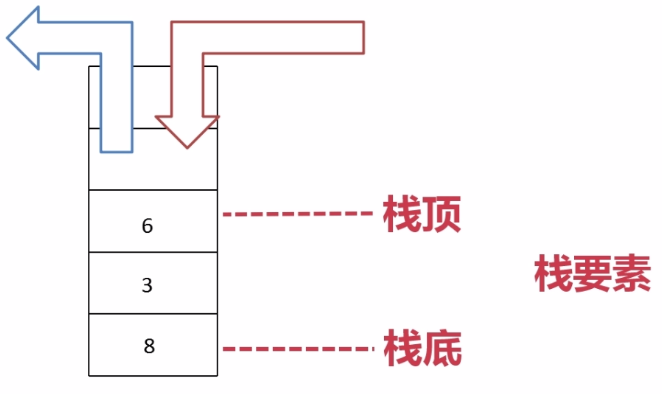
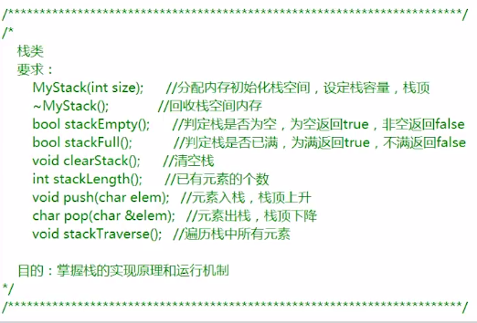
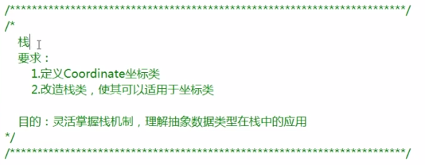
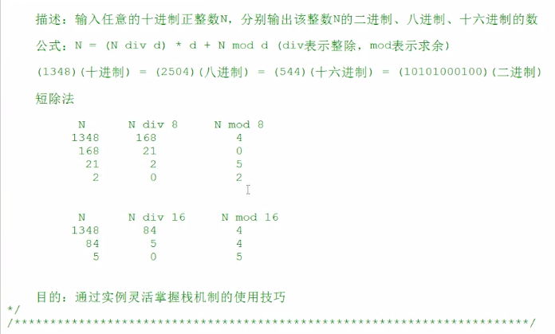
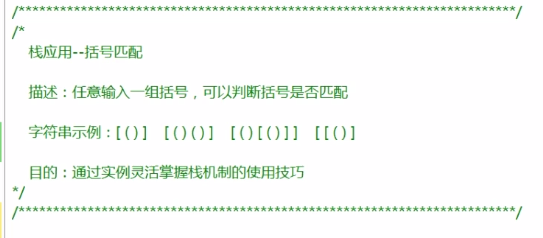

## 数据结构探险—栈篇

什么是栈？

>古代栈就是牲口棚的意思。

栈是一种机制：后进先出 LIFO（last in first out）

比如电梯,先进电梯位于电梯后部,比前面的人得更晚出来。



>空栈，栈底，栈顶。没有元素的时候，栈顶和栈底指向同一个元素，如果加入新元素，栈顶不断升高。取出数据时栈顶不断地降低。栈顶和栈底都称之为栈要素。

课程内容:

通过demo说明栈的基本原理

- 热身运动-进制转换：十进制转换到二进制，八进制，十六进制

```c
N = (N div d) * d + N mod d
```

- 步步为营- 括号匹配检测：检测一个字符串中的各种括号是否匹配

```c
[()]  [()()]  [()[()]]
```

### 实例介绍



2-1-StackStartDemo

MyStack.h:

```c
#ifndef MyStack_h
#define MyStack_h

class MyStack
{
public:
    MyStack(int size);              //分配内存初始化栈空间，设定栈容量，栈顶
    ~MyStack();                     //回收栈空间内存
    bool stackEmpty();              //判断栈是否为空 为空 true 非空false
    bool stackFull();               //判断栈是否为满 为满 true 不满 false
    void clearStack();              //清空栈
    int stackLength();              //栈中元素的个数
    bool push(char elem);           //将元素压入栈中，栈顶上升 判满
    bool pop(char &elem);           //将元素推出栈，栈顶下降 判空
    void stackTraverse(bool isFromButtom);    //遍历栈中元素并输出
private:
    int m_iTop;            //栈顶，同时可以反映栈中元素个数(栈底永远是0)
    int m_iSize;           //栈容量
    char *m_pBuffer;       //栈空间指针
};

#endif /* MyStack_h */
```

MyStack.cpp:

```c
#include "Mystack.h"
#include <iostream>
using namespace std;

MyStack::MyStack(int size)
{
	m_iSize = size;
	m_pBuffer = new char[size]; //申请内存
	m_iTop = 0; // 初始化栈顶
}
MyStack::~MyStack()
{
	delete[]m_pBuffer;
	m_pBuffer = NULL;
}
bool MyStack::stackEmpty()
{
	if (m_iTop == 0) // 小技巧: if(0 == m_iTop) 写成一个等号会报错
	{
		return true;
	}
	else
	{
		return false;
	}
}
bool MyStack::stackFull()
{
	if ( m_iTop == m_iSize) // >=
	{
		return true;
	}
	else
	{
		return false;
	}
}

void MyStack::clearStack()
{
	m_iTop = 0; //原栈中所有值无效，通过栈顶标记有没有该元素。
}

int MyStack::stackLength()
{
	return m_iTop; // 空栈 0 放一个元素加1
}

bool MyStack::push(char elem) //将当前元素一定得放入栈顶
{
	if(stackFull())
	{
		return false; // 或抛出异常，外层代码接收
	}
	m_pBuffer[m_iTop] = elem;
	m_iTop++;
	return true;
}

// 引用可以接收
bool MyStack::pop(char &elem)
{
	if(stackEmpty())
	{
		return false;
	}
	m_iTop--; //因为入栈时做了++，使栈顶指向下一个空位置。减减才能到有值的位置
	elem = m_pBuffer[m_iTop];
	return true;
}

//char MyStack::pop()
//{
//	if(stackEmpty())
//	{
//		throw 1;
//	}
//	else
//	{
//		m_iTop--;
//		return m_pBuffer[m_iTop];
//	}
//}


// 参数: visti()函数指针，对象元素栈得传入专有的函数处理。
void MyStack::stackTraverse(bool isFromButtom)
{
	if (isFromButtom)
	{
	  // 从栈底开始遍历
		for (int i = 0; i < m_iTop; i++)
		{
			cout << m_pBuffer[i] << ",";
		}
	}
	else
	{
	  // 从栈顶开始
		for (int i = m_iTop - 1; i >= 0; i--)
		{
			cout << m_pBuffer[i] << ",";
		}
	}
	
}

```

main.cpp:

```c
#include "Mystack.h"
#include <iostream>
#include <stdlib.h>
using namespace std;
int main(void)
{
	MyStack *pStack = new MyStack(5);

	pStack->push('h');//栈底
	pStack->push('e');
	pStack->push('l');
	pStack->push('l');
	pStack->push('o');//栈顶

	pStack->stackTraverse(true);
	
	cout << endl;
	char elem = 0;
	pStack->pop(elem);

	cout << "pop elem" <<endl;
	cout << elem << endl;

	//pStack->clearStack();
	pStack->stackTraverse(false);

  cout << endl; 
	cout << "len:" << pStack->stackLength() << endl;
	
	if (pStack->stackEmpty())
	{
		cout << "栈为空" << endl;
	}
	if (pStack->stackFull())
	{
		cout << "栈为满" << endl;
	}

	delete pStack;
	pStack = NULL;
	return 0;
}
```

运行结果：


### 案例改造。

要求：



3-1-StackCoordinate

Coordinate.h

```c
#ifndef COORDINATE_H
#define COORDINATE_H
class Coordinate
{
public:
	Coordinate(int x=0,int y=0);
	void printCoordinate();
private:
	int m_iX;
	int m_iY;
};
#endif
```

Coordinate.cpp

```c
#include "Coordinate.h"
#include <iostream>
using namespace std;

Coordinate::Coordinate(int x, int y)
{
	m_iX = x;
	m_iY = y;
}
void Coordinate::printCoordinate()
{
	cout << "(" << m_iX << "," << m_iY << ")" << endl;
}
```

MyStack.h

```c
#ifndef MyStack_h
#define MyStack_h

#include "Coordinate.h"
class MyStack
{
public:
    MyStack(int size);         //分配内存初始化栈空间，设定栈容量，栈顶
    ~MyStack();                //回收栈空间内存
    bool stackEmpty();         //判断栈是否为空
    bool stackFull();          //判断栈是否为满
    void clearStack();         //清空栈
    int stackLength();         //栈中元素的个数
    bool push(Coordinate elem);    //将元素压入栈中，栈顶上升
    bool pop(Coordinate &elem);    //将元素推出栈，栈顶下降
    void stackTraverse(bool isFromButtom);  //遍历栈中元素并输出
private:
    int m_iTop;             //栈顶，栈中元素个数
    int m_iSize;            //栈容量
    Coordinate *m_pBuffer;  //栈空间指针
};

#endif /* MyStack_h */
```

MyStack.cpp

```c
#include "Mystack.h"
#include <iostream>
using namespace std;

MyStack::MyStack(int size)
{
	m_iSize = size;
	m_pBuffer = new Coordinate[size];// 默认构造函数。
	m_iTop = 0;
}
MyStack::~MyStack()
{
	delete[]m_pBuffer;
	m_pBuffer = NULL;
	
}
bool MyStack::stackEmpty()
{
	if (m_iTop == 0)//if(0 == m_iTop)
	{
		return true;
	}
	else
	{
		return false;
	}
}
bool MyStack::stackFull()
{
	if ( m_iTop == m_iSize)//>=
	{
		return true;
	}
	else
	{
		return false;
	}
}

void MyStack::clearStack()
{
	m_iTop = 0;//原栈中所有值无效
}

int MyStack::stackLength()
{
	return m_iTop;
}

bool MyStack::push(Coordinate elem)//放入栈顶
{
	if (stackFull())
	{
		return false;
	}
	m_pBuffer[m_iTop] = elem;
	// 因为这里的coordinate是一个简单的复制，所以使用默认拷贝函数就可以了
	// 如果Coordinate里面又含有指针申请了空间，深拷贝，浅拷贝。
	m_iTop++;
	return true;
}
bool MyStack::pop(Coordinate &elem)
{
	if (stackEmpty())
	{
		return false;
	}
	m_iTop--;//因为入栈时做了++，使栈顶指向下一个空位置
	elem = m_pBuffer[m_iTop];
	return true;
}

//char MyStack::pop()
//{
//	if (stackEmpty())
//	{
//		throw 1;
//	}
//	else
//	{
//		m_iTop--;
//		return m_pBuffer[m_iTop];
//	}
//}

void MyStack::stackTraverse(bool isFromButtom)
{
	if (isFromButtom)
	{
		for (int i = 0; i < m_iTop; i++)
		{
			//cout << m_pBuffer[i] << ",";
			m_pBuffer[i].printCoordinate(); //也可以重载输出运算符实现
		}
	}
	else
	{
		for (int i = m_iTop - 1; i >= 0; i--)
		{
			//cout << m_pBuffer[i] << ",";
			m_pBuffer[i].printCoordinate();
		}
	}
	
}
```

main.cpp:

```c
#include "Mystack.h"
#include <iostream>
#include <stdlib.h>
using namespace std;
int main(void)
{
	MyStack *pStack = new MyStack(5);

	pStack->push(Coordinate(1,2));//底
	pStack->push(Coordinate(3,4));

	pStack->stackTraverse(true); 
	
	pStack->stackTraverse(false);

	cout << pStack->stackLength() << endl;

	delete pStack;
	pStack = NULL;
	return 0;
}
```

运行结果：


经过改造我们使栈满足了Coordinate对象的入栈出栈。

### 将普通栈改为类模板栈,使其可以适用于任何数据类型

栈的类模板,要求:

>将普通栈改造为类模板栈,使其可以适用于任何数据类型;目的:灵活掌握栈机制,理解抽象数据类型在栈中的应用

上面我们实现过两遍对于栈的实现: 一次是实现char数组的栈,一次是实现coordinate对象的;两次除过数据类型,差别不是很大。所以本次我们使用类模板实现适用任何数据类型的栈

3-2-StackClassTemplate

MyStack.h: (因为编译器不支持类模板分开编译。所以cpp为空)

```c
#ifndef MYSTACK_H
#define MYSTACK_H
#include <iostream>
using namespace std;
template <typename T>
class MyStack
{
public:
	MyStack(int size);		  //分配内存初始化栈空间，设定栈容量，栈顶
	~MyStack();				      //回收栈空间内存
	bool stackEmpty();	  	//判断栈是否为空
	bool stackFull();		    //判断栈是否为满
	void clearStack();	  	//清空栈
	int stackLength();      //栈中元素的个数
	bool push(T elem);	//将元素压入栈中，栈顶上升
	bool pop(T &elem);	//将元素推出栈，栈顶下降
	void stackTraverse(bool isFromButtom);	//遍历栈中元素并输出
private:
	int m_iTop;         //栈顶，栈中元素个数
	int m_iSize;			  //栈容量
	T *m_pBuffer;		    //栈空间指针
};

template <typename T>
MyStack<T>::MyStack(int size)
{
	m_iSize = size;
	m_pBuffer = new T[size];
	m_iTop = 0;
}
template <typename T>
MyStack<T>::~MyStack()
{
	delete[]m_pBuffer;
	m_pBuffer = NULL;

}
template <typename T>
bool MyStack<T>::stackEmpty()
{
	if (m_iTop == 0)//if(0 == m_iTop)
	{
		return true;
	}
	else
	{
		return false;
	}
}
template <typename T>
bool MyStack<T>::stackFull()
{
	if (m_iTop == m_iSize)//>=
	{
		return true;
	}
	else
	{
		return false;
	}
}
template <typename T>
void MyStack<T>::clearStack()
{
	m_iTop = 0;//原栈中所有值无效
}
template <typename T>
int MyStack<T>::stackLength()
{
	return m_iTop;
}
template <typename T>
bool MyStack<T>::push(T elem)//放入栈顶
{
	if (stackFull())
	{
		return false;
	}
	m_pBuffer[m_iTop] = elem;
	//因为这里的coordinate是一个简单的复制。所以使用默认拷贝函数就可以了
	m_iTop++;
	return true;
}
template <typename T>
bool MyStack<T>::pop(T &elem)
{
	if (stackEmpty())
	{
		return false;
	}
	m_iTop--;//因为入栈时做了++，使栈顶指向下一个空位置
	elem = m_pBuffer[m_iTop];
	return true;
}

//char MyStack::pop()
//{
//	if (stackEmpty())
//	{
//		throw 1;
//	}
//	else
//	{
//		m_iTop--;
//		return m_pBuffer[m_iTop];
//	}
//}
template <typename T>
void MyStack<T>::stackTraverse(bool isFromButtom)
{
	if (isFromButtom)
	{
		for (int i = 0; i < m_iTop; i++)
		{
			cout << m_pBuffer[i];
			//m_pBuffer[i].printCoordinate();
		}
	}
	else
	{
		for (int i = m_iTop - 1; i >= 0; i--)
		{
			cout << m_pBuffer[i];
			//m_pBuffer[i].printCoordinate();
		}
	}

}

#endif
```

Coordinate.h

```c
#ifndef COORDINATE_H
#define COORDINATE_H
#include <ostream>
using namespace std;
class Coordinate
{
	friend ostream &operator<<(ostream &out, Coordinate &coor); // 重载输出运算符
public:
	Coordinate(int x=0,int y=0);
	void printCoordinate();
private:
	int m_iX;
	int m_iY;
};
#endif
```

Coordinate.cpp

```c
#include "Coordinate.h"
#include <iostream>
using namespace std;

Coordinate::Coordinate(int x, int y)
{
	m_iX = x;
	m_iY = y;
}
void Coordinate::printCoordinate()
{
	cout << "(" << m_iX << "," << m_iY << ")" << endl;
}

ostream &operator<<(ostream &out, Coordinate &coor)
{
	out << "(" << coor.m_iX << "," << coor.m_iY << ")" << endl;
	return out;
}
```

main.cpp:

```c
#include "Mystack.h"
#include <iostream>
#include <stdlib.h>
#include "Coordinate.h"
using namespace std;
int main(void)
{
	MyStack<Coordinate> *pStack = new MyStack<Coordinate>(5);

	pStack->push(Coordinate(1,2));//底
	pStack->push(Coordinate(3, 4));

	pStack->stackTraverse(true);
	
	pStack->stackTraverse(false);

	cout << pStack->stackLength() << endl;
	MyStack<char> *pStack2 = new MyStack<char>(5);

	pStack2->push('h');//底
	pStack2->push('e');
	pStack2->push('l');
	pStack2->push('l');
	pStack2->push('o');//顶

	pStack2->stackTraverse(true);
	delete pStack;
	pStack = NULL;
	return 0;
}
```


>可以看到我们的类模板已经将栈改造成了通用数据类型的栈。

### 栈应用-进制转换



>短除法,不停除以进制数,保留余数;然后商继续除以进制保留余数,直到商为0。

栈的应用: 将每次的余数 4 0 5 2 入栈,然后从栈顶开始打印。八进制为2504。

4-1-StackBinaryOctonary

MyStack.h

```c
#ifndef MYSTACK_H
#define MYSTACK_H
#include <iostream>
using namespace std;
template <typename T>
class MyStack
{
public:
	MyStack(int size);		//分配内存初始化栈空间，设定栈容量，栈顶
	~MyStack();				    //回收栈空间内存
	bool stackEmpty();		//判断栈是否为空
	bool stackFull();		  //判断栈是否为满
	void clearStack();		//清空栈
	int stackLength();    //栈中元素的个数
	bool push(T elem);	  //将元素压入栈中，栈顶上升
	bool pop(T &elem);  	//将元素推出栈，栈顶下降
	void stackTraverse(bool isFromButtom);	//遍历栈中元素并输出
private:
	int m_iTop;       //栈顶，栈中元素个数
	int m_iSize;		  //栈容量
	T *m_pBuffer;		  //栈空间指针
};

template <typename T>
MyStack<T>::MyStack(int size)
{
	m_iSize = size;
	m_pBuffer = new T[size];
	m_iTop = 0;
}
template <typename T>
MyStack<T>::~MyStack()
{
	delete[]m_pBuffer;
	m_pBuffer = NULL;

}
template <typename T>
bool MyStack<T>::stackEmpty()
{
	if (m_iTop == 0)//if(0 == m_iTop)
	{
		return true;
	}
	else
	{
		return false;
	}
}
template <typename T>
bool MyStack<T>::stackFull()
{
	if (m_iTop == m_iSize)//>=
	{
		return true;
	}
	else
	{
		return false;
	}
}
template <typename T>
void MyStack<T>::clearStack()
{
	m_iTop = 0;//原栈中所有值无效
}
template <typename T>
int MyStack<T>::stackLength()
{
	return m_iTop;
}
template <typename T>
bool MyStack<T>::push(T elem)//放入栈顶
{
	if (stackFull())
	{
		return false;
	}
	m_pBuffer[m_iTop] = elem;
	//因为这里的coordinate是一个简单的复制。所以使用默认拷贝函数就可以了
	m_iTop++;
	return true;
}
template <typename T>
bool MyStack<T>::pop(T &elem)
{
	if (stackEmpty())
	{
		return false;
	}
	m_iTop--;//因为入栈时做了++，使栈顶指向下一个空位置
	elem = m_pBuffer[m_iTop];
	return true;
}

//char MyStack::pop()
//{
//	if (stackEmpty())
//	{
//		throw 1;
//	}
//	else
//	{
//		m_iTop--;
//		return m_pBuffer[m_iTop];
//	}
//}
template <typename T>
void MyStack<T>::stackTraverse(bool isFromButtom)
{
	if (isFromButtom)
	{
		for (int i = 0; i < m_iTop; i++)
		{
			cout << m_pBuffer[i];
			//m_pBuffer[i].printCoordinate();
		}
	}
	else
	{
		for (int i = m_iTop - 1; i >= 0; i--)
		{
			cout << m_pBuffer[i];
			//m_pBuffer[i].printCoordinate();
		}
	}

}
#endif
```

main.cpp

```c
#include "MyStack.h"
#include <iostream>
#include <stdlib.h>
using namespace std;

#define BINARY 2
#define OCTONARY 8
#define HEXADECIMAL 16

int main(void)
{
    MyStack<int> *pStack = new MyStack<int>(30);
    int N = 1348;
    int mod = 0;
    while (N !=0)
    {
        mod = N % BINARY;
        pStack->push(mod);
        N = N / BINARY;
    }
    pStack->stackTraverse(false);
    
    pStack->clearStack();
    cout << endl;
    int M = 1348;
    while (M !=0)
    {
        mod = M % OCTONARY;
        pStack->push(mod);
        M = M / OCTONARY;
    }
    pStack->stackTraverse(false);
    cout << endl;
    
    delete pStack;
    pStack = NULL;
    return 0;
}
```

二进制和8进制都没有问题了，16进制还需要进一步改造。

运行结果：


#### 16进制改造

Mystack.h与原来一致。

```c
#include "MyStack.h"
#include <iostream>
#include <stdlib.h>
using namespace std;

#define BINARY 2
#define OCTONARY 8
#define HEXADECIMAL 16

int main(void)
{
    char num[] = "0123456789ABCDEF"; //栈中出现了10 访问到的就是AA
    MyStack<char> *pStack = new MyStack<char>(30);
    int N = 2018;
    int mod = 0;
    while (N !=0)
    {
        mod = N % HEXADECIMAL;
        pStack->push(num[mod]);
        N = N / HEXADECIMAL;
    }
    pStack->stackTraverse(false);
    cout << endl;
    
//    char elem = 0;
//    while (!pStack->stackEmpty())
//    {
//        pStack->pop(elem);
//        cout << num[elem];
//    }
    
    delete pStack;
    pStack = NULL;
    return 0;
}
```

如果仍使栈为int型。则可以使用注释部分打印出内容。修改为char之后，不重载运算符的情况下，使用
`pStack->push(num[mod]);`取出具体值处理。或者在存进去的时候，直接转换了再存。

运行结果:


### 栈应用之括号匹配



>以第一个为例, 从前往后扫描, 左方括号入栈,左圆括号入栈;当遇到右圆括号则左圆括号出栈。当遇到右方括号，左方括号出栈。字符串扫描完毕时栈为空则全部匹配, 栈中还有东西则不是全部匹配(当前栈顶的是最迫切需求匹配的)

Mystack.h 与之前的一样

4-3-CharMatching

```c
#include "Mystack.h"
#include <iostream>
#include <stdlib.h>
using namespace std;

int main(void)
{
    MyStack<char> *pStack = new MyStack<char>(30);   //已存入的字符
    
    MyStack<char> *pNeedStack = new MyStack<char>(30);//需要的字符。
    
    char str[] = "[()]]";
    char currentNeed = 0;
    
    for (int i=0;i<strlen(str);i++)
    {
        if (str[i] != currentNeed)//如果此时扫描到的字符不是我们所需要的。
        {
            pStack->push(str[i]);//那么将这个字符存入“已存入字符”
            switch (str[i])//对于这个字符，生成它的currentneed
            {
                case '[':
                    if (currentNeed !=0)//如果currentneed已经有值，不为初值。
                    {
                        pNeedStack->push(currentNeed);//将当前的需要字符入栈。
                    }
                    currentNeed = ']';//生成当前需要。
                    break;
                case  '(':
                    if (currentNeed != 0)
                    {
                        pNeedStack->push(currentNeed);
                    }
                    currentNeed = ')';
                    break;
                default:
                    cout << currentNeed <<endl;
                    cout << str <<endl;
                    cout << "字符串不匹配: 您输入了孤立的右括号或非括号字符" << endl;
                    return 0;
                    
            }
        }
        // 当前字符正好是需要的
        else
        {
            char elem;
            pStack->pop(elem);
            // 新的栈顶应该有新的currentNeed
            if(!pNeedStack->pop(currentNeed))
            {
                // 这里的判断很重要,不然已经没有可以出栈的，仍保持上次currentNeed。这时正好来一个，就出bug
                currentNeed = 0;
            }

        }
        
    }
    if (pStack->stackEmpty())
    {
        cout << str <<endl;
        cout << "字符串括号匹配" << endl;
    }
    else{
        cout << str <<endl;
        cout << "字符串不匹配: 括号不匹配" << endl;
    }
    delete pStack;
    pStack = NULL;
    delete pNeedStack;
    pNeedStack = NULL;
    return 0;
}
```

运行结果:


>非常需要注意的点就是对于最后的currentNeed出栈时的处理。以及对于多一个括号或其他字符时的分支处理。