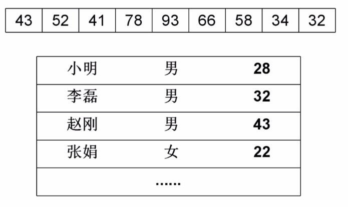
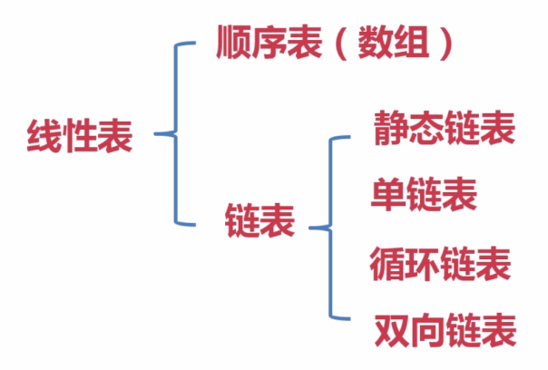
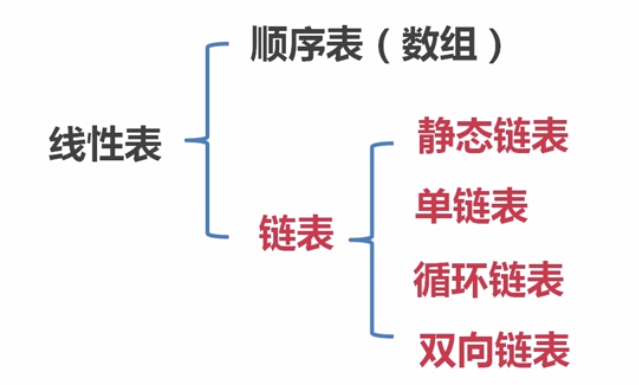
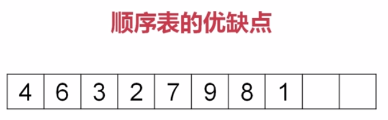
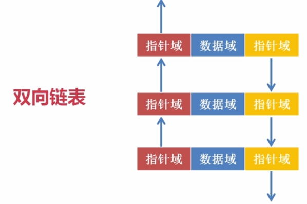
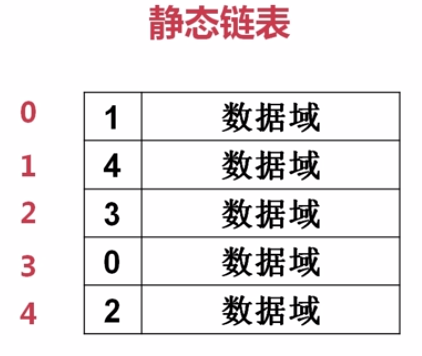
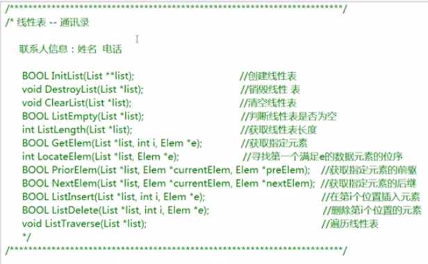

## 数据结构探险之线性表篇

将要学到得, 线性表（链表）


>整体的路线图如上图所示，线性表要比队列和栈编码上难一点，起到承前启后的作用。

什么是线性表？

>线性表是n个数据元素的有限序列，如下图所示,排列之后成线性展开:



>关键字: 有限 & 数据元素（简单 & 复杂都可以） & 序列

线性表的分类:



- 数组: 本身带下标，访问速度快，搜索能力强，与内存地址相关。
- 链表 & 线性链表 & 线性表的链式表达 都是一个意思。

**链**字是链表中的重要。

应用场景：通讯录（加，删，搜索）。

一元多项式：


只有x，一个变量x，称为一元。`p0~pn`为系数，称为多项。

动手实践，事倍功半

### 线性表编码

从顺序表开始讲起:

前驱后继, 某一个元素的 前一个元素 & 后一个元素;直接前驱，直接后继。

题目提示，顺序表该拥有的方法（c语言表示）：

```c
BOOL InitList(List **list);   //创建线性表 构造函数
void DestroyList(List *list); //销毁线性表 析构函数
void ClearList(List *list);   //清空线性表
BOOL ListEmpty(List *list);   //判断线性表是否为空
int ListLength(List *list);   //获取线性表长度
BOOL GetElem(List *list, int i, Elem *e);//获取指定元素，数组下标，把值放入e
int LocateElem(List *list, Elem *e);//寻找第一个满足e的数据元素的位序
BOOL PriorElem(List *list, Elem *currentElem, Elem *preElem); //获取指定元素的前驱
BOOL NextElem(List *list, Elem *currentElem, Elem *nextElem); //获取指定元素的后继

BOOL ListInsert(List *list, inti, Elem *e); //在第i个位置插入元素
BOOL ListDelete(List *list, int i, Elem *e);//在删除第i个位置的元素

void ListTraverse(List *list); //遍历线性表
```

- 在第i个位置插入元素，那么后面的所有都要后移。除非是在尾部输入。
- 在第i个位置删除元素，那么后面的所有都要前移. 除非是第一个元素。

有三个参数的就只剩两个参数了，隐藏的this指针。

2-1-SequenceList

List.h

```c
#ifndef LIST_H
#define LIST_H

class List
{
public:
	List(int size);   //InitList 传入线性表长度
	~List();          //DestroyList
	void ClearList();
	bool ListEmpty(); // 大写是c语言中没有bool类型使用宏定义
	int ListLength();
	bool GetElem(int i, int *e);
	int LocateElem(int *e);
	bool PriorElem( int *currentElem,int *preElem);
	bool NextElem(int *currentElem, int *nextElem);
	void ListTraverse();
	bool ListInsert(int i ,int *e);
	bool ListDelete(int i ,int *e);
private:
	int *m_pList; // 指向一段内存
	int m_iSize;  // 大小
	int m_iLength;// 线性表当前长度
};

#endif
```

List.cpp

```c
#include "List.h"
#include <iostream>
using namespace std;

List::List(int size)
{
	m_iSize = size; // 容量
	m_pList = new int[m_iSize];
	m_iLength = 0;
}

List::~List()
{
	delete []m_pList;
	m_pList = NULL;
}

void List::ClearList()
{
	m_iLength = 0;
}
bool List::ListEmpty()
{
// 	if (m_iLength == 0)
// 	{
// 		return true;
// 	} 
// 	else
// 	{
// 		return false;
// 	}
    return m_iLength == 0?true:false;
}

int List::ListLength()
{
	return m_iLength;
}

// 判断越界
bool List::GetElem(int i, int *e)
{
	if (i<0 || i >= m_iSize)
	{
		return false;
	}
	*e = m_pList[i];
	return true;
}

// 定位一个元素，找到返回下标值。
int List::LocateElem(int *e)
{
	for(int i=0;i<m_iLength;i++)
	{
		if (m_pList[i] == *e)
		{
			return i;
		}
	}
	// 找不到
	return -1;
}

// 获取指定元素前驱
bool List::PriorElem(int *currentElem, int *preElem)
{
	int temp = LocateElem(currentElem);
	// 情况1 无法定位到，也就是根本没有这个元素
	if (temp == -1 )
	{
		return false;
	}
	else
	{ // 情况2 定位到了，这是队首元素，没有前驱
		if (temp == 0)
		{
			return false;
		}
		else
		// 正常的一般情况
		{
		*preElem = m_pList[--temp];
		return true;
		}
	}

}

// 寻找指定元素后继
bool List::NextElem(int *currentElem, int *nextElem)
{
	int temp = LocateElem(currentElem);
	if (temp == -1)
	{
		return false;
	}
	else
	{
	  // 当前的位置索引是从0开始，length是从1开始，两者比较要统一起跑线。
		if (temp == --m_iLength)
		{
			return false;
		}
		else
		{
			*nextElem = m_pList[++temp];
			return true;
		}
	}
}

// 遍历整张线性表
void List::ListTraverse()
{
	for (int i=0;i<m_iLength;i++)
	{
		cout << m_pList[i] << endl;
	}
}

// 插入元素e作为数组的第i个元素，要记得后移其他元素。i从0开始。
bool List::ListInsert(int i, int *e)
{
  // 判断插入位置的合法性，因为i是索引所以不能等于
	if (i<0 || i >= m_iSize)
	{
		return false;
	}
	
	// 先把i及之后的先移动
	// for (int k = i;k<m_iLength;k++) //这样会导致覆盖掉,2移到3，3的值再移到4时，已经移动的是2的值了。
	// 这样写就得每次都备份原本位置数据，所以采用下面从后向前移动。
	
	// m_ilength-1是当前表中最后一个元素的下标。而k与i的比较加不加等于看下面的临界点验证。
	for(int k = m_iLength-1; k>i; k--)
	{
		m_pList[k + 1] = m_pList[k]; // 后一个位置等于前一个位置的值，即整体后移。
	}
	
	// 后移之后插入我们要插的元素
	m_pList[i] = *e;

  // 插入之后，长度变长
	m_iLength++;

	return true;
}

// 临界点验证: 假设 i = m_size-1 = 2 也就是在容量为3的表，插入到下标索引为2的位置(最后一个元素位置)插入。

// 极值此时队伍是满的0-1-2, k=3-1=2，此时i为2，要求k大于i是不可能的，一次都不会执行，直接i位置赋值成插入值e。

// i=0,假设此时满载，k=3-1=2,k>0,k--; k=2 第一次后移，k=1 第二次后移; k=0 不满足>0 停止了。正确的后移了两次。


//先备份第i个位置的元素，再移动相应的元素(从i+1个逐次往前移)就算是删除了。

bool List::ListDelete(int i, int *e)
{
  // i 位置的合法性判断 因为i下标，i的范围为0到m_size-1不能等于
	if (i <0 || i >m_iSize)
	{
		return false;
	}
	*e = m_pList[i]; // 备份要删除的值
	
	// i位置是要放i+1位置的元素的。 
	// 从i+1开始移动，不会导致被覆盖问题。
	for (int k =i+1;k<m_iLength;k++)
	{
		m_pList[k-1] = m_pList[k];
	}
	
	m_iLength--;
	return true;
}

// 临界点验证； 假设要删除一个容量为3，已经有三个值的表的第一个元素(也就是删除索引为0)。
// k=1,也就是从第二个元素开始，此时m_ilength是满的。k<3; 1,满足,移动;2，满足,移动;3,不满足大于了，移动两次正确。
// 删除最后一个元素的话，其他元素位置都不用变。所以等于m_size时: i=2,k=3,k<3不满足，一次循环体都不会执行，直接减长度就ok了。
```

main.cpp:

```c
#include "List.h"
#include <iostream>
using namespace std;
#include <stdlib.h>

int main()
{
	// 3 5 7 2 9 1 8
	int e1 = 3;
	int e2 = 5;
	int e3 = 7;
	int e4 = 2;
	int e5 = 9;
	int e6 = 1;
	int e7 = 8;
	int temp = 0;
	List *list1 = new List(7);
	cout <<"length:"<<list1->ListLength()<<endl;
	list1->ListInsert(0, &e1);
	cout << "after insert e1 length:" << list1->ListLength() << endl;
	list1->ListInsert(1, &e2);
	list1->ListInsert(2, &e3);
	list1->ListInsert(3, &e4);
	list1->ListInsert(4, &e5);
	list1->ListInsert(5, &e6);
	list1->ListInsert(6, &e7);
	
	list1->ListTraverse();
  
  cout << endl;
  // 获取0索引位置元素
	list1->GetElem(0, &temp);
	cout << "0号索引 的元素:" << temp << endl;
	
	temp = 5;
	cout << "5 的 index:"<<list1->LocateElem(&temp) << endl;;

	list1->PriorElem(&e4, &temp);
	cout << "2 的 前驱:" << temp << endl;
	list1->NextElem(&e4, &temp);
	cout << "2 的 后继" << temp << endl;

	delete list1;
	return 0;
}

```

运行结果：


#### 插入删除测试

测试用例:

- 插入: 满队插入0;满队插入size-1;满队插入中间;
- 删除: 满队删除0;满队删除size-1;满队删除中间;
- 两种一般情况: 队未满，删除或插入; 中间,第一个，最后一个。

```c
#include "List.h"
#include <iostream>
using namespace std;

List::List(int size)
{
    m_iSize = size; // 容量
    m_pList = new int[m_iSize];
    m_iLength = 0;
}

List::~List()
{
    delete []m_pList;
    m_pList = NULL;
}

void List::ClearList()
{
    m_iLength = 0;
}
bool List::ListEmpty()
{
    //     if (m_iLength == 0)
    //     {
    //         return true;
    //     }
    //     else
    //     {
    //         return false;
    //     }
    return m_iLength == 0?true:false;
}

int List::ListLength()
{
    return m_iLength;
}

// 判断越界
bool List::GetElem(int i, int *e)
{
    if (i<0 || i >= m_iSize)
    {
        return false;
    }
    *e = m_pList[i];
    return true;
}

// 定位一个元素，找到返回下标值。
int List::LocateElem(int *e)
{
    for(int i=0;i<m_iLength;i++)
    {
        if (m_pList[i] == *e)
        {
            return i;
        }
    }
    // 找不到
    return -1;
}

// 获取指定元素前驱
bool List::PriorElem(int *currentElem, int *preElem)
{
    int temp = LocateElem(currentElem);
    // 情况1 无法定位到，也就是根本没有这个元素
    if (temp == -1 )
    {
        return false;
    }
    else
    { // 情况2 定位到了，这是队首元素，没有前驱
        if (temp == 0)
        {
            return false;
        }
        else
            // 正常的一般情况
        {
            *preElem = m_pList[--temp];
            return true;
        }
    }
    
}

// 寻找指定元素后继
bool List::NextElem(int *currentElem, int *nextElem)
{
    int temp = LocateElem(currentElem);
    if (temp == -1)
    {
        return false;
    }
    else
    {
        // 当前的位置索引是从0开始，length是从1开始，两者比较要统一起跑线。
        if (temp == --m_iLength)
        {
            return false;
        }
        else
        {
            *nextElem = m_pList[++temp];
            return true;
        }
    }
}

// 遍历整张线性表
void List::ListTraverse()
{
    for (int i=0;i<m_iLength;i++)
    {
        cout << m_pList[i] << endl;
    }
}

// 插入元素e作为数组的第i个元素，要记得后移其他元素。i从0开始。
bool List::ListInsert(int i, int *e)
{
    // 判断插入位置的合法性，因为i是索引所以不能等于
    if (i<0 || i >= m_iSize)
    {
        cout << "Warning: 插入未完成，请输入合法的下标" << endl;
        return false;
    }
    // 先把i及之后的先移动
    // for (int k = i;k<m_iLength;k++) //这样会导致覆盖掉,2移到3，3的值再移到4时，已经移动的是2的值了。
    // 这样写就得每次都备份原本位置数据，所以采用下面从后向前移动。
    // m_ilength-1是当前表中最后一个元素的下标。而k与i的比较加不加等于看下面的临界点验证。
    // 插入之后，长度未满时变长，满长不变。
    for(int k = m_iLength-1; k>=i; k--)
    {
        m_pList[k + 1] = m_pList[k]; // 后一个位置等于前一个位置的值，即整体后移。三个数，插第一个要移动三次。
    }
    
    // 后移之后插入我们要插的元素
    m_pList[i] = *e;
    
    // 插入判满
    if (m_iLength >= m_iSize)
    {
        cout << "Warning:插入成功，容量有限，最后的元素被抛弃" << endl;
        
    }else{
        m_iLength++;
    }
    
    return true;
}

// 临界点验证: 假设 i = m_size-1 = 2 也就是在容量为3的表，插入到下标索引为2的位置(最后一个元素位置)插入。

// 极值此时队伍是满的0-1-2, k=3-1=2，此时i为2，要求k大于i是不可能的，一次都不会执行，直接i位置赋值成插入值e。

// i=0,假设此时满载，k=3-1=2,k>0,k--; k=2 第一次后移，k=1 第二次后移; k=0 不满足>0 停止了。正确的后移了两次。

//先备份第i个位置的元素，再移动相应的元素(从i+1个逐次往前移)就算是删除了。

bool List::ListDelete(int i, int *e)
{
    // i 位置的合法性判断 因为i下标，i的范围为0到m_size-1不能等于
    if (i <0 || i >=m_iSize)
    {
        cout<<"Warning: 删除的下标非法"<<endl;
        return false;
    }
    
    *e = m_pList[i]; // 备份要删除的值
    
    // i位置是要放i+1位置的元素的。
    // 从i+1开始移动，不会导致被覆盖问题。
    for (int k =i+1;k<m_iLength;k++)
    {
        m_pList[k-1] = m_pList[k];
    }
    // 删除判空
    if(m_iLength <=0)
    {
        cout << "Warning: List已空，删除失败" <<endl;
        
    }else{
        m_iLength--;
    }
    return true;
}
```

main.cpp

```c
#include "List.h"
#include <iostream>
using namespace std;
#include <stdlib.h>

int main()
{
    // 3 5 7 2 9 1 8
    int e1 = 3;
    int e2 = 5;
    int e3 = 7;
    int e4 = 2;
    int e5 = 9;
    int e6 = 1;
    int e7 = 8;
    List *list1 = new List(7);
    
    list1->ListInsert(0, &e1);
    list1->ListInsert(1, &e2);
    list1->ListInsert(2, &e3);
    list1->ListInsert(3, &e4);
    list1->ListInsert(4, &e5);
    list1->ListInsert(5, &e6);
    list1->ListInsert(6, &e7);

   
    // 打印长度
    cout << "length: "<<list1->ListLength()<< endl;
    int insertFirst= 11;
    list1->ListInsert(0,&insertFirst);
    int insertEnd = 99;
    list1->ListInsert(6,&insertEnd);
    int insertOutRange = 666;
    list1->ListInsert(7,&insertOutRange);
    
    list1->ListTraverse();
    cout << "*************" << endl;
    
    // 满list中间插入元素
    int insertMiddle = 55;
    list1->ListInsert(3,&insertMiddle);
    
 
    list1->ListTraverse();
    cout << ">>>>>>>>>>>>>" << endl;
    
    // 满List删除元素
    int delMidlle= 0;
    list1->ListDelete(3, &delMidlle);
    list1->ListInsert(3,&insertMiddle);
    int delFirst= 0;
    list1->ListDelete(0,&delFirst);
    int delEnd = 0;
    list1->ListDelete(6,&delEnd);
    int delOutRange = 0;
    list1->ListDelete(7,&delOutRange);
    list1->ListTraverse();
    cout << "<<<<<<<<<<<<<<" << endl;
    
    // 未满队删除
    list1->ListDelete(0,&delFirst);
    list1->ListDelete(2,&delMidlle);
    list1->ListDelete(2,&delEnd);
    
    list1->ListTraverse();
    cout << "ooooooooooooooo" << endl;
    
    // 未满队添加
    insertFirst = 21;
    insertMiddle = 22;
    insertEnd = 23;
    list1->ListInsert(0,&insertFirst);
    list1->ListInsert(2,&insertMiddle);
    list1->ListInsert(4,&insertEnd);
    list1->ListTraverse();
    cout << "ttttttttttttttt" << endl;
    
    list1->ClearList();
    list1->ListTraverse();
    cout << "nnnnnnnnnnnnnnn" << endl;
    
    delete list1;
    return 0;
}
```


>插入测试如上


>删除测试,清空表如上图所示

#### 升级版（int 升级对象成员）

2-9-CoordinateClassList

Coordinate.h

```c
#ifndef COORDINATE_H
#define COORDINATE_H

#include <ostream>
using namespace std;
class Coordinate
{
    friend ostream &operator<<(ostream &out, Coordinate &coor);
public:
    Coordinate(int x = 0, int y = 0);
    void printCoordinate();
    bool operator==(Coordinate &coor);
private:
    int m_iX;
    int m_iY;
};

#endif
```

Coordinate.cpp

```c
#include "Coordinate.h"
#include <iostream>
using namespace std;

Coordinate::Coordinate(int x, int y)
{
    m_iX = x;
    m_iY = y;
}
void Coordinate::printCoordinate()
{
    cout << "(" << m_iX << "," << m_iY << ")" << endl;
}

ostream &operator<<(ostream &out, Coordinate &coor)
{
    out << "(" << coor.m_iX << "," << coor.m_iY << ")" << endl;
    return out;
}
bool Coordinate::operator==(Coordinate &coor)
{
    if(this->m_iX == coor.m_iX && this->m_iY == coor.m_iY)
    {
        return true;
    }
    else
    {
        return false;
    }
}

```

List.h

```c

#ifndef LIST_H
#define LIST_H

#include "Coordinate.h"

class List
{
public:
    List(int size);
    ~List();
    void ClearList();
    bool ListEmpty();
    int ListLength();
    bool GetElem(int i, Coordinate *e);
    int LocateElem(Coordinate *e);
    bool PriorElem(Coordinate *currentElem, Coordinate *preElem);
    bool NextElem(Coordinate *currentElem, Coordinate *nextElem);
    void ListTraverse();
    bool ListInsert(int i , Coordinate *e);
    bool ListDelete(int i , Coordinate *e);
private:
    Coordinate *m_pList;
    int m_iSize;
    int m_iLength;
};

#endif
```

List.cpp:

```c
#include "List.h"
#include <iostream>
using namespace std;
#include "Coordinate.h"

List::List(int size)
{
    m_iSize = size; // 容量
    m_pList = new Coordinate[m_iSize];
    m_iLength = 0;
}

List::~List()
{
    delete []m_pList;
    m_pList = NULL;
}

void List::ClearList()
{
    m_iLength = 0;
}
bool List::ListEmpty()
{
    return m_iLength == 0?true:false;
}

int List::ListLength()
{
    return m_iLength;
}

// 判断越界
bool List::GetElem(int i, Coordinate *e)
{
    if (i<0 || i >= m_iSize)
    {
        return false;
    }
    *e = m_pList[i];
    return true;
}

// 定位一个元素，找到返回下标值。
int List::LocateElem(Coordinate *e)
{
    for(int i=0;i<m_iLength;i++)
    {
        // 对于对象成员，比较运算符并不认识
        if (m_pList[i] == *e)
        {
            return i;
        }
    }
    // 找不到
    return -1;
}

// 获取指定元素前驱
bool List::PriorElem(Coordinate *currentElem, Coordinate *preElem)
{
    int temp = LocateElem(currentElem);
    // 情况1 无法定位到，也就是根本没有这个元素
    if (temp == -1 )
    {
        return false;
    }
    else
    { // 情况2 定位到了，这是队首元素，没有前驱
        if (temp == 0)
        {
            return false;
        }
        else
            // 正常的一般情况
        {
            *preElem = m_pList[--temp];
            return true;
        }
    }
    
}

// 寻找指定元素后继
bool List::NextElem(Coordinate *currentElem, Coordinate *nextElem)
{
    int temp = LocateElem(currentElem);
    if (temp == -1)
    {
        return false;
    }
    else
    {
        // 当前的位置索引是从0开始，length是从1开始，两者比较要统一起跑线。
        if (temp == --m_iLength)
        {
            return false;
        }
        else
        {
            *nextElem = m_pList[++temp];
            return true;
        }
    }
}

// 遍历整张线性表
void List::ListTraverse()
{
    for (int i=0;i<m_iLength;i++)
    {
        cout << m_pList[i] << endl;
        // m_plist.printCoord
    }
}

// 插入元素e作为数组的第i个元素，要记得后移其他元素。i从0开始。
bool List::ListInsert(int i, Coordinate *e)
{
    // 判断插入位置的合法性，因为i是索引所以不能等于
    if (i<0 || i >= m_iSize)
    {
        cout << "Warning: 插入未完成，请输入合法的下标" << endl;
        return false;
    }
    // 先把i及之后的先移动
    // for (int k = i;k<m_iLength;k++) //这样会导致覆盖掉,2移到3，3的值再移到4时，已经移动的是2的值了。
    // 这样写就得每次都备份原本位置数据，所以采用下面从后向前移动。
    // m_ilength-1是当前表中最后一个元素的下标。而k与i的比较加不加等于看下面的临界点验证。
    // 插入之后，长度未满时变长，满长不变。
    for(int k = m_iLength-1; k>=i; k--)
    {
        m_pList[k + 1] = m_pList[k]; // 后一个位置等于前一个位置的值，即整体后移。三个数，插第一个要移动三次。
    }
    
    // 后移之后插入我们要插的元素
    m_pList[i] = *e;
    
    // 插入判满
    if (m_iLength >= m_iSize)
    {
        cout << "Warning:插入成功，容量有限，最后的元素被抛弃" << endl;
        
    }else{
        m_iLength++;
    }
    
    return true;
}


bool List::ListDelete(int i, Coordinate *e)
{
    // i 位置的合法性判断 因为i下标，i的范围为0到m_size-1不能等于
    if (i <0 || i >=m_iSize)
    {
        cout<<"Warning: 删除的下标非法"<<endl;
        return false;
    }
    
    *e = m_pList[i]; // 备份要删除的值
    
    // i位置是要放i+1位置的元素的。
    // 从i+1开始移动，不会导致被覆盖问题。
    for (int k =i+1;k<m_iLength;k++)
    {
        m_pList[k-1] = m_pList[k];
    }
    // 删除判空
    if(m_iLength <=0)
    {
        cout << "Warning: List已空，删除失败" <<endl;
        
    }else{
        m_iLength--;
    }
    return true;
}
```

main.cpp:

```c
#include "List.h"
#include <iostream>
using namespace std;

int main()
{
    //3 5 7 2 9 1 8
    Coordinate e1(3,5);
    Coordinate e2(5,7);
    Coordinate e3(6,8);
    Coordinate temp(0,0);
    List *list1 = new List(10);
    cout <<"length:"<<list1->ListLength()<<endl;
    list1->ListInsert(0, &e1);
    cout << "length:" << list1->ListLength() << endl;
    list1->ListInsert(1, &e2);
    list1->ListInsert(2, &e3);
    list1->ListTraverse();
    
    delete list1;
    return 0;
}
```

运行结果：


## 数据结构探险之线性表: 链表

### 链表算法说明



顺序表的优缺点：



优点：遍历寻址很方便，基于数组效率高; 缺点：插入时元素挪位，删除时元素挪位。

什么是链表？

链表包括: 静态链表,单链表,循环链表,双向链表;

- 单链表(特点): 单向性，节点（数据域|指针域）指针域指向下一个节点。直到最后一个指针域指向NULL；


- 循环链表(特点)：最后一个节点的指针域又指向头结点。


- 双向链表（特点）：每个节点由三部分组成。指针域与指针域之间还有数据域。一个正向指针域，一个反向指针域, 既能从头找到尾，又能从尾找到头。



- 静态链表(没有指针的链表实现)：数组的天然编号，加自定义的节点指向指针域。



### 链表编码说明

单链表

3-2-SingleList

ListInsertHead是在链表的前边插入一个节点, 紧跟在头节点后面, 而不是在头节点的前面插入一个节点来替换掉原本的头节点！！！

Node.h

```c
#ifndef NODE_H
#define NODE_H

class Node
{
public:
	int data;//数据域
	Node *next;//指针域指向下一个节点
	void printNode(); //节点的打印函数

};

#endif
```

Node.cpp

```c
#include "Node.h"
#include <iostream>
using namespace std;

void Node::printNode()
{
	cout << data << endl;
}
```

List.h

```c
#ifndef LIST_H
#define LIST_H
#include "Node.h"
class List
{
public:
	List();  //相对于线性表，先放头结点，不需要size，增加节点新申请内存。
	~List();
	void ClearList();//得一个一个节点清空
	bool ListEmpty();
	int ListLength();
	bool GetElem(int i, Node *pNode);//头结点顺藤摸瓜
	int LocateElem(Node *pNode);//给定节点的坐标
	bool PriorElem(Node *pCurrentElem, Node *pPreElem);//由头结点开始，根据currentnode找到相应节点。将前驱或后继赋值给其他变量
	bool NextElem(Node *pCurrentElem, Node *pNextElem);
	void ListTraverse();//拿着头结点。
	bool ListInsert(int i, Node *pNode);//找到i-1个节点，指向该节点。该节点指向原来第i个。
	bool ListDelete(int i, Node *pNode);//找到第i个节点，上一个节点指向下一个节点
	bool ListInsertHead(Node *pNode);//从头开始插入，头结点指针域指向该节点，该节点指针域指向原来头结点指向的结点。
	bool ListInsertTail(Node *pNode);//从尾开始插入，只需要找到最后一个节点，该节点指针域为NulL，让插入节点指向null。
private:
	Node *m_pList;
	int m_iLength;
};

#endif
```

- 链表相对于顺序表没有size，增加新节点时申请内存空间。
- 析构与清空的区别：析构会连第一个构造函数创建的头结点也删除，而清空会保留这个申请的头结点内存。

List.cpp:

```c
#include "List.h"
#include <iostream>
using namespace std;

List::List()
{
	m_pList = new Node; //堆中申请内存
	m_pList->data = 0; 
	m_pList->next = NULL; //初始化时头结点指向NULL
	m_iLength = 0; // 头结点不算在链表的长度中
}

List::~List()
{
	ClearList();
	delete m_pList;
	m_pList = NULL;
}
void List::ClearList()
//顺藤摸瓜，敌人之间单线联系。
{
	Node *currentNode = m_pList->next;
	while(currentNode != NULL) //审讯犯人
	{
		Node * temp = currentNode->next; // 将他下线地址保存
		delete currentNode; // 他已经没有利用价值了，删除
		currentNode = temp;
	}
	m_pList->next = NULL;
	m_iLength = 0;
}
bool List::ListEmpty()
{
  return m_iLength==0?true:false;
}

int List::ListLength()
{
	return m_iLength;
}

bool List::ListInsertHead(Node *pNode)
{
	Node *temp = m_pList->next;
	Node *newNode = new Node;
	// 判断申请内存是否成功
	if(newNode == NULL)
	{
		return false;
	}
	newNode->data = pNode->data;
	m_pList->next = newNode;
	newNode->next = temp; //指向头结点原本指向的。
	m_iLength++;
	return true;
}

bool List::ListInsertTail(Node *pNode)
{
	Node *currentNode = m_pList;
	while(currentNode->next != NULL)
	{
		currentNode = currentNode->next;
	}
	Node *newNode = new Node;
	if (newNode == NULL)
	{
		return false;
	}
	newNode->data = pNode->data;
	newNode->next = NULL;
	currentNode->next = newNode; //老的尾节点指向新插入节点。
	m_iLength++;
	return true;
}
bool List::ListInsert(int i, Node *pNode)
{
	if (i<0 || i>m_iLength)
	{
		return false;
	}
	Node *currentNode = m_pList;
	for (int k=0;k<i;k++)//找到的是i位置前一个
	{
		currentNode = currentNode->next; 
	}
	Node *newNode = new Node;
	if (newNode == NULL)
	{
		return false;
	}
	newNode->data = pNode->data;
	newNode->next = currentNode->next;
	// 原来currentnode的下一个节点变成了newnode的下一个节点

	currentNode->next = newNode;
	// newnode变成了currentnode的下一个节点
	// 带入两个极端情况来验证，0位置插入，for循环一次都不执行。currentNode就是头结点。然后新Node的next指向头结点原本指向的节点。
	// 如果我们最后一个节点位置插入，原本最后一个节点指向NUll，赋值给新节点的Next
	return true;
}

bool List::ListDelete(int i, Node *pNode)
{
	if (i<0 || i>= m_iLength) //删除不能=
	{
		return false;
	}
	Node *currentNode = m_pList;
	// 找到当前节点的上一个节点
	Node *currentNodeBefore = NULL;
	for (int k = 0; k <= i; k++)//删除就要i位置的
	{
		currentNodeBefore = currentNode;
		currentNode = currentNode->next;
	}

	currentNodeBefore->next = currentNode->next;
	pNode->data = currentNode->data;
	delete currentNode;
	currentNode = NULL;
	m_iLength--;
	return true;
}

bool List::GetElem(int i, Node *pNode)
{
	if (i < 0 || i >= m_iLength)
	{
		return false;
	}
	// 找第i个节点
	Node *currentNode = m_pList;
	// 找到当前节点的上一个节点
	Node *currentNodeBefore = NULL;
	for (int k = 0; k <= i; k++)
	{
		currentNodeBefore = currentNode;
		currentNode = currentNode->next;
	}
	pNode->data = currentNode->data;
	return true;
}

int List::LocateElem(Node *pNode)
{
	Node *currentNode = m_pList;
	int count = 0;
	while (currentNode->next != NULL)
	{
		currentNode = currentNode->next;
		if (currentNode->data == pNode->data)
		{
			return count;// 第一个节点，返回的是第一个节点，因此后面有相同会被忽略
		}
		count++;
		// 第一次拿到的head是头结点并不算第0号元素。
	}

	return -1;
}

bool List::PriorElem(Node *pCurrentElem, Node *pPreElem)
{
	Node *currentNode = m_pList;
	Node *tempNode = NULL; // 定义当前节点的上一个节点
	while (currentNode->next != NULL)
	{
		tempNode = currentNode;
		currentNode = currentNode->next;
		
		if (currentNode->data == pCurrentElem->data)
		{
			if (tempNode == m_pList)// 如果是头结点
			{
				return false;
			}
			pPreElem->data = tempNode->data;
			return true;
		}
	}
	return false;

}

bool List::NextElem(Node *pCurrentElem, Node *pNextElem)
{
	Node *currentNode = m_pList;
	while (currentNode->next != NULL)
	{
		currentNode = currentNode->next;
		if (currentNode->data == pCurrentElem->data)
		{
			if (currentNode->next == NULL)//如果是尾节点
			{
				return false;
			}
			pNextElem->data = currentNode->next->data;
			return true;
		}
	}
	return false;

}

void List::ListTraverse()
{
	Node *currentNode = m_pList;
	while (currentNode->next != NULL)
	{
		currentNode = currentNode->next;
		currentNode->printNode();
	}
}

```

main.cpp:

```c
#include <stdlib.h>
#include "List.h"
#include <iostream>

using namespace std;

int main()
{
	Node node1;
	node1.data = 3;
	Node node2;
	node2.data = 4;
	Node node3;
	node3.data = 5;
	Node node4;
	node4.data = 6;
	Node node5;
	node5.data = 7;
	Node temp;
	List *pList = new List();

	pList->ListInsertHead(&node1);
	pList->ListInsertHead(&node2);
	pList->ListInsertHead(&node3);
	pList->ListInsertHead(&node4);// 不断插入头结点后面，后来的更靠前
	pList->ListTraverse();
	cout<<"head insert **********"<<endl;
	pList->ListInsertTail(&node1);
	pList->ListInsertTail(&node2);
	pList->ListInsertTail(&node3);
	pList->ListInsertTail(&node4);
	pList->ListTraverse();
  cout<<"tail insert **********"<<endl;
	pList->ListInsert(0,&node5);
	pList->ListInsert(8,&node5);
	pList->ListDelete(0,&temp);
	
	pList->GetElem(0, &temp);
	
	pList->PriorElem(&node5, &temp);
	pList->NextElem(&node5, &temp);
	
	pList->ListTraverse();
	cout <<"temp:" <<temp.data << endl;

	delete pList;
	pList = NULL;
	return 0;
}
```

从头部尾部插入删除测试:


任意位置插入删除测试:


前驱后继测试:


#### 链表应用之通讯录

要求：



对象的赋值，比较操作都得重载运算符，打印也得重载。

4-1-ListAddressBook

Person.h

```c
#ifndef PERSON_H
#define PERSON_H
#include <string>
#include <ostream>
using namespace std;

class Person
{
	friend ostream &operator<<(ostream &out, Person &person);
public:
	string name;
	string phone;
	// 重载赋值运算符
	Person &operator=(Person &person);
	bool operator==(Person &person);
};


#endif
```

Person.cpp

```c
#include "Person.h"

Person &Person::operator=(Person &person)
{
	this->name = person.name;
	this->phone = person.phone;

	return *this;
}
bool Person::operator==(Person &person)
{
	if (this->name == person.name && this->phone == person.phone)
	{
		return true;
	}
	return false;
}

ostream &operator<<(ostream &out, Person &person)
{
	out << person.name <<"---------"<< person.phone << endl;
	return out;
}
```

Node.h

```c
#ifndef NODE_H
#define NODE_H
#include "Person.h"

class Node
{
public:
	Person data;//数据域
	Node *next;//指针域指向下一个地点
	void printNode();
};

#endif
```

Node.cpp

```c
#include "Node.h"
#include <iostream>
using namespace std;

void Node::printNode()
{
	cout << data << endl;
}
```

List.h

```c
#ifndef LIST_H
#define LIST_H
#include "Node.h"
class List
{
public:
	List();//相对于线性表，先放了头结点
	~List();
	void ClearList();//得一个一个清空
	bool ListEmpty();
	int ListLength();
	bool GetElem(int i, Node *pNode);
	int LocateElem(Node *pNode);//给定节点的坐标
	bool PriorElem(Node *pCurrentElem, Node *pPreElem);//根据currentnode找到相应节点。将前驱或后继赋值给其他变量
	bool NextElem(Node *pCurrentElem, Node *pNextElem);
	void ListTraverse();//拿着头结点。
	bool ListInsert(int i, Node *pNode);//找到i-1个节点。指向该节点。该节点指向原来第i个。
	bool ListDelete(int i, Node *pNode);//找到第i个节点。上一个节点指向下一个节点
	bool ListInsertHead(Node *pNode);//从头开始插入。头结点指针域指向该节点。该节点指针域指向原来头结点指向的结点。
	bool ListInsertTail(Node *pNode);//从尾开始插入。只需要找到最后一个节点。该节点指针域为NulL。让插入节点指向null。
private:
	Node *m_pList;
	int m_iLength;
};

#endif
```

List.cpp

```c
#include "List.h"
#include <iostream>
using namespace std;

List::List()
{
	m_pList = new Node;
	//m_pList->data = 0;
	
	m_pList->next = NULL;
	m_iLength = 0;
}

List::~List()
{
	ClearList();
	delete m_pList;
	m_pList = NULL;
}
void List::ClearList()
//顺藤摸瓜。
{
	Node *currentNode = m_pList->next;
	while (currentNode != NULL)
	{
		Node * temp = currentNode->next;
		delete currentNode;
		currentNode = temp;
	}
	m_pList->next = NULL;
	m_iLength = 0;
}
bool List::ListEmpty()
{
	if (m_iLength == 0)
	{
		return true;
	}
	else
	{
		return false;
	}
}

int List::ListLength()
{
	return m_iLength;
}

bool List::ListInsertHead(Node *pNode)
{
	Node *temp = m_pList->next;
	Node *newNode = new Node;
	if (newNode == NULL)
	{
		return false;
	}
	newNode->data = pNode->data;
	m_pList->next = newNode;
	newNode->next = temp;
	m_iLength++;
	return true;
}

bool List::ListInsertTail(Node *pNode)
{
	Node *currentNode = m_pList;
	while (currentNode->next != NULL)
	{
		currentNode = currentNode->next;
	}
	Node *newNode = new Node;
	if (newNode == NULL)
	{
		return false;
	}
	currentNode->next = newNode;
	newNode->data = pNode->data;
	newNode->next = NULL;
	m_iLength++;
	return true;
}
bool List::ListInsert(int i, Node *pNode)
{
	if (i<0 || i>m_iLength)
	{
		return false;
	}
	Node *currentNode = m_pList;
	for (int k=0;k<i;k++)
	{
		currentNode = currentNode->next;

	}
	Node *newNode = new Node;
	if (newNode == NULL)
	{
		return false;
	}
	newNode->data = pNode->data;
	newNode->next = currentNode->next;
	//原来currentnode的下一个节点变成了newnode的下一个节点

	currentNode->next = newNode;
	//newnode变成了currentnode的下一个节点
	//带入两个极端情况来验证
	return true;
}

bool List::ListDelete(int i, Node *pNode)
{
	if (i<0 || i>= m_iLength)
	{
		return false;
	}
	Node *currentNode = m_pList;
	//找到当前节点的上一个节点
	Node *currentNodeBefore = NULL;
	for (int k = 0; k <= i; k++)
	{
		currentNodeBefore = currentNode;
		currentNode = currentNode->next;
	}

	currentNodeBefore->next = currentNode->next;
	pNode->data = currentNode->data;
	delete currentNode;
	currentNode = NULL;
	m_iLength--;
	return true;
}

bool List::GetElem(int i, Node *pNode)
{
	if (i < 0 || i >= m_iLength)
	{
		return false;
	}
	//找第i个节点
	Node *currentNode = m_pList;
	//找到当前节点的上一个节点
	Node *currentNodeBefore = NULL;
	for (int k = 0; k <= i; k++)
	{
		currentNodeBefore = currentNode;
		currentNode = currentNode->next;
	}
	pNode->data = currentNode->data;
	return true;
}

int List::LocateElem(Node *pNode)
{
	Node *currentNode = m_pList;
	int count = 0;
	while (currentNode->next != NULL)
	{
		currentNode = currentNode->next;
		if (currentNode->data == pNode->data)
		{
			return count;//第一个节点
		}
		count++;
		//第一次拿到的head是头结点并不算第0号元素。
	}

	return -1;
}

bool List::PriorElem(Node *pCurrentElem, Node *pPreElem)
{
	Node *currentNode = m_pList;
	Node *tempNode = NULL;
	while (currentNode->next != NULL)
	{
		tempNode = currentNode;
		currentNode = currentNode->next;
		if (currentNode->data == pCurrentElem->data)
		{
			if (tempNode == m_pList)//如果是头结点
			{
				return false;
			}
			pPreElem->data = tempNode->data;
			return true;
		}
	}
	return false;

}

bool List::NextElem(Node *pCurrentElem, Node *pNextElem)
{
	Node *currentNode = m_pList;
	while (currentNode->next != NULL)
	{
		currentNode = currentNode->next;
		if (currentNode->data == pCurrentElem->data)
		{
			if (currentNode->next == NULL)//如果是尾节点
			{
				return false;
			}
			pNextElem->data = currentNode->next->data;
			return true;
		}
	}
	return false;

}

void List::ListTraverse()
{
	Node *currentNode = m_pList;
	while (currentNode->next != NULL)
	{
		currentNode = currentNode->next;
		currentNode->printNode();
	}
}
```

main.cpp:

```c
#include <stdlib.h>
#include "Link.h"
#include <iostream>

using namespace std;

int main()
{
	Node node1;
	node1.data.name = "mtianyan1";
	node1.data.phone = "18092671234";
	Node node2;
	node2.data.name = "mtianyan2";
	node2.data.phone = "18487251234";
	
	List *pList = new List();

	pList->ListInsertHead(&node1);
	pList->ListInsertHead(&node2);
	
  pList->ListInsertTail(&node1);
	pList->ListInsertTail(&node2);

	pList->ListTraverse();

	delete pList;
	pList = NULL;
	return 0;
}
```

运行结果:


### 通讯录加壳版

为通讯录加上一个壳子，让它可以选择新建联系人，删除联系人，浏览通讯录，退出通讯录。

main.cpp:

```c
#include <iostream>
#include <stdlib.h>
#include "Link.h"
using namespace std;
/*线性表*/
int menu()
{
	cout << "功能菜单" << endl;
	cout << "1 新建联系人" << endl;
	cout << "2 删除联系人" << endl;
	cout << "3 浏览通讯录" << endl;
	cout << "4 退出通讯录" << endl;
	cout << "请输入：";
	int order = 0;
	cin >> order;
	return order;
}
//创建联系人方法
void creatperson(List *pList)
{
	Node node;
	Person person;
	cout << "输入用户姓名：";
	cin >> person.name;
	cout << "输入电话号码：";
	cin >> person.phone;
	node.data = person;
	pList->ListInsertTail(&node);


}
int main()
{
	int userorder = 0;
	List *pList = new List();
	while (userorder != 4)
	{
		userorder = menu();
		switch (userorder)
		{
		case 1:
			cout << "用户指令-------》新建联系人" << endl;
			creatperson(pList);
			break;
		case 2:
			cout << "用户指令-------》删除联系人" << endl;
			break;
		case 3:
			cout << "用户指令-------》浏览通讯录" << endl;
			pList->ListTraverse();
			break;
		case 4:
			cout << "用户指令-------》退出通讯录" << endl;
			break;
		}
	}

	delete pList;
	pList = NULL;
	return 0;
}
```

新建联系人测试


浏览通讯录&退出通讯录测试


删除联系人懒得写了。个人推崇思路: 添加id(通过类静态成员实现自增），然后通过id定位删除操作。

推荐阅读: https://www.imooc.com/qadetail/163402