# 数据结构探险之图篇

### 图的简介

什么是图？

>如下图：无向图 & 有向图(箭头分方向)。图可以看做节点和连线的集合，无向图中可以被认为是有来有回的两条线

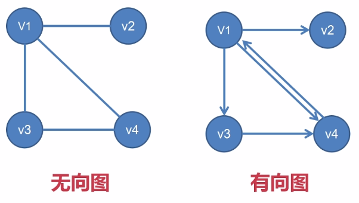

图中的概念：

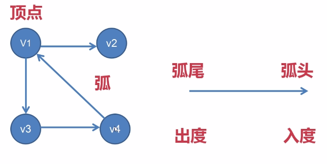

- 结点称为顶点,之间的线称为弧。弧尾和弧头（箭头）。从顶点发出去和射入的。
- 出度：一个顶点发射出去的线数 & 入度：一个顶点射入的线数。

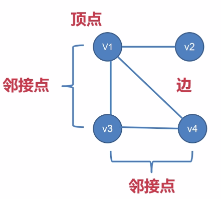

- 顶点 & 边(一般指无向图中的连线)，连线连起来的两个结点称为邻接点。

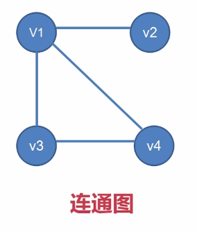

- 连通图: 对于无向图中的每一个顶点，都有通往其他顶点的连线，间接，直接的都可以。


- 任意两个结点之间都有路径相互连接，就是完全图。完全图的边数计算边数=n(n-1)/2

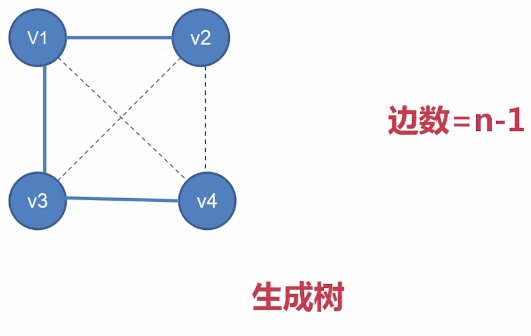

- 生成树，完全图简化到只有最小数量的边连接每一个顶点，边数为n-1

图的表示法 & 图的遍历 & 最小生成树(高速公路最小)。

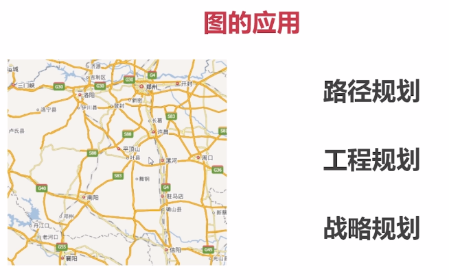

>规划公路，光纤，找最近的路。

### 图的基本概念及存储方式

图的存储结构也就是把图变成数据存起来供我们使用：

>无向图是由边 & 顶点组成的； 有向图是由弧 & 顶点组成

图的存储结构：邻接矩阵（数组）；邻接表（链表）有向； 十字链表（链表）有向；邻接多重表（链表）无向

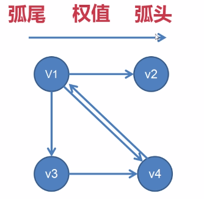

>箭头的起端是弧尾，终端是弧头，箭头上面会有一个权值。道路，300公里，5天路程之类。

#### 邻接矩阵(数组)

无论哪种方法都是要存储顶点的，顶点包括顶点的索引和顶点数据两部分。 

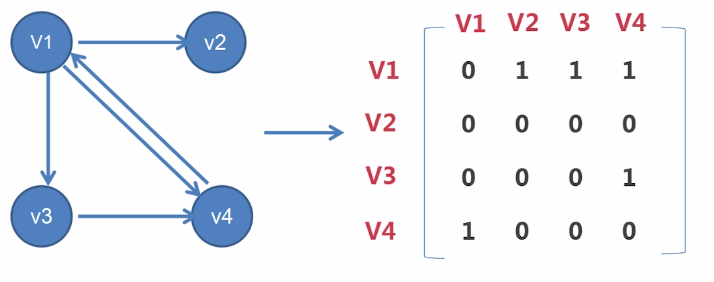

>邻接矩阵只需要存储顶点的索引和顶点数据；顶点的索引不可重复；有弧用1，没弧用0，自身不能到自身。

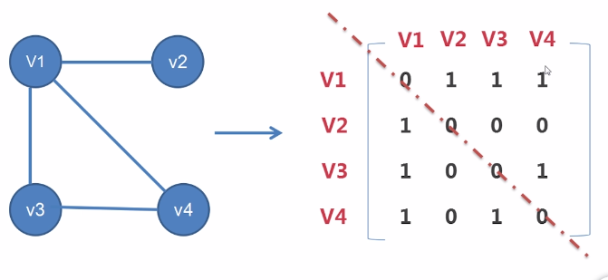

主对角线对称，只记录一半即可节省存储空间。

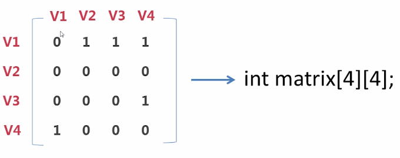

>变成一个`int matrix[4][4]` 的二维数组

顶点与图的结构体表示:

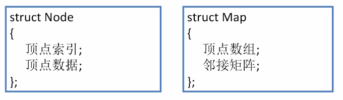

#### 邻接表-链式存储

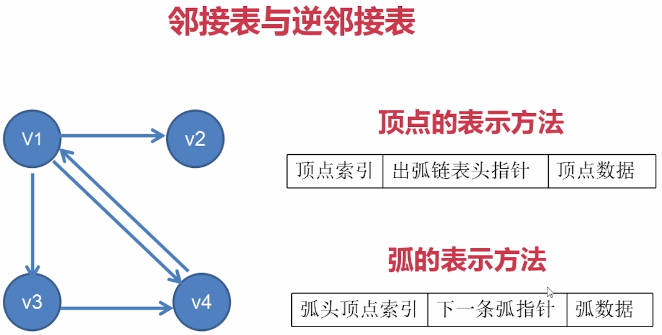

>通过一个顶点索引，找到出弧链表头指针。然后找到下一个节点。下一个节点又可以找到出弧。


弧指针，0，1，2，3代表索引。四个顶点都有弧指针，说明v1既有弧指向v2，又有指向v3,又有指向v4。v2 没有出度直接指向NULL;v3 有一条指向v4的弧。
v4 有指向v1的弧。

**邻接表记录出弧，逆邻接表记录入弧的**；弧头改为弧尾。

数据结构代码体现：

```c
struct Node
{
  顶点索引;
  该顶点弧链表的头结点; //重要信息
  顶点数据;
};
struct Map
{
  顶点数组;
};
struct Arc
{
  指向的顶点索引;
  指向下一条弧的指针;
  弧信息;
};
```

#### 十字链表-链式存储

十字链表的顶点表示要存储: 顶点索引 顶点数据 以该顶点为弧尾的弧结点指针 以该顶点为弧头的弧结点指针

十字链表的弧表示要存储: 弧尾顶点索引 弧头顶点索引 弧尾相同的下一条弧的指针 弧头相同的下一条弧的指针 弧的数据

```c
struct Arc
{
  弧尾顶点索引; 
  弧头顶点索引;
  指向下一条弧头相同的弧的指针;
  指向下一条弧尾相同的弧的指针;
  弧信息;
};
struct Node
{
  顶点索引;
  顶点数据;
  第一条入弧结点指针;
  第一条出弧结点指针;
};
struct Map
{
顶点数组;
};

```

#### 邻接多重表-链式存储(无向图)

顶点的表示方法: 顶点索引;连接该顶点的边;顶点数据

边的表示方法: A顶点索引;B顶点索引;与A顶点相连接的下一条边的指针;与B顶点相连接的下一条边的指针;边数据

```c
struct Egde
{
顶点A索引;
顶点B索引;
连接A的下一条边的指针;
连接B的下一条边的指针;;
边信息;
};

struct Node
{
顶点索引;
顶点数据;
第一条边结点指针;
};

struct Map
{
顶点数组;
};
```

### 图的遍历

-   图的遍历分为两种:深度优先搜索 & 广度优先搜索


深度：a-b-c-e-f-d-g-h(也就是前序遍历：根左右)


广度优先搜索：按着一层一层搜索


不同的遍历方式形成不同的生成树。

#### 最小生成树


>有a.b.c.e.f六个城市修路，线上的权值为成本。a修到b，不如a-f-b。希望得到的结果是如右图。

最小生成树算法我们这里介绍两种: 普里姆（Prim）算法; 克鲁斯卡尔（Kruskal）算法

- **普里姆（Prim）算法介绍**


先有一个点的集合。这个点的集合是纳入最小生成树的点的集合，还要有一个边的集合,这个边的集合也是纳入最小生成树的边的集合;待选边集合：当我们选定一个顶点，该顶点可以走的边的集合。

假设从A开始做最小生成树。从A出去有三条待选边: A-B(6) A-F(1) A-E(5)。在待选边集合中找到权值最小的边,如A-F(1),将其放入边集合。这样我们就确定了第一条边和第一个点。

我们的第一条边连接了F，从A和F伸出的所有的边都会被纳入待选边的集合中。


可以看到如上图所示，我们的待选边集合一下子就变大了。此时的待选边集合中F-B(2)权值最小，因此F-B(2)加入边集合，B加入点集合。


此时我们的待选边集合又会因为B的加入而变大，找到B-C(3)权值最小，因此B-C(3)加入边集合，C加入点集合。


此时因为C的加入，我们的待选边集合又会进一步扩大，这其中F-D(4)是最小权值的一条，D加入点集合。


加入D之后又形成了更新的待选边集合，此时D-E(2)权值最小，加入边集合，E加入点集合。

当点集合已经包含所有顶点树，该最小生成树生成完毕。

- **克鲁斯卡尔（Kruskal）算法介绍**


把所有边放入待选边集合中，在所有边中选取一条权值最小的边放入已选边集合，把该边放入已选边集合中，选定了边就是选定了涉及的点，将该边的两个点放入已涉及点集合中。


然后再次寻找待选边集合中权值次小的边:F-B(2) / D-E(2)权值为2都可以选。此时要判断有没有和原来的边形成闭环，形成闭环就抛弃掉该边。


选择D-E(2)边之后，因为DE和原来的AFB没有关联关系，所以涉及点集合被分为两个。


此时再选就是选择B-C(3), 将BC放入集合中。


选出边F-D(4)之后，两个集合合二为一。

此时最小生成树生成，生成条件: 所有的点被涉及，并且已经纳入同一个集合。

### 图的编码实战-图的编码说明与展示

#### 图的存储(邻接矩阵) & 图的深度优先 & 广度优先


>如上图所示的一个无向图，可以被映射为如下面这样一个邻接矩阵。


3-1-MapDepthBreadth

Node.h

```c
#ifndef NODE_H
#define NODE_H

class Tree
{
public:
	Node(char data = 0);
	char m_cData;//数据值
	bool m_bIsVisited;//有没有被访问
};
#endif
```

Node.cpp

```c
#include "Node.h"

Node::Node(char data)
{
	m_cData = data;
	m_bIsVisited = false;
}
```

CMap.h

```c
#ifndef CMAP_H
#define CMAP_H

#include "Node.h"
#include <vector>
using namespace std;

class CMap
{
public:
	CMap(int capacity);
	~CMap();
	bool addNode(Node *pNode);
	//向图中加入顶点
	void resetNode();
	//重置顶点都没访问过
	bool setValueToMatrixForDirectedGraph(int row,int col,int val =1);
	bool setValueToMatrixForUndirectedGraph(int row, int col, int val = 1);

	void printMatrix();
	//打印邻接矩阵

	void depthFirstTraverse(int nodeIndex);//深度优先遍历
	void breadthFirstTraverse(int nodeIndex);//广度优先遍历

private:
	bool getValueFromMatrix(int row, int col, int &val);//从矩阵中获取权值
	void breadthFirstTraverseImpl(vector<int> preVec);//广度优先遍历实现函数

private:
	int m_iCapacity;
	//图中最多可以容纳的顶点数
	int m_iNodeCount;
	//已经添加的顶点（结点）个数
	Node *m_pNodeArray;
	//用来存放顶点数组
	int *m_pMatrix;
	//用来存放邻接矩阵
};

#endif
```

Cmap.cpp:

```c
#include "CMap.h"
#include <iostream>
#include <vector>
#include "Node.h"
using namespace std;

CMap::CMap(int capacity)
{
	m_iCapacity = capacity;
	m_iNodeCount = 0;
	m_pNodeArray = new Node[m_iCapacity];
	m_pMatrix = new int[m_iCapacity * m_iCapacity]; // 邻接矩阵大小size乘size
	// 邻接矩阵初始化为全0
	// 设定内存大小: memset(m_pMatrix, 0, m_iCapacity * m_iCapacity * sizeof(int)); 与下面for循环初始化二选一即可。
	// 将s所指向的某一块内存中的前n个 字节的内容全部设置为ch指定的ASCII值，第一个值为指定的内存地址，块的大小由第三个参数指定
	for (int i=0;i<m_iCapacity*m_iCapacity;i++)
	{
		m_pMatrix[i] = 0;
	}
}

CMap::~CMap()
{
	delete []m_pNodeArray;
	delete []m_pMatrix;
}

bool CMap::addNode(Node *pNode)
{
	if (pNode == NULL)
	{
		return false;
	}
	// 保存节点数据 数组；new后保存数据，而不是把外部的挂载上去
	m_pNodeArray[m_iNodeCount].m_cData = pNode->m_cData;
	m_iNodeCount++;
	return true;
}

void CMap::resetNode()
{
  // 
	for (int i = 0; i < m_iNodeCount; i++)
	{
		m_pNodeArray[i].m_bIsVisited = false;
	}
}

// 行和列的本质据说顶点的索引
bool CMap::setValueToMatrixForDirectedGraph(int row, int col, int val)
{
	if (row <0 || row >= m_iCapacity)
	{
		return false;
	}
	if (col < 0 || col >= m_iCapacity)
	{
		return false;
	}
	m_pMatrix[row*m_iCapacity + col] = val; //有向图设置对应坐标位置的值就行了
	return true;
}

bool CMap::setValueToMatrixForUndirectedGraph(int row, int col, int val)
{
	if (row < 0 || row >= m_iCapacity)
	{
		return false;
	}
	if (col < 0 || col >= m_iCapacity)
	{
		return false;
	}
	m_pMatrix[row*m_iCapacity + col] = val;
	m_pMatrix[col*m_iCapacity + row] = val; // 无向图得设置对称位置的值。对称位置，行成列，列成行
	return true;
}
bool CMap::getValueFromMatrix(int row, int col, int &val)
{
	if (row < 0 || row >= m_iCapacity)
	{
		return false;
	}
	if (col < 0 || col >= m_iCapacity)
	{
		return false;
	}
	val = m_pMatrix[row * m_iCapacity + col];
	return true;
}

void CMap::printMatrix()
{
	//两重循环（i行k列）
	for (int i=0;i<m_iCapacity;i++)
	{
		for (int k=0;k<m_iCapacity;k++)
		{
			cout << m_pMatrix[i*m_iCapacity + k] << " ";
		}
		cout << endl;
	}
}

// mtiandou: 深度优先
void CMap::depthFirstTraverse(int nodeIndex)
{
	// 访问根左右，与先序遍历类似。把子树延展的所有节点访问完才会回到根。之前我们是根据node的递归实现。
	int value = 0;

	cout << m_pNodeArray[nodeIndex].m_cData << " ";
	m_pNodeArray[nodeIndex].m_bIsVisited = true;

	// 通过邻接矩阵判断是否与其他的顶点有连接
	for (int i=0;i<m_iCapacity;i++)
	{
		// 取出相应的弧
		getValueFromMatrix(nodeIndex, i, value);
		if (value !=0)// 判断有弧连接其他顶点
		{
			if (m_pNodeArray[i].m_bIsVisited)
			{
				continue;
			}
			else
			{
			  // 当前点没有访问过，调用递归函数。
				depthFirstTraverse(i);
			}
		}
		else
		{
			continue;
		}
	}
}
// 每一层放在一个数组中
void CMap::breadthFirstTraverse(int nodeIndex)
{
	cout << m_pNodeArray[nodeIndex].m_cData << " ";
	m_pNodeArray[nodeIndex].m_bIsVisited = true;

	// 将节点索引保存到数组中
	vector<int> curVec;
	curVec.push_back(nodeIndex); // 将节点索引使用push_back放入

	breadthFirstTraverseImpl(curVec); // 真正实现广度优先的函数

}

void CMap::breadthFirstTraverseImpl(vector<int> preVec)
{
	int value = 0;
	vector<int> curVec;

	// mtiandou:prevec为上一层节点
	for (int j = 0; j < (int)preVec.size(); j++)
	{
		for (int i=0;i<m_iCapacity;i++)
		{
		  // 查询当前点与其他点的连接
			getValueFromMatrix(preVec[j], i, value);
			if (value != 0)
			{
			  // 相连接的点有没有被访问过
				if (m_pNodeArray[i].m_bIsVisited)
				{
					continue;
				}
				else
				{
					cout << m_pNodeArray[i].m_cData << " ";
					m_pNodeArray[i].m_bIsVisited = true;

					curVec.push_back(i);
				}
			}
		}
	}
	// 本层不存在被访问的点
	if (curVec.size() == 0)
	{
		return;
	}
	else // 下层还有连接
	{
		breadthFirstTraverseImpl(curVec);
	}

}
```

main.cpp:

```c
#include "CMap.h"
#include <stdlib.h>
#include "Node.h"
#include <iostream>
using namespace std;

int main()
{
	CMap *pMap = new CMap(8);

	Node *pNodeA = new Node('A');
	Node *pNodeB = new Node('B');
	Node *pNodeC = new Node('C');
	Node *pNodeD = new Node('D');
	Node *pNodeE = new Node('E');
	Node *pNodeF = new Node('F');
	Node *pNodeG = new Node('G');
	Node *pNodeH = new Node('H');


	pMap->addNode(pNodeA);
	pMap->addNode(pNodeB);
	pMap->addNode(pNodeC);
	pMap->addNode(pNodeD);
	pMap->addNode(pNodeE);
	pMap->addNode(pNodeF);
	pMap->addNode(pNodeG);
	pMap->addNode(pNodeH);

	pMap->setValueToMatrixForUndirectedGraph(0, 1); // 无向图对称位置也会有值，相当于是双向连接。
	pMap->setValueToMatrixForUndirectedGraph(0, 3); // 还有一个隐藏的默认参数，权值1
	pMap->setValueToMatrixForUndirectedGraph(1, 2);
	pMap->setValueToMatrixForUndirectedGraph(1, 5);
	pMap->setValueToMatrixForUndirectedGraph(3, 6);
	pMap->setValueToMatrixForUndirectedGraph(3, 7);
	pMap->setValueToMatrixForUndirectedGraph(6, 7);
	pMap->setValueToMatrixForUndirectedGraph(2, 4);
	pMap->setValueToMatrixForUndirectedGraph(4, 5);

	pMap->printMatrix();
	cout << endl;

	pMap->resetNode();
	// 指定起始点的索引
	pMap->depthFirstTraverse(0);
	cout << endl;

	pMap->resetNode();
	pMap->breadthFirstTraverse(0);
	cout << endl;

	return 0;
}
```

运行结果：


>Map前加上C是因为Map是一个标准模板库，为了防止重名。

### 图的编码实战-最小生成树(普里姆算法)

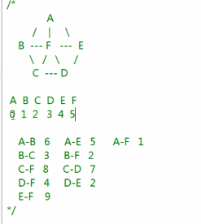

4-3-MapMinimumSpanningTreePrim

>七个顶点，边与边之间存在权值，如a-b权值为6，一共十条边。

Edge.h

```c
#ifndef EDGE_H
#define EDGE_H

class Edge
{
public:
	Edge(int nodeIndexA = 0, int nodeIndexB = 0,int weightValue = 0);
	int m_iNodeIndexA; // 边的两个顶点
	int m_iNodeIndexB;

	int m_iWeightValue; // 边上权值

	// 标记已经挑出来的边
	bool m_bSelected;
};

#endif
```

Edge.cpp

```c
#include "Edge.h"

Edge::Edge(int nodeIndexA, int nodeIndexB, int weightValue)
{
	m_iNodeIndexA = nodeIndexA;
	m_iNodeIndexB = nodeIndexB;
	m_iWeightValue = weightValue;
	m_bSelected = false;
}
```

Node.h

```c
#ifndef NODE_H
#define NODE_H

class Node
{
public:
	Node(char data = 0);
	char m_cData;       //数据值
	bool m_bIsVisited;  //有没有被访问
};

#endif

```

Node.cpp

```c
#include "Node.h"

Node::Node(char data)
{
	m_cData = data;
	m_bIsVisited = false;
}
```

CMap.h

```c
#ifndef CMAP_H
#define CMAP_H
#include "Node.h"
#include <vector>
#include "Edge.h"
using namespace std;

class CMap
{
public:
	CMap(int capacity);
	~CMap();
	bool addNode(Node *pNode);
	//向图中加入顶点
	void resetNode();
	//重置顶点
	bool setValueToMatrixForDirectedGraph(int row,int col,int val =1);
	bool setValueToMatrixForUndirectedGraph(int row, int col, int val = 1);

	void printMatrix();
	//打印邻接矩阵

	void depthFirstTraverse(int nodeIndex);// 深度优先遍历
	void breadthFirstTraverse(int nodeIndex);// 广度优先遍历
	void primTree(int nodeIndex); // 普里姆生成树指定的第一个点，找出与他相连的最小边
private:
	bool getValueFromMatrix(int row, int col, int &val);//从矩阵中获取权值
	void breadthFirstTraverseImpl(vector<int> preVec);//广度优先遍历实现函数


	int getMinEdge(vector<Edge> edgeVec);


private:
	int m_iCapacity;
	//图中最多可以容纳的顶点数
	int m_iNodeCount;
	//已经添加的顶点（结点）个数
	Node *m_pNodeArray;
	//用来存放顶点数组
	int *m_pMatrix;
	//用来存放邻接矩阵

	Edge *m_pEdge; // 边，map.cpp中分配内存
	
};

#endif

```

CMap.cpp

```c
#include "CMap.h"
#include <iostream>
#include <vector>
#include "Node.h"
using namespace std;

CMap::CMap(int capacity)
{
	m_iCapacity = capacity;
	m_iNodeCount = 0;
	m_pNodeArray = new Node[m_iCapacity];
	m_pMatrix = new int[m_iCapacity * m_iCapacity];//邻接矩阵size乘size
	//邻接矩阵初始化为全0
	//memset(m_pMatrix, 0, m_iCapacity * m_iCapacity * sizeof(int));
	//将s所指向的某一块内存中的前n个 字节的内容全部设置为ch指定的ASCII值， 第一个值为指定的内存地址，块的大小由第三个参数指定
	for (int i=0;i<m_iCapacity*m_iCapacity;i++)
	{
		m_pMatrix[i] = 0;
	}

	m_pEdge = new Edge[m_iCapacity - 1]; // 为边申请内存

}

CMap::~CMap()
{
	delete []m_pNodeArray;
	delete[]m_pMatrix;
}

bool CMap::addNode(Node *pNode)
{
	if (pNode == NULL)
	{
		return false;
	}
	//保存节点数据
	m_pNodeArray[m_iNodeCount].m_cData = pNode->m_cData;
	m_iNodeCount++;
	return true;
}

void CMap::resetNode()
{
	for (int i = 0; i < m_iNodeCount; i++)
	{
		m_pNodeArray[i].m_bIsVisited = false;
	}
}

bool CMap::setValueToMatrixForDirectedGraph(int row, int col, int val)
{
	if (row <0 || row >= m_iCapacity)
	{
		return false;
	}
	if (col < 0 || col >= m_iCapacity)
	{
		return false;
	}
	m_pMatrix[row*m_iCapacity + col] = val;
	return true;
}

bool CMap::setValueToMatrixForUndirectedGraph(int row, int col, int val)
{
	if (row < 0 || row >= m_iCapacity)
	{
		return false;
	}
	if (col < 0 || col >= m_iCapacity)
	{
		return false;
	}
	m_pMatrix[row*m_iCapacity + col] = val;
	m_pMatrix[col*m_iCapacity + row] = val;
	return true;
}
bool CMap::getValueFromMatrix(int row, int col, int &val)
{
	if (row < 0 || row >= m_iCapacity)
	{
		return false;
	}
	if (col < 0 || col >= m_iCapacity)
	{
		return false;
	}
	val = m_pMatrix[row * m_iCapacity + col];
	return true;
}

void CMap::printMatrix()
{
	//两重循环（i行k列）
	for (int i=0;i<m_iCapacity;i++)
	{
		for (int k=0;k<m_iCapacity;k++)
		{
			cout << m_pMatrix[i*m_iCapacity + k] << " ";
		}
		cout << endl;
	}
}

//深度优先
void CMap::depthFirstTraverse(int nodeIndex)
{
	//访问根左右。与先序遍历类似。把子树延展的所有节点访问完回到根
	int value = 0;

	cout << m_pNodeArray[nodeIndex].m_cData << " ";
	m_pNodeArray[nodeIndex].m_bIsVisited = true;

	//通过邻接矩阵判断是否与其他的顶点有连接

	for (int i=0;i<m_iCapacity;i++)
	{
		//取出相应的弧
		getValueFromMatrix(nodeIndex, i, value);
		if (value !=0)//判断有弧连接其他顶点
		{
			if (m_pNodeArray[i].m_bIsVisited)
			{
				continue;
			}
			else
			{
				depthFirstTraverse(i);
			}
		}
		else
		{
			continue;
		}
	}
}
//每一层放在一个数组中
void CMap::breadthFirstTraverse(int nodeIndex)
{
	cout << m_pNodeArray[nodeIndex].m_cData << " ";
	m_pNodeArray[nodeIndex].m_bIsVisited = true;

	//将节点索引保存到数组中
	vector<int> curVec;
	curVec.push_back(nodeIndex);

	breadthFirstTraverseImpl(curVec);

}

void CMap::breadthFirstTraverseImpl(vector<int> preVec)
{
	int value = 0;
	vector<int> curVec;

	//prevec为上一层节点
	for (int j = 0; j < (int)preVec.size(); j++)
	{
		for (int i=0;i<m_iCapacity;i++)
		{
			getValueFromMatrix(preVec[j], i, value);
			if (value != 0)
			{
				if (m_pNodeArray[i].m_bIsVisited)
				{
					continue;
				}
				else
				{
					cout << m_pNodeArray[i].m_cData << " ";
					m_pNodeArray[i].m_bIsVisited = true;

					curVec.push_back(i);
				}
			}
		}
	}
	if (curVec.size() == 0)
	{
		return;
	}
	else
	{
		breadthFirstTraverseImpl(curVec);
	}

}

// 普利姆生成树
void CMap::primTree(int nodeIndex) {
	//取边存权值
	int value = 0;
	int edgeCount = 0;

	vector<int> nodeVec;
	vector<Edge> edgeVec;

	cout << m_pNodeArray[nodeIndex].m_cData << endl;

	nodeVec.push_back(nodeIndex); // nodeIndex
	m_pNodeArray[nodeIndex].m_bIsVisited = true;
	// 什么时候停下来，边数等于点数-1时，edgeCount计数边
	while (edgeCount < m_iCapacity - 1)
	{
		int temp = nodeVec.back();
		// 从数组中取出最尾部的元素
  
    // 寻找与该节点连接的所有边
		for (int i=0;i<m_iCapacity;i++)
		{
		  // 取相应的边，temp是
			getValueFromMatrix(temp, i, value);
			if (value != 0)
			{
				if (m_pNodeArray[i].m_bIsVisited)
				{
					continue;
				}
				else
				{
					// 没被访问过放入备选边
					Edge edge(temp, i, value);
					edgeVec.push_back(edge);
				}
			}
		}

		// 才可选边集合中找出最小的边
		int edgeIndex = getMinEdge(edgeVec);
		edgeVec[edgeIndex].m_bSelected = true;

		cout << edgeVec[edgeIndex].m_iNodeIndexA <<"-----"<<edgeVec[edgeIndex].m_iNodeIndexB<<"  ";
		cout << edgeVec[edgeIndex].m_iWeightValue << endl;

		// 放入最小生成树边的集合
		m_pEdge[edgeCount] = edgeVec[edgeIndex];
		edgeCount++;

		// 找到与当前边连接的点
		int nextNodeIndex = edgeVec[edgeIndex].m_iNodeIndexB;

		// 放入点集合
		nodeVec.push_back(nextNodeIndex);
		m_pNodeArray[nextNodeIndex].m_bIsVisited = true;

		cout << m_pNodeArray[nextNodeIndex].m_cData << endl;
	}
}

int CMap::getMinEdge(vector<Edge> edgeVec)
{
	// 找到第一条边而且是没有被选出去的边
	int minWeight = 0;
	int edgeIndex = 0;
	int i = 0;
	for ( ;i<edgeVec.size();i++)
	{
		if (!edgeVec[i].m_bSelected)
		{
			//该边还没有被选过
			minWeight = edgeVec[i].m_iWeightValue;
			edgeIndex = i;
			break;//找到第一条边迅速跳出循环
		}
	}

	if (minWeight == 0)
	{
		return -1;
	}

	for ( ;i<edgeVec.size();i++)
	{
		if (edgeVec[i].m_bSelected)
		{
			continue;
		}
		else
		{
			if (minWeight >edgeVec[i].m_iWeightValue)
			{
				minWeight = edgeVec[i].m_iWeightValue;
				edgeIndex = i;
			}
		}
	}
	return edgeIndex;
}
```

main.cpp:

```c
#include "CMap.h"
#include <stdlib.h>
#include "Node.h"
#include <iostream>
using namespace std;

int main()
{
	CMap *pMap = new CMap(6);

	Node *pNodeA = new Node('A');
	Node *pNodeB = new Node('B');
	Node *pNodeC = new Node('C');
	Node *pNodeD = new Node('D');
	Node *pNodeE = new Node('E');
	Node *pNodeF = new Node('F');

	pMap->addNode(pNodeA);
	pMap->addNode(pNodeB);
	pMap->addNode(pNodeC);
	pMap->addNode(pNodeD);
	pMap->addNode(pNodeE);
	pMap->addNode(pNodeF);

	pMap->setValueToMatrixForUndirectedGraph(0,1,6);
	pMap->setValueToMatrixForUndirectedGraph(0,4,5);
	pMap->setValueToMatrixForUndirectedGraph(0,5,1);
	pMap->setValueToMatrixForUndirectedGraph(1,2,3);
	pMap->setValueToMatrixForUndirectedGraph(1,5,2);
	pMap->setValueToMatrixForUndirectedGraph(2,5,8);
	pMap->setValueToMatrixForUndirectedGraph(2,3,7);
	pMap->setValueToMatrixForUndirectedGraph(3,5,4);
	pMap->setValueToMatrixForUndirectedGraph(3,4,2);
	pMap->setValueToMatrixForUndirectedGraph(4,5,9);


	pMap->primTree(0);
	return 0;
}
```

运行结果：


#### 图的编码实战-最小生成树之克鲁斯卡尔算法

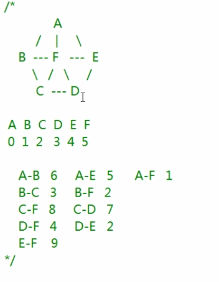

以边为基础，第一步找到所有的边，在边中找到最小生成树的集合

第二步:从所有边中取出组成最小生成树的边

找到算法结束条件；从边集合中找到最小边；找出最小边连接的点；找出点所在的点集合；根据点所在集合的不同做出不同处理

Node.cpp & Node.h Edge.cpp & Edge.h与之前的一样

4-5-MapMinimumSpanningTreeKruskal

CMap.h

```c
#ifndef CMAP_H
#define CMAP_H
#include "Node.h"
#include <vector>
#include "Edge.h"
using namespace std;

class CMap
{
public:
	CMap(int capacity);
	~CMap();
	bool addNode(Node *pNode);
	//向图中加入顶点
	void resetNode();
	//重置顶点
	bool setValueToMatrixForDirectedGraph(int row,int col,int val =1);
	bool setValueToMatrixForUndirectedGraph(int row, int col, int val = 1);

	void printMatrix();
	//打印邻接矩阵

	void depthFirstTraverse(int nodeIndex);//深度优先遍历
	void breadthFirstTraverse(int nodeIndex);//广度优先遍历
	void primTree(int nodeIndex); //普里姆生成树指定的第一个点，找出与他相连的最小边
	void kruskalTree();//克鲁斯卡尔算法生成树


private:
	bool getValueFromMatrix(int row, int col, int &val);//从矩阵中获取权值
	void breadthFirstTraverseImpl(vector<int> preVec);//广度优先遍历实现函数
	bool isInSet(vector<int> nodeSet, int target); //判断顶点是否在点集合中
	void mergeNodeSet(vector<int> &nodeSetA, vector<int> nodeSetB);//合并两个点集合


	int getMinEdge(vector<Edge> edgeVec);


private:
	int m_iCapacity;
	//图中最多可以容纳的顶点数
	int m_iNodeCount;
	//已经添加的顶点（结点）个数
	Node *m_pNodeArray;
	//用来存放顶点数组
	int *m_pMatrix;
	//用来存放邻接矩阵

	Edge *m_pEdge;
	
};

#endif
```

CMap.cpp

```c
#include "CMap.h"
#include <iostream>
#include <vector>
#include "Node.h"
using namespace std;

CMap::CMap(int capacity)
{
	m_iCapacity = capacity;
	m_iNodeCount = 0;
	m_pNodeArray = new Node[m_iCapacity];
	m_pMatrix = new int[m_iCapacity * m_iCapacity];//邻接矩阵size乘size
	//邻接矩阵初始化为全0
	//memset(m_pMatrix, 0, m_iCapacity * m_iCapacity * sizeof(int));
	//将s所指向的某一块内存中的前n个 字节的内容全部设置为ch指定的ASCII值， 第一个值为指定的内存地址，块的大小由第三个参数指定
	for (int i=0;i<m_iCapacity*m_iCapacity;i++)
	{
		m_pMatrix[i] = 0;
	}

	m_pEdge = new Edge[m_iCapacity - 1];

}

CMap::~CMap()
{
	delete []m_pNodeArray;
	delete[]m_pMatrix;
	delete[]m_pEdge;
}

bool CMap::addNode(Node *pNode)
{
	if (pNode == NULL)
	{
		return false;
	}
	//保存节点数据
	m_pNodeArray[m_iNodeCount].m_cData = pNode->m_cData;
	m_iNodeCount++;
	return true;
}

void CMap::resetNode()
{
	for (int i = 0; i < m_iNodeCount; i++)
	{
		m_pNodeArray[i].m_bIsVisited = false;
	}
}

bool CMap::setValueToMatrixForDirectedGraph(int row, int col, int val)
{
	if (row <0 || row >= m_iCapacity)
	{
		return false;
	}
	if (col < 0 || col >= m_iCapacity)
	{
		return false;
	}
	m_pMatrix[row*m_iCapacity + col] = val;
	return true;
}

bool CMap::setValueToMatrixForUndirectedGraph(int row, int col, int val)
{
	if (row < 0 || row >= m_iCapacity)
	{
		return false;
	}
	if (col < 0 || col >= m_iCapacity)
	{
		return false;
	}
	m_pMatrix[row*m_iCapacity + col] = val;
	m_pMatrix[col*m_iCapacity + row] = val;
	return true;
}
bool CMap::getValueFromMatrix(int row, int col, int &val)
{
	if (row < 0 || row >= m_iCapacity)
	{
		return false;
	}
	if (col < 0 || col >= m_iCapacity)
	{
		return false;
	}
	val = m_pMatrix[row * m_iCapacity + col];
	return true;
}

void CMap::printMatrix()
{
	//两重循环（i行k列）
	for (int i=0;i<m_iCapacity;i++)
	{
		for (int k=0;k<m_iCapacity;k++)
		{
			cout << m_pMatrix[i*m_iCapacity + k] << " ";
		}
		cout << endl;
	}
}

//深度优先
void CMap::depthFirstTraverse(int nodeIndex)
{
	//访问根左右。与先序遍历类似。把子树延展的所有节点访问完回到根
	int value = 0;

	cout << m_pNodeArray[nodeIndex].m_cData << " ";
	m_pNodeArray[nodeIndex].m_bIsVisited = true;

	//通过邻接矩阵判断是否与其他的顶点有连接

	for (int i=0;i<m_iCapacity;i++)
	{
		//取出相应的弧
		getValueFromMatrix(nodeIndex, i, value);
		if (value !=0)//判断有弧连接其他顶点
		{
			if (m_pNodeArray[i].m_bIsVisited)
			{
				continue;
			}
			else
			{
				depthFirstTraverse(i);
			}
		}
		else
		{
			continue;
		}
	}
}
//每一层放在一个数组中
void CMap::breadthFirstTraverse(int nodeIndex)
{
	cout << m_pNodeArray[nodeIndex].m_cData << " ";
	m_pNodeArray[nodeIndex].m_bIsVisited = true;

	//将节点索引保存到数组中
	vector<int> curVec;
	curVec.push_back(nodeIndex);

	breadthFirstTraverseImpl(curVec);

}

void CMap::breadthFirstTraverseImpl(vector<int> preVec)
{
	int value = 0;
	vector<int> curVec;

	//prevec为上一层节点
	for (int j = 0; j < (int)preVec.size(); j++)
	{
		for (int i=0;i<m_iCapacity;i++)
		{
			getValueFromMatrix(preVec[j], i, value);
			if (value != 0)
			{
				if (m_pNodeArray[i].m_bIsVisited)
				{
					continue;
				}
				else
				{
					cout << m_pNodeArray[i].m_cData << " ";
					m_pNodeArray[i].m_bIsVisited = true;

					curVec.push_back(i);
				}
			}
		}
	}
	if (curVec.size() == 0)
	{
		return;
	}
	else
	{
		breadthFirstTraverseImpl(curVec);
	}

}

//普利姆生成树
void CMap::primTree(int nodeIndex) {
	//取边存权值
	int value = 0;
	int edgeCount = 0;

	vector<int> nodeVec;
	vector<Edge> edgeVec;

	cout << m_pNodeArray[nodeIndex].m_cData << endl;

	nodeVec.push_back(nodeIndex);
	m_pNodeArray[nodeIndex].m_bIsVisited = true;
	//什么时候停下来，边数等于点数-1时
	while (edgeCount < m_iCapacity - 1)
	{
		int temp = nodeVec.back();
		//从数组中取出最尾部的

		for (int i=0;i<m_iCapacity;i++)
		{
			getValueFromMatrix(temp, i, value);
			if (value != 0)
			{
				if (m_pNodeArray[i].m_bIsVisited)
				{
					continue;
				}
				else
				{
					//没被访问过放入备选边
					Edge edge(temp, i, value);
					edgeVec.push_back(edge);
				}
			}
		}

		//才可选边集合中找出最小的边
		int edgeIndex = getMinEdge(edgeVec);
		edgeVec[edgeIndex].m_bSelected = true;

		cout << edgeVec[edgeIndex].m_iNodeIndexA <<"-----"<<edgeVec[edgeIndex].m_iNodeIndexB<<"  ";
		cout << edgeVec[edgeIndex].m_iWeightValue << endl;

		//放入最小生成树边
		m_pEdge[edgeCount] = edgeVec[edgeIndex];
		edgeCount++;

		//找到与当前边连接的点
		int nextNodeIndex = edgeVec[edgeIndex].m_iNodeIndexB;

		//放入点集合
		nodeVec.push_back(nextNodeIndex);
		m_pNodeArray[nextNodeIndex].m_bIsVisited = true;

		cout << m_pNodeArray[nextNodeIndex].m_cData << endl;
	}
}

int CMap::getMinEdge(vector<Edge> edgeVec)
{
	//找到第一条边而且是没有被选出去的边
	int minWeight = 0;
	int edgeIndex = 0;
	int i = 0;
	for ( ;i<(int)edgeVec.size();i++)
	{
		if (!edgeVec[i].m_bSelected)
		{
			//该边还没有被选过
			minWeight = edgeVec[i].m_iWeightValue;
			edgeIndex = i;
			break;//找到第一条边迅速跳出循环
		}
	}

	if (minWeight == 0)
	{
		return -1;
	}

	for ( ;i<(int)edgeVec.size();i++)
	{
		if (edgeVec[i].m_bSelected)
		{
			continue;
		}
		else
		{
			if (minWeight >edgeVec[i].m_iWeightValue)
			{
				minWeight = edgeVec[i].m_iWeightValue;
				edgeIndex = i;
			}
		}
	}
	return edgeIndex;
}

//克鲁斯卡尔算法生成树
void CMap::kruskalTree()
{
	int value = 0;//用来取权值的

	int edgeCount = 0;
	// 定义存放结点集合的数组，数组的数组。
	vector<vector<int>>  nodeSets;
	// 点的集合不止一个

	// 第一步取出所有边，边的数组
	vector<Edge> edgeVec;
	for (int i=0;i<m_iCapacity;i++)
	{
		for (int k=i+1;k<m_iCapacity;k++)
		{
			//取出上半个三角的值
			getValueFromMatrix(i, k, value);
			// 权值不等于0才有意义
			if (value!=0)
			{
				Edge edge(i, k, value);
				edgeVec.push_back(edge);
			}
		}
	}

	// 第二步：从所有边中取出最小生成树的边
	// 1. 找到算法的结束条件（边数等于顶点数-1）
	while (edgeCount <m_iCapacity-1)
	{
		// 2. 从边集合中找到最小边（最小边的点）
		int minEdgeIndex = getMinEdge(edgeVec);
		edgeVec[minEdgeIndex].m_bSelected = true;
		// 3. 找出最小边所连接的两个点
		int nodeAIndex = edgeVec[minEdgeIndex].m_iNodeIndexA;
		int nodeBIndex = edgeVec[minEdgeIndex].m_iNodeIndexB;

		bool nodeAIsInSet = false;
		bool nodeBIsInSet = false;

		int nodeAInSetLabel = -1;
		int nodeBInSetLabel = -1;

		// 4. 找出点所在的点集合
		for (int i = 0; i <(int)nodeSets.size(); i++)
		{
			nodeAIsInSet = isInSet(nodeSets[i],nodeAIndex);
			if (nodeAIsInSet)
			{
				// 保存i的值,i能知道a所在集合的索引
				nodeAInSetLabel = i;
			}
		}
		for (int i = 0; i < (int)nodeSets.size(); i++)
		{
			nodeBIsInSet = isInSet(nodeSets[i], nodeBIndex);
			if (nodeBIsInSet)
			{
				//保存i的值
				nodeBInSetLabel = i;
			}
		}
		//5. 根据点所在集合的不同做出不同处理
		if (nodeAInSetLabel == -1 && nodeBInSetLabel == -1)
		{
		  // 放入一个全新的集合
			vector<int> vec;
			vec.push_back(nodeAIndex);
			vec.push_back(nodeBIndex);

			nodeSets.push_back(vec);
		}

		else if (nodeAInSetLabel == -1 && nodeBInSetLabel !=-1)
		{
			// 此时a不在任何一个集合中。而nodeB已经在某一集合中
			// 因为node a,b为一边的两点。所有将a也加入b的集合
			nodeSets[nodeBInSetLabel].push_back(nodeAIndex);
		}
		else if (nodeAInSetLabel != -1 && nodeBInSetLabel == -1)
		{
			//此时b不在任何一个集合中。而nodeA已经在某一集合中
			//因为nodea&b为一边的两点。所有将b也加入a的集合
			nodeSets[nodeAInSetLabel].push_back(nodeBIndex);
		}
		else if (nodeAInSetLabel != -1 && nodeBInSetLabel != -1 && nodeAInSetLabel != nodeBInSetLabel)
		{
			//两者在两个不同的集合中，将集合合并
			mergeNodeSet(nodeSets[nodeAInSetLabel], nodeSets[nodeBInSetLabel]);

			for (int k = nodeBInSetLabel;k<(int)nodeSets.size()-1;k++)
			{
				//相当于删除了一个节点后面的都向前挪一位
				nodeSets[k] = nodeSets[k + 1];

			}

		}
		else if(nodeAInSetLabel != -1 && nodeBInSetLabel != -1 && nodeAInSetLabel == nodeBInSetLabel)
		{
			//两个都不等于-1.相等还在同一个集合中。
			continue;
		}

		m_pEdge[edgeCount] = edgeVec[minEdgeIndex];
		edgeCount++;


		cout << edgeVec[minEdgeIndex].m_iNodeIndexA << "---" << edgeVec[minEdgeIndex].m_iNodeIndexB << "  ";
		cout << edgeVec[minEdgeIndex].m_iWeightValue << endl;
	}
	

}

bool CMap::isInSet(vector<int> nodeSet, int target)
{
	// 参数一点的集合。参数二点的索引
	for (int i=0;i<(int)nodeSet.size();i++)
	{
		if (nodeSet[i] == target)
		{
			return true;
		}
	}
	return false;
}

void CMap::mergeNodeSet(vector<int> &nodeSetA, vector<int> nodeSetB)
{
	for (int i=0;i<(int)nodeSetB.size();i++)
	{
		//合并就是将b的点依次加到a的后面
		nodeSetA.push_back(nodeSetB[i]);
	}
}

```

main.cpp:

```c
#include "CMap.h"
#include <stdlib.h>
#include "Node.h"
#include <iostream>
using namespace std;

int main()
{
	CMap *pMap = new CMap(6);

	Node *pNodeA = new Node('A');
	Node *pNodeB = new Node('B');
	Node *pNodeC = new Node('C');
	Node *pNodeD = new Node('D');
	Node *pNodeE = new Node('E');
	Node *pNodeF = new Node('F');

	pMap->addNode(pNodeA);
	pMap->addNode(pNodeB);
	pMap->addNode(pNodeC);
	pMap->addNode(pNodeD);
	pMap->addNode(pNodeE);
	pMap->addNode(pNodeF);

	pMap->setValueToMatrixForUndirectedGraph(0,1,6);
	pMap->setValueToMatrixForUndirectedGraph(0,4,5);
	pMap->setValueToMatrixForUndirectedGraph(0,5,1);
	pMap->setValueToMatrixForUndirectedGraph(1,2,3);
	pMap->setValueToMatrixForUndirectedGraph(1,5,2);
	pMap->setValueToMatrixForUndirectedGraph(2,5,8);
	pMap->setValueToMatrixForUndirectedGraph(2,3,7);
	pMap->setValueToMatrixForUndirectedGraph(3,5,4);
	pMap->setValueToMatrixForUndirectedGraph(3,4,2);
	pMap->setValueToMatrixForUndirectedGraph(4,5,9);

	//pMap->primTree(0);
	pMap->kruskalTree();
	return 0;
}
```

程序编写完成之后，查看资源内存都有没有正确的释放。目前我们的顶点是很简单的顶点，将顶点替换成城市等。

运行结果：


