本章我们介绍Trie字典树前缀树

正确的读法就是Tree，为了区别Tree E；微软真实案例: 手持设备通讯录搜索，实习生使用Trie 

映射结构: 字典。但Trie 专门为处理字符串而生。

如果有n个条目 使用树结构(平衡) 查询的时间复杂度是O(logn);如果有100万个条目(2^20)logn大约为20

Trie 查询每个条目的时间复杂度，和字典中一共有多少条目无关! 时间复杂度为O(w) w为查询单词的长度! 因为大多数单词的长度都是小于10的。

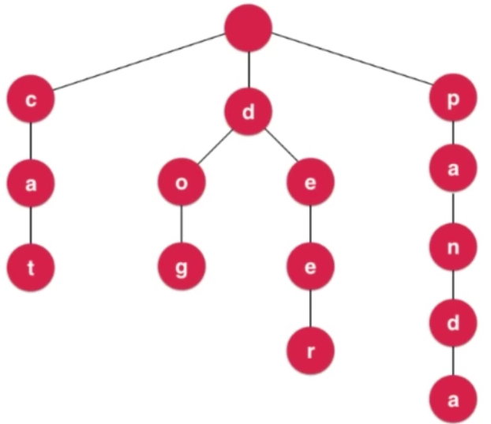

之前都是一个单词为一个节点进行存储，Trie按字母拆开进行了树形结构的排列。上图中有cat dog dear panda 四个单词。单词有多少个字母，访问到叶子节点就可以访问到单词。

Trie中节点的定义: 每个节点有26个指向下个节点的指针,每个节点有能力指向26个孩子。考虑不同的语言，不同的情境，26个指针有可能是不够的，也有可能有多余的。

```java
class Node{
  char c;
  Node next[26];
}
```

考虑大小写，有52个指针。如果设计的是url，邮箱等，肯定就要扩展更多的指针。更灵活的Trie会不固定指针的数量。

```java
class Node{
  char c;
  Map<char, Node> next;
}
```

next就是指一个char和一个node之间的映射，map中存放多少个不知道，但每一个都是节点到字符的映射。TreeMap(平衡二叉树 红黑树) HashMap

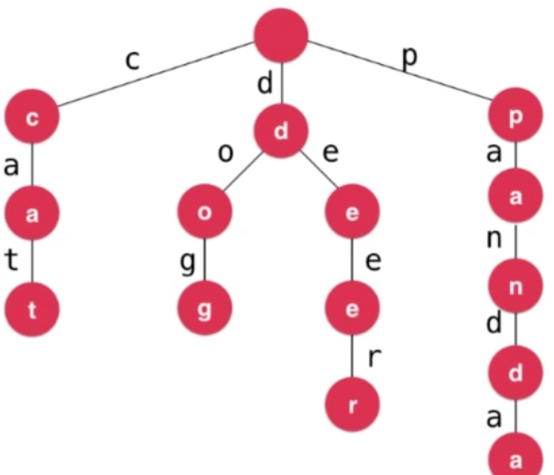

来到这个节点之前就已经知道这条线通往哪个字母了。因此可以不存值，只存映射。

```java
class Node{
  Map<char, Node> next;
}
```

Trie中添加查询即使没有char c也没有问题。我们上面的例子到叶子节点就是一个要查询的单词，但是英语世界中一些单词是另一些的前缀。pan panda都要存。 要有一个标识，记录该节点是否是一个单词的结尾。

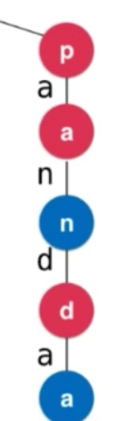

```java
class Node{
  boolean isWord;
  Map<char, Node> next;
}
```

最重要的一个部分就是next，既是一个映射，又存放着一个char值。

### Trie字典树基础

```java
package cn.mtianyan.trie;

import java.util.TreeMap;

public class Trie {

    /**
     * 节点类：isWord，Map<c,node>
     */
    private class Node {

        public boolean isWord;
        public TreeMap<Character, Node> next; // 中文单词界限模糊

        // 传入isWord
        public Node(boolean isWord) {
            this.isWord = isWord;
            next = new TreeMap<>();
        }

        // 无参构造函数
        public Node() {
            this(false);
        }
    }

    private Node root;  // 根节点
    private int size;   // 存储了多少个单词

    /**
     * Trie默认构造函数
     */
    public Trie() {
        root = new Node();
        size = 0;
    }

    /**
     * 获得Trie中存储的单词数量
     *
     * @return
     */
    public int getSize() {
        return size;
    }

    /**
     * 向Trie中添加一个新的单词word
     *
     * @param word
     */
    public void add(String word) {
        // 非递归写法，字符串拆成字符
        Node cur = root;
        for (int i = 0; i < word.length(); i++) {
            char c = word.charAt(i);
            // 如果为空，新建节点。
            if (cur.next.get(c) == null)
                cur.next.put(c, new Node());
            cur = cur.next.get(c); // 走到下一个节点
        }
        // 这个节点以前不表示单词结尾
        if (!cur.isWord) {
            cur.isWord = true;
            size++;
        }
    }
}
```

可以尝试一下递归写法作为练习。

### Trie中查询单词。

```java
    /**
     * 查询单词word是否在Trie中
     * @param word
     * @return
     */
    public boolean contains(String word){

        Node cur = root;
        for(int i = 0 ; i < word.length() ; i ++){
            char c = word.charAt(i);
            // 没有这个字符，return false
            if(cur.next.get(c) == null)
                return false;
            cur = cur.next.get(c);
        }
        // 比如trie中有panda，查pan。虽然到节点，但是并没有这个单词。
        return cur.isWord;
    }
```

```java
package cn.mtianyan;

import cn.mtianyan.set.BSTSet;
import cn.mtianyan.trie.Trie;

import java.util.ArrayList;

public class Main {

    public static void main(String[] args) {

        System.out.println("Pride and Prejudice");

        ArrayList<String> words = new ArrayList<>();
        if(FileOperation.readFile("pride-and-prejudice.txt", words)){

            long startTime = System.nanoTime();

            BSTSet<String> set = new BSTSet<>();
            for(String word: words)
                set.add(word);

            for(String word: words)
                set.contains(word);

            long endTime = System.nanoTime();

            double time = (endTime - startTime) / 1000000000.0;

            System.out.println("Total different words: " + set.getSize());
            System.out.println("BSTSet: " + time + " s");

            // ---

            startTime = System.nanoTime();

            Trie trie = new Trie();
            for(String word: words)
                trie.add(word);

            for(String word: words)
                trie.contains(word);

            endTime = System.nanoTime();

            time = (endTime - startTime) / 1000000000.0;

            System.out.println("Total different words: " + trie.getSize());
            System.out.println("Trie: " + time + " s");
        }
    }
}
```

运行结果:

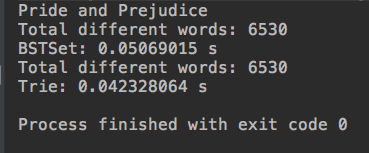

时间性能上Trie略高于BST。集合元素越多，Trie性能越高,因为Trie的性能与集合中有多少个字符串无关。

### Trie和前缀搜索

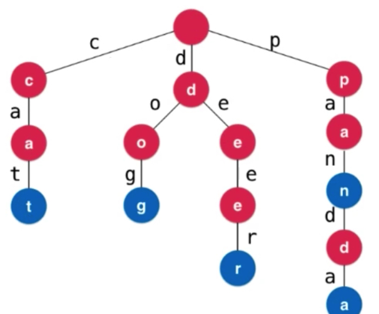

比如查找cat的时候 c ca都是cat的前缀。非常方便查找是否有某一个前缀对应的单词。

```java
/**
     * 查询是否在Trie中有单词以prefix为前缀
     *
     * @param prefix
     * @return
     */
    public boolean isPrefix(String prefix){

        Node cur = root;
        for(int i = 0 ; i < prefix.length() ; i ++){
            char c = prefix.charAt(i);
            if(cur.next.get(c) == null)
                return false;
            cur = cur.next.get(c);
        }

        return true; // 单词本身也是该单词的前缀。
    }
```

Trie又称为前缀树。BST中添加prefix方法，比较性能(自己练习)

#### leetcode中208 实现Trie

https://leetcode-cn.com/problems/implement-trie-prefix-tree/description/

实现一个 Trie (前缀树)，包含 insert, search, 和 startsWith 这三个操作。将我们上面实现的Trie方法名改成和题目一致就行。


### Trie的具体应用

LeetCode 211 简单的正则表达式。

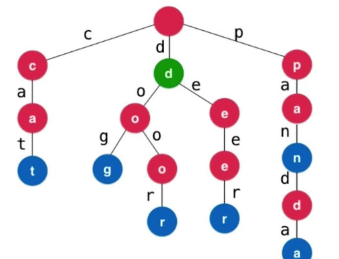

对于遇到的`.`，我们遍历所有的可能。

```java
package cn.mtianyan.leetcode_211;

/// Leetcode 211. Add and Search Word - Data structure design
/// https://leetcode.com/problems/add-and-search-word-data-structure-design/description/

import java.util.TreeMap;

public class WordDictionary {

    /**
     * 节点类：isWord，Map<c,node>
     */
    private class Node {

        public boolean isWord;
        public TreeMap<Character, Node> next; // 中文单词界限模糊

        // 传入isWord
        public Node(boolean isWord) {
            this.isWord = isWord;
            next = new TreeMap<>();
        }

        // 无参构造函数
        public Node() {
            this(false);
        }
    }

    private Node root;  // 根节点

    /**
     * 默认构造函数，初始化节点
     */
    public WordDictionary() {
        root = new Node();
    }

    /**
     * 添加一个单词到数据结果中
     */
    public void addWord(String word) {

        Node cur = root;
        // 不存在创建
        for (int i = 0; i < word.length(); i++) {
            char c = word.charAt(i);
            if (cur.next.get(c) == null)
                cur.next.put(c, new Node());
            cur = cur.next.get(c);
        }
        cur.isWord = true;
    }

    /**
     * Returns if the word is in the data structure. A word could contain the dot character '.' to represent any one letter.
     */
    public boolean search(String word) {
        // 最差情况全是点
        return match(root, word, 0);
    }

    private boolean match(Node node, String word, int index) {
        // 递归到底，整个word已经考虑完了
        if (index == word.length())
            return node.isWord;

        char c = word.charAt(index);

        // 具体字母
        if (c != '.') {
            if (node.next.get(c) == null)
                return false; // 字符串匹配失败
            return match(node.next.get(c), word, index + 1);
        } else {
            for (char nextChar : node.next.keySet())
                if (match(node.next.get(nextChar), word, index + 1))
                    return true;
            return false;
        }
    }
}
```

运行结果:


### Trie字典树和字符串映射

677 https://leetcode-cn.com/problems/map-sum-pairs/description/

字符串有一个value值，传入前缀，返回包含这个前缀的单词的value和。

处理1 node中包含value值，处理2 基于前缀，查找时计算所有对应词的value值和。

```java
package cn.mtianyan.leetcode_677;

import java.util.TreeMap;

public class MapSum {

    private class Node{

        public int value; // 单词权重值 isWord可以省略，0不是单词。
        public TreeMap<Character, Node> next;

        public Node(int value){
            this.value = value;
            next = new TreeMap<>();
        }

        public Node(){
            this(0);
        }
    }

    private Node root;

    /** Initialize your data structure here. */
    public MapSum() {

        root = new Node();
    }

    public void insert(String key, int val) {

        Node cur = root;
        // 单词添加Trie,并添加value值。
        for(int i = 0 ; i < key.length() ; i ++){
            char c = key.charAt(i);
            if(cur.next.get(c) == null)
                cur.next.put(c, new Node());
            cur = cur.next.get(c);
        }
        cur.value = val;
    }

    public int sum(String prefix) {
        // 先找到前缀最后一个字母所在位置。
        Node cur = root;
        for(int i = 0 ; i < prefix.length() ; i ++){
            char c = prefix.charAt(i);
            if(cur.next.get(c) == null)
                return 0;
            cur = cur.next.get(c);
        }

        return sum(cur);
    }

    private int sum(Node node){
        // cur 为根节点的单词，所有节点value值相加。
        int res = node.value;
        for(char c: node.next.keySet())
            res += sum(node.next.get(c));
        return res;
    }
}
```

递归到底的情况就是当前节点是一个叶子节点，下一个节点映射为0。这个问题中我们的Trie是作为一个映射来使用的，每一个单词和整型的value值进行了映射，映射具体体现在node节点中存储了一个value值。

Trie和映射

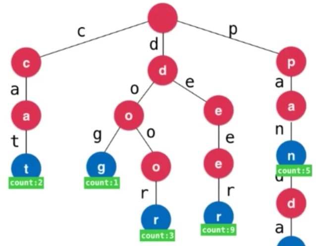

映射使用: 词频统计，Trie也可以做词频统计。练习: TrieMap 统计词频 比对 BSTMap

理解node 添加元素，与单词之间的关系。

### 更多与Trie相关的话题

Trie的删除操作,通讯录的实现。将通讯录中每一个人名，当做一个单词插入Trie，单词最后一个字母位置存储相应的电话号码等信息。

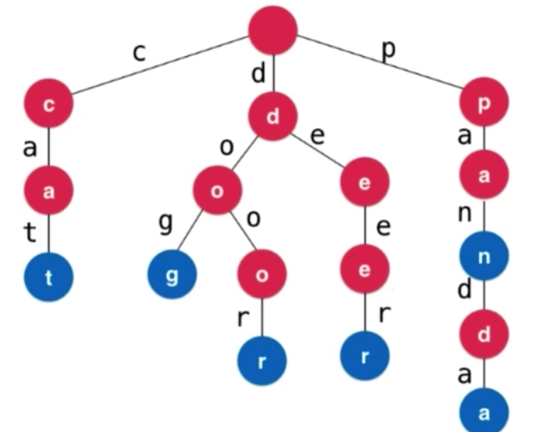

删除deer单词会将eer节点都删除掉，然后保留d。删除pan，把n的isWord置为false即可。

Trie的局限性:

最大的问题:空间!

```java
class Node{
  boolean isWord;
  Tree<char, Node> next;
}
```

每个节点只存储了一个字符的信息，节点之间的关联全部由TreeMap映射。存储空间是27n

解决方案: 压缩字典树Compressed Trie，只有一个后续字符的单链可以进行合并。

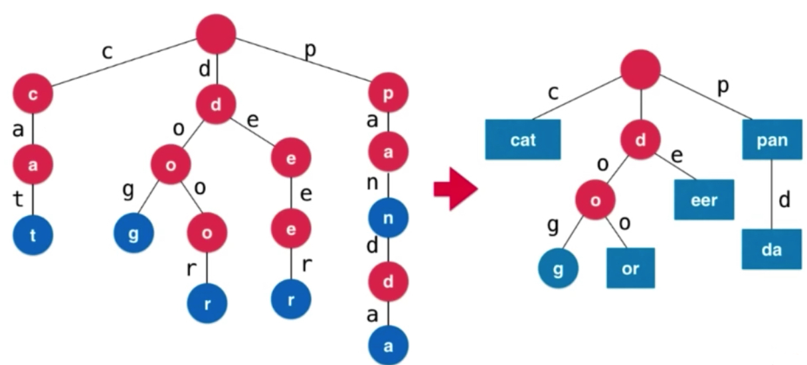

空间节省了，但是维护成本高了很多。

- Ternary Search Trie 三分搜索树

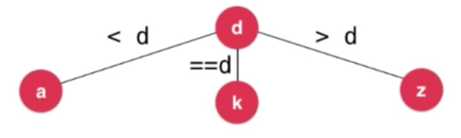


上图中存储了dog这个词。

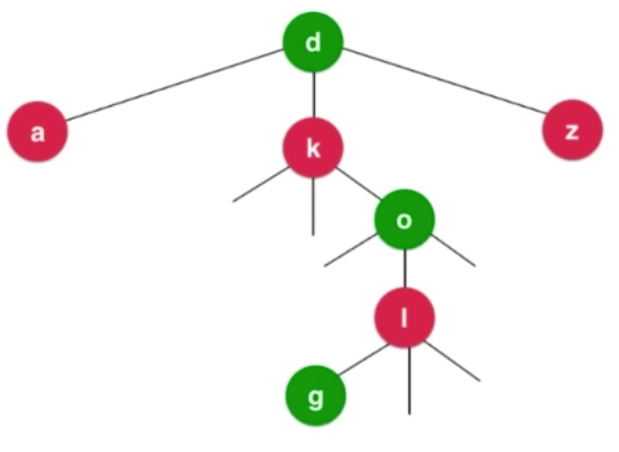

沿路根据大于小于判断，最终可以找到dog这个单词。字母数量+访问了但是并不是要找的，牺牲了查找性能。但是没有那么多map，节约了空间。

- 后缀树：字符串模式识别

#### 字符串数据研究

大多数时候都在与字符串打交道，字符串无处不在。研究无处不在。

经典问题: 子串查询，验证某个字符串是不是另外一个的子串。网页,word中搜索关键词都是子串查询。KMP Boyer-Moore Rabin-Karp 算法

文件压缩，背后都是0，1;文件压缩就是对字符串压缩，哈夫曼算法建立一棵树。

模式匹配: 实现一个高效的正则表达式引擎。java代码也是字符串，程序字符串进行解析，编译原理。

生物科学领域，DNA超长字符串，寻找模式，寻找特定目标。

**下一章将学习并查集这种树结构。**


