我们要学习的第一个数据结构就是数组，数组中很多值得挖掘。

#### 数组基础

把数据码成一排进行存放

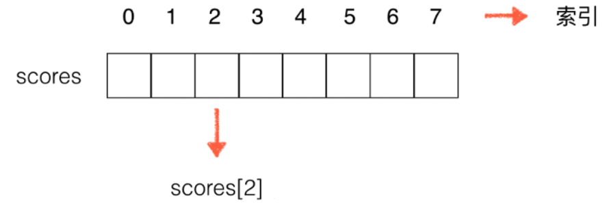

数组中索引从0开始，Java语法中要求数组存放同一类型的元素，可以通过中括号下标的方式取到元素。

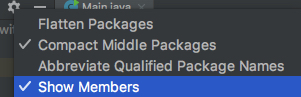

这样可以看到Main中有的方法。

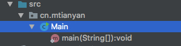

```java
package cn.mtianyan;

public class Main {

    public static void main(String[] args) {
        // 必须传入长度
        int[] arr = new int[10];
        for (int i = 0; i < arr.length; i++) {
            arr[i] = i;
        }

        System.out.println("=========");

        int[] scores = new int[]{100,99,96};
        for (int i = 0; i < scores.length; i++) {
            System.out.println(scores[i]);
        }

        System.out.println("=========");

        for (int score : scores) {
            System.out.println(score);
        }

        System.out.println("=========");
        scores[0] = 92;

        for (int score : scores) {
            System.out.println(score);
        }
    }
}
```

运行结果：

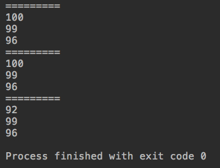

数组可以这样遍历，是因为它实现了可遍历接口。

Java为我们提供的数组，其中非常重要的一部分就是它的索引。索引可以有语义，也可以没有语义,2可以代表学号，但也可以将其视为没有语义。

数组最大的优点: 快速查询，scores[2]直接插到2号索引的。因此数组最好应用于"索引有语义"的情况，查学号为2的学生成绩。

但并非所有有语意的索弓都适用于数组,如身份证号: 1101031985121 66666;依次为索引，这得开辟很大的内存空间,空间浪费。

数组也可以处理“索引没有语意”的情况。我们在这一章，主要处理“索引没有语意”的情况数组的使用。

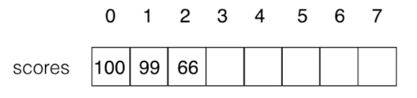

索引没有语意，如何表示没有元素? capacity 和 size的区别： 数组size是3，capacity是8。

如何添加元素（超过size如何处理）?如何删除元素（挪位）? Java中的数组并没有这些方法，我们需要基于java的数组，二 次封装属于我们自己的数组类。

我们自己做的是动态数组（内部依然使用java数组实现），Java的是静态数组。

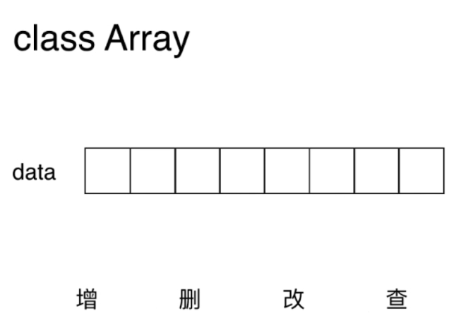

增删改查，有的数据结构不一定四个齐全。capacity是数组最多可以装多少元素，和实际能装多少元素是没有关系的。

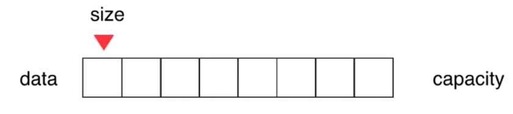

```java
package cn.mtianyan;

public class Array {
    private int[] data;
    private int size;

    /**
     * 带容量参数构造函数
     *
     * @param capacity 数组容量
     */
    public Array(int capacity) {
        data = new int[capacity];
        size = 0;
    }

    /**
     * 默认构造函数
     */
    public Array() {
        this(10);
    }

    /**
     * 静态数组入参构造函数
     *
     * @param data 传入静态数组
     */
    public Array(int[] data) {
        this.data = data;
    }

    /**
     * 获取数组元素个数
     *
     * @return size 数组元素个数
     */
    public int getSize() {
        return size;
    }

    /**
     * 获取数组的容量
     *
     * @return capacity 获取容量
     */
    public int getCapacity(){
        return data.length;
    }

    /**
     * 判断数组是否为空
     *
     * @return 是否为空
     */
    public boolean isEmpty(){
        return size == 0;
    }
}
```

### 向数组中添加元素

向数组末尾添加元素

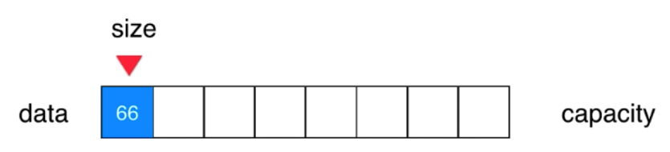

size指向data中第一个为空位置。因此添加元素时只需要添加到arr[size],并size++即可。(注意添加元素判满)

```java
    /**
     * 向所有元素末尾添加一个新元素。
     *
     * @param e 添加的元素
     */
    public void addLast(int e){
//        if (isFull()){
//            throw new IllegalArgumentException("AddLast failed. Array is Full");
//        }else {
//            data[size] =e; // data[size++] =e;
//            size++;
//        }
        add(size,e);
    }

    /**
     * 向索引0号位置添加元素
     *
     * @param e 添加的元素
     */
    public void addFirst(int e){
        add(0,e);
    }

    /**
     * 在index位置插入一个新元素e
     *
     * @param index 插入位置索引
     * @param e 插入元素
     */
    public void add(int index,int e){
        if (isFull())
            throw new IllegalArgumentException("AddLast failed. Array is Full");
        // 大于size就不是紧密排列了
        if (index<0 || index>size){
            throw new IllegalArgumentException("AddLast failed. Required index<0 or index>size ");
        }
        else {
            // 从哪开始挪呢: 从size-1这个元素(size本身是指向空的),挪到哪个呢，index位置的这个元素也是要挪的。
            for (int i=size-1; i>=index; i--){
                data[i+1] = data[i]; // 后一个等于前一个，从数组最后一个元素开始。
                // 极端值验证: size 1 index 0;(i=0;i>=0;i--)会执行一次data[1]=data[0].正确。
            }
            data[index] = e;
            size++;
        }
    }
```

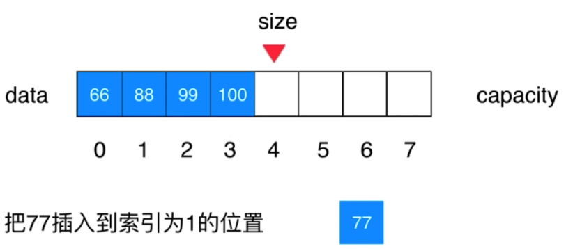

77插入，后面的元素都要向后挪动。

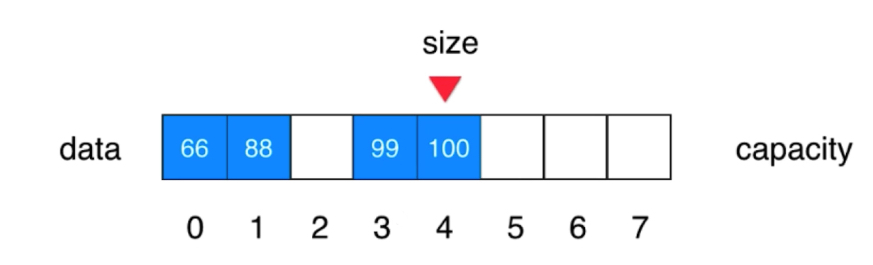

这里注意必须从100这里，向后挪，否则会造成值覆盖。

### 在数组中查询元素和修改元素

```java
    /**
     * 打印数组信息及遍历元素。
     *
     * @return 数组信息和元素遍历结果
     */
    @Override
    public String toString() {
        StringBuilder res = new StringBuilder();
        res.append(String.format("Array: size = %d, capacity = %d\n",size,data.length));
        res.append('[');
        for (int i = 0; i < size; i++) {
            res.append(data[i]);
            if (i !=size-1) // 最后一个元素不要加，
                res.append(", ");
        }
        res.append(']');
        return res.toString();
    }
```

```java
package cn.mtianyan;

public class ArrayTest {
    public static void main(String[] args) {
        Array array = new Array(20);
        for (int i = 0; i < 10; i++) {
            array.addLast(i);
        }
        System.out.println(array);
    }
}
```

运行结果:

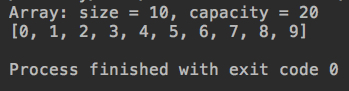

```java
        array.add(1,100);
        System.out.println(array);
```

运行结果:

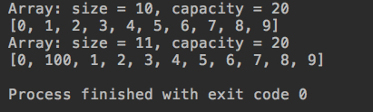

```java
        array.addFirst(-1);
        System.out.println(array);
```

运行结果:

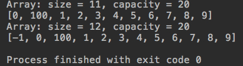

取出某一个元素。

```java
    /**
     * 传入索引，获取该位置元素
     *
     * @param index 要获取的元素索引
     * @return 返回该位置数组元素
     */
    public int get(int index){
        if (index<0 || index>=size){
            throw new IllegalArgumentException("Get failed. Required index<0 or index>=size ");
        }else {
            return data[index];
        }
    }
```

通过get方法用户无法使用到数组后半截没有使用到的空间，通过封装保证。

```java
System.out.println(array.get(array.getSize()-1));
```

运行结果:

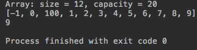

```java
    /**
     * 传入索引和元素值，将该位置元素设置为传入值
     * @param index 索引
     * @param e 传入值
     */
    public void set(int index,int e){
        if (index<0 || index>=size){
            throw new IllegalArgumentException("Set failed. Required index<0 or index>=size ");
        }else {
            data[index] = e;
        }
    }
```

```java
        array.set(0,-99);
        System.out.println(array);
```

运行结果:

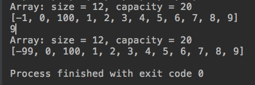

### 数组中的包含，搜索和删除元素

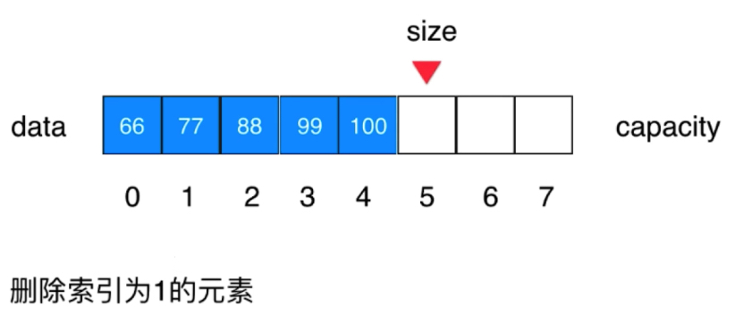

如果要删除索引为1的元素，从88开始，后面都要往前挪,挪size-index次。只需要size--，对于最后一个位置的元素不用做其他操作，因为用户也访问不到。

```java
/**
     * 查找数组中是否有元素e
     *
     * @param e
     * @return 包含 true; 不包含 false
     */
    public boolean contains(int e){
        for (int i = 0; i < size; i++) {
            if (data[i] == e){
                return true;
            }
        }
        return false;
    }

    /**
     * 查找数组中元素，返回其索引(第一个遇到)
     *
     * @param e 元素
     * @return 不存在 -1; 存在 i
     */
    public int find(int e){
        for (int i = 0; i < size; i++) {
            if (data[i] == e){
                return i;
            }
        }
        return -1;
    }

    public int[] findAll(int e){
        int[] tempArray=new int[size];
        int index = 0;
        for (int i = 0; i < size; i++) {
            if (data[i] == e){
                tempArray[index] = i;
                index++;
            }
        }
        int[] indexArray=new int[index];
        for (int i = 0; i < index; i++) {
            indexArray[i] = tempArray[i];
        }
        return indexArray;
    }
```

注意findAll中使用tempArray临时对象的作用: 同时将int数组，与它的size一起传递了出来。

```java
        System.out.println("===============加入重复元素后数组如下===================");
        array.add(3,3);
        array.add(array.getSize()-1,9);
        System.out.println(array);
        System.out.println("================包含 寻找测试===========================");
        System.out.println(array.contains(-99));
        System.out.println(array.contains(-100));
        System.out.println("3的index: "+array.find(3));
        int [] tmpArr = array.findAll(3);
        for (int i : tmpArr) {
            System.out.print(i+" ");
        }
        System.out.println();
```

运行结果:

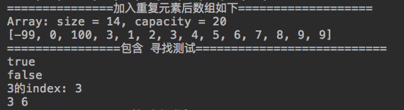

```java
 /**
     * 删除数组元素，返回删除的元素值
     *
     * @param index 索引
     * @return 该索引位置元素值
     */
    public int remove(int index){
        // 判空，空数组 removeFirst index=0,size=0，index>=size异常。空数组 removeLast index=-1 index<0异常;
        if (index<0 || index>=size){
            throw new IllegalArgumentException("Remove failed. Required index<0 or index>=size ");
        }else {
            int ret = data[index];
            for (int i=index+1;i < size;i++){
                // 从哪个元素开始挪，从index位置的后一个元素开始，挪到哪个元素结束，挪到size-1(因此没等号)
                data[i-1] = data[i]; // 前一个等于后一个
            }
            size--;
            return ret;
        }
    }

    /**
     * 删除第一个(索引0)元素
     *
     * @return 删除的元素值
     */
    public int removeFirst(){
        return  remove(0);
    }

    /**
     * 删除最后一个(索引size-1)元素
     *
     * @return 删除的元素值
     */
    public int removeLast(){
        return remove(size-1);
    }

    /**
     * 删除数组中某一个元素值（删除数组中第一个找到的）
     *
     * @param e 元素值
     * @return 删除是否成功
     */
    public boolean removeElement(int e){
        int index = find(e);
        if (index != -1){
            remove(index);
            return true;
        }
        return false;
    }

    /**
     * 删除数组中包含的所有该元素值
     * @param e 元素值
     * @return 删除成功与否
     */
    public boolean removeAllElement(int e){
        int[] indexArray = findAll(e);
        if (indexArray.length != 0){
            for (int i = 0; i < indexArray.length; i++) {
                remove(indexArray[i]-i); // 此处注意-i的巧妙
            }
            return true;
        }
        return false;
    }
```

重难点代码在于remove(indexArray[i]-i);此处很可能会被忽略，造成异常。因为数组每删除一个，原本获取到的临近后一个元素的index值应该-1；临近后两个则应该-2；以此类推。

```java
        System.out.println("================开始删除测试========================");
        System.out.println(array);
        array.remove(3); // 删除一个3
        System.out.println(array);
        array.removeElement(1); // 删除1
        System.out.println(array);
        System.out.println("=====删除index3 后 删除元素1如上====");
```

运行结果:

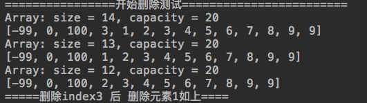

```java
        array.removeAllElement(9);
        System.out.println(array);
        System.out.println("=====删除所有9=====");
        array.addFirst(-99);
        array.removeAllElement(-99);
        System.out.println(array);
        System.out.println("=====首位添加-99，后删除所有-99 结果如上=====");
```


```java
        array.add(4,99);
        array.add(5,99);
        array.addFirst(99);
        array.addLast(99);
        array.add(7,99);
        System.out.println(array);
        System.out.println("=====上面为删除99前，下面为删除99后=====");
        array.removeAllElement(99);
        System.out.println(array);
```

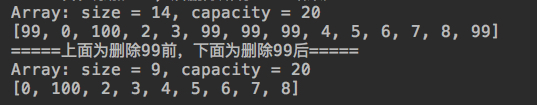

### 使用泛型

我们上面实现的数组目前只能存放int类型，但是我们需要的是可以承载多种类型，甚至自定义对象的容器。Java泛型可以解决这个问题。

使用泛型: 让我们的数据结构可以放置“任何”数据类型,不可以是基本数据类型，只能是类对象。

java中的八种基本类型: boolean , byte, char , short , int , long , float , double; 

每个基本数据类型都有对应的包装类: Boolean , Byte , Char , Short, Int , Long , Float , Double。自动的拆包，解包。

```java
public class Array<Element>
public class Array<E> 
```

为类名后面添加泛型类型标识，此处的类型标识可以自定义。

```java
    private E[] data;
```

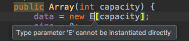

这里无法直接通过E实例化。只能通过间接的Object再转换。

```java
data = (E[]) new Object[capacity];
```

```java
    /**
     * 静态数组入参构造函数
     *
     * @param data 传入静态数组
     */
    public Array(E[] data) {
        this.data = data;
    }
```

```java
public void add(int index,E e){
public void addLast(E e){
public void addFirst(E e){
```

```java
 public boolean contains(int E){
        for (int i = 0; i < size; i++) {
            if (data[i].equals(E)){
                return true;
            }
        }
        return false;
    }
```

这里注意，两个对象之间的比较要使用equals方法，将所有的与成员数组类型相关的都改了。

```java
    public E remove(int index){
        // 判空，空数组 removeFirst index=0,size=0，index>=size异常。空数组 removeLast index=-1 index<0异常;
        if (index<0 || index>=size){
            throw new IllegalArgumentException("Remove failed. Required index<0 or index>=size ");
        }else {
            E ret = data[index];
            for (int i=index+1;i < size;i++){
                // 从哪个元素开始挪，从index位置的后一个元素开始，挪到哪个元素结束，挪到size-1(因此没等号)
                data[i-1] = data[i]; // 前一个等于后一个
            }
            size--;
            data[size] = null;
            return ret;
        }
    }
```

 data[size]还指着一个值不过用户访问不到而已，新的元素添加会自动覆盖。使用泛型后，data数组中存放的是类对象的引用， size-- 后data[size]依然指向一个引用，引用就涉及到空间释放的问题，Java有自动垃圾回收机制，但如果 data[size]仍存放引用，就不会被自动垃圾回收。data[size] = null;(不必须，可以被新对象覆盖) 
 
 如果不置为null，它会被称为loitering Objects，没有用但垃圾回收机制不回收。 loitering Objects != memory leak 为了程序优化，手动去除更好。 

Main中改动

```java
Array<Integer> array = new Array(20);
Array<Integer> array = new Array<>(20);
```

即使不改，也是可以正常运行的。但是我们最好加上更清楚的看出类型，jdk1.7之后不用再后面再重复一次。

```java
package cn.mtianyan;

public class Student {

    private String name;
    private int score;

    public Student(String studentName, int studentScore){
        name = studentName;
        score = studentScore;
    }

    @Override
    public String toString(){
        return String.format("Student(name: %s, score: %d)", name, score);
    }

    public static void main(String[] args) {

        Array<Student> arr = new Array();
        arr.addLast(new Student("mtianyan1", 100));
        arr.addLast(new Student("mtianyan2", 66));
        arr.addLast(new Student("mtianyan3", 88));
        System.out.println(arr);
    }
}
```

运行结果:

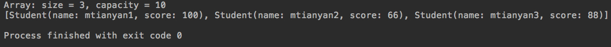

```java
    @Override
    public boolean equals(Object o) {
        if (this == o) return true;
        if (!(o instanceof Student)) return false;
        Student student = (Student) o;
        return score == student.score &&
                (name.equals(student.name));
    }

    @Override
    public int hashCode() {
        return Objects.hash(name,score);
    }
```

重写hashCode和equals方法。

```java
        System.out.println("================start=======================");
        System.out.println(arr);
        arr.remove(1);
        Student stu1 = new Student("mtianyan1", 100);
        Student stu3 = new Student("mtianyan3", 88);
        arr.removeElement(stu1);
        System.out.println(arr);
        System.out.println("==============================================");
        System.out.println(arr);
        arr.removeAllElement(stu3);
        System.out.println(arr);
```

运行结果:

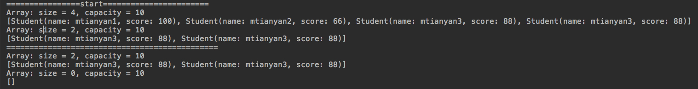

### 动态数组

Java静态数组容量有限，固定。我们要将其改造成一个可伸缩的。

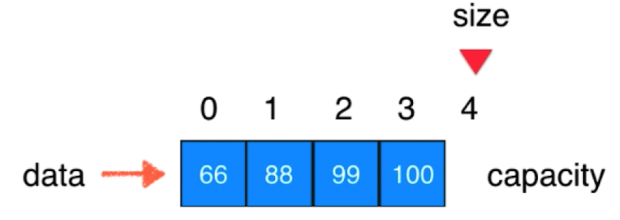

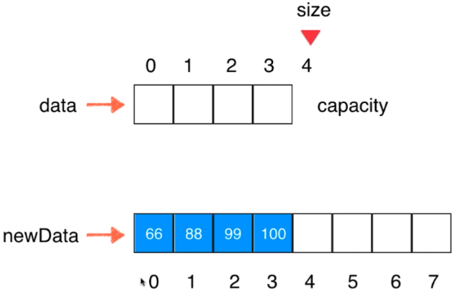

不够用了，就开辟一个新的数组，容量是原来的二倍(4变为8)，然后把原来数组的内容进行复制过来(size不变)，最后将data指向新的数组。这里要遍历的把每个值都搞过去，对于性能消耗大不大呢，本章后两节会讨论。

```java
        if (isFull())
            throw new IllegalArgumentException("AddLast failed. Array is Full");
        // 大于size就不是紧密排列了
        if (index<0 || index>size){
            throw new IllegalArgumentException("AddLast failed. Required index<0 or index>size ");
        }
```

坐标非法依然抛出异常，但是如果满了，我们的动态数组将不会抛出异常。

```java
        if (isFull())
            resize(2*data.length);
```

这里的2倍，是优于扩大固定大小值的。2的选择是我们自己决定的，Collection中ArrayList中选取了1.5。

```java
    private void resize(int newCapacity) {
        E[] newData = (E[]) new Object[newCapacity];
        for (int i = 0; i < size; i++) {
            newData[i] = data[i];
        }
        data = newData;
    }
```

```java
package cn.mtianyan;

public class ArrayTestDynamic {
    public static void main(String[] args) {
        Array<Integer> array = new Array<>();
        for (int i = 0; i < 10; i++) {
            array.addLast(i);
        }
        System.out.println(array);
        array.addFirst(99);
        System.out.println(array);
        array.addLast(100);
        System.out.println(array);
    }
}
```

运行结果:

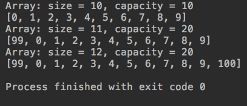

删除时压缩数组容量

```java
    public E remove(int index){
        // 判空，空数组 removeFirst index=0,size=0，index>=size异常。空数组 removeLast index=-1 index<0异常;
        if (index<0 || index>=size){
            throw new IllegalArgumentException("Remove failed. Required index<0 or index>=size ");
        }else {
            E ret = data[index];
            for (int i=index+1;i < size;i++){
                // 从哪个元素开始挪，从index位置的后一个元素开始，挪到哪个元素结束，挪到size-1(因此没等号)
                data[i-1] = data[i]; // 前一个等于后一个
            }
            size--;
            data[size] = null;

            if (size == data.length /2 )
                resize(data.length /2);
            return ret;
        }
    }
```

这里设置一个阈值，当数组一半为空时，容量减半。

```java
package cn.mtianyan;

public class ArrayTestDynamic {
    public static void main(String[] args) {
        Array<Integer> array = new Array<>();
        for (int i = 0; i < 10; i++) {
            array.addLast(i);
        }
        System.out.println(array);
        array.addFirst(99);
        System.out.println(array);
        array.addLast(99);
        System.out.println(array);
        array.removeAllElement(99);
        System.out.println(array);
        for (int i = 0; i < 5; i++) {
            array.removeElement(i);
        }
        System.out.println(array);
    }
}
```

运行结果:

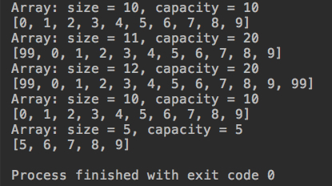

### 简单的复杂度分析

简单的时间复杂度分析 感性认识 考研: 细致推导

> O(1), O(n) , O(lgn) , O(nlogn) , O(n^2);

大O描述的是算法的运行时间和输入数据之间的关系

```java
public static int sum(int[] nums){
    int sum = 0;
    for(int num: nums) sum += num;
    return sum;
}
```

通常我们说上面这个代码的算法，时间复杂度是O(n)的。n是nums中的元素个数;算法和n呈线性关系,线性关系表现在一次方。

num 数字越多，算法执行时间越长。

为什么要用大O，叫做O(n)?

>因为我们忽略了常数，实际时间 T=c1*n + c2，大O是一个大概的; 对于每一个数所花的时间是c1，int return sum时间是c2。


因此，无论c1，c2是多少，只要符合线性关系都是O(n)的算法。

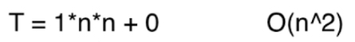

即使c1，c2很小，但是是二次方，因此是O(n^2)，性能差于O(n)。没错，理论性能差，但是对于一些小数据，如n=10，反倒是O(n^2)的要执行更快。

渐进时间复杂度，描述n趋近于无穷的情况。（3000）高阶算法常数低反而快于低阶算法: 高级排序算法，归并排序，快速排序，都可以对于小数据转为插入排序，获得10-15%优化，插入排序高阶但常数小。

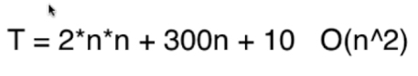

因为是趋向于无穷的情况，因此可以将其中的低阶项忽略掉。

### 分析动态数组的时间复杂度

添加操作 

```java
addLast(e) // O(1) 末尾添加，直接赋值，其他什么也不做。
```

O(1)意味着它与我们的数组规模没有关系,不管数组n有多大，addLast都能在常数时间内完成，此时不考虑size变化。

```java
addFirst(e) // O(n) 前面添加，所有元素后挪
```

n个元素，就要后挪n-1次。

```java
add(index, e)
```

与index有关。因此可以这样分析：index这么多取值的概率是相等的，严格计算需要一些概率论知识，求出时间期望；平均来看是O(n/2)

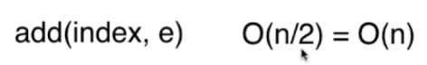

添加操作综合来看，整体是O(n)级别的。

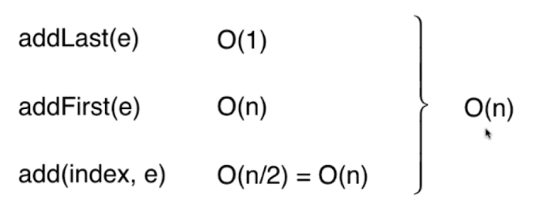

在算法复杂度分析上通常关注的是最坏的情况,有一些特例，下小节讲个特例。

```java
resize // O(n)级别
```

删除操作:

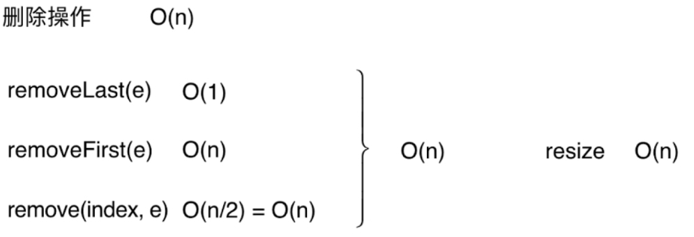

修改操作:

```java
set(index, e) // O(1)级别
```

查找操作:

```java
get(index) // O(1)
contains(e) // O(n)
find(e)  // O(n)
```


>数组最好情况是已知索引。

如果只对最后一个元素操作，addLast RemoveLast O(1)依然是O(n),因为resize把全部元素重新遍历赋值一遍。看起来resize好像是一个性能很差的操作。

对于resize的分析，使用最差情况是不合理的。下一小节使用均摊复杂度进行分析。

### 均摊复杂度和防止复杂度的震荡

添加操作

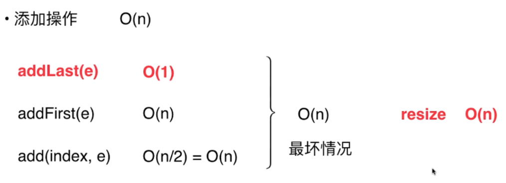

最坏情况下，尾部添加就扩容，从O(1)变成了O(n)级别;但是我们不可能每次操作都resize，10次才会触发一次resize。

假设当前capacity=8,并且每一次添加操作都使用addLast：

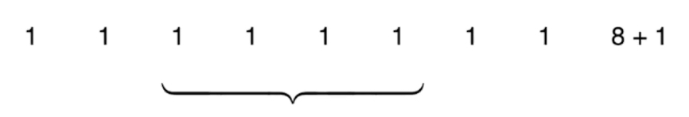

9次addLast操作，触发resize,总共进行了17次基本操作。大约平均每次addLast操作，进行2次基本操作。

推广开: 假设capacity = n, 第n+1次addLast,触发resize，总共进行2n+1次基本操作，平均每次addLast操作，进行2次基本操作。

>这就将resize的时间平均给了每一次addLast操作,这样均摊下来，时间复杂度是O(1)级别的！和n没有关系。

在这个例子里，这样均摊计算，比计算最坏情况有意义。均摊复杂度 amortized time complexity

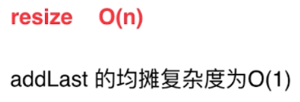

同理，我们看removeL ast操作，均摊复杂度也为0(1)

#### 复杂度震荡。

我们单独看removeLast和addLast,它的复杂度为O(1)

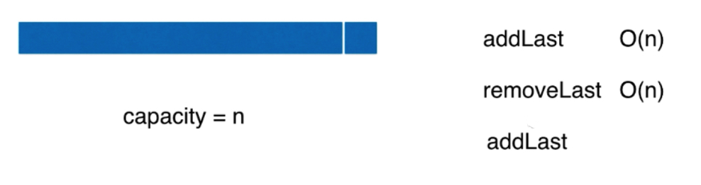

但当两个在capacity临界点，一次add 一次remove，会不停的触发resize。存在该情况，出现问题的原因: removeLast时resize过于着急
(Eager)

解决方案: Lazy

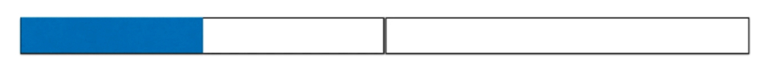

当数组size是当前容量的1/4，进行缩容量，缩1/2,则还有1/4空间可以加元素。size == capacity/4时，才将capacity减半。

Lazy方式，懒一下，算法性能更好。后面讲到线段树时还有例子:当更懒，改善算法性能(懒机制代码更多)。

```java
            if (size == data.length /4 && data.length/2 !=0)
                resize(data.length /2);
```

因为是整数除法，所以当length为1时，会造成等于0，而我们无法new一个容量为0的数组。

设计数据结构，存取数据。下集预告，栈与队列。


