我们会介绍两个全新的线性数据结构，栈与队列。

#### 栈Stack

栈也是一种线性结构;相比数组，栈对应的操作是数组的子集;只能从一端添加元素，也只能从一端取出元素(这一端称之为栈顶)

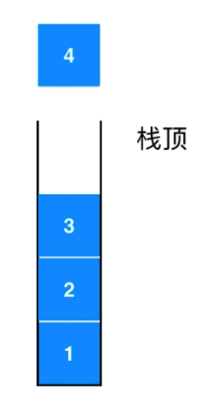

添加元素和取出元素都只能从栈顶位置开始存取。栈是一种后进先出的数据结构。Last ln First Out (LIFO);
在计算机的世界里，栈拥有着不可思议的作用

栈的应用: 无处不在的Undo操作(撤销) 

- 比如你打字: 沉迷学习无法自拔，然后将无法打成不法。

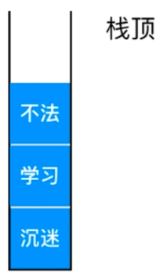

撤销就是将这个不法出栈，然后将后续的正确字都入栈。

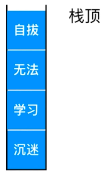

- 程序调用的系统栈(对于理解递归有作用)

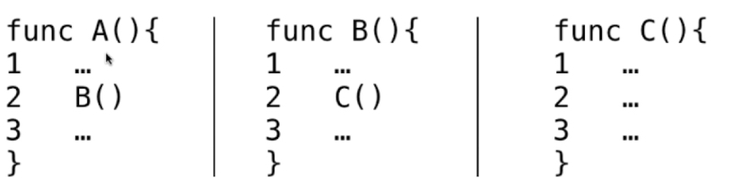

函数A运行到一半，调用函数B; B运行到一半，调用函数C;

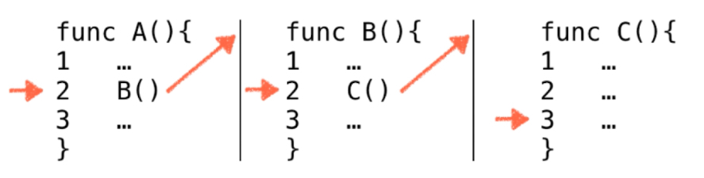

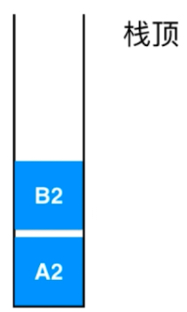 

A2指函数A运行到了第二行，B2指函数B运行到了第二行。当函数C顺序执行完毕之后，该执行哪一个函数呢，拿出栈顶B2继续执行。
当B函数执行完毕之后，拿出栈顶A2，执行A函数，执行完之后，发现栈为空，整个程序执行完毕。

子过程，子逻辑的调用，对于理解递归有作用。

### 栈的实现

```java
Stack<E>
void push(E e);      // 向栈中加入元素
E pop();           // 弹出栈顶元素
E peek( );         // 查看栈顶元素
int getSize();     // 获取栈中元素个数
boolean isEmpty(); // 判断栈是否为空
```

从用户的角度看，支持这些操作就好。具体底层实现，用户不关心，实际底层有多种实现方式。

```java
    Interface Stack<E> implement ArrayStack<E>
    int getSize();
    boolean isEmpty();
    void push(E e);
    E pop();
    E peek();
```

将我们栈中的常用方法作为一个接口，然后让我们上次实现的动态数组来实现这个接口。

```java
    /**
     * 获取数组最后一个元素(方便我们的栈实现)
     * 
     * @return
     */
    public E getLast(){
        return  get(size-1);
    }

    /**
     * 获取数组第一个元素
     * 
     * @return
     */
    public E getFirst(){
        return get(0);
    }
```

为Array添加两个方法方便我们的栈实现。

```java
package cn.mtianyan;

public class ArrayStack<E> implements Stack<E> {
    Array<E> array;
    public ArrayStack(int capacity){
        array = new Array<>(capacity);
    }

    public ArrayStack() {
        array = new Array<>();
    }

    public int getCapacity(){
        return array.getCapacity();
    }


    @Override
    public int getSize() {
        return array.getSize();
    }

    @Override
    public boolean isEmpty() {
        return array.isEmpty();
    }


    @Override
    public void push(E e) {
        array.addLast(e);
    }

    @Override
    public E pop() {
        return  array.removeLast();
    }

    @Override
    public E peek() {
        return array.getLast();
    }

    @Override
    public String toString() {
        StringBuilder res = new StringBuilder();
        res.append("Stack ：");
        res.append("[ ");
        for (int i = 0; i < array.getSize(); i++) {
            res.append(array.get(i));
            if (i != array.getSize()-1){
                res.append(", ");
            }
        }
        res.append("] top");
        return  res.toString();
    }

}
```

栈的设计中，用户只关注栈顶元素存取和栈长度。因此不需要提供其他对外方法。

```java
package cn.mtianyan;

public class ArrayStackTest {


    public static void main(String[] args) {
        ArrayStack<Integer> arrayStack = new ArrayStack<>();
        for (int i = 0; i < 5; i++) {
            arrayStack.push(i);
            System.out.println(arrayStack);
        }
        arrayStack.pop();
        System.out.println(arrayStack);
    }

}
```

运行结果:

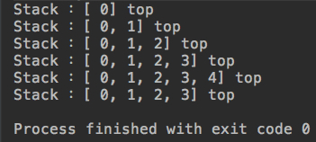

#### 栈的复杂度分析

```java
ArrayStack<E>
void push(E e)      // O(1) 均摊
E pop()             // O(1) 均摊
E peek()            // O(1)
int getSize()       // O(1)
boolean isEmpty()   // O(1)
```

这里的push和pop操作在最后面进行，有可能触发resize，但均摊来算是O(1)的。

### 栈的应用

undo操作-编辑器; 系统调用栈-操作系统;

应用: 括号匹配 - 编译器 LeetCode 问题(leetcode-cn.com) 美版的功能更丰富

https://leetcode-cn.com/problems/valid-parentheses/description/


许多公司真实的面试题。

>栈顶元素反映了在嵌套的层次关系中，最近的需要匹配的元素

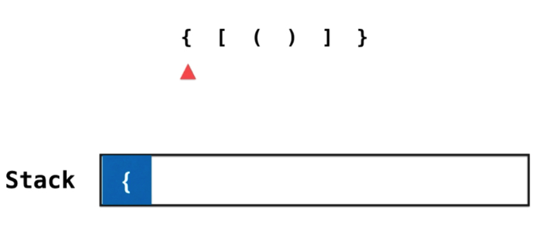

只要是左侧的括号，就压入栈内。

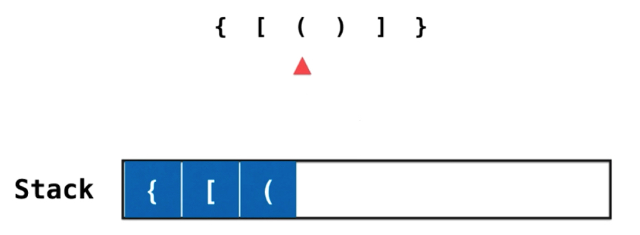

如上图所示，只要是左侧就压入栈。面对字符时右括号，开始查看当前栈顶元素是否可以和该右括号匹配，匹配则出栈。

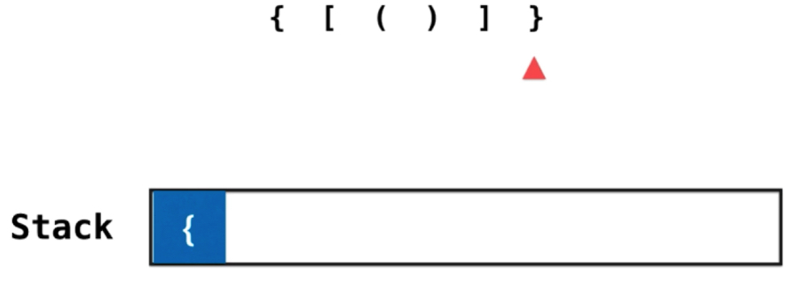

直到所有字符扫描完毕，栈为空则匹配成功。

失败的例子:

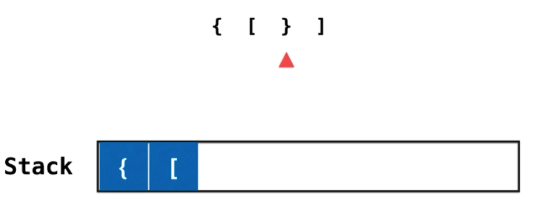

左侧括号全部入栈后，遇到的右括号无法和栈顶匹配,匹配失败。Leetcode会生成相应的语言的答题模板

```java
class Solution {
    public boolean isValid(String s) {
        
    }
}
```

这一小节我们使用`import java.util.Stack;`,但实际我们自己编写的Stack和java中的这个接口是一致的，下节课教大家在LeetCode用我们自己编写的Stack。

```java
package cn.mtianyan;

import java.util.Stack;

class Solution {
    public boolean isValid(String s) {
        Stack<Character> stack = new Stack<>();
        for (int i = 0; i < s.length(); i++) {
            char c = s.charAt(i); // String中的第i个字符
            if (c == '(' || c == '[' || c == '{'){
                stack.push(c);
            }else{
                if (stack.isEmpty())
                    return false;
                char topChar = stack.pop();
                if (c ==')' && topChar !='(')
                    return false;
                if (c ==']' && topChar !='[')
                    return false;
                if (c=='}' && topChar != '{')
                    return false;
            }
        }
        return stack.isEmpty();
    }
}
```

注意topChar时的pop操作，完成了取出栈顶元素和保存栈顶元素两个操作。

附加Python版本实现:

```python
class Solution:
    def isValid(self, s):
        """
        :type s: str
        :rtype: bool
        """
        stack = []
        for c in s:
        	if(c=='(' or c=='[' or c=='{'):
        		stack.append(c)
        	else:
        		if(len(stack) == 0):
        			return False
        		top_c = stack.pop()
        		if (c ==')' and top_c != '('):
        			return False
        		if (c ==']' and top_c !='['):
        			return False
        		if (c=='}' and top_c != '{'):
        			return False
        return len(stack)==0;
```

```python
if __name__ == '__main__':
	s = Solution()
	print(s.isValid("(]"))
```

Python版实现要注意list没有push方法，应该使用append方法代替; 注意栈为空(没有待匹配字符直接return False) Python中False是大写，python中获取长度使用len()方法。pop方法还是一样的。

### 关于LeetCode的更多说明

本地测试,Java版直接添加main函数

```java
public static void main(String[] args) {
        System.out.println(new Solution().isValid("()[]{}"));
        System.out.println(new Solution().isValid("([)]"));
    }
```

运行结果:

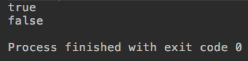

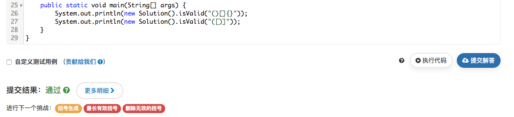

提交时即使添加了main函数也不会报错的。但是请注意不要将自己Package的语句也加入，会报错。

方法必须是public的，因为它会在类外创建自己的Main使用你的方法。


如果我们本地有自己的类接口等，我们可以通过内部类(可以使public也可以是private)来在LeetCode上使用。

```python
class Stack(object):
    """栈"""

    def __init__(self):
        self.items = []

    def is_empty(self):
        """判断是否为空"""
        return self.items == []

    def push(self, item):
        """加入元素"""
        self.items.append(item)

    def pop(self):
        """弹出栈顶元素"""
        return self.items.pop()

    def peek(self):
        """返回栈顶元素"""
        return self.items[len(self.items) - 1]

    def size(self):
        """返回栈的大小"""
        return len(self.items)


class Solution:
    def isValid(self, s):
        """
        :type s: str
        :rtype: bool
        """
        stack = Stack()
        for c in s:
            if c == '(' or c == '[' or c == '{':
                stack.push(c)
            else:
                if stack.size() == 0:
                    return False
                top_c = stack.pop()
                if c == ')' and top_c != '(':
                    return False
                if c == ']' and top_c != '[':
                    return False
                if c == '}' and top_c != '{':
                    return False
        return stack.size() == 0


if __name__ == '__main__':
    s = Solution()
    print(s.isValid("(]"))
    print(s.isValid("()"))
```

Python中不能使用内部类，而是应该该类与class Solution并列。这种提交方式，既可以检验我们的解题，对于我们自己编写的Array Stack也进行检验，值得推荐。

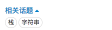

可以看到LeetCode的相关话题。点击可以找到栈相关的题目，可以进行专项练习。

#### 学习方法的疑问:

强烈推荐bobo老师的学习方法指导: https://zhuanlan.zhihu.com/p/35878826

>一个课程知识学好几遍，而不是硬扛着一遍强行看完。不懂的先留着，比如我就有一个自己的胡思乱想笔记，记录自己每个阶段遗留问题，日后这些遗留问题在自己学到更深度的知识的时候自然会解决。

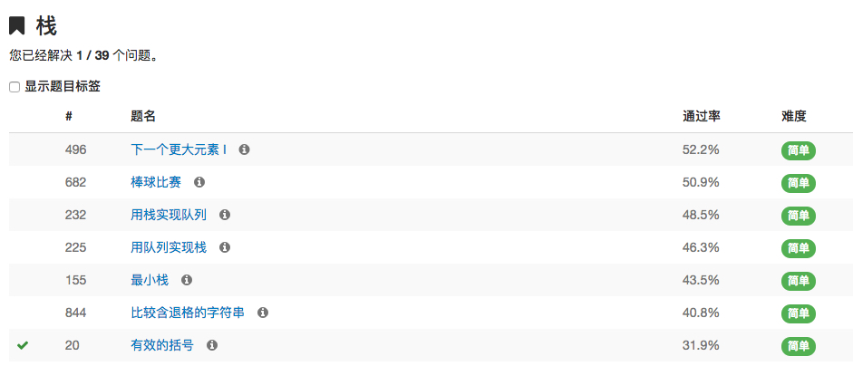

这39个问题看看自己感兴趣的，大概了解一下栈能解决什么问题。不是非得把问题做完，才能开始下一节。

不要完美主义。掌握好“度”;学习本着自己的目标去。

对于这个课程，大家的首要目标，是了解各个数据结构的底层实现原理,以及应用。学习到后面，再回头来看。

### 队列 Queue

队列也是一种线性数据结构; 相比数组，队列对应的操作是数组的子集

只能从一端 (队尾) 添加元素，只能从另一端 (队首) 取出元素

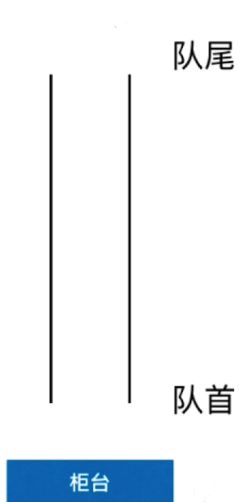

>就像一个银行的柜台，从队尾进入元素，在队首有柜台处理，处理了就可以出队。

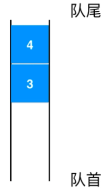

>出队从队首出队，1然后2。

队列是一种先进先出的数据结构(先到先得); First In First Out (FIFO)

```java
Queue<E>
void enqueue(E e); // 入队
E dequeue();       // 出队
E getFront();      // 获取队首元素
int getSize();      // 获取队列元素多少
boolean isEmpty();  // 是否为空
```

```java
Interface Queue<E> implement ArrayQueue<E>
void enqueue(E e); // 入队
E dequeue();       // 出队
E getFront();      // 获取队首元素
int getSize();      // 获取队列元素多少
boolean isEmpty();  // 是否为空
```

```java
package cn.mtianyan;

public interface Queue<E> {
    void enqueue(E e); // 入队
    E dequeue();       // 出队
    E getFront();      // 获取队首元素
    int getSize();      // 获取队列元素多少
    boolean isEmpty();  // 是否为空
}

```

```java
package cn.mtianyan;

public class ArrayQueue<E> implements Queue<E> {
    private Array<E> array;

    public ArrayQueue(int capacity) {
        this.array = new Array<>(capacity);
    }

    public ArrayQueue() {
        this.array = new Array<>();
    }

    public int getCapacity(){
        return array.getCapacity();
    }

    @Override
    public void enqueue(E e) {
        array.addLast(e);
    }

    @Override
    public E dequeue() {
        return array.removeFirst();
    }

    /**
     * 获取队首元素
     *
     * @return
     */
    @Override
    public E getFront() {
        return array.getFirst();
    }

    @Override
    public int getSize() {
        return array.getSize();
    }

    @Override
    public boolean isEmpty() {
        return array.isEmpty();
    }

    @Override
    public String toString() {
        StringBuilder res = new StringBuilder();
        res.append("Queue ：");
        res.append("front [ ");
        for (int i = 0; i < array.getSize(); i++) {
            res.append(array.get(i));
            if (i != array.getSize()-1){
                res.append(", ");
            }
        }
        res.append("] tail");
        return  res.toString();
    }

    public static void main(String[] args) {
        ArrayQueue<Integer> queue = new ArrayQueue<>();
        for (int i = 0; i < 5; i++) {
            queue.enqueue(i);
            System.out.println(queue);
        }
        queue.dequeue();
        System.out.println(queue);
    }
}
```

运行结果:

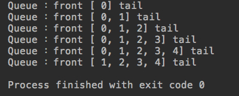

#### 数组队列的复杂度分析

```java
ArrayQueue<E>

void enqueue(E e); // 入队 O(1) 均摊
E dequeue();       // 出队 O(n)
E getFront();      // 获取队首元素 O(1)
int getSize();      // 获取队列元素多少 O(1)
boolean isEmpty();  // 是否为空 O(1)
```

这里入队是从队尾，有可能触发resize，因此均摊下来是O(1)。出队是在队首，数组实现每次都要挪动所有元素,O(n)。

获取队首元素，get(0)，O(1)。剩下两个也是常数级别完成，O(1);  使用循环队列实现即可。

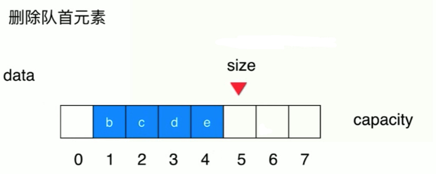

可不可以在把a删除之后，不挪动bcde呢？

>剩下的元素仍然保持着先后顺序，我们可以记录一下当前的队首是谁？

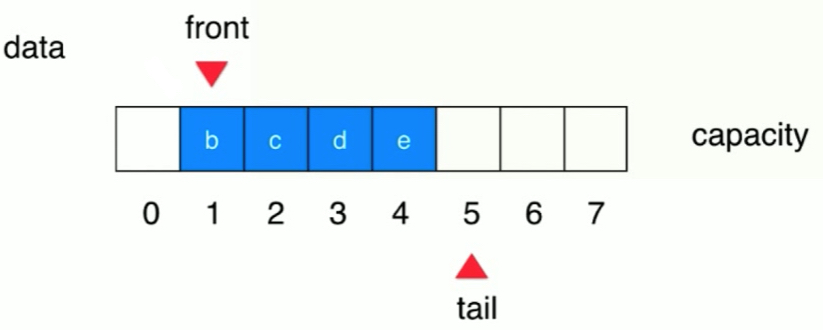

>(front++)就可以了，tail位置不用变。

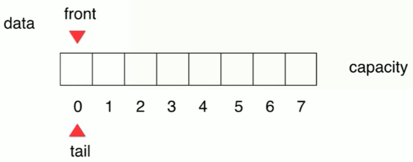

front == tail 队列为空。只要队列不为空，front 就不可能等于 tail

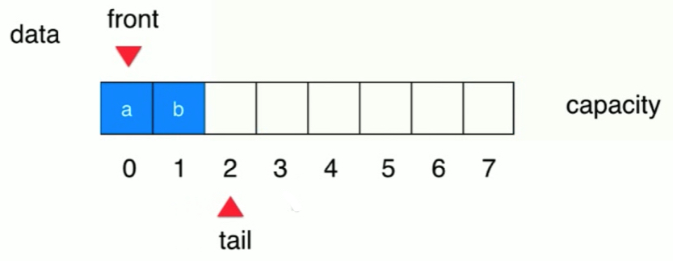

入队时不需要考虑front，只需要tail++;出队时，tail不变，front++就可以了。

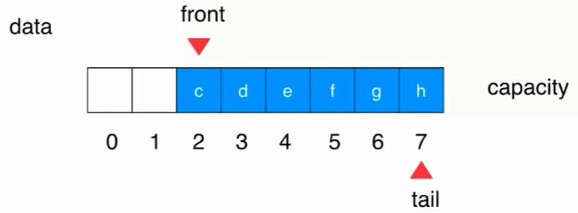

当tail指向队尾末，再++就会移到越界区域时，前面还有空余空间，把元素填充到前面去。

把数组看成一个环，容量是8，索引0-7。当指向7之后的位置，就变成0了，tail = (7+1)%8 即可。


此时如果再放入元素，tail往后移，front = tail 了，但此时队列为满。

front == tail 队列为空; tail+ 1==front 队列满; 此时就可以扩容了。准确的是(tail +1)%capacity == front队列满

对于整个的capacity中，故意的浪费了一个空间。循环队列类似于钟表时针转动到12.

#### 循环队列代码的基本实现

```java
package cn.mtianyan;

import java.util.Arrays;

public class LoopQueue<E> implements Queue<E> {

    private E[] data;
    private int front, tail; // 队首和下一个空位置索引
    private int size;        // 可以没有size，自己尝试

    public LoopQueue(int capacity) {
        data = (E[]) new Object[capacity+1]; // 因为会有一个浪费
        front = 0;
        tail = 0;
        size = 0;
    }

    public LoopQueue() {
        this(10);
    }

    public int getCapacity(){
        return data.length-1;
    }

    @Override
    public void enqueue(E e) {
        if (isFull()){
            resize(getCapacity()*2);
        }
        data[tail] = e;
        tail = (tail+1) % data.length;
        size++;
    }

    private void resize(int newCapacity) {
        E[] newData = (E[]) new Object[newCapacity +1];
        for (int i = 0; i < size; i++) {
            newData[i] = data[(i+front) % data.length]; // 此时在newData中队首对齐回来，data中就得有一个front的偏移量
        }
        data = newData;
        front = 0;
        tail = size;
    }

    @Override
    public E dequeue() {
       if (isEmpty()){
           throw new IllegalArgumentException("Cannot dequeue from an empty queue");
       }
       E ret = data[front];
       data[front] = null;
       front = (front+1) % data.length;
       size--;
       if(size == getCapacity()/4 && getCapacity()/2 != 0){
           resize(getCapacity()/2);
       }
       return ret;
    }

    @Override
    public E getFront() {
        if (isEmpty()){
            throw new IllegalArgumentException("Cannot dequeue from an empty queue");
        }
        return data[front];
    }

    @Override
    public int getSize() {
        return size;
    }

    @Override
    public boolean isEmpty() {
        return front == tail;
    }
    public boolean isFull(){
        return (tail +1)%data.length ==front; // 下一个tail指向front
    }

    @Override
    public String toString() {
        StringBuilder res = new StringBuilder();
        res.append(String.format("LoopQueue: size = %d, capacity = %d\n",size,getCapacity()));
        res.append("front [");
        for (int i = front; i != tail; i = (i+1)%data.length) {
            res.append(data[i]);
            if ((i+1)%data.length !=tail) // 最后一个元素不要加，
                res.append(", ");
        }
        res.append("] tail");
        return res.toString();
    }
    public static void main(String[] args) {
        LoopQueue<Integer> queue = new LoopQueue<>();
        for (int i = 0; i < 5; i++) {
            queue.enqueue(i);
            System.out.println(queue);
            if(i %3 == 2){
                queue.dequeue();
                System.out.println(queue);
            }
        }
    }
}

```

运行结果:

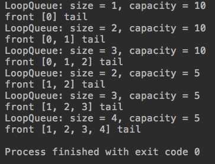

这里的resize和toString中我们使用了两种不同的遍历方式。一种是size次，元素取值时index偏移量;一种是头不等于尾，i按照循环取值规则向后++。

用户在使用数据结构时，只需要了解接口中设计的方法，其他内部实现对于用户进行了隐藏，比如内部的capacity+1等操作。

循环队列的出队复杂度也变成了O(1),具体的性能对比我们下一节来对比。

### 循环队列的复杂度分析 

```java
ArrayQueue<E>

void enqueue(E e); // 入队 O(1) 均摊
E dequeue();       // 出队 O(1) 均摊
E getFront();      // 获取队首元素 O(1)
int getSize();      // 获取队列元素多少 O(1)
boolean isEmpty();  // 是否为空 O(1)
```

出队操作可能触发缩容。具体O(n)比O(1)慢多少。

对10万个元素入队出队看时间。

```java
package cn.mtianyan;

import java.util.Random;

public class Main {
    /**
     * 测试使用q运行optCount个enqueue和deQueue操作所需时间。单位: 秒
     *
     * @param q
     * @param opCount
     * @return
     */
    private static double testQueue(Queue<Integer> q,int opCount){
        long startTime = System.nanoTime();

        Random random = new Random();

        for (int i = 0; i < opCount; i++) {
            q.enqueue(random.nextInt(Integer.MAX_VALUE)); // 生成从0到int最大值
        }
        for (int i = 0; i < opCount; i++) {
            q.dequeue();
        }

        long endTime = System.nanoTime(); // 纳秒

        return (endTime - startTime)/ 1e9;
    }

    public static void main(String[] args) {
        int opCount = 100000;
        ArrayQueue<Integer> arrayQueue = new ArrayQueue<>();
        double time1 = testQueue(arrayQueue, opCount);
        System.out.println("ArrayQueue出队入队"+opCount+"次的时间: "+time1+"秒");
        LoopQueue<Integer> loopQueue = new LoopQueue<>();
        double time2 = testQueue(loopQueue, opCount);
        System.out.println("loopQueue出队入队"+opCount+"次的时间: "+time2+"秒");
    }
}
```

运行结果:

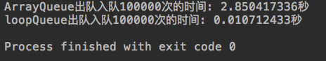

对于100万的运行结果:

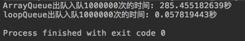

两者的差距主要在出队的过程中。对于ArrayQueue来说，每出一次队，队首后面的所有元素都得挪动一次。出队操作复杂度是O(n),相应而言，对于ArrayQ，整个testQueue的复杂度就是O(n^2)，因为每次O(n)，for循环有n次。对于LoopQueue的testQueue: 每次都是O(1)，for循环有n次，因此testQueue()为O(n)。

性能对比:

|Queue类型 |循环次数 |时间| 倍数|
|----------|---------|----|-----|
|LoopQueue  |10万    |0.01 |1(基准)|
|ArrayQueue |10万    |2.85  | 285|
|LoopQueue  |100万   | 0.06  |1(基准) |
|ArrayQueue |100万   |285.46 |4758|

 这是对于O(n)以及O(n^2) 的性能对比，可以看出性能差异巨大。对于同一种Queue实现，我们依然可以根据(0.06/0.01)=6 数据量扩大十倍，时间复杂度扩大了6倍,验证O(n); (285.46/2.85)=100，数据量扩大10倍，时间复杂度扩大了100倍，验证O(n^2)。

更合理的测试方法是对于testQueue也进行多次，取平均值。和JVM也会有关。

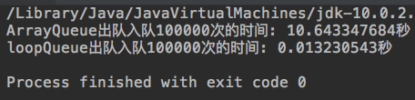

>同一台电脑，我改为java10运行。不知为什么比java8的运行速度慢了很多。

队列的应用: 排队，操作系统任务排队。队首的定义，存在广义队列，后面会学。此处我们学到的普通队列，在后面的广度优先遍历，二叉树时也可以学到。

下一章，我们将讲解链表。


