本章我们介绍链表

前面我们已经介绍了动态数组，栈和队列。

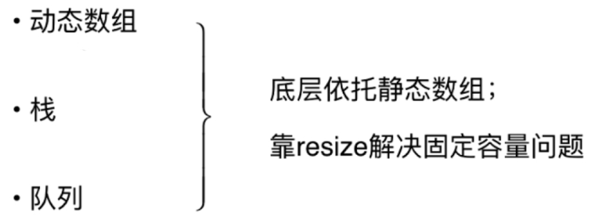

它们的底层依托静态数组;靠resize解决固定容量问题

链表是我们接触的第一个真正的动态数组。

### 为什么链表很重要

链表是重点，也是难点。它是最简单动态数据结构;后续我们还会学习更多的，比如二分搜索树，平衡二叉树，红黑树，后面很多的动态数据结构都可以在理解链表的基础上学习。

链表可以让我们更深入的理解引用(C++中指针)，内存管理等有更深理解。对于更深入的理解递归有好处，树形中递归必须理解。

链表可以辅助组成其他数据结构。

#### 链表Linked List

数据存储在“节点”(Node)中;

```java
class Node{
  E e;
  Node next;
}
```

车厢和车厢进行连接，使用next进行连接。

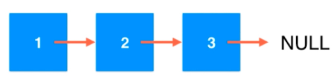

最后一个节点的next指向空，说明这个节点是最后一个节点了。优点:真正的动态，不需要处理固定容量的问题

>不像数组一下子必须new出来一片空间，需要考虑空间不够用或浪费。链表是你需要多少个数据，就生成多少个节点将他挂接起来，这就是所谓的动态的意思。

缺点: 丧失了随机访问的能力。不能像数组一样，给定一个索引直接拿出对应元素。底层机制中数组开辟的空间在内存中是连续分布的，我们可以直接寻找索引对应的偏移，直接计算出数据所存储的内存地址，直接用O(1)复杂度拿出。链表靠next连接，每个节点存储地址不同，我们只能通过next顺藤摸瓜找到我们要找的元素。

数组最好用于索引有语意的情况。scores[2] 2是学号，身份证号不能做索引;最大的优点:支持快速查询。

>我们在编写动态数组，但是其实这类索引没有语义的情况更适合链表。

链表不适合用于索引有语意的情况。最大的优点:动态

什么时候适合使用数组，什么时候适合使用链表。

#### 链表实现

```java
package cn.mtianyan;

public class LinkedList<E> {

    // private设计，不被用户感知
    private class Node{
        public E e;
        public Node next; // c++实现时是指针

        public Node(E e, Node next) {
            this.e = e;
            this.next = next;
        }

        public Node(E e) {
            this.e = e;
            this.next = null;
        }

        public Node() {
            this(null,null);
        }

        @Override
        public String toString() {
            return "Node[" +
                    "e=" + e +
                    ", next=" + next +
                    ']';
        }
    }
}
```

上面是我们对于链表节点的设计。注意private设计，以及Node的成员变量Node

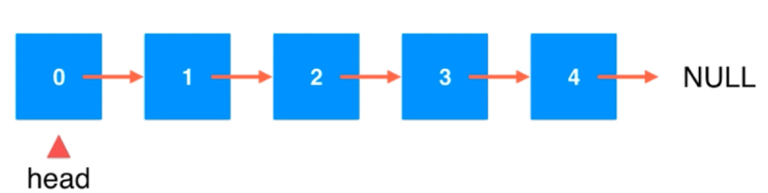

应该有一个链表头,声明出LinkedList基本的成员变量。

```java
 private Node head;
    private int size;

    public LinkedList() {
        head = null;
        size = 0;
    }

    public LinkedList(Node head, int size) {
        this.head = head;
        this.size = size;
    }

    /**
     * 从数组创建链表的方法，待完善。
     *
     * @param e
     */
    public LinkedList(E[] e){

    }

    /**
     * 获取链表中元素个数
     *
     * @return
     */
    public int getSize(){
        return size;
    }

    /**
     * 返回链表是否为空
     *
     * @return
     */
    public boolean isEmpty(){
        return size == 0;
    }
```

上面是链表中应该有的成员变量和一些普通方法。

在链表头添加元素是非常方便的，数组在数组尾部添加元素不用挪位会非常方便。数组中有size指向下一个空位置跟踪队尾，链表中有head来标识链表的头部。

```java
node.next = head
head = node
```

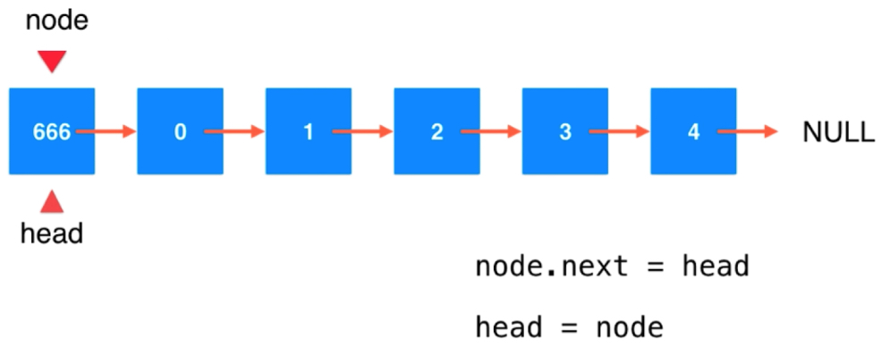

```java
    public void addFirst(E e){
        //        Node node = new Node(e);
        //        node.next = head;
        //        head = node;

        // 上面三行代码的等价实现
        head = new Node(e,head); // 值为e的Node的next是head;head = 这个Node
        size++;
    } 
```

上面有两种等价的实现。

在索引为2的地方添加元素666,要找到之前的节点。关键:找到要添加的节点的前一个节点。前一个节点要特殊处理

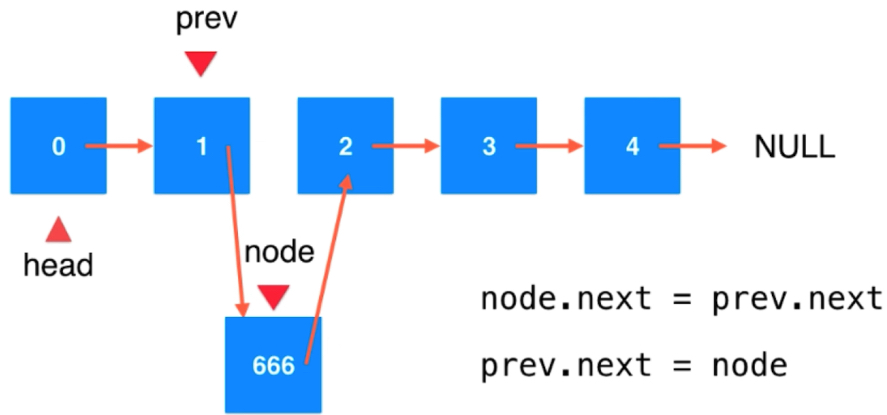

顺序是很重要的，不能颠倒。否则会丢失原本的prev.next。大多时候顺序可以省下一个old的备份临时变量。

```java
    /**
     * 在链表的index(0-based)位置添加新的元素e
     * 在链表中不是一个常用的操作，练习题用,面试用。
     * @param index
     * @param e
     */
    public void add(int index,E e){
        // index可以取到size，在链表末尾空位置添加元素。
        if (index < 0 || index >size){
            throw new IllegalArgumentException("Add failed. Illegal index");
        }
        Node prevNode = head;
        // 因为有了dummyHead，多遍历一次，遍历index次
        for (int i = 0; i < index-1; i++) {
            // 验证。 12 index 1添加，index-1=0一次也不执行，正好是head。符合
            // 验证。 1234 index 2添加，index-1=1 运行一次pre指向head下一个也就是2，符合。
            prevNode = prevNode.next;
        }
        //        Node insertNode = new Node(e);
        //        insertNode.next = prevNode.next;
        //        prevNode.next = insertNode;
        prevNode.next = new Node(e,prevNode.next); // 后半截是前两句完成任务

        size++;
    }
```

链表的添加操作时，要找的是前一个节点。而我们之前定义的头结点因为没有前一个节点，需要进行特殊处理,这样不够优雅。而如果我们往前面加一个虚拟的头结点，则可以将我们现在的头结点和其他节点统一起来。

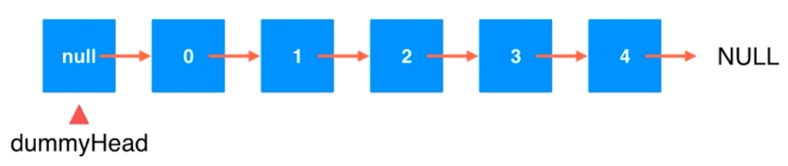

```java
    private Node dummyHead;
    
    public LinkedList() {
        dummyHead = new  Node(null,null);
        size = 0;
    }
```

虚拟头结点对用户屏蔽不可见。

```java
    /**
     * 在链表的index(0-based)位置添加新的元素e
     * 在链表中不是一个常用的操作，练习题用,面试用。
     * @param index
     * @param e
     */
    public void add(int index,E e){
        // index可以取到size，在链表末尾空位置添加元素。
        if (index < 0 || index >size){
            throw new IllegalArgumentException("Add failed. Illegal index");
        }
        Node prevNode = dummyHead;
        // 因为有了dummyHead，多遍历一次，遍历index次
        for (int i = 0; i < index; i++) {
            // 验证。 12 index 1添加，index-1=0一次也不执行，正好是head。符合
            // 验证。 1234 index 2添加，index-1=1 运行一次pre指向head下一个也就是2，符合。
            prevNode = prevNode.next;
        }
        //        Node insertNode = new Node(e);
        //        insertNode.next = prevNode.next;
        //        prevNode.next = insertNode;
        prevNode.next = new Node(e,prevNode.next); // 后半截是前两句完成任务

        size++;
    }

    /**
     * 在链表头添加新元素e
     */
    public void addFirst(E e){
        add(0,e);
    }

    /**
     *  在链表末尾添加新的元素e
     */
    public void addLast(E e){
        add(size,e);
    }
```

添加元素操作时，注意指向，以及循环次数的验证。

```java
/**
     *  获得链表的第index(0-based)位置元素
     *  链表中不是常用操作，练习用
     * @param index
     * @return
     */
    public E get(int index){
        // index不可以取到size，索引从0开始，最多取到size-1
        if (index < 0 || index >=size){
            throw new IllegalArgumentException("Add failed. Illegal index");
        }
        Node cur = dummyHead.next; // 从索引为0元素开始
        // 下面与找index-1个节点保持一致。上面执行了一次。所以从index-1个元素变成了找index个元素。
        for (int i = 0; i < index; i++) {
            cur = cur.next;
        }
        return cur.e;

    }

    public E getFirst(){
        return get(0);
    }

    public E getLast(){
        return get(size-1);
    }
```

插入时我们要寻找的是index的前一个位置，而get时，我们要找的就是index的当前位置，因此要多找一次，在for循环不变情况下，从虚拟头结点下一个节点开始遍历。

```java
 /**
     * 修改链表的第index(0-based)个位置的元素为e
     * 在链表中不是一个常用的操作，练习用
     */
    public void set(int index,E e){
        // index不可以取到size，索引从0开始，最多取到size-1
        if (index < 0 || index >=size){
            throw new IllegalArgumentException("Set failed. Illegal index");
        }
        Node cur = dummyHead.next; // 从索引为0元素开始
        // 下面与找index-1个节点保持一致。上面执行了一次。所以从index-1个元素变成了找index个元素。
        for (int i = 0; i < index; i++) {
            cur = cur.next;
        }
        cur.e = e;
    }

  /**
     *     查找链表中是否有元素e
     */
    public boolean contains(E e){
        Node cur = dummyHead.next;
        while (cur != null){
            if (cur.e.equals(e)){
                return true;
            }
            cur = cur.next;
        }
        return false;
    }
```

```java
 @Override
    public String toString() {
        StringBuilder res = new StringBuilder();
//        Node cur = dummyHead.next;
//        while (cur != null){
//            res.append(cur.e +"->");
//            cur = cur.next;
//        }
//        res.append("NULL");
        res.append("head: ");
        for (Node cur=dummyHead.next;cur !=null;cur=cur.next){
            res.append(cur.e +"->");
        }
        res.append("NULL");
        return res.toString();
    }
```

两种不同的遍历方式是等价的。

```java
package cn.mtianyan;

public class Main {

    public static void main(String[] args) {
	    LinkedList<Integer> linkedList = new LinkedList<>();
        for (int i = 0; i < 5; i++) {
            linkedList.addFirst(i);
            System.out.println(linkedList);
        }
        linkedList.add(2,888);
        System.out.println(linkedList);
    }
}

```

运行结果:

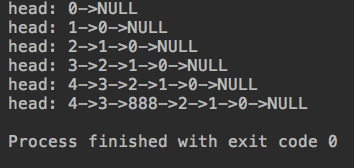

#### 删除元素

删除索引为2位置的元素

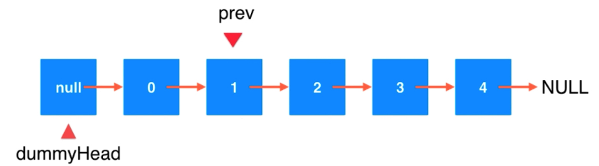

要找到它之前的元素。

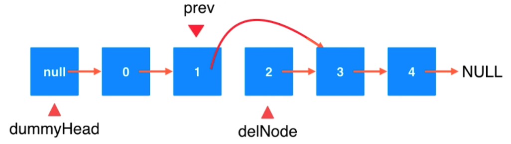

```java
prev.next = delNode.next
delNode.next = null
```

- 链表元素删除时常见的错误。

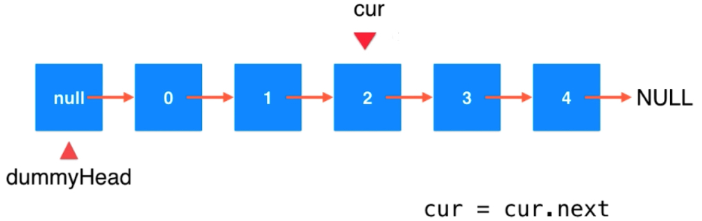

cur 指向cur.next的位置。本质是对于引用概念糊涂，Java中类的对象都是一个引用，理解成一个实际内存的指向。cur = cur.next从原来指的位置，指到下一个位置，但对于链表来说没有发生任何改变。要想改变链表就应该改变节点的next指向。

```java
    /**
     * 删除链表中指定index位置的元素
     * @param index
     * @return
     */
    public E remove(int index){
        if (index < 0 || index >=size){
            throw new IllegalArgumentException("Set failed. Illegal index");
        }
        Node prev = dummyHead;
        for (int i = 0; i < index; i++) {
            prev = prev.next;
        }
        Node retNode = prev.next;
        prev.next = retNode.next;
        retNode.next = null;

        size--;

        return retNode.e;
    }

    public E removeFirst(){
        return remove(0);
    }

    public E removeLast(){
        return remove(size-1);
    }
```

```java
        linkedList.remove(2);
        System.out.println(linkedList);
        linkedList.removeFirst();
        System.out.println(linkedList);
        linkedList.removeLast();
        System.out.println(linkedList);
```

运行结果:

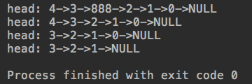

#### 链表时间复杂度分析

- 添加操作:

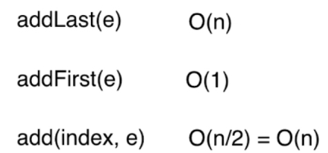

O(n)是因为往链表尾部添加，要遍历整个链表节点。O(n/2)可以看做操作中间的节点。

- 删除操作:

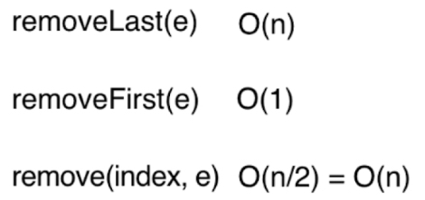

- 修改操作:

```java
set(index e)  // O(n/2) = O(n)
```

- 查找操作:

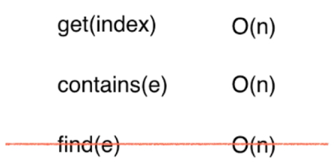

get 和 contains 都是O(n/2) find操作是根据元素找index，链表中index没啥用。

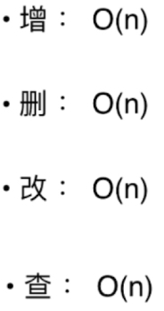

看起来，链表的增删改查全都是O(n)级别的，比数组看起来差。链表没有索引，无法像数组一样快速访问。

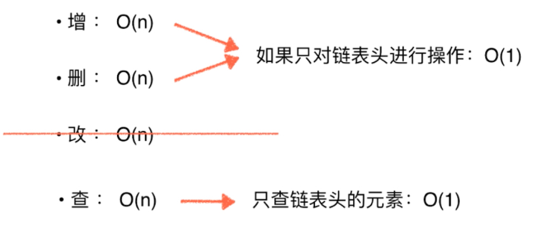

此时我们能利用的方法复杂度都是O(1)了;链表的改进，比数组节省空间。最基础动态数据结构，对二叉树平衡二叉树的学习都能有辅助作用。

#### 链表实现栈

只对链表头进行操作，也就是只能对一端进行操作，很明显是栈。队列是要对两端都进行操作的。链表头作为栈顶。

```java
    Interface Stack<E> implement LinkedListStack<E>
    int getSize();
    boolean isEmpty();
    void push(E e);
    E pop();
    E peek();
```

比较两个栈的性能差异。

```java
package cn.mtianyan;

public class LinkedListStack<E> implements Stack<E> {
    private LinkedList<E> list;

    public LinkedListStack() {
        list = new LinkedList<>();
    }

    @Override
    public int getSize() {
        return list.getSize();
    }

    @Override
    public boolean isEmpty() {
        return list.isEmpty();
    }

    @Override
    public void push(E e) {
        list.addFirst(e);
    }

    @Override
    public E pop() {
        return list.removeFirst();
    }

    @Override
    public E peek() {
        return list.getFirst();
    }

    @Override
    public String toString() {
        StringBuilder res = new StringBuilder();
        res.append("LinkedList Stack ：");
        res.append(list);
        return  res.toString();
    }
}
```

```java
    public static void main(String[] args) {
        LinkedListStack stack = new LinkedListStack();

        for (int i = 0; i < 5; i++) {
            stack.push(i);
            System.out.println(stack);
        }

        stack.pop();
        System.out.println(stack);
    }
```

运行结果:

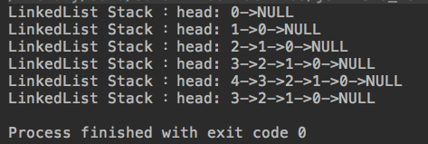

```java
package cn.mtianyan;

import java.util.Random;

public class mainTwoTest {

    // 测试使用stack运行opCount个push和pop操作所需要的时间，单位：秒
    private static double testStack(Stack<Integer> stack, int opCount){

        long startTime = System.nanoTime();

        Random random = new Random();
        for(int i = 0 ; i < opCount ; i ++)
            stack.push(random.nextInt(Integer.MAX_VALUE));
        for(int i = 0 ; i < opCount ; i ++)
            stack.pop();

        long endTime = System.nanoTime();

        return (endTime - startTime) / 1e9;
    }

    public static void main(String[] args) {

        int opCount = 100000000;

        ArrayStack<Integer> arrayStack = new ArrayStack<>();
        double time1 = testStack(arrayStack, opCount);
        System.out.println("ArrayStack, time: " + time1 + " s");

        LinkedListStack<Integer> linkedListStack = new LinkedListStack<>();
        double time2 = testStack(linkedListStack, opCount);
        System.out.println("LinkedListStack, time: " + time2 + " s");

        // 其实这个时间比较很复杂，因为LinkedListStack中包含更多的new操作
    }
}
```

其实这个时间是比较不确定谁大谁小的。

运行结果:

100000000 数据:

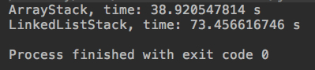

10000000 数据:

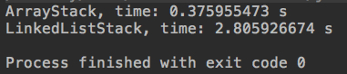

1000000 数据:

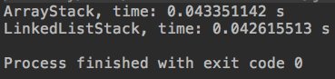

100000 数据:

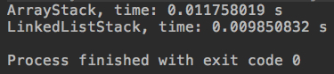

基本可以看出，数据量小于100万的时候LinkedList比较有优势，数据量大时ArrayList更优。但它们实际是同样级别时间复杂度的,最多相差几倍。

### 链表实现队列

队列势必会在链表的两端同时操作，一端为O(1）一端为O(n)；使用数组时我们也遇到了这个问题，因此我们产生了使用循环队列的方式。

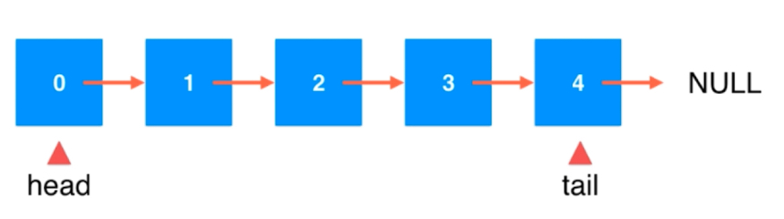

链表中我们为什么对于链表头部的操作都简单一些呢，因为我们有一个标识的head。那么想让尾部也可以操作简单，设置一个tail变量。从两端插入元素都是很容易的。

tail端前一个节点不容易找，得遍历一遍。此时: head添加删除都容易，tail添加容易，删除不易。

因此队列从head端删除元素，从tail端插入元素。head 队首负责出队，tail队尾负责入队。由于没有dummyHead，要注意链表为空的情况

```java
package cn.mtianyan;

public class LinkedListQueue<E> implements Queue<E> {

    private class Node{
        public E e;
        public Node next;

        public Node(E e, Node next){
            this.e = e;
            this.next = next;
        }

        public Node(E e){
            this(e, null);
        }

        public Node(){
            this(null, null);
        }

        @Override
        public String toString(){
            return e.toString();
        }
    }

    private Node head, tail;
    private int size;

    public LinkedListQueue(){
        head = null;
        tail = null;
        size = 0;
    }

    @Override
    public int getSize(){
        return size;
    }

    @Override
    public boolean isEmpty(){
        return size == 0;
    }

    @Override
    public void enqueue(E e){
      // 如果队尾为空，说明队列是空的。因为tail一直指向最后一个非空节点。
        if(tail == null){
            tail = new Node(e);
            head = tail;
        }
        else{
            // 使用tail.next把新Node挂载上来。
            tail.next = new Node(e);
            // tail后挪
            tail = tail.next;
        }
        size ++;
    }

    @Override
    public E dequeue(){
        if(isEmpty())
            throw new IllegalArgumentException("Cannot dequeue from an empty queue.");

        Node retNode = head;
        head = head.next; // head后移
        retNode.next = null; // 元素置空
        if(head == null) // 如果头结点都没得删了
            tail = null;
        size --;
        return retNode.e;
    }

    @Override
    public E getFront(){
        if(isEmpty())
            throw new IllegalArgumentException("Queue is empty.");
        return head.e;
    }

    @Override
    public String toString(){
        StringBuilder res = new StringBuilder();
        res.append("Queue: front ");

        Node cur = head;
        while(cur != null) {
            res.append(cur + "->");
            cur = cur.next;
        }
        res.append("NULL tail");
        return res.toString();
    }

    public static void main(String[] args){

        LinkedListQueue<Integer> queue = new LinkedListQueue<>();
        for(int i = 0 ; i < 5 ; i ++){
            queue.enqueue(i);
            System.out.println(queue);

            if(i % 3 == 2){
                queue.dequeue();
                System.out.println(queue);
            }
        }
    }
}
```

运行结果:

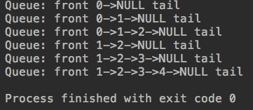

测试性能差异:

```java
package cn.mtianyan;

import java.util.Random;

public class MainThree {

    // 测试使用q运行opCount个enqueueu和dequeue操作所需要的时间，单位：秒
    private static double testQueue(Queue<Integer> q, int opCount){

        long startTime = System.nanoTime();

        Random random = new Random();
        for(int i = 0 ; i < opCount ; i ++)
            q.enqueue(random.nextInt(Integer.MAX_VALUE));
        for(int i = 0 ; i < opCount ; i ++)
            q.dequeue();

        long endTime = System.nanoTime();

        return (endTime - startTime) / 1000000000.0;
    }

    public static void main(String[] args) {

        int opCount = 100000;

        ArrayQueue<Integer> arrayQueue = new ArrayQueue<>();
        double time1 = testQueue(arrayQueue, opCount);
        System.out.println("ArrayQueue, time: " + time1 + " s");

        LoopQueue<Integer> loopQueue = new LoopQueue<>();
        double time2 = testQueue(loopQueue, opCount);
        System.out.println("LoopQueue, time: " + time2 + " s");

        LinkedListQueue<Integer> linkedListQueue = new LinkedListQueue<>();
        double time3 = testQueue(linkedListQueue, opCount);
        System.out.println("LinkedListQueue, time: " + time3 + " s");
    }
}
```

运行结果:

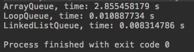

链表是一种适合用来学习递归的数据结构。下一章我们将对于链表和递归的相关知识进行学习。


