前面我们实现了一个单链表，用它又实现了栈和队列，实现队列时对于链表进行了改进。链表与递归，递归和树联系在一起。但链表天然和递归有关，链表的递归学习会对后面我们理解树相关递归有帮助。

LeetCode问题，不以我们自己的链表类实现为基础，它上面的很多以节点为中心。

https://leetcode-cn.com/problems/remove-linked-list-elements/description/

203. 删除链表中的节点

删除链表中等于给定值 val 的所有节点。

示例:

```java
输入: 1->2->6->3->4->5->6, val = 6
输出: 1->2->3->4->5
```

注意: 两个6都要删除。

```java
/**
 * Definition for singly-linked list.
 * public class ListNode {
 *     int val;
 *     ListNode next;
 *     ListNode(int x) { val = x; }
 * }
 */
class Solution {

    public ListNode removeElements(ListNode head, int val) {
    }
}
```

可以看到LeetCode给我们的Solution模板中有注释代码，有一个已经定义好的ListNode类，只是告诉我们底下Solution中的方法可以使用这个对象，对象里存储了怎样的成员变量。listNode不能被提交。

我们新建工程: 创建Solution类，将LeetCode的模板粘贴进来，我们没有ListNode类，因此要新建一个ListNode类。

```java
package cn.mtianyan;

public class ListNode {
        int val;
        ListNode next;
        ListNode(int x) { val = x; }
}
```

想要删除一个元素，要找到这个节点之前的那个节点才方便删除。对于头结点要特殊处理，或使用虚拟头结点。

```java
        if (head != null && head.val == val){
            
        }
```

这句话是对于头结点做单独处理，但是前提条件是head非空。

```java
        if (head != null && head.val == val){
            ListNode delNode = head;    // 保存head对象
            head = head.next;           // head后移
            delNode.next = null;        // head脱离链表
        }
```

通过上面的代码我们可以成功的删除头结点，但是有可能新的头结点还是等于val。因此应该变为while循环。

```java
        while (head != null && head.val == val){
            ListNode delNode = head;    // 保存head对象
            head = head.next;           // head后移
            delNode.next = null;        // head脱离链表
        }
```

这样就把开头的都删除了。

```java
        if (head == null)
            return null;
```

这里要考虑到链表中全部元素都是val，上面的while就删除完了。

```java
while (prev.next != null){
            if (prev.next.val == val){
                ListNode delNode = prev.next;
                prev.next = delNode.next; // prev.next.next
                delNode.next = null;
                // 这里prev不需要后挪，因为删除之后，prev.next节点已经变了，有可能还是val要删除。
            }else {
                prev = prev.next;
            }
        }
```

在LeetCode上提交代码我们不需要考虑内存泄漏等问题，它运行完一定会被回收，因此代码可以简化。

```java
class Solution {

    public ListNode removeElements(ListNode head, int val) {
        while (head != null && head.val == val){
            // ListNode delNode = head;    // 保存head对象
            head = head.next;           // head后移
            // delNode.next = null;        // head脱离链表
        }
        if (head == null)
            return null;
        ListNode prev =head;
        while (prev.next != null){
            if (prev.next.val == val){
                // ListNode delNode = prev.next;
                prev.next = prev.next.next; // prev.next.next
                // delNode.next = null;
                // 这里prev不需要后挪，因为删除之后，prev.next节点已经变了，有可能还是val要删除。
            }else {
                prev = prev.next;
            }
        }
        return head;
    }
}
```

#### 使用虚拟头结点实现方式。

```java
package cn.mtianyan;

class SolutionDummyHead {

    public ListNode removeElements(ListNode head, int val) {
        ListNode dummyHead = new ListNode(-1); // 因为不会被访问，值随便。
        dummyHead.next = head;

        ListNode prev =dummyHead;
        while (prev.next != null){
            if (prev.next.val == val){
                ListNode delNode = prev.next;
                prev.next = prev.next.next; // prev.next.next
                delNode.next = null;
                // 这里prev不需要后挪，因为删除之后，prev.next节点已经变了，有可能还是val要删除。
            }else {
                prev = prev.next;
            }
        }
        return dummyHead.next;
    }
}
```

这里使用虚拟头结点之后，前面的两种对于头结点的特殊处理就都不需要了，因为每个结点都有前一个节点，注意最后return时要return dummyHead的下一个节点。

#### 本机调试

在Solution中创建main函数

```java
public static void main(String[] args) {
        int[] nums = {1,2,6,3,4,5,6};
    }
```

需要ListNode中有一个构造函数，传入一个arr，创建一个链表。

```java
    /**
     * 链表节点的构造函数
     * 使用arr作为参数，创建一个链表，当前的listNode为链表头结点。
     *
     * @param arr
     */
    public ListNode(int[] arr) {
        if (arr == null || arr.length == 0){
            throw new IllegalArgumentException("Arr can not be empty");
        }
        this.val = arr[0];
        ListNode cur = this;
        for (int i = 1; i < arr.length; i++) {
            cur.next = new ListNode(arr[i]);
            cur = cur.next;
        }
    }
```

为了让大家看到链表是什么，改写一下toString方法。

```java
 /**
     * 返回以当前节点为头结点的链表信息字符串
     *
     * @return
     */
    @Override
    public String toString() {
        StringBuilder res = new StringBuilder();
        res.append("List :");
        ListNode cur = this;
        while (cur != null){
            res.append(cur.val +"->");
            cur = cur.next;
        }
        res.append("NULL");
        return res.toString();
    }
```

```java
    public static void main(String[] args) {
        int[] nums = {1,2,6,3,4,5,6};
        ListNode head = new ListNode(nums);
        System.out.println(head);
    }
```

运行结果:

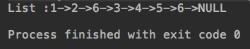

```java
public static void main(String[] args) {
        int[] nums = {1,2,6,3,4,5,6};
        ListNode head = new ListNode(nums);
        System.out.println(head);

        ListNode res = new Solution().removeElements(head,6);
        System.out.println(res);
    }
```

运行结果:

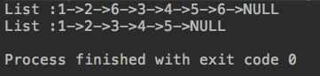

Solution类可以有Main函数，但是我们如果连带着main函数提交，会编译出错。我们本地才有数组到listNode的构造函数，但LeetCode中没有。

### 链表和递归

大家做程序员绕不开递归这个话题，递归是组建逻辑很重要的一部分，很多同学以为递归只能编写抽象逻辑。

可视化算法中随机生成迷宫算法，分形图绘制等都与递归密不可分。推箱子的自动求解也是一个递归的过程。高级排序算法使用到递归。

熟练掌握递归是初级程序员和高级程序员的分水岭。

#### 什么是递归？

本章介绍递归是因为链表和递归有着密不可分的联系，本质上，将原来的问题，转化为更小的同一问题（小到不能再小）

举例:数组求和

```java
Sum(arr[0...n-1]) = arr[0] + Sum(arr[1...n-1])
```

后面的sum函数要解决的就是比前一个sum更小的同一问题。

```java
Sum(arr[1...n-1]) = arr[1] + Sum(arr[2...n-1])
```

以此类推，直到对一个空数组求和，空数组和为0，此时变成了最基本的问题。

```java
Sum(arr[n-1...n-1] ) = arr[n-1] + Sum([])
```

#### 递归解决数组求和

```java
package cn.mtianyan;

public class Sum {
    public static int sum(int[] arr){
        return sum(arr,0);
    }

    /**
     * 计算arr[l...n)这个区间内所有数字的和,真正的递归函数
     */
    private static int sum(int[] arr,int l){
        if (l == arr.length)
            return 0;
        return arr[l] + sum(arr,l+1);
    }

    public static void main(String[] args) {
        int[] nums = {1,2,3,4,5,6,7,8};
        System.out.println(sum(nums));
    }
}
```

这是我们完成的递归函数，运行结果:

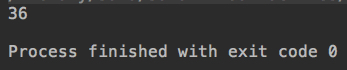

所有的递归算法可以分为两步，第一步是求解最基本问题（最基本问题是不能自动求解的），第二步是核心，把原问题转化为更小的问题，使用更小的问题构建原问题。

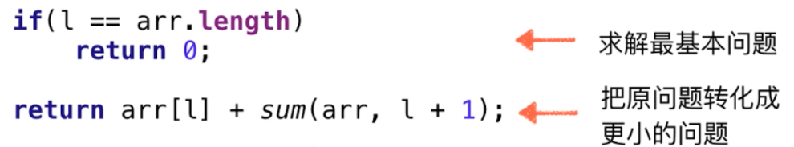

注意递归函数的宏观语义，sum就是计算arr[l...n)范围里的数字和,注意递归函数的宏观语义。递归函数就是一个函数，完成一个功能。就把递归函数想成一个独立的子函数，可以完成特定功能，A调用A和A调用B区别不大。

### 链表的天然递归性质

递归算法的宏观语义。

 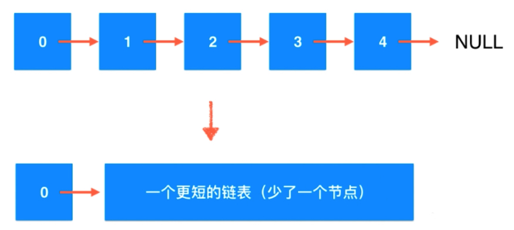

可以理解为是0这个节点，挂了一个更短的链表;直到最后NUll本身是一个新的更短链表，比原始链表少了一个节点，对于更短的链表来说1变成了它的头结点。1后面又挂接了一个2位头的更短链表，以此类推，空本身也是一个链表，最基本的链表。

下面我们使用递归完成LeetCode,删除链表中所有v。

函数本身的宏观语义。

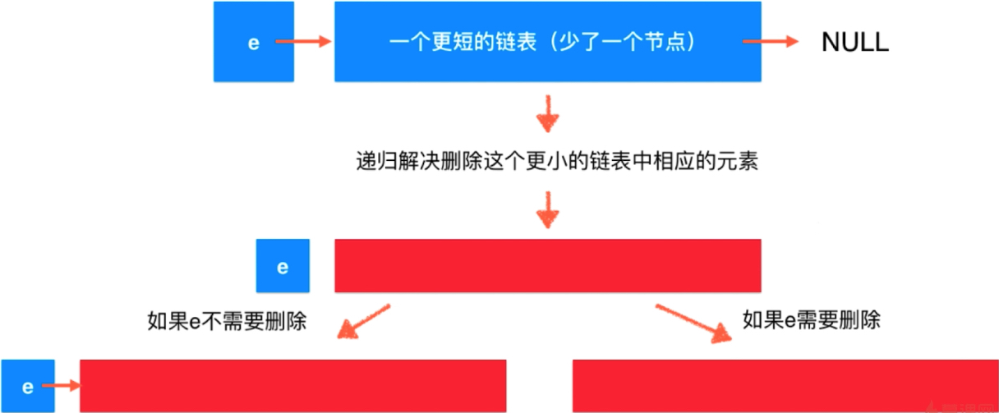

传给这个函数一个头结点和元素v，假定我们有函数解决删除更小链表中相应元素，删除之后的剩下的就是红色链表。但是怎么通过这个问题的解得到原问题的解呢，原问题只是没有考虑头结点。头结点不需要删除，就挂接上。如果头结点是e，那么久直接是红色部分。
这样就递归的把问题解决了。对更小的问题求解，最后组合成原问题。

```java
package cn.mtianyan;

class SolutionRecusion {

    public ListNode removeElements(ListNode head, int val) {
        if(head == null) // 求解最基本问题
            return null;
        ListNode res = re moveElements(head.next,val); // 将原问题转换为更小问题
        if (head.val == val){
            return res; // 继续调用更小问题求解。
        }else {
            head.next = res; // 这个head不需要删除，继续连接上链表。
            return head;
        }
    }

    public static void main(String[] args) {
        int[] nums = {1, 2, 6, 3, 4, 5, 6};
        ListNode head = new ListNode(nums);
        System.out.println(head);

        ListNode res = new SolutionRecusion().removeElements(head, 6);
        System.out.println(res);
    }
}
```

leetcode中提交时，这里的代码可以化简为:

```java
    public ListNode removeElements(ListNode head, int val) {
        // 对于问题规模最小情况
        if (head == null){
            return null;
        }
        // 问题不断小化,头结点分离，对于头结点后面的链表进行删除元素操作
        // 无论head如何，都将head与后面的红色部分连接起来。
        head.next = removeElements(head.next, val);
        if (head.val == val){
            // 要删除head，直接返回head.next，相当于删除掉了。
            return head.next;
        }else {
            // 此时head依然在链上
            return head;
        }
    }
```

使用三目运算符可以更简化。

```java
        return head.val == val?head.next:head;
```

这里我们构建递归过程用更小的求解部分构建整个求解，把removeElements当成一个子函数。自己写不出来，但能理解就是现阶段的就可以的。看起来并没有删除操作啊，下节就对递归进行微观解读。

### 递归函数的微观解读

递归函数的内部原理，到底是怎样运转的。程序调用的系统栈，递归调用和子函数调用没什么区别，只不过BC变成了A本身。

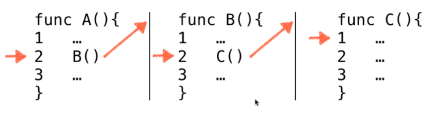

```java
    private static int sum(int[] arr,int l){
        if (l == arr.length)
            return 0;
        return arr[l] + sum(arr,l+1);
    }
```

为了演示方便，我们将最后一句拆成三句。

```java
    private static int sum(int[] arr, int l) {
        // 求解最基本问题
        if (l == arr.length) {
            return 0;
        }
        // 问题不断更小化
        int x = sum(arr, l + 1);
        int res = arr[l] + x;
        return res;
    }
```

递归函数的调用，本质就是函数调用 只不过调用的函数是自己而已

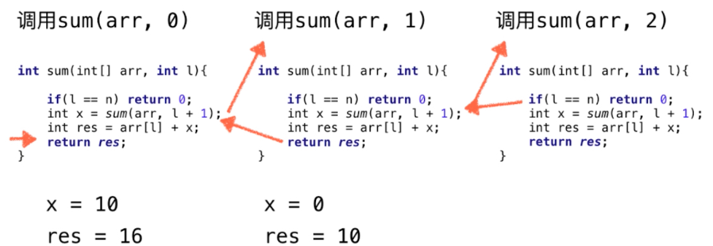

左向箭头一步一步调用过去，直到在sum(arr 2)中条件l == n达成，返回0.然后逆着如右箭头一步一步返回去。不用对着递归程序硬想，用一个很小的数据集扔进去跟着纸笔画或ide调试。

```java
    public ListNode removeElements(ListNode head, int val) {
        if (head == null) {
            return null;
        }
        head.next = removeElements(head.next, val);
        return head.val == val ? head.next : head;
    }
```

模拟调用，对6->7->8->null 删除7

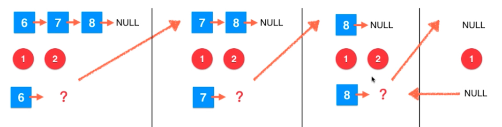

如上图是递归中的正向传播，从前往后调用，直到达成条件head == null。return null 填充到上一层的调用处，第三个块(第二次递归)的第二句，然后去执行第三句。

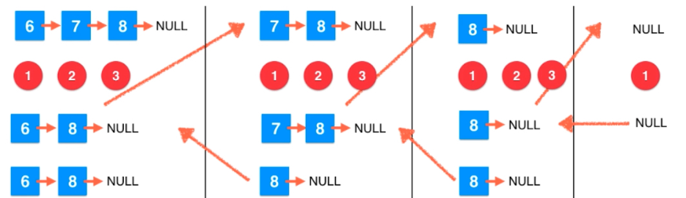

如上图一样，一步一步再填充回去。删除就发生在第二部分7-8-null 执行第三句时返回只返回了8-null。(节点删除发生在第三句中)

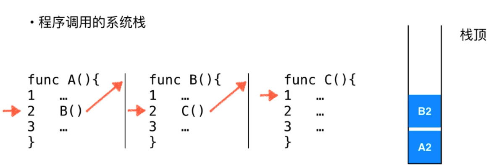

递归调用，与子程序调用是没有区别的。 

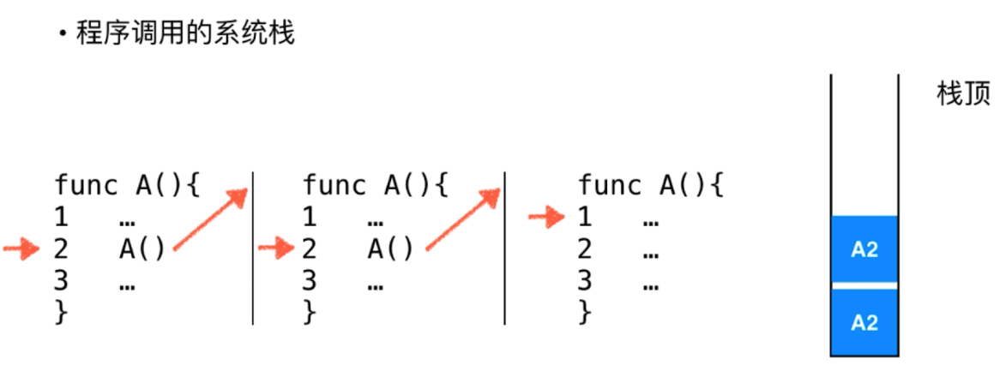

只是将程序B，C都换成了A;但是可以看出递归调用是有代价的: 函数调用有更多的时间开销包括记录当前函数执行到哪里，当前局部变量状态压入系统栈空间，包括找到底层该函数所在的位置。消耗系统栈空间。非线性结构中使用递归方式更加简单。下一节使用打印调试的方式展示递归调用。

### 递归调用的调试

打印输出调试法，或debug单步跟踪。

递归中有一个非常重要的概念，递归深度。每次调用时，递归深度+1

```java
public ListNode removeElements(ListNode head, int val,int depth)
ListNode res = new SolutionRecusionCopySmallPrint().removeElements(head, 6,0);
head.next = removeElements(head.next, val,depth+1);
```

每次进入这个函数，输出一句话。depthString

```java
    private String generateDepthString(int depth) {
        StringBuilder res = new StringBuilder();
        for (int i = 0; i < depth; i++) {
            res.append("--"); // 深度越深，字符串中--数量越多。
        }
        return res.toString();
    }
```

```java
        String depthString = generateDepthString(depth);
        System.out.print(depthString);
        System.out.println("Call: remove "+val+" in "+head);
```


在这样的递归深度下调用了这个函数，调用了这个函数是要在这个链表中，删除这个元素。

```java
        if (head == null) {
            System.out.print(depthString);
            System.out.println("Return: "+head);
            return null;
        }
```

```java
ListNode res = removeElements(head.next, val,depth+1);
        System.out.print(depthString);
        System.out.println("After remove "+val+": "+res);

        ListNode ret;
        if (head.val == val)
            ret = res;
        else {
            head.next = res;
            ret = head;
        }
        System.out.println(depthString);
        System.out.println("Return: "+ret);
        return ret;
```

完整代码如下:

```java
package cn.mtianyan;

public class SolutionRecusionCopySmallPrint {
    /**
     * mtianyan链表删除节点简化版
     *
     * @param head
     * @param val
     * @return
     */
    public ListNode removeElements(ListNode head, int val,int depth) {
        String depthString = generateDepthString(depth);
        System.out.print(depthString);
        System.out.println("Call: remove "+val+" in "+head);
        // 对于问题规模最小情况
        if (head == null) {
            System.out.print(depthString);
            System.out.println("Return: "+head);
            return null;
        }
        // 问题不断小化,头结点分离，对于头结点后面的链表进行删除元素操作
        // 无论head如何，都将head与后面的红色部分连接起来。
        ListNode res = removeElements(head.next, val,depth+1);
        System.out.print(depthString);
        System.out.println("After remove "+val+": "+res);

        ListNode ret;
        if (head.val == val)
            ret = res;
        else {
            head.next = res;
            ret = head;
        }
        System.out.print(depthString);
        System.out.println("Return: "+ret);
        return ret;
    }

    private String generateDepthString(int depth) {
        StringBuilder res = new StringBuilder();
        for (int i = 0; i < depth; i++) {
            res.append("--"); // 深度越深，字符串中--数量越多。
        }
        return res.toString();
    }

    public static void main(String[] args) {
        int[] nums = {1, 2, 6, 3, 4, 5, 6};
        ListNode head = new ListNode(nums);
        System.out.println(head);

        ListNode res = new SolutionRecusionCopySmallPrint().removeElements(head, 6,0);
        System.out.println(res);
    }
}
```

运行结果:

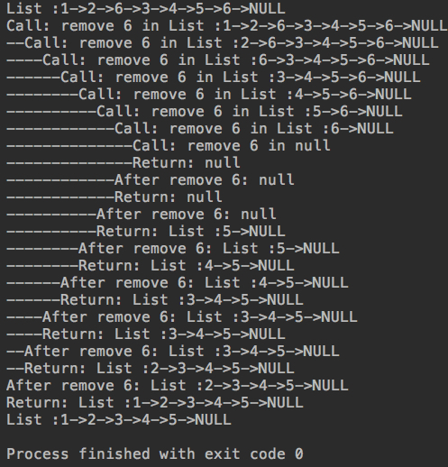

可以看到，递归深度不断增加，不断在更短链表中求删除链表。直到在空链表中删除元素6，结果仍然为空，开始return。

递归深度变短，回到上一层，不断返回。得到上一层返回，只需要判断该递归深度中当前的头结点要不要删除就行了。四行代码解决问题，背后的功夫绝不止四行。

### 更多和链表相关的话题

关于递归;近乎和链表相关的所有操作，都可以使用递归的形式完成

建议对链表的增，删，改,查,进行递归实现;对于LeetCode中链表相关的习题可以动手写一些。玩转算法的第五章介绍了更多关于链表的问题。C++语言，提供了java版本。看得见的算法，小demo中也有很多递归。斯坦福大学18个链表问题(c语言实现)。

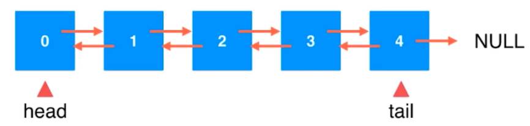

双链表(链表实现的队列在尾部删除元素，即使有tail了，依然是O(n)级别的，双链表可以解决这个问题):

```java
class Node{
  E e;
  Node next,prev;
}
```

此时删除tail，就变成了一个O(1)时间复杂度的问题，因为可以直接找到tail的prev节点。缺点，有两个指针维护起来更复杂。双链表也可以加入虚拟头节点。

循环链表:

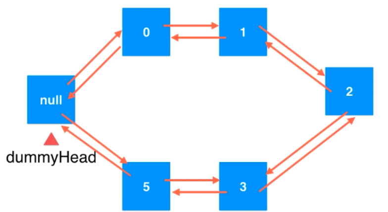

最重要的是尾结点不指向空，而是指向我们的虚拟头结点。通过这个节点的下一个节点是不是虚拟头结点，判断该节点是不是尾结点。
循环链表将很多操作进一步进行了统一，向尾部添加节点，就不需要tail一直指着结尾了。dummyHead前面添加一个，就相当于尾部。

JAVA中Linklist是一个双向循环链表。

数组链表:

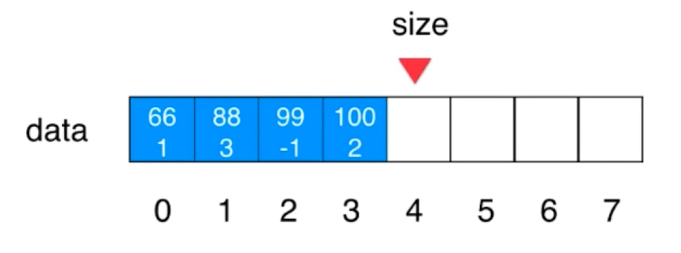

链表的next只是指向下一个node，数组中每个位置，存上元素加下一个位置的索引。88的下一个元素是在位置3，-1表示这是链表结束了。

```java
class Node{
  E e;
  int next;
}
```

明确知道数据有多少个，使用数组链表更方便一些。从链表底层实现到计算机递归进行了学习，链表还有更多内容等待大家自己学习。

下一章就不研究线性数据结构了，开始研究二分搜索树(动态数据结构，靠节点，排成一棵树，指向左子树，右子树)。


