之前我们的课程都在关注线性的数据结构，我们从本章开始学习树结构,二分搜索树。

树结构:

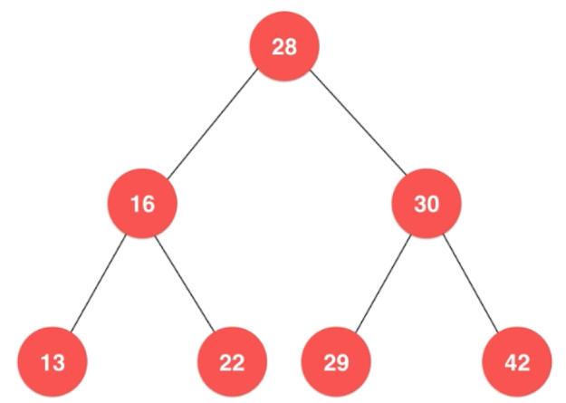

线性数据结构是将数据排成一排，树结构倒过来更像一棵树。

为什么要有树结构?

树结构本身是一种天然的组织结构。

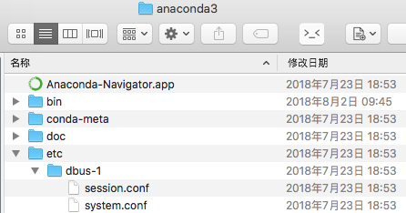

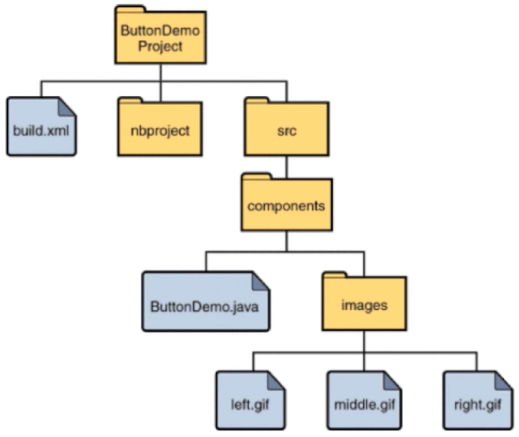

电脑中的文件夹就是一种树结构,计算机中让人们使用的存储结构来源于生活。图书馆分区，分类，分子类。


公司的组织架构也是一种树结构。生活中能看到这么多树结构，为什么呢？高效的检索（目录找文件，ceo找技术开发部门的人）。

将数据使用树结构存储后, 出奇的高效 

二分搜索树(Binary Search Tree) 局限性，因此我们会介绍两种平衡二叉树: AVL,红黑树;为满足数据的某一类特殊操作，堆与并查集。特殊数据存储成树结构，对于特殊数据的领域形成高性能，课程会介绍线段树[线段数据]，Trie(字典树，前缀树)[处理字符串]。

不一定是显式的使用树结构进行存储，但是高效的搜索操作，很多时候也离不开树结构。比如，用户使用撤销操作和括号不匹配ide的报错，用户是不知道背后用了栈的，但为了达成这种效果，我们是要使用栈的。虽然解决的是数据存储的问题，但在使用层面上不仅仅因为存储而使用，更多时候是因为只有使用了这种数据结构我们才能基于它实现高效的算法。

### 二分搜索树

二叉树，和链表一样，动态数据结构。

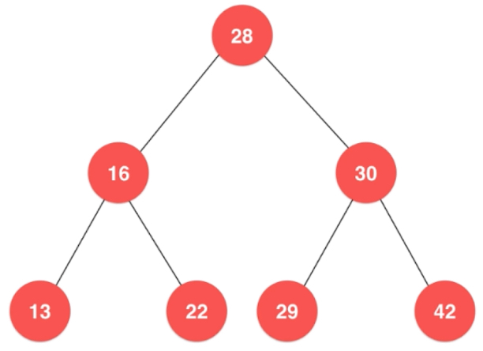

```java
class Node{
  E e;
  Node left;
  Node right;
}
```

除过元素值，还有两个指向左右子树的引用。二叉树:每个节点最多分出两个叉(后面会学到多叉树)

二叉树具有具有唯一根节点

```java
class Node {
  E e;
  Node left;  // 左孩子
  Node right; // 右孩子
}
```

二叉树每个节点最多有两个孩子,下面这些一个孩子都没有的通常称为叶子节点（左右孩子都为空的节点）。

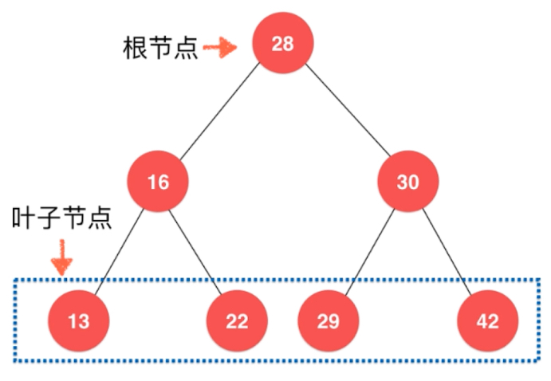

二叉树每个节点最多有一个父亲，根节点没有父亲节点。

#### 二叉树具有天然递归结构

很多时候在树中，使用递归结构要简单的多。天然递归结构表现在: 每个节点的左，右子树都是棵二叉树。

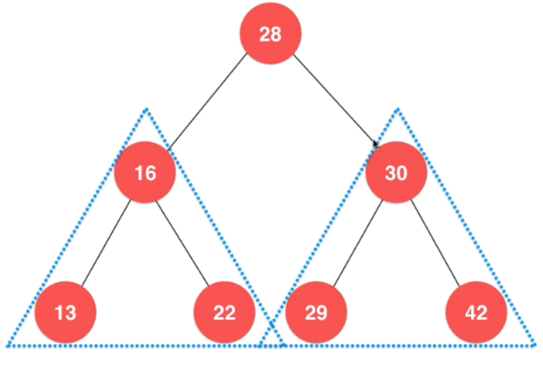

满二叉树: 除了叶子节点之外，每个节点都有两个孩子。 但二叉树不一定是满的。

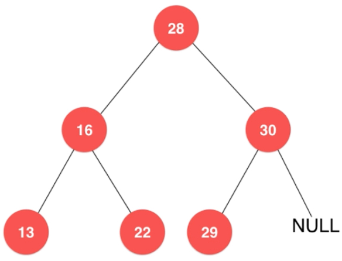

这也是一棵二叉树，它就是一棵不满的。

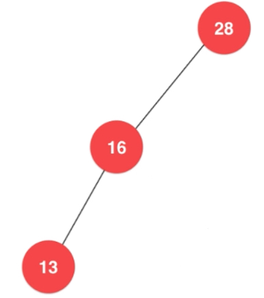

这也是一颗二叉树，28和16都没有右子树,看上去是一个链表。

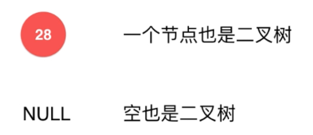

一个节点也是二叉树;空也是二叉树

#### 二分搜索树 Binary Search Tree

首先，二分搜索树是二叉树。二叉树中的所有术语，在二分搜索树中也都适用。

二分搜索树的**每个节点**的值大于其左子树的所有节点的值，小于其右子树的所有节点的值。每一棵子树也是二分搜索树

检索时，查找53，53一定在右子树，左子树根本不用看。要达成这样的检索，就必须让我们存储的元素具有可比较性。

如果是我们自定义的对象想要使用二分搜索树，那么我们需要自定义好两个学生之间是如何进行比较的。之前我们的链表和数组是没有这个要求的，这可以看成是二分搜索树的一个局限性,要想加快搜索就要对于数据有一定的要求。

```java
package cn.mtianyan;

/**
 * 二分搜索树，binary search tree（限制类型具有可比较性）
 */
public class BST<E extends Comparable<E>> {
    /**
     * 节点类对用户屏蔽
     */
    private class Node {
        public E e; // 节点元素值
        public Node left, right; // 左子树，右子树引用

        /**
         * 默认的节点构造函数
         *
         * @param e
         */
        public Node(E e) {
            this.e = e;
            left = null;
            right = null;
        }
    }

    private Node root;  // 根节点
    private int size;   // 树中元素的个数

    /**
     * 默认的二分搜索树构造函数
     */
    public BST() {
        root = null;
        size = 0;
    }

    /**
     * 获取搜索树中节点元素个数
     *
     * @return
     */
    public int getSize() {
        return size;
    }

    /**
     * 二分搜索树是否为空
     *
     * @return
     */
    public boolean isEmpty() {
        return size == 0;
    }
}
```

上面是在一个二分搜索树中最基本的方法。

### 向二分搜索树中添加元素。

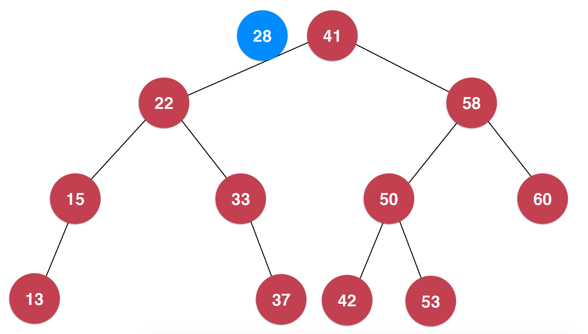

可以看到，此时要添加28的话，从根节点不断向下跟新的子树根节点判断大小。

我们的二分搜索树不包含重复元素；如果想包含重复元素的话，只需要定义: 左子树小于等于节点;或者右子树大于等于节点。

注意:我们之前讲的数组和链表，可以有重复元素. 二分搜索树添加元素的非递归写法，和链表很像

```java
    /**
     * 向二分搜索树中添加新的元素e(面向用户使用的)
     *
     * @param e
     */
    public void add(E e) {

        if (root == null) {
            root = new Node(e);
            size++;
        } else
            add(root, e);
    }

    /**
     * 语义: 向以node为根的二分搜索树中插入元素e，递归算法
     *
     * @param node
     * @param e
     */
    private void add(Node node, E e) {
        if (e.equals(node.e))
            return; // 此处相当于去重
            //小于e的值，并且该节点的左子树为空。
        else if (e.compareTo(node.e) < 0 && node.left == null) {
            node.left = new Node(e);
            size++;
            return;
        }
        // 如果大于e的值，并且该节点的右子树为空。
        else if (e.compareTo(node.e) > 0 && node.right == null) {
            node.right = new Node(e);
            size++;
            return;
        }
        // 上面条件不满足，说明还得继续往下找左右子树为null可以挂载上的节点
        if (e.compareTo(node.e) < 0)
            // 如果小于，那么继续往它的左子树添加该节点
            add(node.left, e);
        else //e.compareTo(node.e) > 0
            // 大于，往右子树添加。
            add(node.right, e);
    }
```

二分搜索树添加元素的非递归写法，和链表很像; 这个课程在二分搜索树方面的实现，关注递归实现
。二分搜索树一些方法的非递归实现，留做练习。在二分搜索树方面，递归比非递归实现简单: )

### 二分搜索树插入元素改进: 深入理解递归终止条件。

上节代码向以node为根的二分搜索树中插入元素e，插入给左孩子或右孩子。对于根节点做了特殊处理，对于node.e 和e，我们进行了两轮的比较，小于并有空位，直接插入;没有空位小于，继续往下寻找。

此时我们的递归函数的终止条件非常的臃肿，因为我们要考虑node的左右孩子是否为为空，但是我们之前就说过，空本身也是一颗二叉树。

>如果我们在遍历过程中走到了一个node为空的地方，一定是要创建新节点了。此时我们的如下代码并没有递归到底。

```java
else if (e.compareTo(node.e) < 0 && node.left == null) {
            node.left = new Node(e);
            size++;
            return;
        }
        // 如果大于e的值，并且该节点的右子树为空。
        else if (e.compareTo(node.e) > 0 && node.right == null) {
            node.right = new Node(e);
            size++;
            return;
        }
```

既然我们看到了这个e小于node.e ，不管是不是空，都再递归一层。如果递归到的这一层为空，这个位置本身就应该是这个节点。

```java
if (e.equals(node.e))
            return; // 此处相当于去重
            //小于e的值，并且该节点的左子树为空。
        else if (e.compareTo(node.e) < 0 && node.left == null) {
            node.left = new Node(e);
            size++;
            return;
        }
        // 如果大于e的值，并且该节点的右子树为空。
        else if (e.compareTo(node.e) > 0 && node.right == null) {
            node.right = new Node(e);
            size++;
            return;
        }
```

如上的终止条件就可以写为

```java
        if (node == null){
            new Node(e);
            size ++;
        }
```

但是此时我们就没法把这个节点和我们的树挂接起来了。如何挂？return给函数调用的上层。

```java
    /**
     * 向二分搜索树中添加新的元素e(面向用户使用的)
     *
     * @param e
     */
    public void add(E e) {
        root = add(root, e);
    }

    /**
     * 返回插入新节点后二分搜索树的根
     *
     * @param node
     * @param e
     * @return
     */
    private Node add(Node node, E e) {
        if (node == null) {
            size++;
            return new Node(e);
        }
        // 上面条件不满足，说明还得继续往下找左右子树为null可以挂载上的节点
        if (e.compareTo(node.e) < 0)
            // 如果小于，那么继续往它的左子树添加该节点,这里插入结果可能根发生了变化。
            node.left = add(node.left, e); // 新节点赋值给node.left,改变了二叉树
        else if (e.compareTo(node.e) > 0)
            // 大于，往右子树添加。
            node.right = add(node.right, e);
        return node;
    }
```

传入的node为空，就直接new 一个node，然后return回去调用出。node.left 或者node.right 此时node.left就等于新产生的这个节点。
面向公众的add方法中也不需要再判断root是否为空了，如果为空直接会new一个新的node,并返回至调用处`root = add(root, e);`被根节点保存下来。

宏观自己画图，微观进行小数据集代入。可以尝试链表插入元素的递归算法，二分搜索树要判断插左还是右，链表直接插入.next就可以了。

### 二分搜索树中搜索元素。

查询元素只需要看每一个node里面存储的元素就可以了。

```java
    /**
     * 看二分搜索树中是否包含元素e（面向用户的）
     *
     * @param e
     * @return
     */
    public boolean contains(E e){
        return contains(root,e);
    }

    /**
     * 看以node为根的二分搜索树中是否包含元素e(递归算法语义)
     *
     * @param node
     * @param e
     * @return
     */
    private boolean contains(Node node,E e){
        if (node == null)
            return false;
        if (e.compareTo(node.e) == 0)
            return true;
        else if (e.compareTo(node.e) < 0)
            return contains(node.left,e);
        else // e.compareTo(node.e) < 0
            return contains(node.right,e);
    }
```

contains的具体语义。二分搜索树中没有索引概念，我们就不用实现根据索引查询二分搜索树的方法了。

### 二分搜索树的前序遍历

#### 什么是遍历操作？

遍历操作就是把所有节点都访问一遍;访问的原因和业务相关;在线性结构下，遍历是极其容易的;在树结构下，也没那么难。

对于遍历操作，两棵子树都要顾及。

```java
function traverse(node):
  if(node == null )
  return;
  // 访问该节点
  traverse(node.left)
  traverse (node.right)
```

前序遍历顺序:是指先访问根，再访问左右。

```java
    /**
     * 二分搜索树的前序遍历（用户使用）
     */
    public void preOrder(){
        preOrder(root);
    }


    /**
     * 前序遍历以node为根的二分搜索树, 递归算法
     *
     * @param node
     */
    private void preOrder(Node node){
        if(node == null)
            return;
        System.out.print(node.e+" ");
        preOrder(node.left);
        preOrder(node.right);
    }
```

#### 二分搜索树的toString

```java
/**
     * 打印二分搜索树的信息
     *
     * @return
     */
    @Override
    public String toString() {
        StringBuilder res = new StringBuilder();
        generateBSTString(root, 0, res);
        return res.toString();
    }

    /**
     * 生成以node为根节点，深度为depth的描述二叉树的字符串
     *
     * @param node
     * @param depth
     * @param res
     */
    private void generateBSTString(Node node, int depth, StringBuilder res) {

        if (node == null) {
            res.append(generateDepthString(depth) + "null\n");
            return;
        }

        res.append(generateDepthString(depth) + node.e + "\n");
        generateBSTString(node.left, depth + 1, res);
        generateBSTString(node.right, depth + 1, res);
    }
    
    /**
     * 生成树深度的标识。
     *
     * @param depth
     * @return
     */
    private String generateDepthString(int depth) {
        StringBuilder res = new StringBuilder();
        for (int i = 0; i < depth; i++)
            res.append("--");
        return res.toString();
    }
```

上面的代码实现了将二分搜索树的信息进行遍历，添加深度信息，打印输出。其中generateBSTString为遍历节点操作。

```java
package cn.mtianyan;

public class Main {

    public static void main(String[] args) {

        BST<Integer> bst = new BST<>();
        int[] nums = {5, 3, 6, 8, 4, 2};
        for(int num: nums)
            bst.add(num);
        /////////////////
        //      5      //
        //    /   \    //
        //   3    6    //
        //  / \    \   //
        // 2  4     8  //
        /////////////////
        bst.preOrder();
        System.out.println();

        System.out.println(bst);
    }
}
```

运行结果:

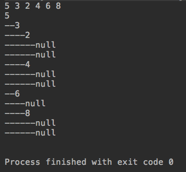

一样深度的是同一层的节点，可以看出根左右的顺序。

### 中序遍历，后序遍历。

前序遍历是最自然的遍历方式，也是最常用的遍历方式。

```java
function traverse(node):
  if(node == null )
  return;
  traverse (node.left)
  // 访问该节点
  traverse(node.right)
```

中序遍历为左根右。

```java
    /**
     * 二分搜索树的中序遍历（用户使用）
     */
    public void inOrder() {
        inOrder(root);
    }


    /**
     * 中序遍历以node为根的二分搜索树, 递归算法
     *
     * @param node
     */
    private void inOrder(Node node) {
        if (node == null)
            return;
        inOrder(node.left);
        System.out.print(node.e + " ");
        inOrder(node.right);
    }
```

```java
        bst.inOrder(); // 2 3 4 5 6 8
        System.out.println();
```

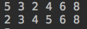

可以看到中序遍历的结果就是二分搜索树排序的结果。

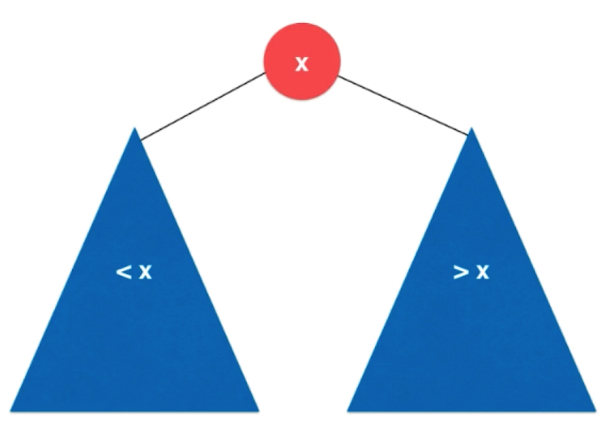

递归的完成先遍历小的，再遍历大的。因此是从小向大排序。

#### 后序遍历

```java
 /**
     * 二分搜索树的后序遍历（用户使用）
     */
    public void postOrder() {
        postOrder(root);
    }


    /**
     * 后序遍历以node为根的二分搜索树, 递归算法
     *
     * @param node
     */
    private void postOrder(Node node) {
        if (node == null)
            return;
        postOrder(node.left);
        postOrder(node.right);
        System.out.print(node.e + " ");
    }
```

```java
        bst.postOrder(); // 2 4 3 8 6 5
        System.out.println();
```

运行结果：

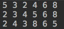

后序遍历为第三行。后序遍历的典型应用: 为二分搜索树释放内存(先释放两个孩子，再删除该节点)

针对一个节点的孩子节点求解出答案，最终再用这些答案组合成这个节点的答案。树形问题: 分治算法，回溯算法，动态规划算法。

程序的角度，如果给一棵树结构，前中后序遍历。不去使用程序，看出结果。

### 再看二分搜索树的遍历

给一个树结构，如何快速得到二分搜索树的前中后遍历的答案。

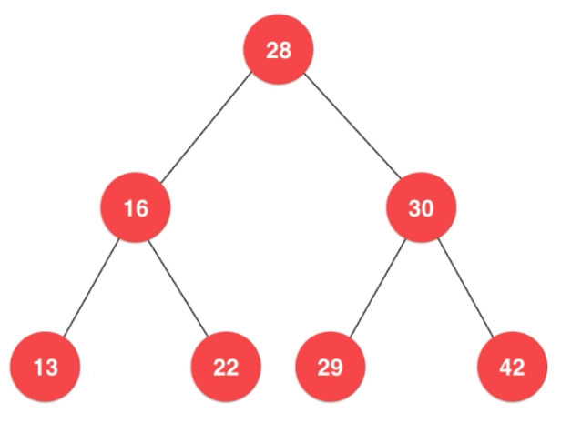

对于二分搜索树，我们可以看成是一个递归结构。每个节点有它的左子树与右子树。在每个节点处，我们有三次的访问机会。

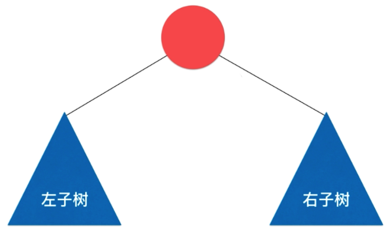

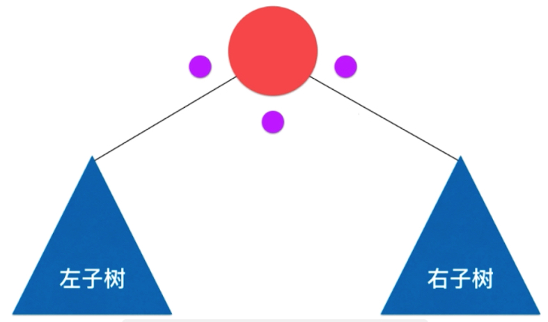

遍历左子树之后，我们会来到这个节点；遍历右子树之后，我们又会来到这个节点。对于二分搜索树的前中后遍历，其实就是我们在三个点中哪个进行真正的访问操作。

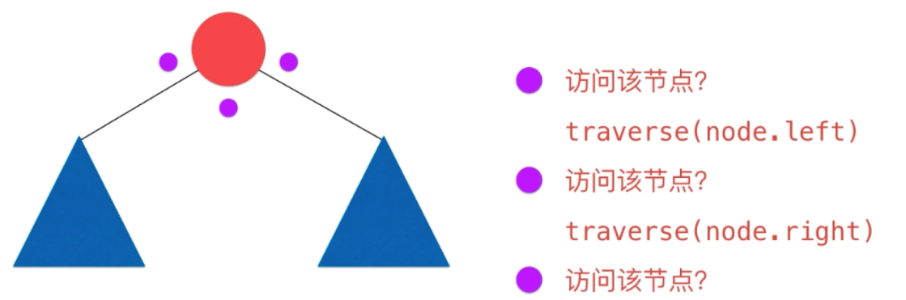

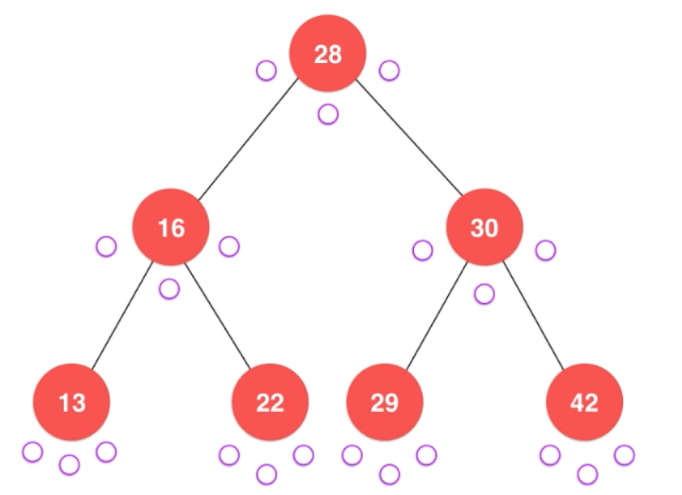

下面我们来实现不通过程序完成二分搜索树前中后序的遍历成果。

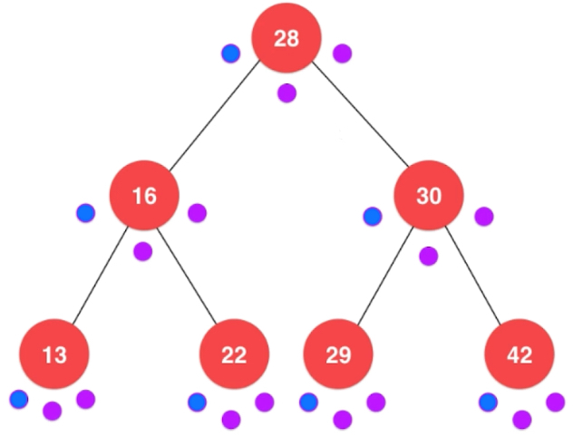

前序遍历时每个结点都是第一次访问的时候就进行打印。

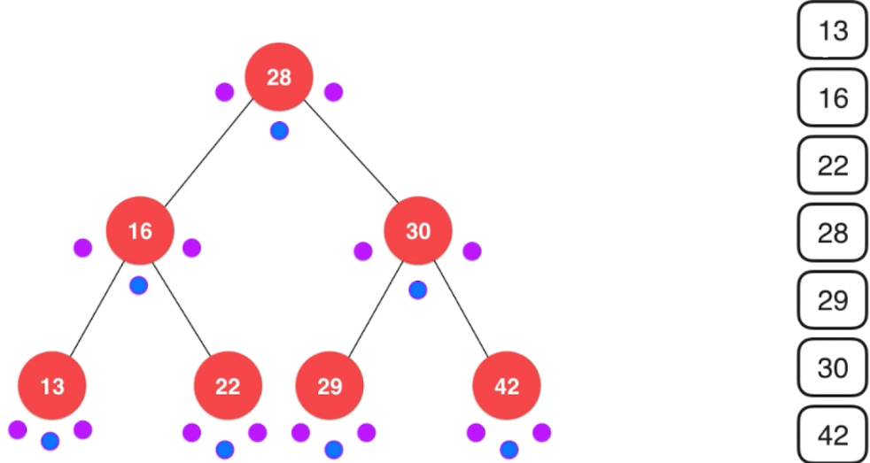

中序遍历是对于每个节点都是第二次访问的时候进行打印。中序遍历是从小到大的。

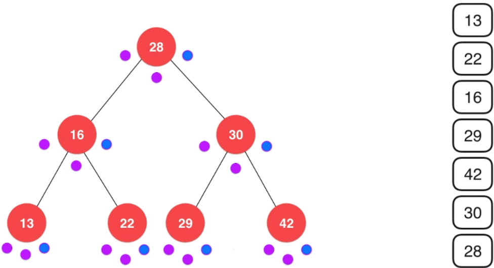

后序遍历是对于每个节点都是第三次访问的时候进行打印。

### 二分搜索树前序遍历的非递归写法

```java
function traverse(node):
  if(node == null )
  return;
  // 访问该节点
  traverse(node.left)
  traverse (node.right)
```

子过程调用，压入系统栈。

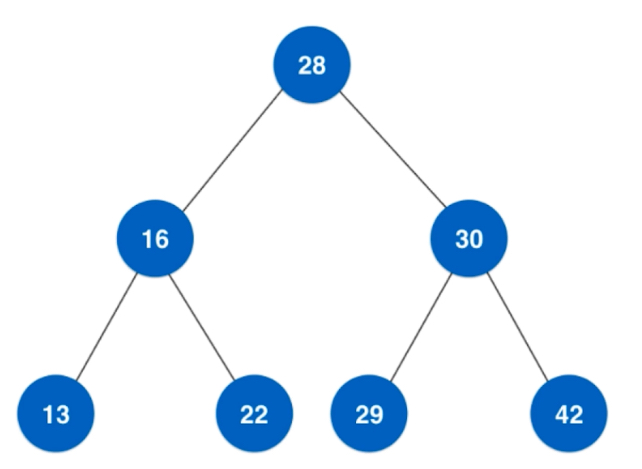

初始根节点压入栈，出栈访问28，之后压入它的右孩子30，左孩子16。访问栈顶16，压入它的右左孩子。

栈中先压入右孩子，再压入左孩子。因为栈是先入后出。我们想先出，就得后入栈。对于每个节点，先压入右孩子，再压入左孩子。然后不断访问栈顶,直到栈为空。

```java
    /**
     * 二分搜索树的非递归前序遍历
     */
    public void preOrderNR(){
        Stack<Node> stack = new Stack<>();
        stack.push(root);
        while (!stack.isEmpty()){
            Node cur = stack.pop();
            System.out.println(cur.e);

            if (cur.right != null)
                stack.push(cur.right);
            if (cur.left != null)
                stack.push(cur.left);
        }
    }
```

```java
        bst.preOrderNR(); // 5 3 2 4 6 8
        System.out.println();
```

运行结果:

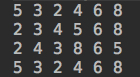

最后一行为非递归的前序遍历实现。二分搜索树遍历的非递归实现，比递归实现复杂很多。

中序遍历和后序遍历的非递归实现更复杂;中序遍历和后序遍历的非递归实现，实际应用不广。考研等有可能包含二分搜索树的中序遍历和后续遍历的非递归实现。

```java
    /**
     * 二分搜索树的非递归中序遍历
     */
    public void inOrderNR() {
        Stack<Node> stack = new Stack<>();
        Node cur = root;
        while (cur != null || !stack.empty()) {

            while (cur != null) {
                stack.push(cur);
                cur = cur.left;
            }

            cur = stack.pop();
            System.out.print(cur.e+" ");
            cur = cur.right;
        }
    }
```

```java
        System.out.printf("非递归中序: ");
        bst.inOrderNR();
        System.out.println();
```

运行结果:

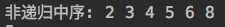

```java
    /**
     * 二分搜索树的非递归后序遍历
     */
    public void postOrderNR() {

        Stack<Node> stack = new Stack<>();
        Node pre = null;
        Node cur = root;

        while(cur != null || !stack.empty()){

            if(cur != null){
                stack.push(cur);
                cur = cur.left;
            }
            else{
                cur = stack.pop();
                if(cur.right == null || pre == cur.right){
                    System.out.printf(cur.e +" ");
                    pre = cur;
                    cur = null;
                }
                else{
                    stack.push(cur);
                    cur = cur.right;
                }
            }
        }
    }
```

```java
        System.out.printf("非递归后序: ");
        bst.postOrderNR();
        System.out.println();
```

运行结果:

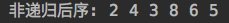

二分搜索树遍历的非递归实现都有经典教科书的写法。《玩转算法面试》中有完全模拟系统栈的写法将前中后都转为非递归的写法。

这种遍历方式叫做深度优先遍历，一扎到底。广度优先遍历是层序遍历。

### 二分搜索树的层序遍历

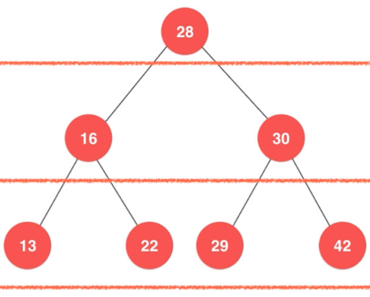

一层一层的向下，被称为广度优先遍历。通常使用非递归方式，使用队列实现。

将28加入队列，然后对于28进行访问，访问时将28的左右孩子入队，对于16进行访问，将16的左右孩子入队。一直访问队首元素，将其孩子纳入队伍，直到队列为空。

```java
    /**
     * 二分搜索树的层序遍历，使用队列实现
     */
    public void levelOrder(){
        Queue<Node> queue = new LinkedList<>();
        queue.add(root);
        while (!queue.isEmpty()){
            Node cur = queue.remove();
            System.out.printf(cur.e+" ");

            if (cur.left !=null)
                queue.add(cur.left);
            if (cur.right != null)
                queue.add(cur.right);
        }
    }
```

```java
 System.out.printf("队列实现层序遍历: ");     
 bst.levelOrder();                    
 System.out.println();                
```

运行结果:

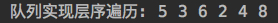

广度优先遍历的意义，更快的找到问题的解，算法的实现在一棵虚拟的树上搜索，常用于算法设计中-最短路径(无权图)。

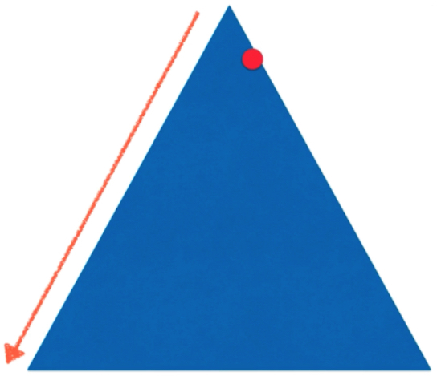

图中的深度优先遍历和广度优先遍历。图中的前驱(父亲)可能有多个，要记录节点是否被访问过。

### 二分搜索树的删除操作。

从最简单的，删除二分搜索树的最小值和最大值开始：最小值位于整棵树的最左下角，最大值位于整棵树的最右下角。

#### 求二分搜索树的最小值，和最大值

```java

    /**
     * 寻找二分搜索树的最小元素(面向用户)
     *
     * @return
     */
    public E minimum(){
        if(size == 0)
            throw new IllegalArgumentException("BST is empty");

        Node minNode = minimum(root);
        return minNode.e;
    }

    /**
     * 返回以node为根的二分搜索树的最小值所在的节点
     *
     * @param node
     * @return
     */
    private Node minimum(Node node){
        if( node.left == null )
            return node;

        return minimum(node.left);
    }

    /**
     * 寻找二分搜索树的最大元素（面向用户）
     *
     * @return
     */
    public E maximum(){
        if(size == 0)
            throw new IllegalArgumentException("BST is empty");

        return maximum(root).e;
    }

    /**
     * 返回以node为根的二分搜索树的最大值所在的节点
     *
     * @param node
     * @return
     */
    private Node maximum(Node node){
        if( node.right == null )
            return node;

        return maximum(node.right);
    }
```

```java
 /**
     * 从二分搜索树中删除最小值所在节点, 返回最小值
     * 
     * @return
     */
    public E removeMin(){
        E ret = minimum();
        root = removeMin(root);
        return ret;
    }

    /**
     * 删除掉以node为根的二分搜索树中的最小节点 返回删除节点后新的二分搜索树的根
     * 
     * @param node
     * @return
     */
    private Node removeMin(Node node){

        if(node.left == null){
            Node rightNode = node.right;
            node.right = null;
            size --;
            return rightNode;
        }

        node.left = removeMin(node.left);
        return node;
    }

    /**
     * 从二分搜索树中删除最大值所在节点
     * @return
     */
    public E removeMax(){
        E ret = maximum();
        root = removeMax(root);
        return ret;
    }

    /**
     * 删除掉以node为根的二分搜索树中的最大节点 返回删除节点后新的二分搜索树的根
     * 
     * @param node
     * @return
     */
    private Node removeMax(Node node){

        if(node.right == null){
            Node leftNode = node.left;
            node.left = null;
            size --;
            return leftNode;
        }

        node.right = removeMax(node.right);
        return node;
    }
```

### 二分搜索树中删除任意值

1. 删除只有左孩子的节点

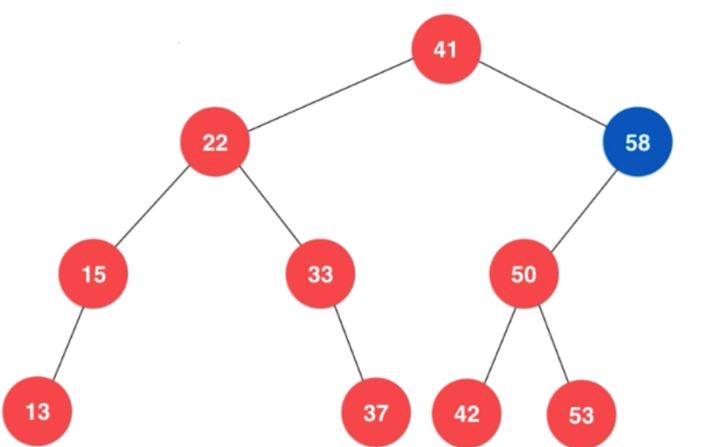

>跟上一节课的情况类似，只需要把58删除后，把它的左孩子拼接回原树。

2. 删除只有右孩子的节点

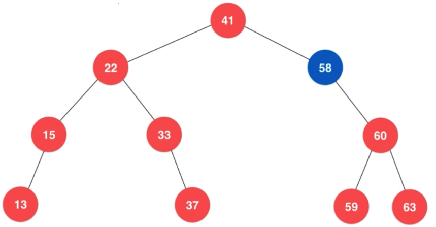

>跟删除只有左孩子的类似，只需要删除58，再把右孩子拼接回原树。

这基本是上节课删除最小值的情况，这也同样适用于叶子节点，理解为左孩子为空，或右孩子为空的情况。

删除节点时最难处理的是删除左右孩子都有的节点。1962年，Hibbard提出- Hibbard Deletion

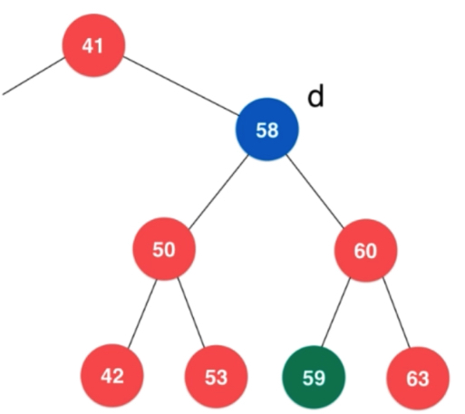

找到删除节点的右子树中最小值(59)作为新的节点。59是58的后继，`s->right = delMin(d->right)`

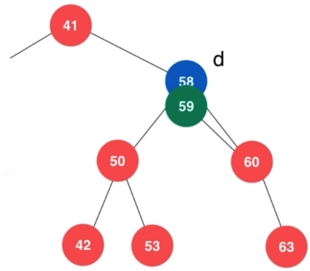

`s->left = d->left`; 删除d，s(59)是新的子树根

```java
 /**
     * 从二分搜索树中删除元素为e的节点
     */
    public void remove(E e){
        root = remove(root, e);
    }

    /**
     *  删除掉以node为根的二分搜索树中值为e的节点, 递归算法 返回删除节点后新的二分搜索树的根
     *
     * @param node
     * @param e
     * @return
     */
    private Node remove(Node node, E e){

        if( node == null )
            return null;

        if( e.compareTo(node.e) < 0 ){
            node.left = remove(node.left , e);
            return node;
        }
        else if(e.compareTo(node.e) > 0 ){
            node.right = remove(node.right, e);
            return node;
        }
        else{   // e.compareTo(node.e) == 0

            // 待删除节点左子树为空的情况
            if(node.left == null){
                Node rightNode = node.right;
                node.right = null;
                size --;
                return rightNode;
            }

            // 待删除节点右子树为空的情况
            if(node.right == null){
                Node leftNode = node.left;
                node.left = null;
                size --;
                return leftNode;
            }

            // 待删除节点左右子树均不为空的情况

            // 找到比待删除节点大的最小节点, 即待删除节点右子树的最小节点
            // 用这个节点顶替待删除节点的位置
            Node successor = minimum(node.right);
            successor.right = removeMin(node.right);
            successor.left = node.left;

            node.left = node.right = null;

            return successor;
        }
    }
```

最后的将node合并进链上的操作并不需要size--。因为在removeMin中已经--了。

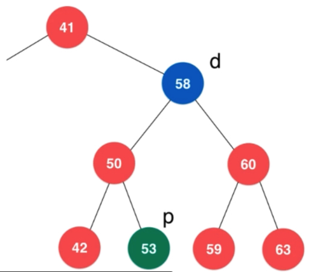

我们刚才的处理方法中找的是d的后继，当然我们也可以找d的前驱。mtianyan小练习: 使用前驱实现。

### 更多二分搜索树相关的问题。

删除元素: 拿到最大值，最小值。

- 二分搜索树的顺序性，方便获得最大值，最小值。包括给定一个值拿到前驱后继，successor,predecessor。

#### 二分搜索树的顺序性还体现在可以方便的找到floor和ceil

寻找45的floor和ceil:

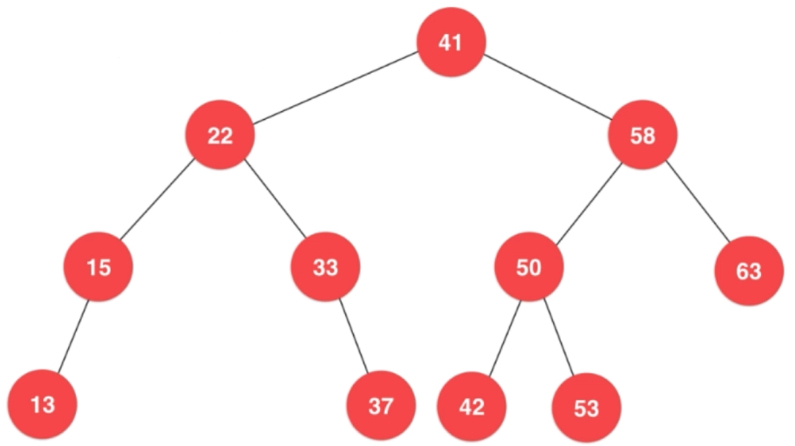

比45小的最大的元素，ceil是比45大的最小的元素。和前驱后继最大的区别是，寻找floor和ceil，这个元素可以不在我们的二分搜索树中。

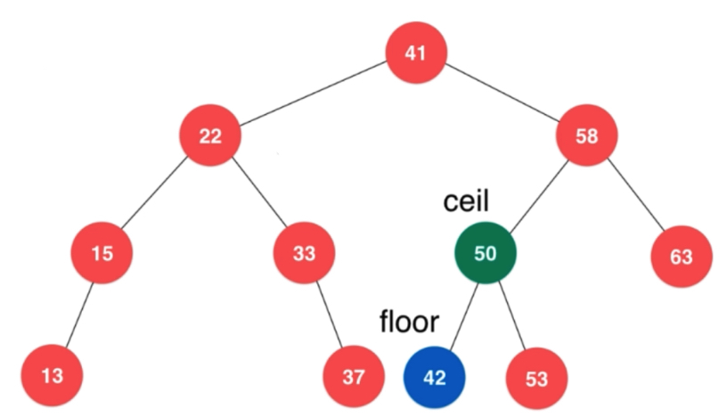

#### 二分搜索树的其他两个非常重要的方法是rank和select

rank: 58是排名第几的元素? select: 排名第10的元素是谁？

如果要实现rank和select，最好是维护一个size。就是以它为根的二分搜索树有多少个元素。

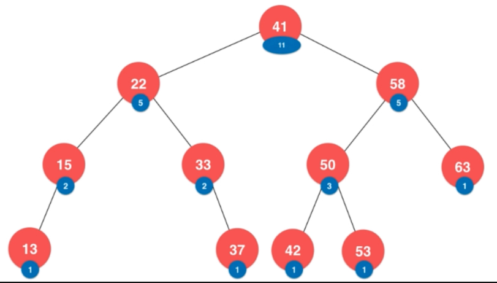

添加元素，删除元素都要维护size。整颗二分搜索树就不需要size了，它的size就是root.size

- 维护depth的二分搜索树

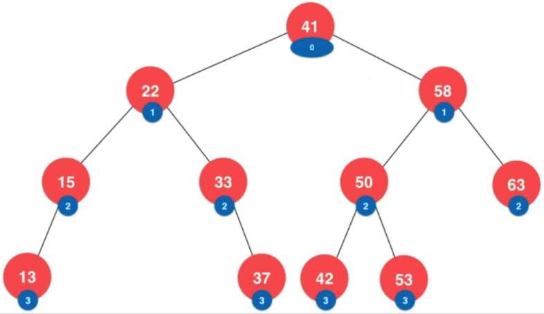

- 支持重复元素的二分搜索树。

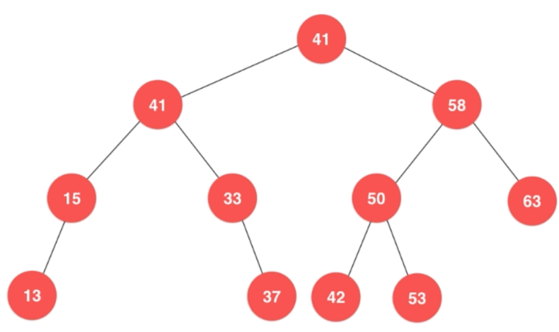

这时是定义了左子树的值是小于等于该节点。

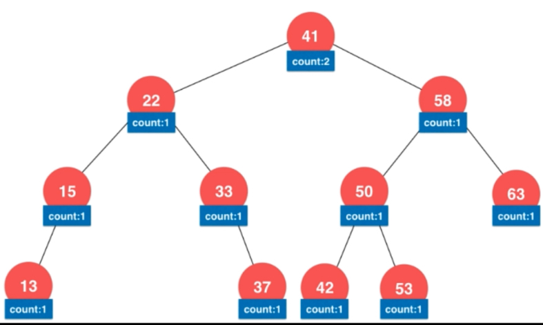

为二分搜索树添加一个count参数是另一种实现。添加count++，删除count--，如果减到0了再执行我们之前的删除操作。

变种: 基本都是在node中多维护几个数据。其他与二分搜索树相关的习题可以在LeetCode中查看，解题(注释中包含节点定义)。

二分搜索树的时间复杂度分析，下一章将会介绍，并且下一章会学习二分搜索树的两个应用: 集合和映射。使用数组，链表，二分搜索树实现集合和映射，优势和局限性都会学习到。


