上一章我们详细的介绍了二分搜索树的底层实现。这章我们介绍两个高层的数据结构，集合和映射。这种高层的数据结构，更像是我们定义好了使用接口规则，但是具体的底层实现可以是多种多样的。

#### 集合

承载元素的容器，元素的去重操作。回忆我们上一小节实现的二分搜索树是不能盛放重复元素的，非常好的实现“集合”的底层数据结构。

```java
Set<E>
  void add(E)
  void remove(E)
  boolean contains(E)
  int getSize()
  boolean isEmpty()
```

添加元素，删除元素，是否包含，大小，是否为空。连续add两次，只保留一份。典型应用: 客户统计。典型应用：词汇量统计。

BST依然是上一章实现的BST

```java
package cn.mtianyan;

public class BSTSet<E extends Comparable<E>> implements Set<E> {
    private BST<E> bst;

    public BSTSet() {
        bst = new BST<>();
    }

    @Override
    public void add(E e) {
        bst.add(e); // 本身就可以对于重复不理会
    }

    @Override
    public void remove(E e) {
        bst.remove(e);
    }

    @Override
    public boolean contanins(E e) {
        return bst.contains(e);
    }

    @Override
    public int getSize() {
        return bst.getSize();
    }

    @Override
    public boolean isEmpty() {
        return bst.isEmpty();
    }
}
```

```java
package cn.mtianyan;

import java.io.FileInputStream;
import java.util.ArrayList;
import java.util.Scanner;
import java.util.Locale;
import java.io.File;
import java.io.BufferedInputStream;
import java.io.IOException;

/**
 * 文件相关操作类
 */
public class FileOperation {

    /**
     * 读取文件名称为filename中的内容，并将其中包含的所有词语放进ArrayList words中
     *
     * @param filename
     * @param words
     * @return
     */
    public static boolean readFile(String filename, ArrayList<String> words){

        if (filename == null || words == null){
            System.out.println("filename is null or words is null");
            return false;
        }

        // 文件读取
        Scanner scanner;

        try {
            File file = new File(filename);
            if(file.exists()){
                FileInputStream fis = new FileInputStream(file);
                scanner = new Scanner(new BufferedInputStream(fis), "UTF-8");
                scanner.useLocale(Locale.ENGLISH);
            }
            else
                return false;
        }
        catch(IOException ioe){
            System.out.println("Cannot open " + filename);
            return false;
        }

        // 简单分词
        // 这个分词方式相对简陋, 没有考虑很多文本处理中的特殊问题
        // 在这里只做demo展示用
        if (scanner.hasNextLine()) {

            String contents = scanner.useDelimiter("\\A").next();

            int start = firstCharacterIndex(contents, 0);
            for (int i = start + 1; i <= contents.length(); )
                if (i == contents.length() || !Character.isLetter(contents.charAt(i))) {
                    String word = contents.substring(start, i).toLowerCase();
                    words.add(word);
                    start = firstCharacterIndex(contents, i);
                    i = start + 1;
                } else
                    i++;
        }

        return true;
    }

    /**
     * 寻找字符串s中，从start的位置开始的第一个字母字符的位置
     * 
     * @param s
     * @param start
     * @return
     */
    private static int firstCharacterIndex(String s, int start){

        for( int i = start ; i < s.length() ; i ++ )
            if( Character.isLetter(s.charAt(i)) )
                return i;
        return s.length();
    }
}
```

这里是一个文件读取单词后存入一个ArrayList words中的操作。

传入文件名，将每一个单词扔进数组中。使用英文文本，简单的分词，一行一行读取，把每一个词分出来，文本中所有的单词。

NLP中对于一个动词的不同形式等可以分为一个单词，我们这里只是最简单的就是字母不同的单词。

傲慢与偏见，双城记。年代久远，版权可以使用。

```java
package cn.mtianyan;

import java.util.ArrayList;

public class Main {

    public static void main(String[] args) {

        System.out.println("Pride and Prejudice");

        ArrayList<String> words1 = new ArrayList<>();
        if (FileOperation.readFile("pride-and-prejudice.txt", words1)) {
            System.out.println("Total words: " + words1.size());

            BSTSet<String> set1 = new BSTSet<>();
            for (String word : words1)
                set1.add(word);
            System.out.println("Total different words: " + set1.getSize());
        }

        System.out.println();


        System.out.println("A Tale of Two Cities");

        ArrayList<String> words2 = new ArrayList<>();
        if (FileOperation.readFile("a-tale-of-two-cities.txt", words2)) {
            System.out.println("Total words: " + words2.size());

            BSTSet<String> set2 = new BSTSet<>();
            for (String word : words2)
                set2.add(word);
            System.out.println("Total different words: " + set2.getSize());
        }
    }
}
```

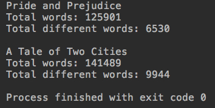

傲慢与偏见12万词，去重后只有六千多词。读原版书,读感兴趣的书是学英语的好方式。

双城记 14万词，去重后有九千多次。单词的多少是阅读这本书难度指标的一项。

### 基于链表的集合实现

为什么我们要再进行一下基于链表的实现呢？因为二分搜索树和LinkedList都属于动态数据结构，它们的数据都存储在一个一个的node中。

```java
class Node{
  E e;
  Node left;
  Node right;
}
```

二分搜索树中指向左右子树。

```java
class Node{
  E e;
  Node next ;
}
```

链表中指向下一个节点。两种不同实现之后我们可以比较性能。

```java
public class LinkedListSet<E> implements Set<E>{
    private LinkedList<E> list;

    public LinkedListSet() {
        list = new LinkedList<>();
    }
}
```

基于链表的实现中，并不要求传入的类型具有可比性,这是线性数据结构的特点。

```java
package cn.mtianyan.set;

import cn.mtianyan.linked.LinkedList;

public class LinkedListSet<E> implements Set<E>{
    private LinkedList<E> list;

    public LinkedListSet() {
        list = new LinkedList<>();
    }

    @Override
    public boolean contanins(E e) {
        return list.contains(e);
    }

    @Override
    public int getSize() {
        return list.getSize();
    }

    @Override
    public boolean isEmpty() {
        return list.isEmpty();
    }
    @Override
    public void add(E e) {
        // 保证不能重复e
        if (!list.contains(e))
            list.addFirst(e);
    }

    @Override
    public void remove(E e) {
        list.removeElement(e);
    }
}
```

```java
    public static void main(String[] args) {

        System.out.println("Pride and Prejudice");

        ArrayList<String> words1 = new ArrayList<>();
        if (FileOperation.readFile("pride-and-prejudice.txt", words1)) {
            System.out.println("Total words: " + words1.size());

            LinkedListSet<String> set1 = new LinkedListSet<>();
            for (String word : words1)
                set1.add(word);
            System.out.println("Total different words: " + set1.getSize());
        }

        System.out.println();


        System.out.println("A Tale of Two Cities");

        ArrayList<String> words2 = new ArrayList<>();
        if (FileOperation.readFile("a-tale-of-two-cities.txt", words2)) {
            System.out.println("Total words: " + words2.size());

            LinkedListSet<String> set2 = new LinkedListSet<>();
            for (String word : words2)
                set2.add(word);
            System.out.println("Total different words: " + set2.getSize());
        }
    }
```

运行结果一模一样，但是明显感觉到时间变长。

### 集合类的复杂度分析

前面我们已经实现了两种底层数据结构不同的Set实现。一个是基于二分搜索树的一个是基于链表的。

之前的测试中，基于链表的是明显的要慢的。

```java
package cn.mtianyan;

import cn.mtianyan.set.BSTSet;
import cn.mtianyan.set.LinkedListSet;
import cn.mtianyan.set.Set;

import java.util.ArrayList;

public class CompareTwoBstLinkedListSet {

    private static double testSet(Set<String> set, String filename){

        long startTime = System.nanoTime();

        System.out.println(filename);
        ArrayList<String> words = new ArrayList<>();
        if(FileOperation.readFile(filename, words)) {
            System.out.println("Total words: " + words.size());

            for (String word : words)
                set.add(word);
            System.out.println("Total different words: " + set.getSize());
        }
        long endTime = System.nanoTime();

        return (endTime - startTime) / 1e9;
    }

    public static void main(String[] args) {

        String filename = "pride-and-prejudice.txt";

        BSTSet<String> bstSet = new BSTSet<>();
        double time1 = testSet(bstSet, filename);
        System.out.println("BST Set: " + time1 + " s");

        System.out.println();

        LinkedListSet<String> linkedListSet = new LinkedListSet<>();
        double time2 = testSet(linkedListSet, filename);
        System.out.println("Linked List Set: " + time2 + " s");

    }
}
```

运行结果:

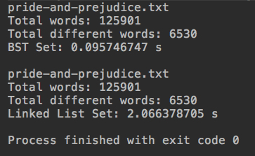

可以看到二分搜索树是要性能优于链表的。

#### 集合的时间复杂度分析

集合不涉及改。

- 本来链表添加只需要O(1)时间复杂度，但是我们为了保证不重复，先调用了一遍contains,因此变成了O(n)
- contains操作，我们必须要从头到尾扫一遍链表，复杂度O(n)
- remove操作，要先找到待删除元素前一个元素，时间复杂度O(n)

如果有n个单词，每个单词都不同，是o(n^2)级别的。

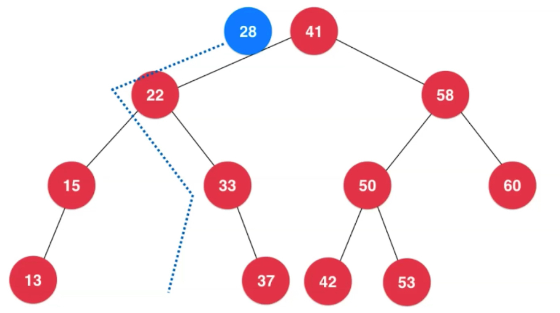

添加一个元素，走左子树，就不会去右子树，节省了很大一部分的寻找开销,最多能经历的节点数是树的高度。添加元素，删除元素，查找元素都是这样的，对于它来说，时间复杂度为O(h)，h为二分搜索树的高度。

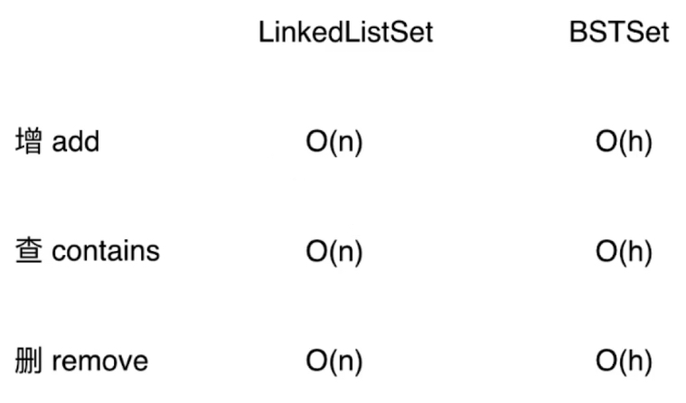

下面我们来谈一谈高度n和h之间的关系，极端: 满二叉树中,第h-1层，有2^(h-1)个节点。


h层一共有多少个节点？

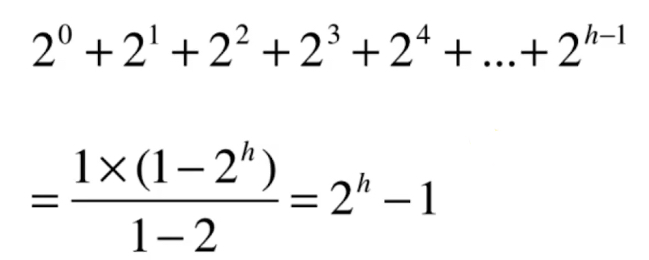

根据等比数列的求和公式，可以得到h层一共有2^h-1 = n

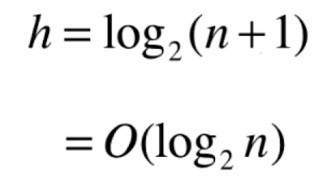

通常我们不会计较这里的底，无论是以2位底，还是10，它们都是logN级别的。

#### logn和n的差距

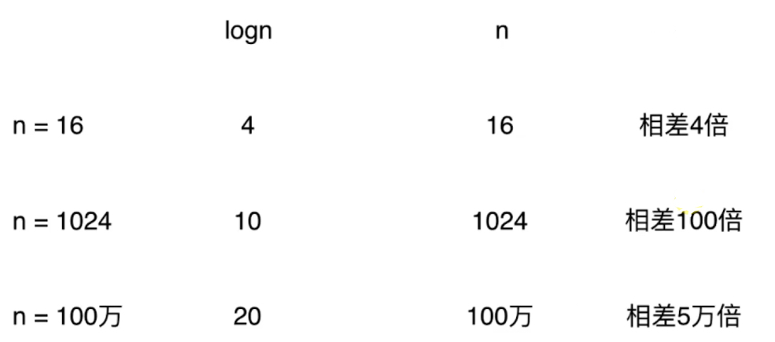

相差了五万倍，一秒跑完，14个小时。一天跑完，137年跑完。

logn是一个非常快的时间复杂度，很多排序算法是nlogn的，比n^2快了很多很多（前面都乘以n）。但是这里我们的logn必须要注明是平均的，因为是在满二叉树下计算出来的。

同样的数据，可以对应不同的二分搜索树

1,2,3,4,5,6

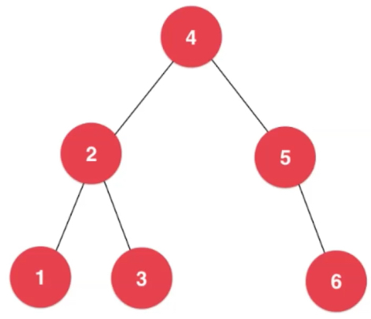

它也可以对应一个1到6排列的类似链表的，从根节点到下面每个节点都只有右子树的一个二分搜索树。

对于这种等同于链表的二分搜索树，它的高度等于节点的个数，它将退化成与链表一模一样的一棵树。这种最坏的顺序只要我们是按照123456的顺序创建就可以形成。

二分搜索树会退化为链表,虽然平均来讲是O(logn)级别的，但是当退化成链表的最差情况，会变成O(n)级别的。

>解决这个问题的方法就是要来创建平衡二叉树,在课程比较靠后的位置会给大家讲解。最准确的二分搜索树的时间复杂度是O(h)

### LeetCode中的集合相关问题以及更多集合相关问题。

804号问题:

https://leetcode-cn.com/problems/unique-morse-code-words/description/

将单词扔进集合中，然后看集合自动去重之后，剩下的集合大小。我们使用java的TreeSet进行实现，它的底层是一颗平衡二叉树(红黑树实现，不会出现最差情况，定义了更多操作)。

```java
package cn.mtianyan.leetcode_804;

import java.util.TreeSet;

class Solution {
    public int uniqueMorseRepresentations(String[] words) {
        String[] codes = {".-","-...","-.-.","-..",".","..-.","--.","....","..",".---","-.-",".-..","--","-.","---",".--.","--.-",".-.","...","-","..-","...-",".--","-..-","-.--","--.."};
        TreeSet set = new TreeSet();
        for (String word : words) {
            StringBuffer res = new StringBuffer();
            for (int i = 0; i < word.length(); i++) {
                res.append(codes[word.charAt(i) - 'a']); //a充当一个初始的偏移，a-a=0 b-a=1
            }
            set.add(res.toString());
        }
        return set.size();
    }
}
```

运行结果:


#### 有序集合和无序集合

我们之前的基于二分搜索树实现的集合，java中红黑树实现的集合本质都是有序的集合。

有序集合中的元素具有顺序性;可以从小到大遍历，可以查看前驱后继。

而链表实现的集合，实际上是一个无序的集合。我们只是根据元素插入的顺序决定了它在集合中的顺序，不能轻易的进行从小到大等操作。

就像我们刚做的那个LeetCode的题，就用不到集合的有序性，因此我们可以采用无序集合。基于哈希表的实现比搜索树更快。

搜索树保持了有序性，此时它付出的代价就是时间复杂度上稍微差于哈希表。

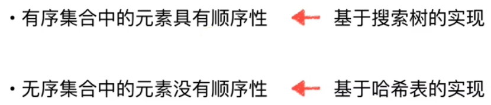

#### 多重集合

集合容纳重复元素，集合中的元素可以重复，在允许重复元素的二分搜索树基础上实现。

### 映射Map

函数一一映射。

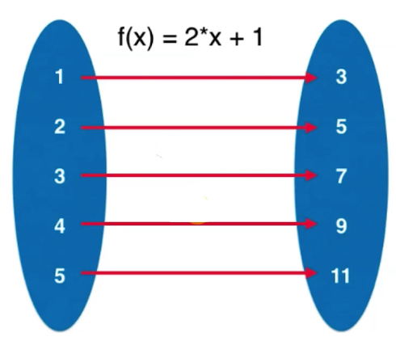

映射更形象的说法应该是字典。字典中从单词到释义: python中dict，c++ java中Map

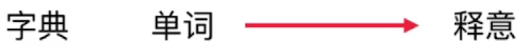

名册: 身份证号 对应到 人; 车牌号 对应 车; id 对应 信息;词频统计 单词 对应 频率。

Key 和 Value相对应的，存储(键，值)数据对的数据结构(Key, Value);根据键(Key) ，寻找值(Value)

看起来要存储两个数据，但是依然可以非常容易的使用链表或者二分搜索树进行实现。将原本存储的e，变成存储两个key 与 Value

```java
class Node{
  K key;
  V value;
  Node left;
  Node right;
}
```

```java
class Node{
  K key;
  V Value;
  Node next;
}
```

定义我们的映射接口:

```java
Map<K,V>
void add(K,V)
V remove(K)
boolean contains(K)
V get(K)
void set(K,V)
int getSize( )
boolean isEmpty()
```

remove时只指定key就可以了。contains不去管可以对应的信息。

```java
package cn.mtianyan.map;

public interface Map<K, V> {
    void add(K key, V value);

    V remove(K key);

    boolean contains(K key);

    V get(K key);

    void set(K key, V value);

    int getSize();

    boolean isEmpty();
}
```

上面就是我们定义好的映射类的接口。

```java
package cn.mtianyan.map;

import cn.mtianyan.FileOperation;

import java.util.ArrayList;

public class LinkedListMap<K, V> implements Map<K, V> {
    /**
     * Node 节点类(private 不被用户感知) For Map
     */
    private class Node {
        public K key;
        public V value;
        public Node next; // c++实现时是指针

        /**
         * 传入key和value以及next节点的构造函数
         *
         * @param key
         * @param value
         * @param next
         */
        public Node(K key, V value, Node next) {
            this.key = key;
            this.value = value;
            this.next = next;
        }

        /**
         * 只传入key,next置空。构造函数
         *
         * @param key
         */
        public Node(K key) {
            this.key = key;
            this.next = null;
        }


        /**
         * 默认构造函数，节点元素，next均为空。
         */
        public Node() {
            this(null, null, null);
        }

        /**
         * 打印节点元素信息。
         *
         * @return
         */
        @Override
        public String toString() {
            return key.toString() + ":" + value.toString();
        }
    }

    private Node dummyHead; // 虚拟头结点
    private int size; // 链表元素个数

    /**
     * LinkedListMap构造函数
     */
    public LinkedListMap() {
        dummyHead = new Node();
        size = 0;
    }

    /**
     * 获取链表中元素个数
     *
     * @return
     */
    public int getSize() {
        return size;
    }

    /**
     * 返回链表是否为空
     *
     * @return
     */
    public boolean isEmpty() {
        return size == 0;
    }

    /**
     * 辅助函数，给key，返回该节点
     *
     * @param key
     * @return
     */
    private Node getNode(K key) {
        Node cur = dummyHead.next;
        while (cur != null) {
            if (cur.key.equals(key))
                return cur;
            cur = cur.next;
        }
        return null;
    }


    /**
     * 传入key 返回是否包含该节点
     *
     * @param key
     * @return
     */
    @Override
    public boolean contains(K key) {
        return getNode(key) != null;
    }

    /**
     * 传入key，返回value。如果key不存在返回null
     *
     * @param key
     * @return
     */
    @Override
    public V get(K key) {
        Node node = getNode(key);
        return node == null ? null : node.value;
    }

    /**
     * 添加key与value，已存在的key，更新value
     *
     * @param key
     * @param value
     */
    @Override
    public void add(K key, V value) {
        // 去重
        Node node = getNode(key);
        if (node == null) {
            dummyHead.next = new Node(key, value, dummyHead.next);
            size++;
        } else {
            // 设计上如果传入已存在的key，更新value
            node.value = value;
        }
    }

    /**
     * 更新key对应的value值
     *
     * @param key
     * @param newValue
     */
    @Override
    public void set(K key, V newValue) {
        Node node = getNode(key);
        if (node == null) {
            throw new IllegalArgumentException(key + " doesn't exist");
        }
        node.value = newValue;
    }

    /**
     * 删除key对应的节点
     *
     * @param key
     * @return
     */
    @Override
    public V remove(K key) {

        Node prev = dummyHead;
        while (prev.next != null) {
            if (prev.next.key.equals(key))
                break;
            prev = prev.next;
        }

        if (prev.next != null) {
            Node delNode = prev.next;
            prev.next = delNode.next;
            delNode.next = null;
            size--;
            return delNode.value;
        }
        return null;
    }

    public static void main(String[] args) {

        System.out.println("Pride and Prejudice");

        ArrayList<String> words = new ArrayList<>();
        if (FileOperation.readFile("pride-and-prejudice.txt", words)) {
            System.out.println("Total words: " + words.size());

            LinkedListMap<String, Integer> map = new LinkedListMap<>();
            for (String word : words) {
                if (map.contains(word))
                    map.set(word, map.get(word) + 1);
                else
                    map.add(word, 1);
            }

            System.out.println("Total different words: " + map.getSize());
            System.out.println("Frequency of PRIDE: " + map.get("pride"));
            System.out.println("Frequency of PREJUDICE: " + map.get("prejudice"));
        }

        System.out.println();
    }
}
```

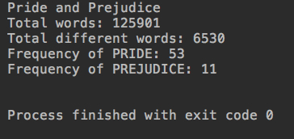

因为是由链表来实现的，而且在main中做了contains，set，add等一系列操作，所以有丢丢慢是正常的。

### 基于二分搜索树的映射实现

```java
public class BSTMap<K extends Comparable<K>,V> implements Map<K,V> {
    
}
```

这里因为底层的数据结构，二分搜索树它要求传入的值，必须是可比较的。

```java
package cn.mtianyan.map;

import cn.mtianyan.FileOperation;

import java.util.ArrayList;

public class BSTMap<K extends Comparable<K>, V> implements Map<K, V> {
    /**
     * 节点类对用户屏蔽
     */
    private class Node {
        public K key; // 节点key
        public V value;
        public Node left, right; // 左子树，右子树引用

        /**
         * 默认的节点构造函数
         *
         * @param key
         * @param value
         */
        public Node(K key, V value) {
            this.key = key;
            this.value = value;
            left = null;
            right = null;
        }
    }

    private Node root;  // 根节点
    private int size;   // 树中元素的个数

    /**
     * 默认的二分搜索树构造函数
     */
    public BSTMap() {
        root = null;
        size = 0;
    }

    /**
     * 获取搜索树中节点元素个数
     *
     * @return
     */
    @Override
    public int getSize() {
        return size;
    }

    /**
     * 二分搜索树是否为空
     *
     * @return
     */
    @Override
    public boolean isEmpty() {
        return size == 0;
    }

    /**
     * 向二分搜索树找那个添加新的键值对
     *
     * @param key
     * @param value
     */
    @Override
    public void add(K key, V value) {
        root = add(root, key, value);
    }

    /**
     * 返回插入新的键值对后二分搜索树的根
     *
     * @param node
     * @param key
     * @param value
     * @return
     */
    private Node add(Node node, K key, V value) {
        if (node == null) {
            size++;
            return new Node(key, value);
        }
        // 上面条件不满足，说明还得继续往下找左右子树为null可以挂载上的节点
        if (key.compareTo(node.key) < 0)
            // 如果e小于node.e，那么继续往它的左子树添加该节点,这里插入结果可能根发生了变化。
            node.left = add(node.left, key, value); // 新节点赋值给node.left,改变了二叉树
        else if (key.compareTo(node.key) > 0)
            // 大于，往右子树添加。
            node.right = add(node.right, key, value);
            // 如果相等
        else
            node.value = value;
        return node;
    }

    /**
     * 辅助方法: 返回以node为根节点到的二分搜索树中，key所在的节点。
     *
     * @param node
     * @param key
     * @return
     */
    private Node getNode(Node node, K key) {
        if (node == null)
            return null;
        if (key.compareTo(node.key) == 0)
            return node;
        else if (key.compareTo(node.key) < 0)
            return getNode(node.left, key);
        else // >0
            return getNode(node.right, key);
    }

    /**
     * 是否包含传入key所对应的键值对
     *
     * @param key
     * @return
     */
    @Override
    public boolean contains(K key) {
        return getNode(root, key) != null;
    }

    /**
     * 通过key获取对应的value
     *
     * @param key
     * @return
     */
    @Override
    public V get(K key) {
        Node node = getNode(root, key);
        return node == null ? null : node.value;
    }

    /**
     * 更新指定key的value值
     *
     * @param key
     * @param newValue
     */
    @Override
    public void set(K key, V newValue) {
        Node node = getNode(root, key);
        if (node == null) {
            throw new IllegalArgumentException(key + " doesn't exist");
        }

        node.value = newValue;
    }

    /**
     * 通过key删除对应的键值对
     *
     * @param key
     * @return
     */
    @Override
    public V remove(K key) {
        Node node = getNode(root, key);
        if (node != null) {
            root = remove(root, key);
            return node.value;
        }
        return null;
    }

    /**
     * 删除掉以node为根的二分搜索树中键为key的节点, 递归算法 返回删除节点后新的二分搜索树的根
     *
     * @param node
     * @param key
     * @return
     */
    private Node remove(Node node, K key) {

        if (node == null)
            return null;

        if (key.compareTo(node.key) < 0) {
            node.left = remove(node.left, key);
            return node;
        } else if (key.compareTo(node.key) > 0) {
            node.right = remove(node.right, key);
            return node;
        } else {   // e.compareTo(node.e) == 0

            // 待删除节点左子树为空的情况
            if (node.left == null) {
                Node rightNode = node.right;
                node.right = null;
                size--;
                return rightNode;
            }

            // 待删除节点右子树为空的情况
            if (node.right == null) {
                Node leftNode = node.left;
                node.left = null;
                size--;
                return leftNode;
            }

            // 待删除节点左右子树均不为空的情况

            // 找到比待删除节点大的最小节点, 即待删除节点右子树的最小节点
            // 用这个节点顶替待删除节点的位置
            Node successor = minimum(node.right);
            successor.right = removeMin(node.right);
            successor.left = node.left;

            node.left = node.right = null;

            return successor;
        }
    }

    /**
     * 寻找二分搜索树的最小key(面向用户)
     *
     * @return
     */
    public K minimum() {
        if (size == 0)
            throw new IllegalArgumentException("BST is empty");

        Node minNode = minimum(root);
        return minNode.key;
    }

    /**
     * 返回以node为根的二分搜索树的最小key值所在的节点
     *
     * @param node
     * @return
     */
    private Node minimum(Node node) {
        if (node.left == null)
            return node;

        return minimum(node.left);
    }

    /**
     * 从二分搜索树中删除最小key值所在节点, 返回最小值
     *
     * @return
     */
    public K removeMin() {
        K ret = minimum();
        root = removeMin(root);
        return ret;
    }

    /**
     * 删除掉以node为根的二分搜索树中的最小key值节点 返回删除节点后新的二分搜索树的根
     *
     * @param node
     * @return
     */
    private Node removeMin(Node node) {

        if (node.left == null) {
            Node rightNode = node.right;
            node.right = null;
            size--;
            return rightNode;
        }

        node.left = removeMin(node.left);
        return node;
    }

    public static void main(String[] args) {

        System.out.println("Pride and Prejudice");

        ArrayList<String> words = new ArrayList<>();
        if (FileOperation.readFile("pride-and-prejudice.txt", words)) {
            System.out.println("Total words: " + words.size());

            BSTMap<String, Integer> map = new BSTMap<>();
            for (String word : words) {
                if (map.contains(word))
                    map.set(word, map.get(word) + 1);
                else
                    map.add(word, 1);
            }

            System.out.println("Total different words: " + map.getSize());
            System.out.println("Frequency of PRIDE: " + map.get("pride"));
            System.out.println("Frequency of PREJUDICE: " + map.get("prejudice"));
        }

        System.out.println();
    }

}
```

运行结果:

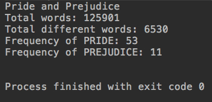

这里可以感受到BST的map相比链表实现的快了很多。

### 映射的复杂度分析和更多映射问题

```java
package cn.mtianyan;

import cn.mtianyan.map.BSTMap;
import cn.mtianyan.map.LinkedListMap;
import cn.mtianyan.map.Map;

import java.util.ArrayList;

public class CompareTwoBstLInkedListMap {
    private static double testMap(Map<String, Integer> map, String filename){

        long startTime = System.nanoTime();

        System.out.println(filename);
        ArrayList<String> words = new ArrayList<>();
        if(FileOperation.readFile(filename, words)) {
            System.out.println("Total words: " + words.size());

            for (String word : words){
                if(map.contains(word))
                    map.set(word, map.get(word) + 1);
                else
                    map.add(word, 1);
            }

            System.out.println("Total different words: " + map.getSize());
            System.out.println("Frequency of PRIDE: " + map.get("pride"));
            System.out.println("Frequency of PREJUDICE: " + map.get("prejudice"));
        }

        long endTime = System.nanoTime();

        return (endTime - startTime) / 1e9;
    }

    public static void main(String[] args) {

        String filename = "pride-and-prejudice.txt";

        BSTMap<String, Integer> bstMap = new BSTMap<>();
        double time1 = testMap(bstMap, filename);
        System.out.println("BST Map: " + time1 + " s");

        System.out.println();

        LinkedListMap<String, Integer> linkedListMap = new LinkedListMap<>();
        double time2 = testMap(linkedListMap, filename);
        System.out.println("Linked List Map: " + time2 + " s");

    }
}
```

运行结果:

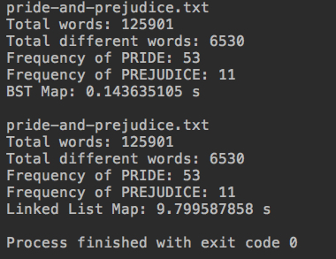

可以看到，得到的数据是一致的，但是运行的时间上，链表实现的要比二分搜索树慢的多。

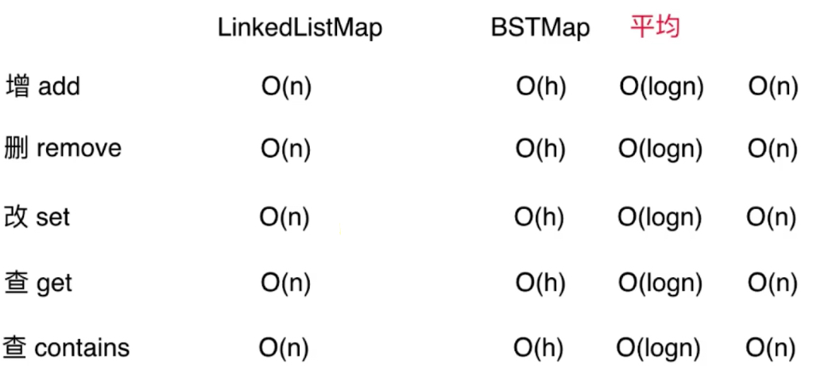

#### 有序映射和无序映射

有序映射中的键具有顺序性，基于搜索树的实现;无序映射中的键没有顺序性，基于哈希表的实现。

#### 多重映射

多重映射中的键可以重复。

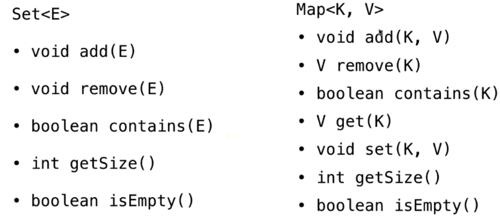

这两种数据结构都既可以使用链表实现，又可以使用二分搜索树实现，实现时有很多相通之处，理解成映射也是一个集合，是一个键值对的集合，而且每一个键还携带了一个value。因为之前我们的集合只能存储一个元素，相应map重写了很多方法。

基于集合的实现，实现映射。 或基于映射的实现，实现集合。重定义集合中元素是一个键值对，并定义比较是根据key来比较的规则。

更常见基于映射，包装成集合。只考虑键，所有value为null。（因为映射方法多）。也可以从树结构开始就进行泛型。

### LeetCode上更多集合和映射的问题

https://leetcode-cn.com/problems/intersection-of-two-arrays/description/

两个数组的交集: 输出结果中的每个元素一定是唯一的，借助集合。

```java
package cn.mtianyan.leetcode_349;

import java.util.ArrayList;
import java.util.TreeSet;

class Solution {
    public int[] intersection(int[] nums1, int[] nums2) {
        TreeSet<Integer> set = new TreeSet<>();
        // 对于nums1进行去重存入set
        for (int num : nums1) {
            set.add(num);
        }
        ArrayList<Integer> list = new ArrayList<>();
        // 对于nums2进行遍历
        for (int num: nums2){
            // 如果是set中已经有的元素，那么就加入结果ArrayList中
            if (set.contains(num)){
                list.add(num);
                // 将set中该元素去除，那么num2中重复的不会再被匹配到，因为set是删一个少一个。
                set.remove(num);
            }
        }
        int[] res = new int[list.size()];
        for (int i = 0; i < list.size(); i++) {
            res[i] = list.get(i);
        }
        return res;
    }
}
```


350 https://leetcode-cn.com/problems/intersection-of-two-arrays-ii/description/

考虑重复元素的计数，使用映射实现。

```java
package cn.mtianyan.leetcode_350;

import java.util.ArrayList;
import java.util.TreeMap;

class Solution {
    public int[] intersect(int[] nums1, int[] nums2) {
        TreeMap<Integer,Integer> map = new TreeMap<>();
        // 遍历nums1
        for (int num : nums1) {
            // 如果map中不包含nums1的数字。
            if (!map.containsKey(num))
                map.put(num,1); // map中put进该num，并为其计次1
            else
                map.put(num,map.get(num)+1); // 如果map中已经有该键值，num+1
        }
        // 此时map <1,2> <2,2>
        ArrayList<Integer> list = new ArrayList<>();
        // 遍历nums2
        for (int num : nums2) {
            // 如果map中已经包含该键值，说明是公共键
            if (map.containsKey(num)){
                list.add(num); // 公共键添加进值列表中 2 2
                map.put(num,map.get(num)-1); // <1,2> <2,1> | <2,0>
                if (map.get(num) == 0)
                    map.remove(num);
            }
        }

        int[] res = new int[list.size()];
        for (int i = 0; i < list.size(); i++) {
            res[i] = list.get(i);
        }
        return res;
    }
}
```

运行结果:


标签: 哈希表的大多数问题也可以使用TreeSet 和Treemap;也可以使用HashSet HashMap。我们提供了两种底层实现，但是接口相同。Treeset TreeMap 底层是平衡二叉树(红黑树)，而HashMap HashSet 底层是哈希表。底层不需要管，只需要实现相应的功能，不同实现时间复杂度不同。

TreeSet和TreeMap实现 时间上没有问题 logn也是很小的了。集合和映射是算法面试的重灾区。

下一章对于堆进行学习，堆的学习会让我们对于队列也会更深认识。


