前面我们介绍了二分搜索树，以及通过二分搜索树实现的集合和映射这两个更加高层次的数据结构。

树这种数据结构在计算机领域有重要作用，之所以重要，是因为树可以产生很多扩展,面对不同的问题稍微改变或限制树这种数据结构的性质，从而产生不同的数据结构，高效解决不同的问题。

下面的四章中，我们会为大家展示四种不同树的例子: 堆 线段树 字典树 并查集。通过这些不同的树的学习，希望大家可以体会到数据结构的灵活之处，以及设计数据结构时的思考。学到四种不同树形结构，也对数据结构有更深认识。

#### 优先队列

什么是优先队列？

普通队列: 先进先出;后进后出 

优先队列:出队顺序和入队顺序无关;优先级高者早出队和优先级相关 （医院，患者优先级）

操作系统中任务的调度，动态选择优先级最高的任务执行。如果我们的任务不是动态，那么我们只需要一个排序算法就好了。

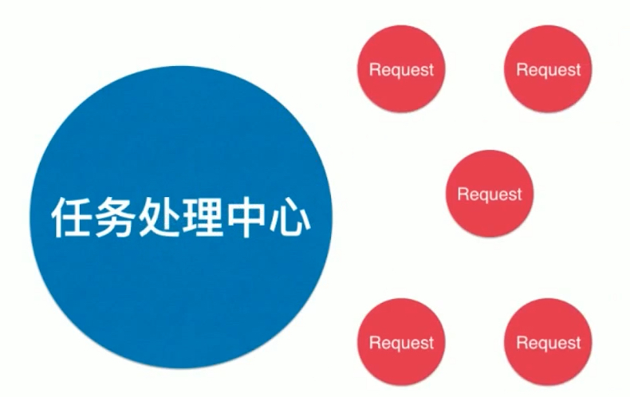

处理旧任务的同时也会有新任务不断的加入，因此此处的关键词**(动态)** 

不能一开始确定有多少个任务，而是动态的不停有新元素入队，也有旧元素出队，因此我们要使用优先队列。

游戏中的AI(LOL中的小兵) 


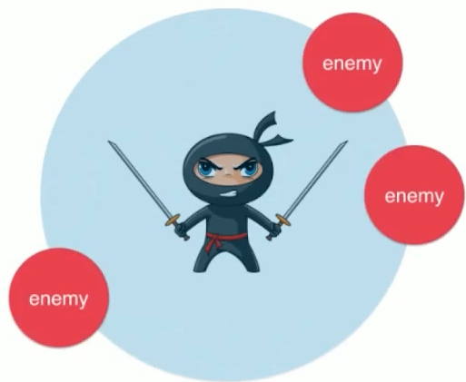

同时面对好几个敌人时，使用优先队列，优先打优先级最高的(距离最近，血最残？)。新的敌人在靠近，动态的。

优先队列的接口（本质依然是个队列）

```java
Interface Queue<E>
void enqueue(E)
E dequeue()
E getFront()
int getSize()
boolean isEmpty()
```

对于我们的优先队列来说，实现这些接口的时候，具体这些接口实现出来的功能会有区别。最大的区别在于出队和队首元素是谁这两个操作。此时出队元素应该是优先级最高的元素，队首的元素也是优先级最高的元素，而不是最早进入的那个。

可以使用不同的底层实现: 

普通线性结构： 有一项操作"出队"是O(n)级别的，对于n个元素来说，它的时间复杂度就是n^2级别的，相对来说就是一个很慢的了。无论是之前在集合映射中使用链表实现，或者是队列中使用动态数组，因为O(n)的操作而很慢。

顺序线性结构: 维持顺序需要O(n) 出队就只需要O(1)了

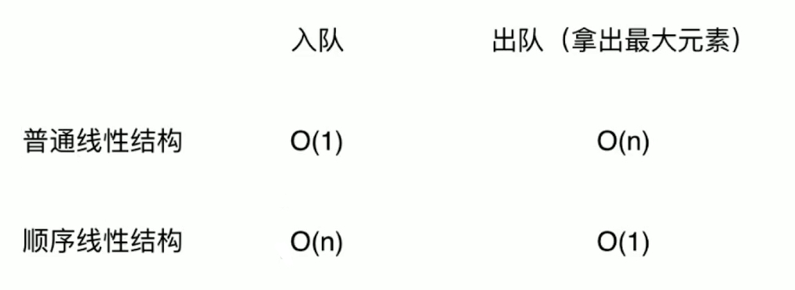

它们都有一方面的劣势，可以自己使用动态数组或链表进行实现作为练习,与堆进行比较。

堆的入队操作和出队操作都可以做到O(logn)级别。

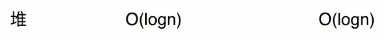

而且与我们前面的二分搜索树不同，不是平均在O(logn),而是最差都是O(logn)，使得堆相当的高效。

### 堆的基础表示

堆作为优先队列的底层实现，计算机科学领域，通常见到O(logn)都与树有关，不一定是显式的构造了一棵树;比如排序中归并排序，快速排序都是nlogn级别的，在排序的过程中没有使用树这种数据结构，但是递归的过程其实形成了一棵递归树。

堆本身也是一棵树，二叉堆(Binary Heap)

二叉堆是一棵完全二叉树。

- 满二叉树概念: 除了叶子节点，所有的节点的左右孩子都不为空，就是一棵满二叉树，如下图。

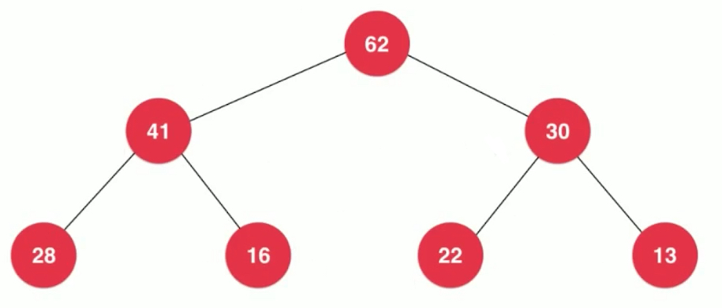

所有的节点都即拥有左孩子，又拥有右孩子，就是一棵满二叉树。

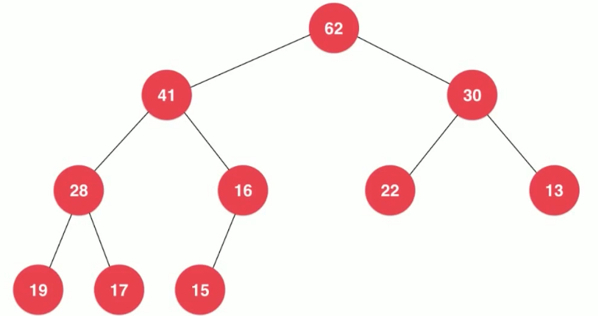

如上图是一棵完全二叉树，特点: 不一定是一个满二叉树，但它不满的那部分一定在右下侧。满二叉树中有多少层对应有多少节点变成了一个固定的事情。那我们要加入的节点并不是对应一整层，那么上一层满了，下一层从左到右依次排开。

最下面一层肯定都是叶子节点，上面一层即使有叶子节点，也一定分布在右侧。完全二叉树:把元素顺序按层排列成树的形状

#### 二叉堆的性质

堆中某个节点的值总是不大于其父节点的值。(所有节点的值都大于等于它的孩子节点的值)

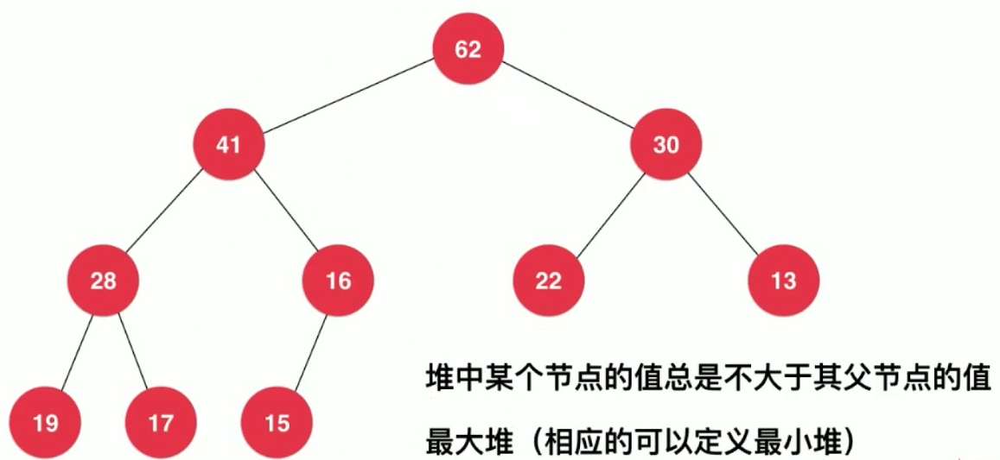
 
这样得到的是最大堆，相应的我们也可以定义出最小堆。某种程度上，最大堆和最小堆是可以统一的，因为什么是大，什么是小是我们可以定义的。 

只保证自己的父亲节点比自己大，但是节点的层次和节点的大小之间是没有必然联系的。比如，第二层的13，层数比第三层的任何一个元素都小，但是值却并不小于。

因为完全二叉树，按顺序码放。

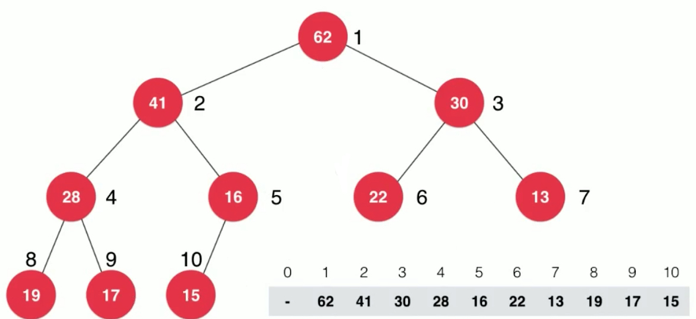

我们就可以用过这样的一个数组来表示这个完全二叉树。数组存储节点i的左右孩子的规律。

```java
parent(i) = i/2

left child(i) = 2*i;
right child(i) = 2*i+1;
```

可以使用数学归纳法来证明上面的关系对于完全二叉树是成立的。一般数组存储二叉堆由1开始，公式如上。如果从0开始，会有一个偏移。

```java
parent(i) = (i-1)/2

left child(i) = 2*i+1;
right child(i) = 2*i+2;
```

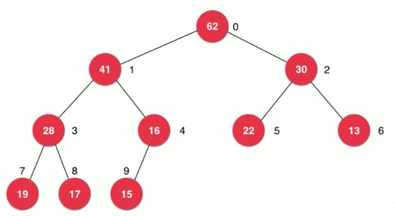

可以通过该图验证公式。

#### 完成堆的基础实现

```java
package cn.mtianyan.heap;

import cn.mtianyan.array.Array;

public class MaxHeap<E extends Comparable<E>> {
    private Array<E> data;

    /**
     * 带参构造函数，传入容量，调用带容量的数组构造
     *
     * @param capacity
     */
    public MaxHeap(int capacity) {
        data = new Array<>(capacity);
    }

    /**
     * 默认无参构造函数
     */
    public MaxHeap() {
        data = new Array<>();
    }

    /**
     * 返回堆中元素个数
     *
     * @return
     */
    public int size() {
        return data.getSize();
    }

    /**
     * 返回堆是否为空
     *
     * @return
     */
    public boolean isEmpty() {
        return data.isEmpty();
    }

    /**
     * 计算传入的index的父亲节点index值
     *
     * @param index
     * @return
     */
    private int parent(int index) {
        if (index == 0)
            throw new IllegalArgumentException("index 0 doesn't have parent.");
        return (index - 1) / 2;
    }

    /**
     * 计算传入的index的左孩子index值
     *
     * @param index
     * @return
     */
    private int left(int index) {
        return (2 * index + 1);
    }

    /**
     * 计算传入的index的右孩子节点index值
     *
     * @param index
     * @return
     */
    private int right(int index) {
        return (2 * index + 2);
    }

}
```

### 向堆中添加元素和Sift Up

从用户的角度是添加元素，从堆内部实现角度涉及堆中一个非常常见的操作 Sift Up.

堆中元素上浮的一个过程。

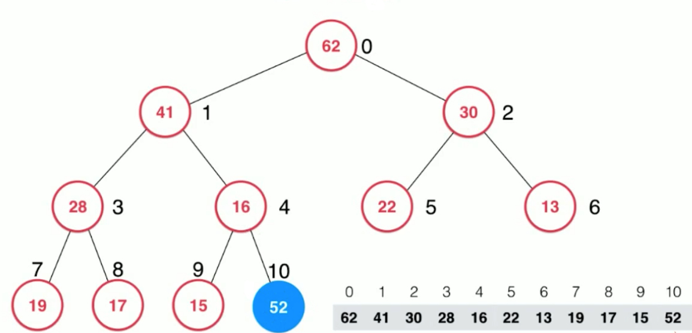

加入元素是非常简单的，直接添加进数组即可，但是可以看到，此时的树结构就不满足最大堆的要求: 父亲最大，16的儿子比16还大了。因此52要执行上浮操作。一个好好的堆怎么就出问题了呢？唯一的原因只会出现在52这个节点的新增，因此只需要将52不断的与它的父亲节点作比较，如果父亲小，就跟父亲互换，一直上浮互换，直到52不比自己的父亲大。

>这里52 和 16 和 41 进行了两次互换操作。

#### 编码向堆中添加元素

```java

    /**
     * 交换传入的索引两个位置的元素值
     *
     * @param i
     * @param j
     */
    public void swap(int i, int j) {
        if (i < 0 || i >= size || j < 0 || j >= size)
            throw new IllegalArgumentException("Index is illegal.");

        E temp = data[i];
        data[i] = data[j];
        data[j] = temp;
    }
```

数组中添加交换两元素位置的方法。

```java
/**
     * 堆中添加元素方法。
     *
     * @param e
     */
    public void add(E e) {
        data.addLast(e);
        siftUp(data.getSize() - 1);
    }

    /**
     * index 为i位置元素上浮。
     *
     * @param i
     */
    private void siftUp(int i) {
        // 当上浮元素大于父亲，继续上浮。并且不能上浮到0之上
        // 直到i 等于 0 或 比 父亲节点小了。
        while (i > 0 && data.get(i).compareTo(data.get(parent(i))) > 0) {
            // 数组Array中添加方法swap
            data.swap(i, parent(i));
            i = parent(i); // 这句话让i来到新的位置，使得循环可以查看新的位置是否还要大。
        }
    }
```

### 取出堆中最大元素和Sift Down

最大堆只能取最大的那个元素，数组为0的位置，拿出去之后。将两棵子树合并的操作比较麻烦。

>我们可以将最后一个元素填充到堆顶，然后不断的下沉这个元素。每次都与两个孩子进行比较，选择两个孩子中最大的那个元素，如果两个孩子中最大的那个元素比它自己还要大的话，那么它自己就和两个孩子中最大的那个交换位置。16的新位置有可能依然要下沉，再次与孩子比较。

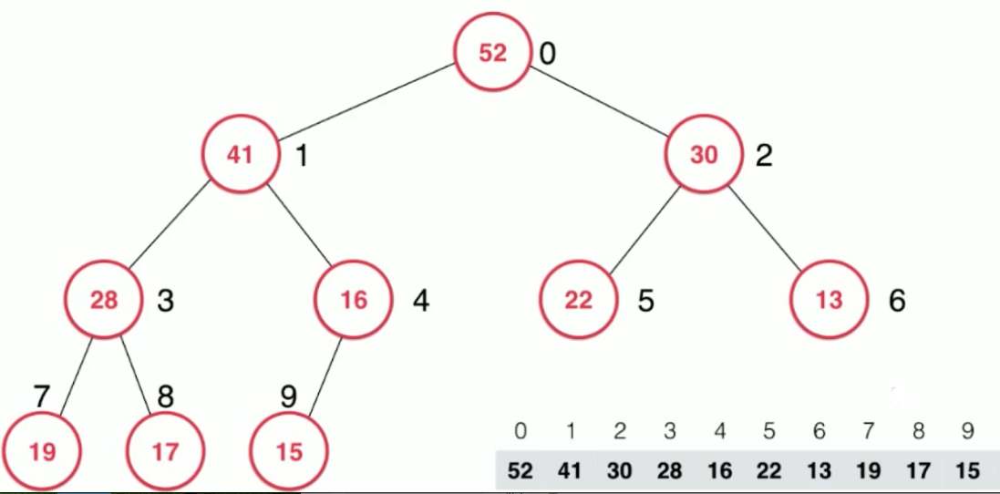

#### 编程实现

```java
/**
     * 看堆中的最大元素
     *
     * @return
     */
    public E findMax() {
        if (data.getSize() == 0)
            throw new IllegalArgumentException("Can not findMax when heap is empty.");
        return data.get(0);
    }

    /**
     * 取出堆中最大元素
     *
     * @return
     */
    public E extractMax() {

        E ret = findMax();

        data.swap(0, data.getSize() - 1); // 0位置元素和最后一个元素互换。
        data.removeLast(); // 删除此时的最后一个元素(最大值)
        siftDown(0); // 对于0处进行siftDown操作

        return ret;
    }

    /**
     * k位置元素下移
     *
     * @param k
     */
    private void siftDown(int k) {

        // k节点已经是叶子节点没有孩子了肯定不用下沉了。k的左孩子索引=size时已经越界了，肯定没有值了。
        while (left(k) < data.getSize()) {
            int j = left(k); // 在此轮循环中,data[k]和data[j]交换位置
            // 右孩子有可能不存在，条件: 有右孩子，右孩子的值大于左孩子的值。
            if (j + 1 < data.getSize() &&
                    data.get(j + 1).compareTo(data.get(j)) > 0)
                j++; // 此时j因为++了，存储的是右孩子的索引了。
            // data[j] 是 leftChild 和 rightChild 中的最大值

            if (data.get(k).compareTo(data.get(j)) >= 0)
                break; // 大于时没有违反堆的性质，结束。

            data.swap(k, j);
            k = j;
        }
    }
```

```java
package cn.mtianyan;

import cn.mtianyan.heap.MaxHeap;

import java.util.Random;

public class Main {

    public static void main(String[] args) {

        int n = 1000000;

        MaxHeap<Integer> maxHeap = new MaxHeap<>();
        Random random = new Random();
        for(int i = 0 ; i < n ; i ++)
            maxHeap.add(random.nextInt(Integer.MAX_VALUE));

        int[] arr = new int[n];
        for(int i = 0 ; i < n ; i ++)
            arr[i] = maxHeap.extractMax();

        for(int i = 1 ; i < n ; i ++)
            if(arr[i-1] < arr[i])
                throw new IllegalArgumentException("Error");

        System.out.println("Test MaxHeap completed.");
    }
}
```

运行结果:

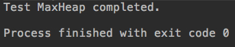

这里就是堆排序，对于100万数字进行了排序，速度还是很快的。真正的堆排序有优化空间，现在是把数据扔进去，再一个一个取出来，但是利用堆组织数据的思想，完全可以做到原地排序。

add和extractMax时间复杂度都是O(logn) 还是二叉树的高度级别O(h) 但是因为堆是一课完全二叉树，它永远不会退化成一个链表。

### Heapify操作和replace操作

replace:取出最大元素后，放入一个新元素

实现: 可以先extractMax,再add,两次O(logn)的操作
实现: 可以直接将堆顶元素替换以后Sift Down,一次O(logn)的操作

```java
    /**
     * 取出堆中的最大元素，并且替换成元素e
     * @param e
     * @return
     */
    public E replace(E e){

        E ret = findMax();
        data.set(0, e);
        siftDown(0);
        return ret;
    }
```

heapify: 将任意数组整理成堆的形状

```java
    /**
     * 将任意数组整理成堆的形状
     *
     * @param arr
     */
    public MaxHeap(E[] arr) {
        data = new Array<>(arr);
        for (int i = parent(arr.length - 1); i >= 0; i--)
            siftDown(i);
    }
```

Heapify是倒着从最后一个元素的父亲节点开始倒着遍历进行siftdown操作。

#### Heapify的算法复杂度

将n个元素逐个插入到一个空堆中，算法复杂度是O(nlogn)

heapify的过程，算法复杂度为O(n)

```java
package cn.mtianyan.heap;

import java.util.Random;

public class CompareHeapifyHeap {

    private static double testHeap(Integer[] testData, boolean isHeapify){

        long startTime = System.nanoTime();

        MaxHeap<Integer> maxHeap;
        if(isHeapify)
            maxHeap = new MaxHeap<>(testData);
        else{
            maxHeap = new MaxHeap<>();
            for(int num: testData)
                maxHeap.add(num);
        }

        int[] arr = new int[testData.length];
        for(int i = 0 ; i < testData.length ; i ++)
            arr[i] = maxHeap.extractMax();

        for(int i = 1 ; i < testData.length ; i ++)
            if(arr[i-1] < arr[i])
                throw new IllegalArgumentException("Error");
        System.out.println("Test MaxHeap completed.");

        long endTime = System.nanoTime();

        return (endTime - startTime) / 1e9;
    }

    public static void main(String[] args) {

        int n = 10000000;

        Random random = new Random();
        Integer[] testData = new Integer[n];
        for(int i = 0 ; i < n ; i ++)
            testData[i] = random.nextInt(Integer.MAX_VALUE);

        double time1 = testHeap(testData, false);
        System.out.println("Without heapify: " + time1 + " s");

        double time2 = testHeap(testData, true);
        System.out.println("With heapify: " + time2 + " s");
    }
}
```

100 万级别的数据
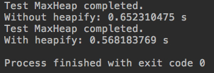

1000 万级别的数据
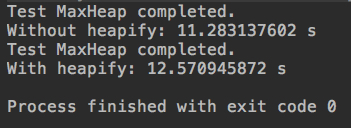

可以看出100万时heapify操作的更快一点，但是到了1000万不加heap操作更快。

### 基于堆的优先队列

```java
package cn.mtianyan.queue;

import cn.mtianyan.heap.MaxHeap;

public class PriorityQueue<E extends Comparable<E>> implements Queue<E> {

    private MaxHeap<E> maxHeap;

    public PriorityQueue(){
        maxHeap = new MaxHeap<>();
    }

    @Override
    public int getSize(){
        return maxHeap.size();
    }

    @Override
    public boolean isEmpty(){
        return maxHeap.isEmpty();
    }

    @Override
    public E getFront(){
        return maxHeap.findMax();
    }

    @Override
    public void enqueue(E e){
        maxHeap.add(e);
    }

    @Override
    public E dequeue(){
        return maxHeap.extractMax();
    }
}
```

优先队列可以使用动态数组或链表，或者自己维护一个顺序的线性结构(动态数组或链表)。也是可以实现优先队列的，接口是完全一致，底层不同实现性能不同。

数组，入队O(1)复杂度，出队时寻找最大值O(n)复杂度。顺序的线性结构 入队O(n) 出队O(1)

### LeetCode优先队列相关问题

优先队列的经典问题 在1000000个元素中选出前100名? 在N个元素中选出前M个元素

关键是M是远远小于N的； 排序，NlogN

使用优先队列: NlogM解决问题。使用优先队列，维护当前看到的前M个元素，如果新元素比最小元素大，就替换进去。我们需要使用最小堆才能快速的看到前M个元素中最小的元素。不断替换掉前M中最小的那个。

就使用最大堆，我们可以自行定义优先级的大小。(定义 元素值越小，优先级越高)

347 LeetCode https://leetcode-cn.com/problems/top-k-frequent-elements/description/

先求出所有元素的频次，然后根据频次(Map)求前k高。

```java
package cn.mtianyan.leetcode_347;

import cn.mtianyan.queue.PriorityQueue;

import java.util.LinkedList;
import java.util.List;
import java.util.TreeMap;

class Solution {
    private class Freq implements Comparable<Freq> {

        public int e, freq;

        public Freq(int e, int freq) {
            this.e = e;
            this.freq = freq;
        }

        /**
         * 定义比较规则，频次越低优先级越高。
         *
         * @param another
         * @return
         */
        @Override
        public int compareTo(Freq another) {
            if (this.freq < another.freq)
                return 1;
            else if (this.freq > another.freq)
                return -1; // 当前元素比传进来的元素要大的话，返回1。这是正常大则优先级高，我们这里颠倒一下即可。
            else
                return 0;
        }
    }

    public List<Integer> topKFrequent(int[] nums, int k) {

        TreeMap<Integer, Integer> map = new TreeMap<>();
        for (int num : nums) {
            if (map.containsKey(num))
                map.put(num, map.get(num) + 1);
            else
                map.put(num, 1);
        }

        PriorityQueue<Freq> pq = new PriorityQueue<>();
        for (int key : map.keySet()) {
            // 还没有存够k个
            if (pq.getSize() < k)
                pq.enqueue(new Freq(key, map.get(key)));
            // 替换频次最小的那个
            else if (map.get(key) > pq.getFront().freq) {
                pq.dequeue();
                pq.enqueue(new Freq(key, map.get(key)));
            }
        }

        LinkedList<Integer> res = new LinkedList<>();
        while (!pq.isEmpty())
            res.add(pq.dequeue().e);
        return res;
    }

    private static void printList(List<Integer> nums) {
        for (Integer num : nums)
            System.out.print(num + " ");
        System.out.println();
    }

    public static void main(String[] args) {

        int[] nums = {1, 1, 1, 2, 2, 3};
        int k = 2;
        printList((new Solution()).topKFrequent(nums, k));
    }
}
```

运行结果:


### 使用java标准库中的PriorityQueue

java的PriorityQueue内部默认是一个最小堆。

```java
            public int compareTo(Freq another){
                if(this.freq < another.freq)
                    return -1;
                else if(this.freq > another.freq)
                    return 1;
                else
                    return 0;
            }
```

我们对于freq的比较就应该遵循原始大小定义。

```java
package cn.mtianyan.leetcode_347;

import java.util.LinkedList;
import java.util.List;
import java.util.PriorityQueue;
import java.util.TreeMap;

    public class SolutionOffical {

        private class Freq implements Comparable<Freq>{

            public int e, freq;

            public Freq(int e, int freq){
                this.e = e;
                this.freq = freq;
            }

            public int compareTo(Freq another){
                if(this.freq < another.freq)
                    return -1;
                else if(this.freq > another.freq)
                    return 1;
                else
                    return 0;
            }
        }

        public List<Integer> topKFrequent(int[] nums, int k) {

            TreeMap<Integer, Integer> map = new TreeMap<>();
            for(int num: nums){
                if(map.containsKey(num))
                    map.put(num, map.get(num) + 1);
                else
                    map.put(num, 1);
            }

            PriorityQueue<Freq> pq = new PriorityQueue<>();
            for(int key: map.keySet()){
                if(pq.size() < k)
                    pq.add(new Freq(key, map.get(key)));
                else if(map.get(key) > pq.peek().freq){
                    pq.remove();
                    pq.add(new Freq(key, map.get(key)));
                }
            }

            LinkedList<Integer> res = new LinkedList<>();
            while(!pq.isEmpty())
                res.add(pq.remove().e);
            return res;
        }

        private static void printList(List<Integer> nums){
            for(Integer num: nums)
                System.out.print(num + " ");
            System.out.println();
        }

        public static void main(String[] args) {

            int[] nums = {1, 1, 1, 2, 2, 3};
            int k = 2;
            printList((new Solution()).topKFrequent(nums, k));
        }
    }
```

之前在我们自己的代码中，设定了一个属于自己的结构:`Freq implements Comparable<Freq>`。使它可比较，规定它的优先级定义很容易。

很多时候我们想改变的是java标准库中类相应的比较方式，自己设计的PriorityQueue是不胜任的。

Java设计的这个PriorityQueue为我们提供了一个解决方案。

```java
    private class Freq {

        public int e, freq;

        public Freq(int e, int freq) {
            this.e = e;
            this.freq = freq;
        }
    }

    private class FreqComparator implements Comparator<Freq> {

        @Override
        public int compare(Freq a, Freq b) {
            return a.freq - b.freq; // 对于char int型可以这样写。
        }
    }
```

FreqComparator类的比较器 实现Comparator接口; 重写compare方法。

```java
PriorityQueue<Freq> pq = new PriorityQueue<>(new FreqComparator());
```

优先队列在构造的时候是可以传入比较器的,这样写的好处，java中传的是字符串对象，默认字典序比较，如果你有自己定制的字符串比较方案，定义自己的Comparator接口传给优先队列。我们自己的优先队列以及它的底层实现堆我们也可以采用这种设计。

因为这个FreqComparator就只会被用在传给优先队列进行设置，只使用这一次,可以使用匿名类。

```java
        PriorityQueue<Freq> pq = new PriorityQueue<>(n1ew Comparator<Freq>() {
            @Override
            public int compare(Freq a, Freq b) {
                return a.freq - b.freq;
            }
        });
```

```java
        PriorityQueue<Integer> pq = new PriorityQueue<>(new Comparator<Integer>() {
            @Override
            public int compare(Integer a, Integer b) {
                return map.get(a) - map.get(b);
            }
        });
```

将我们这个算法中整数的比较重定义为map中key对应频次的比较。

```java
package cn.mtianyan.leetcode_347;

/// 347. Top K Frequent Elements
/// https://leetcode.com/problems/top-k-frequent-elements/description/

import java.util.*;

public class SolutionIntegerCompareReDfine {

    public List<Integer> topKFrequent(int[] nums, int k) {

        TreeMap<Integer, Integer> map = new TreeMap<>();
        for(int num: nums){
            if(map.containsKey(num))
                map.put(num, map.get(num) + 1);
            else
                map.put(num, 1);
        }

        PriorityQueue<Integer> pq = new PriorityQueue<>(new Comparator<Integer>() {
            @Override
            public int compare(Integer a, Integer b) {
                return map.get(a) - map.get(b);
            }
        });
        for(int key: map.keySet()){
            if(pq.size() < k)
                pq.add(key);
            else if(map.get(key) > map.get(pq.peek())){
                pq.remove();
                pq.add(key);
            }
        }

        LinkedList<Integer> res = new LinkedList<>();
        while(!pq.isEmpty())
            res.add(pq.remove());
        return res;
    }

    private static void printList(List<Integer> nums){
        for(Integer num: nums)
            System.out.print(num + " ");
        System.out.println();
    }

    public static void main(String[] args) {

        int[] nums = {1, 1, 1, 2, 2, 3};
        int k = 2;
        printList((new Solution()).topKFrequent(nums, k));
    }
}
```

```java
        PriorityQueue<Integer> pq = new PriorityQueue<>(
                Comparator.comparingInt(map::get)
        );// (a, b) -> map.get(a) - map.get(b)
```

使用java8 lambda表达式。

### 和堆相关的更多话题

我们主要实现的是二叉堆。最容易拓展成d叉堆,层数更低。

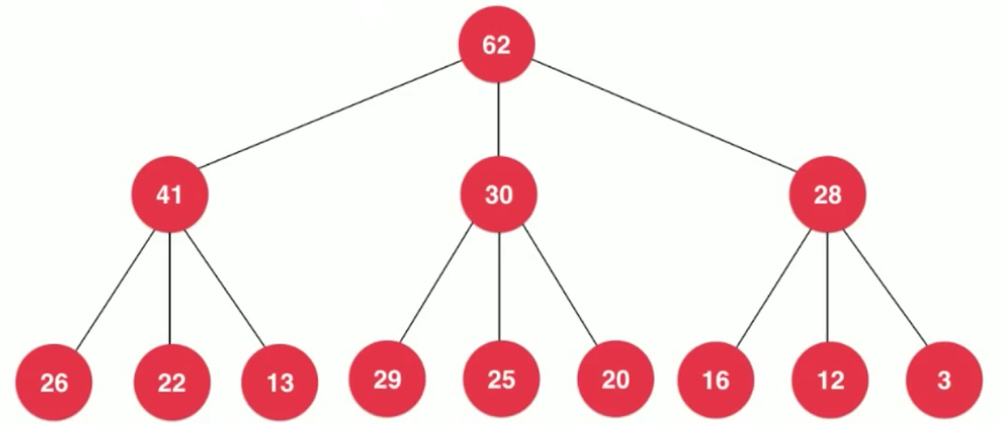

相应的代价，下沉时要考虑的节点变多了。

我们的实现只能看到堆首元素，不能对堆中某一个索引的元素进行修改。索引堆在算法与数据结构课程里进行了讲解。第四章中堆和堆排序中有讲,图论中使用索引堆进行优化。

二项堆和斐波那契堆。

#### 广义队列: 优先队列

普通队列，优先队列，栈也可以理解成是一个队列。

二分搜索树的非递归的前序遍历，层序遍历。基本逻辑完全一样，区别是栈和队列。逻辑一致，数据结果不同。 算法可视化走迷宫: 深度与广度的内在联系,随机队列。

下一章介绍线段树。


 


