上一章我们介绍了堆，这一章我们介绍一种新的树结构，线段树(区间树) Segment Tree

#### 为什么使用线段树？

对于有一类问题，我们关心的是线段(或者区间)

最经典的线段树问题, 区间染色:有一面墙，长度为n，每次选择一段儿墙进行染色

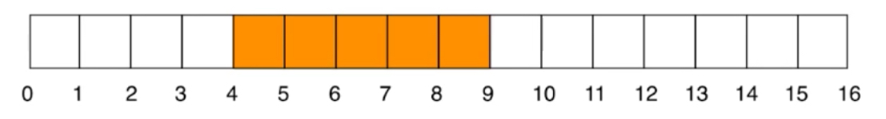

4-9染成橙色之后，对于7-15绘制绿色。橙色被绿色覆盖

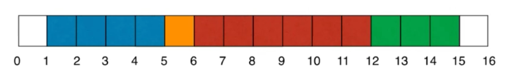

1-5绘制成蓝色，6-12绘制红色。

m次操作后，我们可以看见多少种颜色? m次操作后，我们可以在[i, j]区间内看见多少种颜色?

整个问题: 我们关注区间。染色操作(更新区间) 查询操作(查询区间) 染色操作遍历一遍，查询遍历一遍区间。

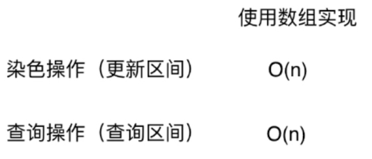

另一类经典问题: 区间查询

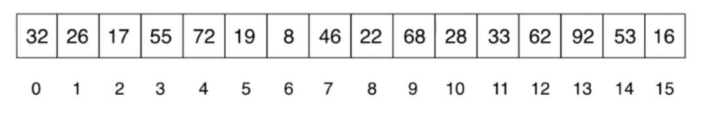

查询一个区间[i, j]的最大值，最小值，或者区间数字和.实质:基于区间的统计查询

例如: 2017年注册用户中消费最高的用户?消费最少的用户?学习时间最长的用户?某个太空区间中天体总量?

动态的一个查询，并不限定于2017年的历史数据，有可能2018年他还是在消费的，数据依然在不断的变化。天体从区间跑到另一个区间。

>也就是数据在不断的更新，我们也可以进行不断的查询。

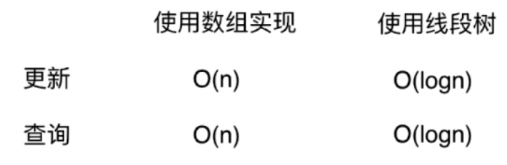
 
对于这类区间类的问题，使用线段树，它的时间复杂度将变为O(logn)级别的。看到logn，大家应该意识到线段树也是一种二叉树结构的。

对于给定区间进行两个操作 更新: 更新区间中一个元素或者一个区间的值;查询: 一个区间[i, j]的最大值，最小值，或者区间数字和

实现: (线段树的区间本身是固定的，2017年注册的用户)

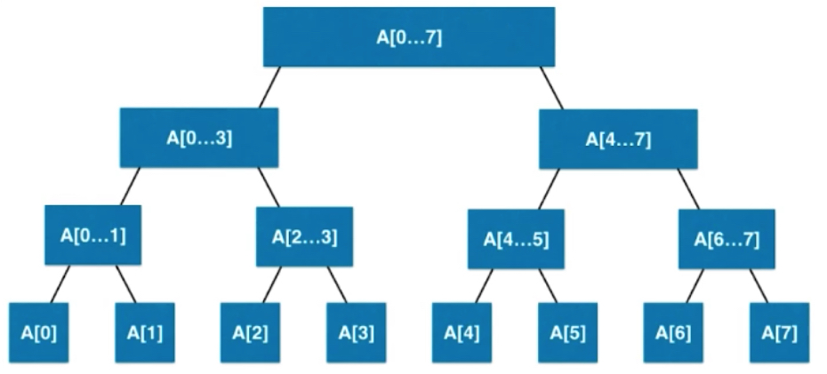

与所有的二叉树一样，它有一个一个的节点。每一个节点表示的是一个区间内相应的信息。以求和为例。最后一层区间长度为1的单个节点。

查询2-5 区间进行合成操作。

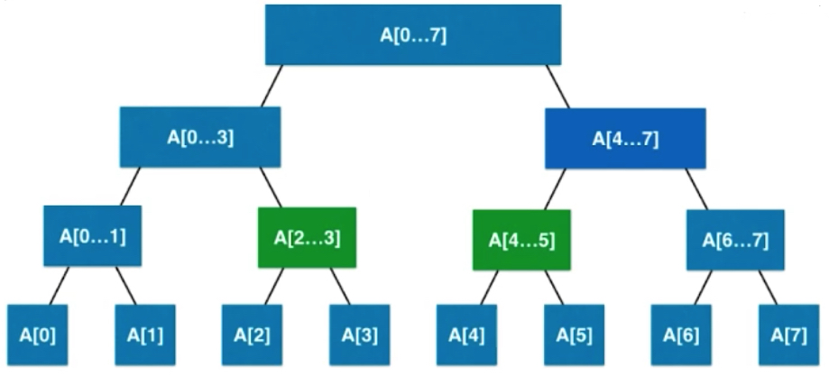

### 线段树的基础表示

每一个节点存储的节点对应数字和(求和为例)。

8个元素，2^3次方,满二叉树。

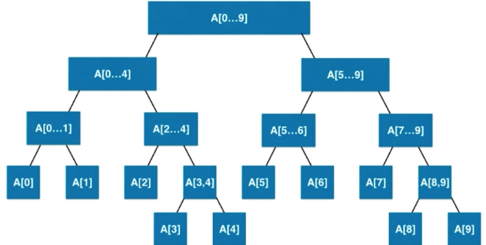

5不能被平分就右边多一点。叶子节点有可能在倒数第二层。

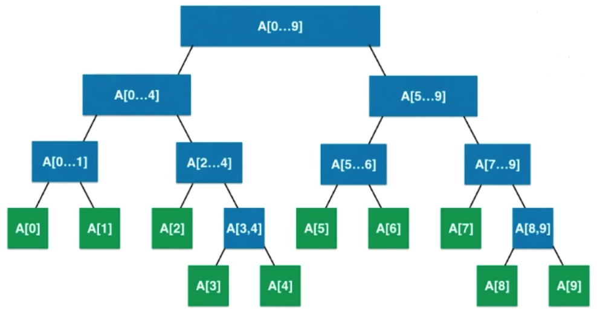

线段树不是完全二叉树;线段树是平衡二叉树。平衡二叉树的定义: 最大的深度和最小的深度之差最多为1,如上图我们的叶子节点要么在深度为4的位置，要么在深度为5的位置。

堆也是平衡二叉树，完全二叉树本身就是一棵平衡二叉树。线段树虽然不是完全二叉树，但是满足线段树的定义。

平衡二叉树不会退化成链表，依然是log级别的。

线段树是平衡二叉树，依然可以用数组表示。看做满二叉树，如果区间有n个元素，数组表示需要多少个节点？

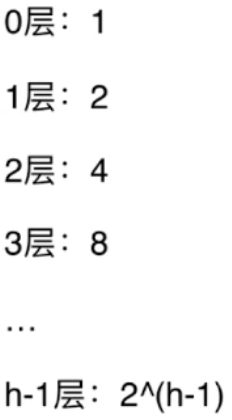

对满二叉树: h层，一共有2^h- 1个节点(大约是2^h),最后一层(h-1层)，有2^(h-1)个节点,最后一层的节点数大致等于前面所有层节点之和。

如果n=2^k 只需要2n的空间; 最坏情况， 如果n=2^k+1 需要4n的空间

如果区间有n个元素数组表示需要有多少节点? 需要4n的空间
我们的线段树不考虑添加元素,即区间固定，使用4n的静态空间即可(这是保证绝对可以装完的)

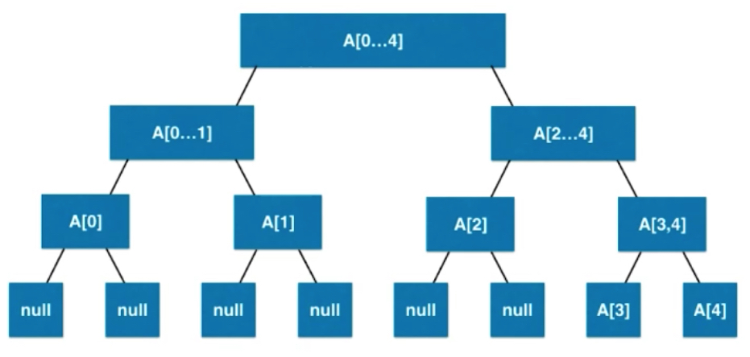

可以看到浪费了很多的空间，现代计算机空间换时间，这部分浪费可以不被浪费，拓展部分解决，节点方式存储可以避免浪费。

```java
package cn.mtianyan.segment;

public class SegmentTree<E> {

    private E[] tree;
    private E[] data; // 存储整个线段树数据副本

    public SegmentTree(E[] arr) {

        data = (E[]) new Object[arr.length];
        for (int i = 0; i < arr.length; i++)
            data[i] = arr[i];

        tree = (E[]) new Object[4 * arr.length];
    }

    /**
     * 获取数组大小
     *
     * @return
     */
    public int getSize() {
        return data.length;
    }

    /**
     * 传入index获取该位置数据
     *
     * @param index
     * @return
     */
    public E get(int index) {
        if (index < 0 || index >= data.length)
            throw new IllegalArgumentException("Index is illegal.");
        return data[index];
    }

    /**
     * 返回完全二叉树的数组表示中，一个索引所表示的元素的左孩子节点的索引
     *
     * @param index
     * @return
     */
    private int leftChild(int index) {
        return 2 * index + 1;
    }

    /**
     * 返回完全二叉树的数组表示中，一个索引所表示的元素的右孩子节点的索引
     *
     * @param index
     * @return
     */
    private int rightChild(int index) {
        return 2 * index + 2;
    }
}
```

线段树中是不需要去找某个节点的父亲节点的。线段树空间4n。

### 创建线段树。

根节点存储的信息，就是两个孩子信息的综合(递归即可),如何合并是由业务而定的。递归到底，是只有一个元素本身。

```java
package cn.mtianyan.segment;

public interface Merger<E> {
    E merge(E a, E b);
}
```

```java
public class SegmentTree<E> {

    private E[] tree;
    private E[] data; // 存储整个线段树数据副本
    private Merger<E> merger; // 用户可以传入合并规则

    public SegmentTree(E[] arr, Merger<E> merger) {
        this.merger = merger;
        data = (E[]) new Object[arr.length];
        for (int i = 0; i < arr.length; i++)
            data[i] = arr[i];

        tree = (E[]) new Object[4 * arr.length];
        buildSegmentTree(0, 0, arr.length - 1); // 根节点索引0，区间左右端点。
    }

    /**
     * 在treeIndex的位置创建表示区间[l...r]的线段树
     *
     * @param treeIndex
     * @param l
     * @param r
     */
    private void buildSegmentTree(int treeIndex, int l, int r) {

        // 递归到底了。
        if (l == r) {
            tree[treeIndex] = data[l];
            return;
        }

        int leftTreeIndex = leftChild(treeIndex);
        int rightTreeIndex = rightChild(treeIndex);

        // 要知道左右子树相应的区间范围。
        // int mid = (l + r) / 2; 整型异常可能
        int mid = l + (r - l) / 2;
        buildSegmentTree(leftTreeIndex, l, mid);
        buildSegmentTree(rightTreeIndex, mid + 1, r);

        // 业务相关的值合并
        tree[treeIndex] = merger.merge(tree[leftTreeIndex], tree[rightTreeIndex]);
    }
```

```java
    /**
     * 遍历打印树中节点中值信息。
     * @return
     */
    @Override
    public String toString(){
        StringBuilder res = new StringBuilder();
        res.append('[');
        for(int i = 0 ; i < tree.length ; i ++){
            if(tree[i] != null)
                res.append(tree[i]);
            else
                res.append("null");

            if(i != tree.length - 1)
                res.append(", ");
        }
        res.append(']');
        return res.toString();
    }
```

这里在构造函数中添加参数，使得用户可以传入merger规则来改变类内部的合并规则。类似于上章优先队列中传入元素比较器。

```java
package cn.mtianyan;

import cn.mtianyan.segment.SegmentTree;

public class Main {

    public static void main(String[] args) {

        Integer[] nums = {-2, 0, 3, -5, 2, -1};
//        SegmentTree<Integer> segTree = new SegmentTree<>(nums,
//                new Merger<Integer>() {
//                    @Override
//                    public Integer merge(Integer a, Integer b) {
//                        return a + b;
//                    }
//                });

        SegmentTree<Integer> segTree = new SegmentTree<>(nums,
                (a, b) -> a + b);
        System.out.println(segTree);
    }
}
```

匿名内部类的实现可以改写为Lambda表达式,传入(a,b) 返回a+b

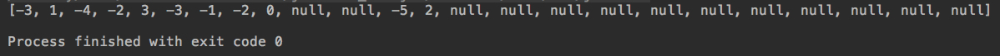

### 线段树的查询

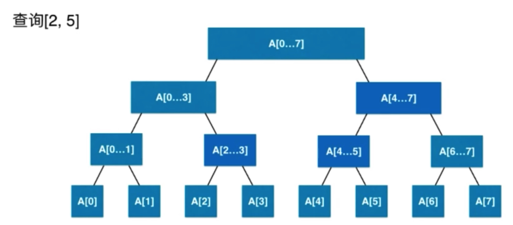

相当于查询2-5区间所有元素的和。从根节点开始往下，我们知道分割位置，左节点查询[2,3] 右节点查询[4,5],找到两个节点之后合并就可以了。

与树的高度有关，高度是logn级别的。

```java
    /**
     * 返回区间[queryL, queryR]的值
     *
     * @param queryL
     * @param queryR
     * @return
     */
    public E query(int queryL, int queryR) {

        if (queryL < 0 || queryL >= data.length ||
                queryR < 0 || queryR >= data.length || queryL > queryR)
            throw new IllegalArgumentException("Index is illegal.");

        return query(0, 0, data.length - 1, queryL, queryR);
    }

    /**
     * 在以treeIndex为根的线段树中[l...r]的范围里，搜索区间[queryL...queryR]的值
     *
     * @param treeIndex 我们都传入了这个treeIndex的区间范围l r; 完全可以包装成一个线段树中的节点类，每个节点存储它所处的区间范围。
     * @param l
     * @param r
     * @param queryL
     * @param queryR
     * @return
     */
    private E query(int treeIndex, int l, int r, int queryL, int queryR) {
        // 节点左边界和右边界都与想要查找的重合。
        if (l == queryL && r == queryR)
            return tree[treeIndex];

        int mid = l + (r - l) / 2;
        // treeIndex的节点分为[l...mid]和[mid+1...r]两部分

        int leftTreeIndex = leftChild(treeIndex);
        int rightTreeIndex = rightChild(treeIndex);

        // 用户关注的区间和左孩子一点关系没有
        if (queryL >= mid + 1)
            // 去右子树查找
            return query(rightTreeIndex, mid + 1, r, queryL, queryR);
            // 用户关注区间和右边没有关系
        else if (queryR <= mid)
            return query(leftTreeIndex, l, mid, queryL, queryR);

        // 一部分左，一部分右 queryL R 被一分为二
        E leftResult = query(leftTreeIndex, l, mid, queryL, mid);
        E rightResult = query(rightTreeIndex, mid + 1, r, mid + 1, queryR);
        return merger.merge(leftResult, rightResult);
    }
```

```java
        System.out.println(segTree.query(0, 2));
        System.out.println(segTree.query(2, 5));
        System.out.println(segTree.query(0, 5));
```

运行结果:

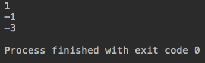

运行结果1是-2+0+3;[0,5]所有元素和

### LeetCode线段树问题

https://leetcode-cn.com/problems/range-sum-query-immutable/description/

303. 区域和检索 - 数组不可变(不涉及线段树的更新操作)

```java
package cn.mtianyan.leetcode_303;

import cn.mtianyan.segment.SegmentTree;

class NumArray {

    private SegmentTree<Integer> segmentTree;
    public NumArray(int[] nums) {

        if(nums.length > 0){
            Integer[] data = new Integer[nums.length];
            for (int i = 0; i < nums.length; i++)
                data[i] = nums[i];
            segmentTree = new SegmentTree<>(data, (a, b) -> a + b);
        }

    }

    public int sumRange(int i, int j) {

        if(segmentTree == null)
            throw new IllegalArgumentException("Segment Tree is null");

        return segmentTree.query(i, j);
    }
}
```

在提交我们自定义的数据结构时，内部类都改为private，否则会造成编译错误。

在数组不可变的情况下，不使用线段树有时可以得到更好的解答。

```java
package cn.mtianyan.leetcode_303;

/**
 * 数组进行预处理。
 */
public class NumArray2 {

    private int[] sum; // sum[i]存储前i个元素和, sum[0] = 0
    // 即sum[i]存储nums[0...i-1]的和
    // sum(i, j) = sum[j + 1] - sum[i]
    // 这里会有一个偏移
    public NumArray2(int[] nums) {

        sum = new int[nums.length + 1];
        sum[0] = 0;
        for(int i = 1 ; i < sum.length ; i ++)
            sum[i] = sum[i - 1] + nums[i - 1];
    }

    public int sumRange(int i, int j) {
        return sum[j + 1] - sum[i];
    }
}
```

这个问题限制在数据是不变的，因此可以采用其他更优方案，线段树更优的应用场景是数据会有更新和查询两种操作同时存在的情况。

#### Leetcode307号问题

区域和检索 - 数组可修改

```java
package cn.mtianyan.leetcode_307;

/**
 * 使用sum数组的思路：TLE	Time Limit Exceed	超时
 * update是O(n)复杂度，sumRange依然是O(1)
 */
class NumArray {

    private int[] data; // 原本的数组备份
    private int[] sum;

    public NumArray(int[] nums) {

        data = new int[nums.length];
        for (int i = 0; i < nums.length; i++)
            data[i] = nums[i];

        sum = new int[nums.length + 1];
        sum[0] = 0;
        for (int i = 1; i <= nums.length; i++)
            sum[i] = sum[i - 1] + nums[i - 1];
    }

    public int sumRange(int i, int j) {
        return sum[j + 1] - sum[i];
    }

    /**
     * update某一个元素的时候，整个数组也会发生变化。
     *
     * @param index
     * @param val
     */
    public void update(int index, int val) {
        data[index] = val;
        // 重建sum数组，从index+1位置后面的都更新一下
        for (int i = index + 1; i < sum.length; i++)
            sum[i] = sum[i - 1] + data[i - 1];
    }
}
```

老师提交时这里是超时的，但是我在LeetCode.com与LeetCode.cn都进行了提交，都没有发生超时现象。

### 线段树添加更新操作。

```java
    /**
     * 将index位置的值，更新为e
     * @param index
     * @param e
     */
    public void set(int index, E e){

        if(index < 0 || index >= data.length)
            throw new IllegalArgumentException("Index is illegal");

        data[index] = e; // index位置换新值
        set(0, 0, data.length - 1, index, e);
    }

    /**
     * 在以treeIndex为根的线段树中更新index的值为e
     * @param treeIndex
     * @param l
     * @param r
     * @param index
     * @param e
     */
    private void set(int treeIndex, int l, int r, int index, E e){

        if(l == r){
            tree[treeIndex] = e;
            return;
        }
        // 找index对应的叶子
        int mid = l + (r - l) / 2;
        // treeIndex的节点分为[l...mid]和[mid+1...r]两部分

        int leftTreeIndex = leftChild(treeIndex);
        int rightTreeIndex = rightChild(treeIndex);
        if(index >= mid + 1)
            set(rightTreeIndex, mid + 1, r, index, e);
        else // index <= mid
            set(leftTreeIndex, l, mid, index, e);

        tree[treeIndex] = merger.merge(tree[leftTreeIndex], tree[rightTreeIndex]);
    }
```

这个过程和之前二分搜索树的更新很像，实际就是在线段树中找index这个位置在哪边，究竟是左子树，还是右子树。二分搜索树中我们比较的是key和当前元素相应的大小关系。线段树中看的是index对于当前所处区间，劈成两半之后在哪一半。

index位置改变了 `tree[treeIndex] = merger.merge(tree[leftTreeIndex], tree[rightTreeIndex]);`

#### 307号问题

```java
package cn.mtianyan.leetcode_307;

import cn.mtianyan.segment.SegmentTree;

class NumArray2 {
    private SegmentTree<Integer> segTree;

    public NumArray2(int[] nums) {

        if(nums.length != 0){
            Integer[] data = new Integer[nums.length];
            for(int i = 0 ; i < nums.length ; i ++)
                data[i] = nums[i];
            segTree = new SegmentTree<>(data, (a, b) -> a + b);
        }
    }

    public void update(int i, int val) {
        if(segTree == null)
            throw new IllegalArgumentException("Error");
        segTree.set(i, val);
    }

    public int sumRange(int i, int j) {
        if(segTree == null)
            throw new IllegalArgumentException("Error");
        return segTree.query(i, j);
    }
}
```


可以看到使用线段树，时间是变短了的。O(logn) 原本的是 O(n)

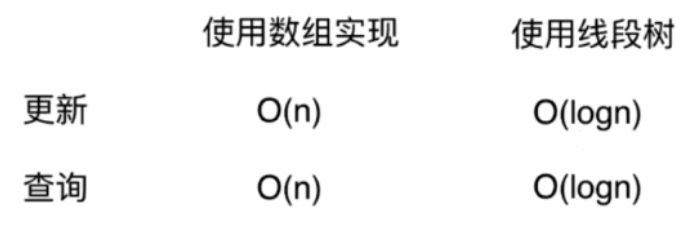

对于线段树来说，更新和查询操作都可以在O(logn)时间复杂度内完成，创建的过程其实是O(n)的复杂度,或者说是O(4n)的复杂度，4n空间，每一个空间赋值。

数据动态的更新， 然后查询两种操作，很适合用线段树。这是一种高级数据结构，面向竞赛。

### 更多与线段树相关话题 

不参加算法竞赛，线段树不是一个重点。

线段树虽然不是一棵完全二叉树，但是可以看做是一棵满二叉树，进而使用数组来存储。这与之前讲的堆是一致的。

理解树这种结构，节点存储的内容表示的意义不一样，左右子树表示什么意思。赋予结构合理定义，高效处理特殊问题。

创建线段树，查询线段树，更新线段树。 递归之后，还要融合，实际是一种后序遍历的思想。

#### 对于一个区间进行更新。

将[2,5]区间中所有元素+3

通过logn找到关注的区间，找到两个节点，对于节点进行更新。


如果是求和就要加6，因为每个节点中的两个元素都要加3.祖辈节点都要进行更新，叶子节点也要更新。

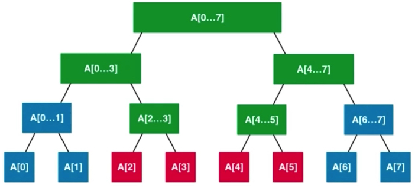

如果对于叶子节点也进行更新，那么这将是一个O(n)复杂度的操作。

#### 懒惰更新，懒惰传播

动态数组的缩小容量操作也用过。使用lazy数组记录末更新的内容.下一次再访问到该节点时，如果是lazy数组中的将其更新,再进行操作。

更新区间时依然是logn,查询lazy数组是否存在该节点。老师会提供相应的补充代码

#### 二堆线段树

我们目前是一个一维的线段树。

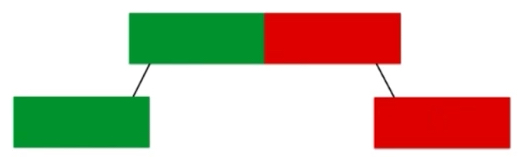

扩展成二维，矩阵分块分成四块。每个节点有四个孩子，每个孩子又是一个更小的矩阵。

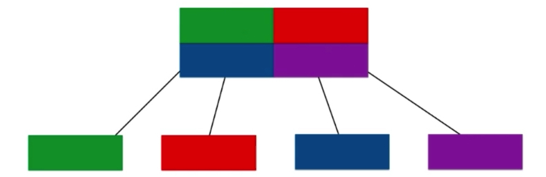

更高维数据依然可以同理可得,大数据单元拆成小的。

#### 动态线段树

数组4n的存储空间，链式的动态线段树。

节点类：区间左边界右边界，左右孩子，自己的值。 要处理节点很多，可以使用链式的动态线段树。

数据量太大，我们根据需求，动态创建动态线段树。

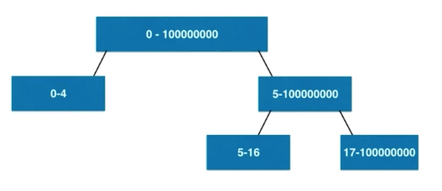

比如我们只关注5-16时，可以如上图实现。

区间操作相关另外一个重要数据结构 树状数组 Binary Index Tree(算法竞赛常客)

区间相关的问题 RMQ Range Minimum Query 其他好方法也都可以解决该问题。

**下一章继续看一种全新树结构，奇特的n叉树，可以快速处理字符串相关问题,字典树。**


