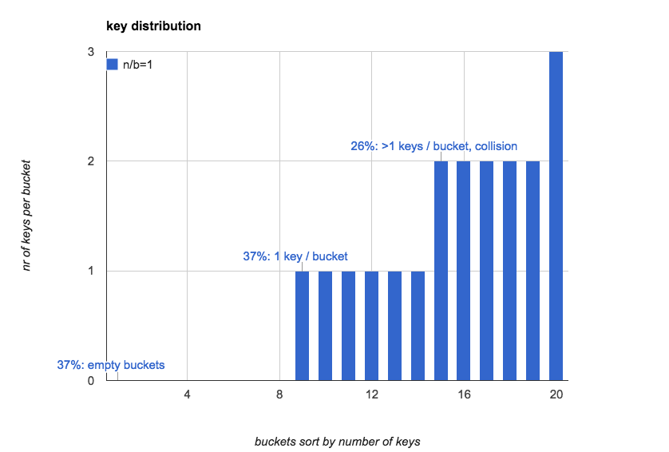
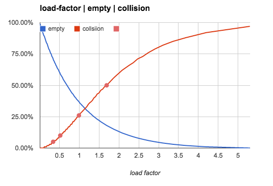
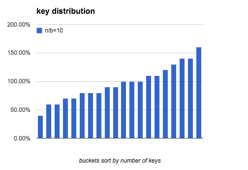
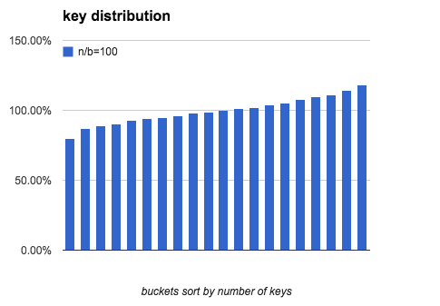
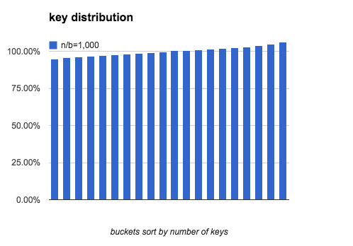

## 程序员必读: 关于hash表

<script src="https://cdn.bootcss.com/mathjax/2.7.2-beta.1/latest.js?config=default"></script>


<!-- mdtoc start -->

- hash表中key的分布规律  
    - 当hash表中key和bucket数量一样时(`n/b==1`):  
    - key的数量对3类bucket数量的影响  
    - key的数量对bucket的均匀程度的影响  
- Load Factor (n/b)  
    - `n/b<0.75`  
- `n/b` 很大的hash  
    - `n/b` 越大, key的分布越均匀.  
- 计算  
    - 每类bucket的数量  
        - 空bucket 数量  
        - 有1个key的bucket的数量  
        - 多个key的bucket  
    - key在bucket中分布的均匀程度  
        - 通过~~正太~~正态分布来近似  
        - 计算最小key数量 `x`  
        - 程序模拟  
- Reference  


<!-- mdtoc end   -->

软件开发中, 一个hash表, 相当于把`n`个key随机放入到 `b` 个bucket,
来实现使用`b`个单位的空间存储`n`个数据.

最后key在bucket中的分布, 我们可以看到hash表的一些有趣的现象:


## hash表中key的分布规律


### 当hash表中key和bucket数量一样时(`n/b==1`):

*   **37%** 的桶是空的.
*   **37%** 的桶里只有1个key.
*   **26%** 的桶里有1个以上的key(hash冲突).

下面这个图更直观的展示了当`n=b=20`的时候, hash表中每个bucket中key的个数的分布,
(我们按照key的数量对bucket做了排序):



和直觉不1样, 往往我们对hash表的第一感觉是:
如果key随机的扔到所有的桶里,
桶里的key的数量应该是比较均匀的, 每个桶里key的数量的期望是1.

而实际上, 桶里的key的分布在n比较小的时候是非常不均匀的, 即使平均下来是1!
当n增大的时候, 这种不均匀会逐渐趋于平均.


### key的数量对3类bucket数量的影响

下面这个表格表示当`b`不变, `n`增大时, `n/b` 的值如何影响3类bucket的数量占比
(冲突占比也就是含有多于1个key的bucket):

| n/b: (每个bucket平均key的数量) | 空bucket占比 | 1个key的bucket占比 | 冲突占比 |
| :--                            | --:          | --:                |  --:     |
| n/b=0.5                        | 61%          | 30%                |   9%     |
| n/b=0.75                       | 47%          | 35%                |  17%     |
| n/b=**1.0**                    | **37%**      | **37%**            |  **26%** |
| n/b=2.0                        | 14%          | 27%                |  59%     |
| n/b=5.0                        | 01%          | 03%                |  96%     |
| n/b=10.0                       | 00%          | 00%                | 100%     |

更直观1点, 我们用一个图来展示空bucket率 和 冲突率 随`n/b`的变化趋势:




### key的数量对bucket的均匀程度的影响

上面的几组数字是在hash表的`n/b`比较小的时候比较有意义的参考值,
但是当`n/b`逐渐增大的时候,
空bucket几乎肯定是0, 1个key的bucket也几乎是0,
绝大多数bucket是含有多个key的.

**这时, 我们主要观察是对象bucket里key的数量的分布规律**.

下面这个表表示`n/b`比较大的时候, 每个bucket的key的数量趋于均匀的时候,
**不均匀**的程度是多少.

为了描述这种不均匀的程度,
我们使用bucket中key的个数的最大值和最小值之间的比例(`(most-fewest)/most`)来表示.

下面这个表格列出了`b==100`时, 随着`n`的增大, key的分布越来越趋于平均的趋势.

| n/b: (bucket平均key的数量) | 最少key的bucket的key的数量 | 最大差异(most-fewest)/most |
|                   --:      |                 --:        |                --:         |
|                     1      |                   0        |             100.0%         |
|                    10      |                   2        |              88.0%         |
|                   100      |                  74        |              41.2%         |
|                 1,000      |                 916        |              15.5%         |
|                10,000      |               9,735        |               5.1%         |
|               100,000      |              99,161        |               1.6%         |
|             1,000,000      |             997,996        |               0.4%         |

可以看出, 随着`n/b`每个bucket里key的平均数量的增加,
bucket的不均匀程度也逐渐降低.

<!--more-->

> 和空bucket比例或1个key的bucket比例不同(只取决于`n/b`),
> 均匀程度不仅取决于`n/b`的值,
> 也会受到`b`本身的值的影响, 后面会提到.

> 这里我们没有使用统计里常用的[均方差]去描述key分布的不均匀程度,
> 因为在软件开发过程中, 更多的时候要考虑最坏情况, 来准备所需的内存等资源.


## Load Factor (n/b)

hash表中常用一个概念 `load factor` $$ \alpha = \frac{n}{b} $$.
来描述hash表的特征.


### `n/b<0.75`

通常, 基于内存存储的hash表, 它的 n/b `<=` **0.75**.
这样的设定, 既可以不浪费太多空间, 也可以保持hash表中的key的冲突相对较低,
低冲突率意味着低频率的hash重定位,
hash表的插入都会更快.

>   [线性探测] 是一个经常被使用的解决插入时hash冲突的算法,
>   它在1个key被放到1个bucket出现冲突的时候,
>   按照(逐步增加的步长)顺序的向后查看这个bucket后面的bucket,
>   直到找到1个空的bucket.
>   因此它对hash的冲突非常敏感.

在`n/b=0.75` 这个场景中, 如果不使用[线性探测] (譬如使用bucket内的链表来保存多个的key),
大约有**47%** 的bucket是空的.
如果使用[线性探测], 这**47%**中的 bucket, 有大约1半的的bucket
会被[线性探测]填充.

> 在很多内存hash表的实现中, 选择 `n/b<=0.75` 作为hash表的容量上限,
> 不仅仅是考虑到冲突率随`n/b`的增大而增大,
> 更重要的是[线性探测]的效率会随着`n/b`的增大而迅速增加,
> 详细分析大家可以参考[线性探测]中的实现和分析.

hash表特性小贴士:

-   hash表本身是1个通过1定的空间浪费来换取效率的算法.
    这三者不可同时兼得: 低时间开销(`O(1)`), 低空间浪费, 低冲突率.

-   hash表只适合纯内存数据结构的存储:

    -   必须很快, 因为hash表实际上是浪费空间换取了访问速度.
        很多时候对磁盘的空间浪费是不能忍受的, 对内存的少许浪费是可以接受的.

    -   hash表只适合随机访问快的存储介质.
        硬盘上的数据存储更多使用btree或其他有序的数据结构.

-   多数高级语言(内建了hash table/hash set等), 都保持 `n/b<=0.75`.

-   hash表在`n/b`比较小的时候, **不会**均匀的分配key!


## `n/b` 很大的hash

另外一种hash表的实现, 专门用来存储比较多的key,
当 `n/b` 大于 `1.0`的时候, [线性探测]不再能工作(没有足够的bucket来存储每个key).
这时1个bucket里不是存储1个key,
一般用[chaining] 在一个bucket内, 将所有落在这个bucket里的key用
[链表]连接起来, 来解决冲突时的多个key的存储.

>   [链表] 只在 `n/b` 不是很大时适用.
>   因为 [链表] 的查找需要 `O(n)`的时间开销,
>   对于非常大的`n/b`, 有时也会用[tree]来替代 [链表] 来管理bucket内的key.

大的`n/b`的使用场景之一是: 将一个网站的用户随机分配到多个不同的web-server上, 这时,
每个web-server可以服务很多个用户.
多数情况下, 我们都希望这种用户对web-server分配能尽可能均匀,
从而有效利用每个web-server的资源.

这种情况下, 我们需要关注的是hash的均匀程度, 我们这里要讨论的,
假定hash函数是完全随机的, 均匀程度根据`n`和`b`如何变化.


### `n/b` 越大, key的分布越均匀.

当 `n/b` 非常大的时候, 一个bucket是空的概率趋近于0,
而每个bucket中的key的数量趋于平均.

统计上, 每个bucket中key的数量的期望是

$$ {avg} = \frac{n}{b} $$

我们定义一个bucket平均key的数量是`100%`: bucket中key的数量 刚好是`n/b`,

下面3个图模拟了 `b==20`, `n/b`分别是 `10`, `100`, `1000`时, bucket中key的数量分布.






我们看出当 `n/b` 增大时, 最多key的bucket和最少key的bucket的差距在逐渐缩小.
下面的表里列出了随着`b` 和 `n/b`增大, key分布的均匀程度的变化:

| <sub>b</sub> \ <sup>n</sup> | 10<sup>2</sup> | 10<sup>3</sup> | 10<sup>4</sup> | 10<sup>5</sup> | 10<sup>6</sup> |
| ----:                       | -------------: | -------------: | -------------: | -------------: | -------------: |
|  100                        |  37.4%         |  13.6%         |  4.5%          |  1.4%          |  0.5%          |
|  1000                       |  47.3%         |  17.7%         |  6.0%          |  1.9%          |  0.6%          |
|  10000                      |  54.0%         |  20.9%         |  7.1%          |  2.3%          |  0.7%          |

结论:

| 场景                             | 趋势                |
| :--                              | :--                 |
| key的数量(n) 确定时              | bucket越多越不均匀. |
| bucket的数量(b) 确定时           | key越多越均匀.      |
| bucket和key的数量比例(n/b)一致时 | n和b越大越均匀.     |


## 计算

大部分上面的结构都来自于程序模拟, 现在我们来看看从数学上怎么来计算这些数值.


### 每类bucket的数量

| bucket的类型                 | bucket数量                                                         |
| :--                          | --:                                                                |
|  包含`0`个key的bucket的比例  | $$ b \times e^{-\frac{n}{b}} $$                                    |
|  包含`1`个key的bucket的比例  | $$ n \times e^{ - \frac{n}{b} } $$                                 |
|  包含`>1`个key的bucket的比例 | $$ b - b \times e^{-\frac{n}{b}} - n \times e^{ - \frac{n}{b} } $$ |


#### 空bucket 数量

对1个key, 它**不在**某个特定的bucket的概率是
$$ \frac{b-1}{b} $$.

所有key都不在某个特定的bucket的概率是
$$
(\frac{b-1}{b})^n
$$

我们知道

$$ \lim_{b\to \infty} (1+\frac{1}{b})^b = e $$.

某个bucket是空的概率就是:

$$
(\frac{b-1}{b})^n = ((1- \frac{1}b)^b)^{\frac{n}{b}} = e^{-\frac{n}{b}}
$$

总的空bucket数量就是:

$$ b e^{-\frac{n}{b}} $$


#### 有1个key的bucket的数量

对某个特定的bucket, 刚好有1个key的概率是:
n个key中有1个key有`1/b`的概率落到这个bucket里,
其他key以`1-1/b`的概率不落在这个bucket里:

$$
\begin{align}
  & {n \choose 1} ( \frac{1}{b} )^1 ( 1 - \frac{1}{b} )^{n-1} \\
= & \frac{n}{b} e^{-\frac{n}{b}}
\end{align}
$$

刚好有1个key的bucket的数量就是:

$$ b\frac{n}{b} e^{-\frac{n}{b}} = n e^{ - \frac{n}{b} } $$


#### 多个key的bucket

就是剩下的咯:

$$ b - b e^{-\frac{n}{b}} - n e^{ - \frac{n}{b} } $$


### key在bucket中分布的均匀程度

类似的, 1个bucket中刚好有`i`个key的概率是 n个key中任选i个出来,
i个key都以`1/b`的概率落在这个bucket里,
其他`n-i`个都以`1-1/b`的概率不落在这个bucket里:

$$
p(i) = {n \choose i} ( \frac{1}{b} )^{ i } ( 1 - \frac{1}{b} )^{n-i}
$$

上面这个是辣个出名的[二项式分布].

我们可以通过二项式分布来估计最大bucket的key的数量, 和最小bucket的key的数量.


#### 通过~~正太~~正态分布来近似

当 `n`, `b` 都很大时, [二项式分布]
可以用正态分布[正态分布]来近似, 来估计key分布的均匀性:

让 $$ p = \frac{1}{b} $$.
1个bucket中刚好有`i`个key的概率是:

$$
\begin{align}
p(i) =  & {n \choose i}p^i(1-p)^{n-i} \\
\approx & \frac{1}
             {\sigma \sqrt{2 \pi} }
        e^{ - \frac{(i-\mu)^2}
                   {2 \sigma^2} }
\end{align}
$$

$$
\begin{align}
\mu      = & np \\
\sigma^2 = & np(1-p) \\
\end{align}
$$

1个bucket中key的数量不多于`x`的概率是:

$$
P(x) = \sum_{i=0}^x p(i)
$$

所以, 所有少于`x`个key的bucket的数量是:

$$
b \cdot P(x) = b \cdot \sum_{i=0}^x p(i)
$$

包含最小bucket的key的数量, 可以用这个方法开估算:
如果少于`x`个key的bucket的数量是1, 那么这唯一1个bucket就是最少key的bucket.
所以我们只要找到1个最小的`x`, 让包含少于`x`个key的bucket总数为1,
这个x就是最小bucket的key的数量


#### 计算最小key数量 `x`

一个bucket里包含不多于`x`个key的概率是:

$$
\sum_{i=0}^x p(i)
\approx \int_{0}^{x} p(i) di
\approx \int_{-\infty}^{x} p(i) di
= \Phi( \frac{x-\mu}\sigma )
$$

$$ \Phi(x) $$
是正态分布的[累计分布函数], 当`x-u` 趋近于0的时候, 可以使用以下方式来近似:

$$
\Phi(x)\; =\;0.5+\frac{1}{\sqrt{2\pi}}\cdot e^{-x^2/2}\left[x+\frac{x^3}{3}+\frac{x^5}{3\cdot 5}+\cdots+\frac{x^{2n+1}}{(2n+1)!!} + \cdots\right]
$$

这个函数还是不太容易计算, 但是如果只是找到`x`, 我们可以在`[0~u]`的范围内逆向遍历`x`,
以找到一个`x` 使得包含不多于`x`个key的bucket的期望数量是1.

$$ b \cdot \Phi(\frac{x-\mu}\sigma) = 1 $$

这个`x`就可以粗略地认为是最少key的bucket里key的数量,
而这个hash表中, 不均匀的程度可以用最多key的数量和最少key的数量的差异来描述:
因为正态分布是对称的, 所以最大key的数量可以用
`u + (u-x)` 来表示.
最终,
```
u + (u-x) - x
-------------
u + (u-x)
```


#### 程序模拟

下面这个python脚本模拟了key在bucket中分布的情况, 同时对比计算的结果,
用来验证我们上面的计算结果.

```python
import sys
import math
import time
import hashlib

def normal_pdf(x, mu, sigma):
    x = float(x)
    mu = float(mu)

    m = 1.0 / math.sqrt( 2 * math.pi ) / sigma
    n = math.exp(-(x-mu)**2 / (2*sigma*sigma))

    return m * n

def normal_cdf(x, mu, sigma):
    # integral(-oo,x)

    x = float(x)
    mu = float(mu)
    sigma = float(sigma)

    # to standard form
    x = (x - mu) / sigma

    s = x
    v = x
    for i in range(1, 100):
        v = v * x * x / (2*i+1)
        s += v

    return 0.5 + s/(2*math.pi)**0.5 * math.e ** (-x*x/2)

def difference(nbucket, nkey):

    nbucket, nkey= int(nbucket), int(nkey)

    # binomial distribution approximation by normal distribution
    # find the bucket with minimal keys.
    #
    # the probability that a bucket has exactly i keys is:
    #   # probability density function
    #   normal_pdf(i, mu, sigma)
    #
    # the probability that a bucket has 0 ~ i keys is:
    #   # cumulative distribution function
    #   normal_cdf(i, mu, sigma)
    #
    # if the probability that a bucket has 0 ~ i keys is greater than 1/nbucket, we
    # say there will be a bucket in hash table has:
    # (i_0*p_0 + i_1*p_1 + ...)/(p_0 + p_1 + ..) keys.
    p = 1.0 / nbucket
    mu = nkey * p
    sigma = math.sqrt(nkey * p * (1-p))

    target = 1.0 / nbucket
    minimal = mu
    while True:

        xx = normal_cdf(minimal, mu, sigma)
        if abs(xx-target) < target/10:
            break

        minimal -= 1

    return minimal, (mu-minimal) * 2 / (mu + (mu - minimal))

def difference_simulation(nbucket, nkey):

    t = str(time.time())
    nbucket, nkey= int(nbucket), int(nkey)

    buckets = [0] * nbucket

    for i in range(nkey):
        hsh = hashlib.sha1(t + str(i)).digest()
        buckets[hash(hsh) % nbucket] += 1

    buckets.sort()
    nmin, mmax = buckets[0], buckets[-1]

    return nmin, float(mmax - nmin) / mmax

if __name__ == "__main__":

    nbucket, nkey= sys.argv[1:]

    minimal, rate = difference(nbucket, nkey)
    print 'by normal distribution:'
    print '     min_bucket:', minimal
    print '     difference:', rate

    minimal, rate = difference_simulation(nbucket, nkey)
    print 'by simulation:'
    print '     min_bucket:', minimal
    print '     difference:', rate
```


## Reference

*   [线性探测]
*   [double-hash]
*   [正态分布]
*   [二项式分布]
*   [累计分布函数]

[累计分布函数]: http://en.wikipedia.org/wiki/Normal_distribution#Cumulative_distribution_function
[正态分布]: http://en.wikipedia.org/wiki/Normal_distribution
[二项式分布]: http://en.wikipedia.org/wiki/Binomial_distribution
[线性探测]: http://en.wikipedia.org/wiki/Linear_probing
[tree]: http://en.wikipedia.org/wiki/Tree_(ata_structure)
[链表]: http://en.wikipedia.org/wiki/Linked_list
[double-hash]: http://en.wikipedia.org/wiki/Double_hashing
[chaining]: http://en.wikipedia.org/wiki/Hash_table#Separate_chaining
[sparse-hash]: http://code.google.com/p/sparsehash/
[均方差]: https://zh.wikipedia.org/wiki/%E5%9D%87%E6%96%B9%E5%B7%AE