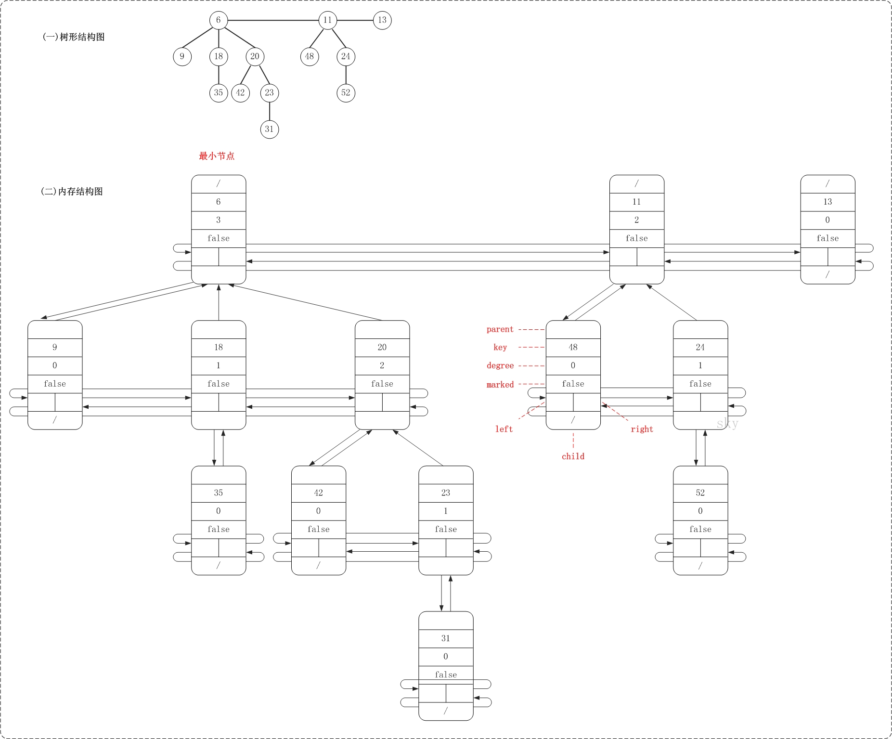
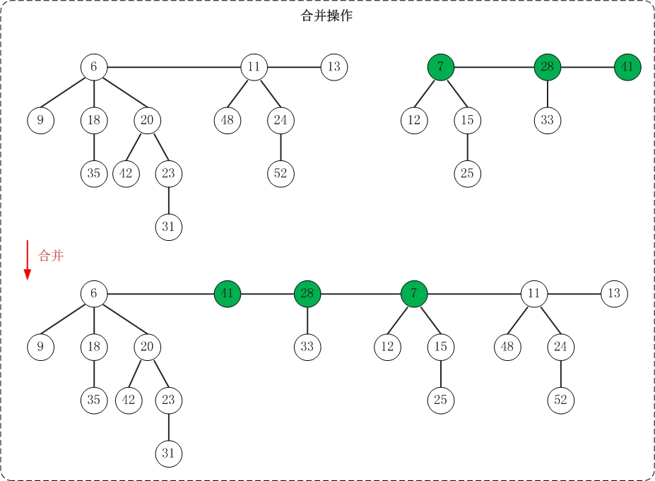
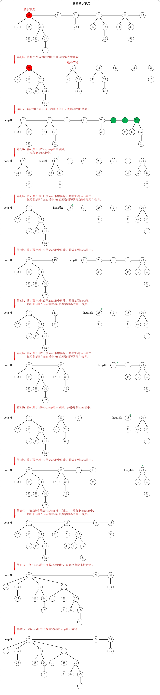
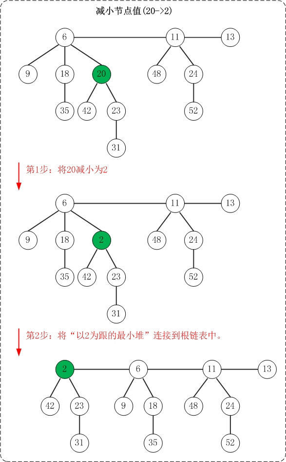
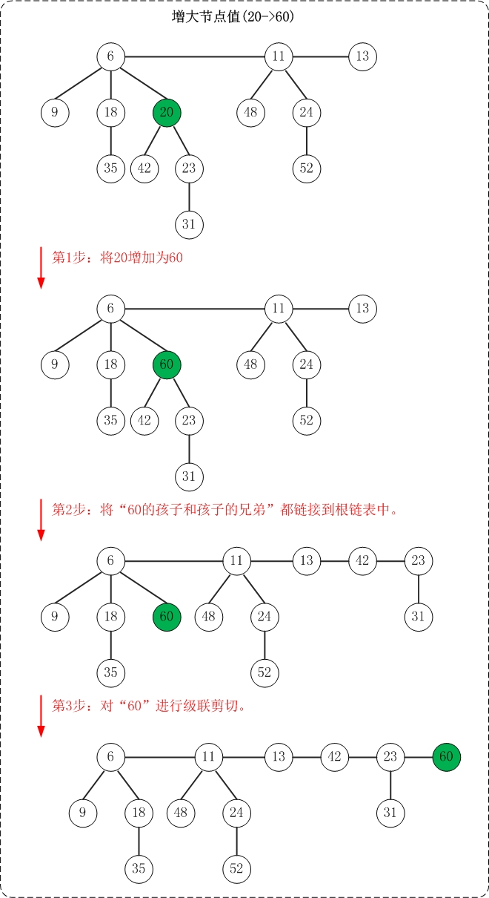

## [斐波那契堆(一)之 图文解析 和 C语言的实现][0]

### **概要**

本章介绍斐波那契堆。和以往一样，本文会先对斐波那契堆的理论知识进行简单介绍，然后给出C语言的实现。后续再分别给出C++和Java版本的实现；实现的语言虽不同，但是原理如出一辙，选择其中之一进行了解即可。若文章有错误或不足的地方，请不吝指出！

**目录**  
1. [斐波那契堆的介绍][1]   
2. [斐波那契堆的基本操作][2]   
3. [斐波那契堆的C实现(完整源码)][3]   
4. [斐波那契堆的C测试程序][4]

转载请注明出处：[http://www.cnblogs.com/skywang12345/p/3659060.html][0]

- - -

**更多内容：** [数据结构与算法系列 目录][5]

(01) [斐波那契堆(一)之 图文解析 和 C语言的实现][0]  
(02) [斐波那契堆(二)之 C++的实现][6]  
(03) [斐波那契堆(三)之 Java的实现][7]

### **斐波那契堆的介绍**

斐波那契堆(Fibonacci heap)是堆中一种，它和二项堆一样，也是一种可合并堆；可用于实现合并优先队列。斐波那契堆比二项堆具有更好的平摊分析性能，它的合并操作的时间复杂度是O(1)。   
与二项堆一样，它也是由一组堆最小有序树组成，并且是一种可合并堆。   
与二项堆不同的是，斐波那契堆中的树不一定是二项树；而且二项堆中的树是有序排列的，但是斐波那契堆中的树都是有根而无序的。

[](../img/111642221538159.jpg)

### **斐波那契堆的基本操作**

**1. 基本定义**

 
```

    typedef int Type;
    
    typedef struct _FibonacciNode
    {
        Type   key;                     // 关键字(键值)
        int degree;                     // 度数
        struct _FibonacciNode *left;    // 左兄弟
        struct _FibonacciNode *right;   // 右兄弟
        struct _FibonacciNode *child;   // 第一个孩子节点
        struct _FibonacciNode *parent;  // 父节点
        int marked;                     //是否被删除第1个孩子(1表示删除，0表示未删除)
    }FibonacciNode, FibNode;
```

FibNode是斐波那契堆的节点类，它包含的信息较多。key是用于比较节点大小的，degree是记录节点的度，left和right分别是指向节点的左右兄弟，child是节点的第一个孩子，parent是节点的父节点，marked是记录该节点是否被删除第1个孩子(marked在删除节点时有用)。

    typedef struct _FibonacciHeap{
        int   keyNum;                   // 堆中节点的总数
        int   maxDegree;                // 最大度
        struct _FibonacciNode *min;     // 最小节点(某个最小堆的根节点)
        struct _FibonacciNode **cons;   // 最大度的内存区域
    }FibonacciHeap, FibHeap;

FibHeap是斐波那契堆对应的类。min是保存当前堆的最小节点，keyNum用于记录堆中节点的总数，maxDegree用于记录堆中最大度，而cons在删除节点时来暂时保存堆数据的临时空间。

下面看看斐波那契堆的内存结构图。

[](../img/111643182933476.jpg)

从图中可以看出， 斐波那契堆是由一组最小堆组成，这些最小堆的根节点组成了双向链表(后文称为"**根链表**")；斐波那契堆中的最小节点就是"根链表中的最小节点"！

PS. 上面这幅图的结构和测试代码中的"基本信息"测试函数的结果是一致的；你可以通过测试程序来亲自验证！

**2. 插入操作**

插入操作非常简单：插入一个节点到堆中，直接将该节点插入到"根链表的min节点"之前即可；若被插入节点比"min节点"小，则更新"min节点"为被插入节点。

![][8]

_上面是插入操作的示意图。_

斐波那契堆的根链表是"双向链表"，这里将min节点看作双向联表的表头(后文也是如此)。在插入节点时，每次都是"将节点插入到min节点之前(即插入到双链表末尾)"。此外，对于根链表中最小堆都只有一个节点的情况，插入操作就很演化成双向链表的插入操作。

此外， 插入操作示意图与测试程序中的"插入操作"相对应，感兴趣的可以亲自验证。

插入操作代码

 
```

    /*
     * 将"单个节点node"加入"链表root"之前
     *   a …… root
     *   a …… node …… root
     *
     * 注意： 此处node是单个节点，而root是双向链表
    */
    static void fib_node_add(FibNode *node, FibNode *root)
    {
        node->left        = root->left;
        root->left->right = node;
        node->right       = root;
        root->left        = node;
    }
    
    /*
     * 将节点node插入到斐波那契堆heap中
     */
    static void fib_heap_insert_node(FibHeap *heap, FibNode *node)
    {
        if (heap->keyNum == 0)
            heap->min = node;
        else
           {
            fib_node_add(node, heap->min);
            if (node->key < heap->min->key)
                heap->min = node;
        }
        heap->keyNum++;
    }
```

**3. 合并操作**

合并操作和插入操作的原理非常类似：将一个堆的根链表插入到另一个堆的根链表上即可。简单来说，就是将两个双链表拼接成一个双向链表。

[](../img/111646216536924.jpg)

上面是合并操作的示意图。 该操作示意图与测试程序中的"合并操作"相对应！

合并操作代码

 
```c

    /*
     * 将双向链表b链接到双向链表a的后面
     *
     * 注意： 此处a和b都是双向链表
    */
    static void fib_node_cat(FibNode *a, FibNode *b)
    {
        FibNode *tmp;
    
        tmp            = a->right;
        a->right       = b->right;
        b->right->left = a;
        b->right       = tmp;
        tmp->left      = b;
    }
    
    /*
     * 将h1, h2合并成一个堆，并返回合并后的堆
     */
    FibHeap* fib_heap_union(FibHeap *h1, FibHeap *h2)
    {
        FibHeap *tmp;
    
        if (h1==NULL)
            return h2;
        if (h2==NULL)
            return h1;
    
        // 以h1为"母"，将h2附加到h1上；下面是保证h1的度数大，尽可能的少操作。
        if(h2->maxDegree > h1->maxDegree)
        {
            tmp = h1;
            h1 = h2;
            h2 = tmp;
        }
    
        if((h1->min) == NULL)                // h1无"最小节点"
        {
            h1->min = h2->min;
            h1->keyNum = h2->keyNum;
            free(h2->cons);
            free(h2);
        }
        else if((h2->min) == NULL)           // h1有"最小节点" && h2无"最小节点"
        {
            free(h2->cons);
            free(h2);
        }                                   // h1有"最小节点" && h2有"最小节点"
        else
        {
            // 将"h2中根链表"添加到"h1"中
            fib_node_cat(h1->min, h2->min);
            if (h1->min->key > h2->min->key)
                h1->min = h2->min;
            h1->keyNum += h2->keyNum;
            free(h2->cons);
            free(h2);
        }
    
        return h1;
    }
```

**4. 取出最小节点**

抽取最小结点的操作是斐波那契堆中较复杂的操作。   
(1）将要抽取最小结点的子树都直接串联在根表中；   
(2）合并所有degree相等的树，直到没有相等的degree的树。

[](../img/111647556224983.jpg)

上面是取出最小节点的示意图。图中应该写的非常明白了，若有疑问，看代码。

此外， 该操作示意图与测试程序中的"删除最小节点"相对应！有兴趣的可以亲自验证。

取出最小节点代码

 
```c

    /*
     * 移除最小节点，并返回移除节点后的斐波那契堆
     */
    FibNode* _fib_heap_extract_min(FibHeap *heap)
    {
        if (heap==NULL || heap->min==NULL)
            return NULL;
    
        FibNode *child = NULL;
        FibNode *min = heap->min;
        // 将min每一个儿子(儿子和儿子的兄弟)都添加到"斐波那契堆的根链表"中
        while (min->child != NULL)
        {
            child = min->child;
            fib_node_remove(child);
            if (child->right == child)
                min->child = NULL;
            else
                min->child = child->right;
    
            fib_node_add(child, heap->min);
            child->parent = NULL;
        }
    
        // 将min从根链表中移除
        fib_node_remove(min);
        // 若min是堆中唯一节点，则设置堆的最小节点为NULL；
        // 否则，设置堆的最小节点为一个非空节点(min->right)，然后再进行调节。
        if (min->right == min)
            heap->min = NULL;
        else
        {
            heap->min = min->right;
            fib_heap_consolidate(heap);
        }
        heap->keyNum--;
    
        return min;
    }
```

其中fib_heap_consolidate(heap)的作用是合并斐波那契堆的根链表中相同度数的树，它的相关代码如下：


```c
/*
 * 将node链接到root根结点
 */
static void fib_heap_link(FibHeap * heap, FibNode * node, FibNode *root)
{
    // 将node从双链表中移除
    fib_node_remove(node);
    // 将node设为root的孩子
    if (root->child == NULL)
        root->child = node;
    else
        fib_node_add(node, root->child);

    node->parent = root;
    root->degree++;
    node->marked = 0;
}
 
/* 
 * 创建fib_heap_consolidate所需空间
 */
static void fib_heap_cons_make(FibHeap * heap)
{
    int old = heap->maxDegree;

    // 计算log2(x)，"+1"意味着向上取整！
    // ex. log2(13) = 3，向上取整为3+1=4。
    heap->maxDegree = LOG2(heap->keyNum) + 1;

    // 如果原本空间不够，则再次分配内存
    if (old >= heap->maxDegree)
        return ;

    // 因为度为heap->maxDegree可能被合并，所以要maxDegree+1
    heap->cons = (FibNode **)realloc(heap->cons, 
            sizeof(FibHeap *) * (heap->maxDegree + 1));
}

/* 
 * 合并斐波那契堆的根链表中左右相同度数的树
 */
static void fib_heap_consolidate(FibHeap *heap)
{
    int i, d, D;
    FibNode *x, *y, *tmp;

    fib_heap_cons_make(heap);//开辟哈希所用空间
    D = heap->maxDegree + 1;

    for (i = 0; i < D; i++)
        heap->cons[i] = NULL;
 
    // 合并相同度的根节点，使每个度数的树唯一
    while (heap->min != NULL)
    {
        x = fib_heap_remove_min(heap);    // 取出堆中的最小树(最小节点所在的树)
        d = x->degree;                    // 获取最小树的度数
        // heap->cons[d] != NULL，意味着有两棵树(x和y)的"度数"相同。
        while (heap->cons[d] != NULL)
        {
            y = heap->cons[d];            // y是"与x的度数相同的树" 
            if (x->key > y->key)        // 保证x的键值比y小
            {
                tmp = x;
                x = y;
                y = tmp;

            }
            fib_heap_link(heap, y, x);    // 将y链接到x中
            heap->cons[d] = NULL;
            d++;
        }
        heap->cons[d] = x;
    }
    heap->min = NULL;
 
    // 将heap->cons中的结点重新加到根表中
    for (i=0; i<D; i++)
    {
        if (heap->cons[i] != NULL)
        {
            if (heap->min == NULL)
                heap->min = heap->cons[i];
            else
            {
                fib_node_add(heap->cons[i], heap->min);
                if ((heap->cons[i])->key < heap->min->key)
                    heap->min = heap->cons[i];
            }
        }
    }
}
```

**5. 减小节点值**

减少斐波那契堆中的节点的键值，这个操作的难点是：如果减少节点后破坏了"最小堆"性质，如何去维护呢？下面对一般性情况进行分析。   
(1) 首先，将"被减小节点"从"它所在的最小堆"剥离出来；然后将"该节点"关联到"根链表"中。 倘若被减小的节点不是单独一个节点，而是包含子树的树根。则是将以"被减小节点"为根的子树从"最小堆"中剥离出来，然后将该树关联到根链表中。   
(2) 接着，对"被减少节点"的原父节点进行"级联剪切"。所谓"级联剪切"，就是在被减小节点破坏了最小堆性质，并被切下来之后；再从"它的父节点"进行递归级联剪切操作。   
而级联操作的具体动作则是：若父节点(被减小节点的父节点)的marked标记为false，则将其设为true，然后退出。   
否则，将父节点从最小堆中切下来(方式和"切被减小节点的方式"一样)；然后递归对祖父节点进行"级联剪切"。   
marked标记的作用就是用来标记"该节点的子节点是否有被删除过"，它的作用是来实现级联剪切。而级联剪切的真正目的是为了防止"最小堆"由二叉树演化成链表。   
(3) 最后，别忘了对根链表的最小节点进行更新。

[](../img/111649333403897.jpg)

上面是减小节点值的示意图。 该操作示意图与测试程序中的"减小节点"相对应！

减小节点值的代码

 
```c

    /* 
     * 将斐波那契堆heap中节点node的值减少为key
     */
    static void fib_heap_decrease(FibHeap *heap, FibNode *node, Type key)
    {
        FibNode *parent;
    
        if (heap==NULL || heap->min==NULL ||node==NULL) 
            return ;
    
        if ( key>=node->key)
        {
            printf("decrease failed: the new key(%d) is no smaller than current key(%d)\n", key, node->key);
            return ;
        }
    
        node->key = key;
        parent = node->parent;
        if (parent!=NULL && node->key < parent->key)
        {
            // 将node从父节点parent中剥离出来，并将node添加到根链表中
            fib_heap_cut(heap, node, parent);
            fib_heap_cascading_cut(heap, parent);
        }
    
        // 更新最小节点
        if (node->key < heap->min->key)
            heap->min = node;
    }
```

其中，fib_heap_cut()和fib_heap_cascading_cut()的相关代码如下：


```c
/* 
 * 将node从父节点parent的子链接中剥离出来，
 * 并使node成为"堆的根链表"中的一员。
 */
static void fib_heap_cut(FibHeap *heap, FibNode *node, FibNode *parent)
{
    fib_node_remove(node);
    renew_degree(parent, node->degree);
    // node没有兄弟
    if (node == node->right) 
        parent->child = NULL;
    else 
        parent->child = node->right;

    node->parent = NULL;
    node->left = node->right = node;
    node->marked = 0;
    // 将"node所在树"添加到"根链表"中
    fib_node_add(node, heap->min);
}

/* 
 * 对节点node进行"级联剪切"
 *
 * 级联剪切：如果减小后的结点破坏了最小堆性质，
 *     则把它切下来(即从所在双向链表中删除，并将
 *     其插入到由最小树根节点形成的双向链表中)，
 *     然后再从"被切节点的父节点"到所在树根节点递归执行级联剪枝
 */
static void fib_heap_cascading_cut(FibHeap *heap, FibNode *node) 
{
    FibNode *parent = node->parent;
    if (parent != NULL)
        return ;

    if (node->marked == 0) 
        node->marked = 1;
    else
    {
        fib_heap_cut(heap, node, parent);
        fib_heap_cascading_cut(heap, parent);
    }
}
```

**6. 增加节点值**

增加节点值和减少节点值类似，这个操作的难点也是如何维护"最小堆"性质。思路如下：   
(1) 将"被增加节点"的"左孩子和左孩子的所有兄弟"都链接到根链表中。   
(2) 接下来，把"被增加节点"添加到根链表；但是别忘了对其进行级联剪切。

[](../img/111650112008396.jpg)

上面是增加节点值的示意图。 该操作示意图与测试程序中的"增大节点"相对应！

增加节点值的代码

 
```c

    /* 
     * 将斐波那契堆heap中节点node的值增加为key
     */
    static void fib_heap_increase(FibHeap *heap, FibNode *node, Type key)
    {
        FibNode *child, *parent, *right;
    
        if (heap==NULL || heap->min==NULL ||node==NULL) 
            return ;
    
        if (key <= node->key)
        {
            printf("increase failed: the new key(%d) is no greater than current key(%d)\n", key, node->key);
            return ;
        }
    
        // 将node每一个儿子(不包括孙子,重孙,...)都添加到"斐波那契堆的根链表"中
        while (node->child != NULL)
        {
            child = node->child;
            fib_node_remove(child);               // 将child从node的子链表中删除
            if (child->right == child)
                node->child = NULL;
            else
                node->child = child->right;
    
            fib_node_add(child, heap->min);       // 将child添加到根链表中
            child->parent = NULL;
        }
        node->degree = 0;
        node->key = key;
    
        // 如果node不在根链表中，
        //     则将node从父节点parent的子链接中剥离出来，
        //     并使node成为"堆的根链表"中的一员，
        //     然后进行"级联剪切"
        // 否则，则判断是否需要更新堆的最小节点
        parent = node->parent;
        if(parent != NULL)
        {
            fib_heap_cut(heap, node, parent);
            fib_heap_cascading_cut(heap, parent);
        }
        else if(heap->min == node)
        {
            right = node->right;
            while(right != node)
            {
                if(node->key > right->key)
                    heap->min = right;
                right = right->right;
            }
        }
    }
```

**7. 删除节点**

删除节点，本文采用了操作是："取出最小节点"和"减小节点值"的组合。   
(1) 先将被删除节点的键值减少。减少后的值要比"原最小节点的值"即可。   
(2) 接着，取出最小节点即可。

删除节点值的代码

 
```c

    /*
     * 删除结点node
     */
    static void _fib_heap_delete(FibHeap *heap, FibNode *node)
    {
        Type min = heap->min->key;
        fib_heap_decrease(heap, node, min-1);
        _fib_heap_extract_min(heap);
        free(node);
    }
```

  
注意： 关于斐波那契堆的"更新"、"打印"、"销毁"等接口就不再单独介绍了。后文的源码中有给出它们的实现代码，Please RTFSC(Read The Fucking Source Code)！

### **斐波那契堆的C实现(完整源码)**

斐波那契堆的头文件(fibonacci_heap.h)


```c
#ifndef _FIBONACCI_HEAP_H_
#define _FIBONACCI_HEAP_H_

typedef int Type;

typedef struct _FibonacciNode
{
    Type   key;                        // 关键字(键值)
    int degree;                        // 度数
    struct _FibonacciNode *left;    // 左兄弟
    struct _FibonacciNode *right;    // 右兄弟
    struct _FibonacciNode *child;    // 第一个孩子节点
    struct _FibonacciNode *parent;    // 父节点
    int marked;                       //是否被删除第1个孩子(1表示删除，0表示未删除)
}FibonacciNode, FibNode;

typedef struct _FibonacciHeap{
    int   keyNum;                    // 堆中节点的总数
    int   maxDegree;                // 最大度
    struct _FibonacciNode *min;        // 最小节点(某个最小堆的根节点)
    struct _FibonacciNode **cons;    // 最大度的内存区域
}FibonacciHeap, FibHeap;

// 创建Fibonacci堆
FibHeap* fib_heap_make();
// 新建键值为key的节点，并将其插入到斐波那契堆中
void fib_heap_insert_key(FibHeap *heap, Type key);
// 删除键值为key的结点
void fib_heap_delete(FibHeap *heap, Type key);
// 移除最小节点
void fib_heap_extract_min(FibHeap *heap);
// 更新heap的中的oldkey为newkey
void fib_heap_update(FibHeap *heap, Type oldkey, Type newkey);
// 将h1, h2合并成一个堆，并返回合并后的堆
FibHeap* fib_heap_union(FibHeap *h1, FibHeap *h2);
// 在斐波那契堆heap中是否存在键值为key的节点；存在返回1，否则返回0。
int fib_heap_contains(FibHeap *heap, Type key);
// 获取最小节点对应的值(保存在pkey中)；成功返回1，失败返回0。
int fib_heap_get_min(FibHeap *heap, Type *pkey);
// 销毁斐波那契堆
void fib_heap_destroy(FibHeap *heap);
// 打印"斐波那契堆"
void fib_print(FibHeap *heap);

#endif
```

斐波那契堆的实现文件(fibonacci_heap.c)


```c
/**
 * C语言实现的斐波那契堆
 *
 * @author skywang
 * @date 2014/04/05
 */

#include <stdio.h>
#include <stdlib.h>
#include <math.h>
#include <float.h>
#include "fibonacci_heap.h"

#if 0
#define LOG2(x) ({ \
        unsigned int _i = 0; \
        __asm__("bsr %1, %0" : "=r" (_i) : "r" ((x))); \
        _i; })
#else   // 注意：通过gcc编译时，要添加 -lm 选项。
#define LOG2(x) ((log((double)(x))) / (log(2.0)))
#endif


static FibNode *fib_heap_search(FibHeap *heap, Type key);
 
/* 
 * 将node从双链表移除
 */
static void fib_node_remove(FibNode *node)
{
    node->left->right = node->right;
    node->right->left = node->left;
}
 
/*
 * 将"单个节点node"加入"链表root"之前
 *   a …… root
 *   a …… node …… root
 *
 * 注意： 此处node是单个节点，而root是双向链表
*/
static void fib_node_add(FibNode *node, FibNode *root)
{
    node->left        = root->left;
    root->left->right = node;
    node->right       = root;
    root->left        = node;
}

/*
 * 将双向链表b链接到双向链表a的后面
 *
 * 注意： 此处a和b都是双向链表
*/
static void fib_node_cat(FibNode *a, FibNode *b)
{
    FibNode *tmp;

    tmp            = a->right;
    a->right       = b->right;
    b->right->left = a;
    b->right       = tmp;
    tmp->left      = b;
}

 
/*
 * 创建斐波那契堆
 */
FibHeap* fib_heap_make()
{
    FibHeap* heap;

    heap = (FibHeap *) malloc(sizeof(FibHeap));
    if (heap == NULL)
    {
        printf("Error: make FibHeap failed\n");
        return NULL;
    }

    heap->keyNum = 0;
    heap->maxDegree = 0;
    heap->min = NULL;
    heap->cons = NULL;

    return heap;
}
 
/*
 * 创建斐波那契堆的节点
 */
static FibNode* fib_node_make(Type key)
{
    FibNode * node;

    node = (FibNode *) malloc(sizeof(FibNode));
    if (node == NULL)
    {
        printf("Error: make Node failed\n");
        return NULL;
    }
    node->key    = key;
    node->degree = 0;
    node->left   = node;
    node->right  = node;
    node->parent = NULL;
    node->child  = NULL;

    return node;
}
 
/*
 * 将节点node插入到斐波那契堆heap中
 */
static void fib_heap_insert_node(FibHeap *heap, FibNode *node)
{
    if (heap->keyNum == 0)
        heap->min = node;
    else
       {
        fib_node_add(node, heap->min);
        if (node->key < heap->min->key)
            heap->min = node;
    }
    heap->keyNum++;
}
 
/* 
 * 新建键值为key的节点，并将其插入到斐波那契堆中
 */
void fib_heap_insert_key(FibHeap *heap, Type key)
{
    FibNode *node;

    if (heap==NULL)
        return ;

    node = fib_node_make(key);
    if (node == NULL)
        return ;

    fib_heap_insert_node(heap, node);
}
  
/*
 * 将h1, h2合并成一个堆，并返回合并后的堆
 */
FibHeap* fib_heap_union(FibHeap *h1, FibHeap *h2)
{
    FibHeap *tmp;

    if (h1==NULL)
        return h2;
    if (h2==NULL)
        return h1;

    // 以h1为"母"，将h2附加到h1上；下面是保证h1的度数大，尽可能的少操作。
    if(h2->maxDegree > h1->maxDegree)
    {
        tmp = h1;
        h1 = h2;
        h2 = tmp;
    }

    if((h1->min) == NULL)                // h1无"最小节点"
    {
        h1->min = h2->min;
        h1->keyNum = h2->keyNum;
        free(h2->cons);
        free(h2);
    }
    else if((h2->min) == NULL)           // h1有"最小节点" && h2无"最小节点"
    {
        free(h2->cons);
        free(h2);
    }                                   // h1有"最小节点" && h2有"最小节点"
    else
    {
        // 将"h2中根链表"添加到"h1"中
        fib_node_cat(h1->min, h2->min);
        if (h1->min->key > h2->min->key)
            h1->min = h2->min;
        h1->keyNum += h2->keyNum;
        free(h2->cons);
        free(h2);
    }

    return h1;
}

/*
 * 将"堆的最小结点"从根链表中移除，
 * 这意味着"将最小节点所属的树"从堆中移除!
 */
static FibNode *fib_heap_remove_min(FibHeap *heap)
{
    FibNode *min = heap->min;

    if (heap->min == min->right)
        heap->min = NULL;
    else
    {
        fib_node_remove(min);
        heap->min = min->right;
    }
    min->left = min->right = min;

    return min;
}
 
/*
 * 将node链接到root根结点
 */
static void fib_heap_link(FibHeap * heap, FibNode * node, FibNode *root)
{
    // 将node从双链表中移除
    fib_node_remove(node);
    // 将node设为root的孩子
    if (root->child == NULL)
        root->child = node;
    else
        fib_node_add(node, root->child);

    node->parent = root;
    root->degree++;
    node->marked = 0;
}
 
/* 
 * 创建fib_heap_consolidate所需空间
 */
static void fib_heap_cons_make(FibHeap * heap)
{
    int old = heap->maxDegree;

    // 计算log2(x)，"+1"意味着向上取整！
    // ex. log2(13) = 3，向上取整为3+1=4。
    heap->maxDegree = LOG2(heap->keyNum) + 1;

    // 如果原本空间不够，则再次分配内存
    if (old >= heap->maxDegree)
        return ;

    // 因为度为heap->maxDegree可能被合并，所以要maxDegree+1
    heap->cons = (FibNode **)realloc(heap->cons, 
            sizeof(FibHeap *) * (heap->maxDegree + 1));
}

/* 
 * 合并斐波那契堆的根链表中左右相同度数的树
 */
static void fib_heap_consolidate(FibHeap *heap)
{
    int i, d, D;
    FibNode *x, *y, *tmp;

    fib_heap_cons_make(heap);//开辟哈希所用空间
    D = heap->maxDegree + 1;

    for (i = 0; i < D; i++)
        heap->cons[i] = NULL;
 
    // 合并相同度的根节点，使每个度数的树唯一
    while (heap->min != NULL)
    {
        x = fib_heap_remove_min(heap);    // 取出堆中的最小树(最小节点所在的树)
        d = x->degree;                    // 获取最小树的度数
        // heap->cons[d] != NULL，意味着有两棵树(x和y)的"度数"相同。
        while (heap->cons[d] != NULL)
        {
            y = heap->cons[d];            // y是"与x的度数相同的树" 
            if (x->key > y->key)        // 保证x的键值比y小
            {
                tmp = x;
                x = y;
                y = tmp;

            }
            fib_heap_link(heap, y, x);    // 将y链接到x中
            heap->cons[d] = NULL;
            d++;
        }
        heap->cons[d] = x;
    }
    heap->min = NULL;
 
    // 将heap->cons中的结点重新加到根表中
    for (i=0; i<D; i++)
    {
        if (heap->cons[i] != NULL)
        {
            if (heap->min == NULL)
                heap->min = heap->cons[i];
            else
            {
                fib_node_add(heap->cons[i], heap->min);
                if ((heap->cons[i])->key < heap->min->key)
                    heap->min = heap->cons[i];
            }
        }
    }
}
 
/*
 * 移除最小节点，并返回移除节点后的斐波那契堆
 */
FibNode* _fib_heap_extract_min(FibHeap *heap)
{
    if (heap==NULL || heap->min==NULL)
        return NULL;

    FibNode *child = NULL;
    FibNode *min = heap->min;
    // 将min每一个儿子(儿子和儿子的兄弟)都添加到"斐波那契堆的根链表"中
    while (min->child != NULL)
    {
        child = min->child;
        fib_node_remove(child);
        if (child->right == child)
            min->child = NULL;
        else
            min->child = child->right;

        fib_node_add(child, heap->min);
        child->parent = NULL;
    }

    // 将min从根链表中移除
    fib_node_remove(min);
    // 若min是堆中唯一节点，则设置堆的最小节点为NULL；
    // 否则，设置堆的最小节点为一个非空节点(min->right)，然后再进行调节。
    if (min->right == min)
        heap->min = NULL;
    else
    {
        heap->min = min->right;
        fib_heap_consolidate(heap);
    }
    heap->keyNum--;

    return min;
}

void fib_heap_extract_min(FibHeap *heap)
{
    FibNode *node;

    if (heap==NULL || heap->min==NULL)
        return ;

    node = _fib_heap_extract_min(heap);
    if (node!=NULL)
        free(node);
}

/*
 * 在斐波那契堆heap中是否存在键值为key的节点；存在返回1，否则返回0。
 */
int fib_heap_get_min(FibHeap *heap, Type *pkey)
{
    if (heap==NULL || heap->min==NULL || pkey==NULL)
        return 0;

    *pkey = heap->min->key;
    return 1;
}
  
/* 
 * 修改度数
 */
static void renew_degree(FibNode *parent, int degree)
{
    parent->degree -= degree;
    if (parent-> parent != NULL)
        renew_degree(parent->parent, degree);
}
 
/* 
 * 将node从父节点parent的子链接中剥离出来，
 * 并使node成为"堆的根链表"中的一员。
 */
static void fib_heap_cut(FibHeap *heap, FibNode *node, FibNode *parent)
{
    fib_node_remove(node);
    renew_degree(parent, node->degree);
    // node没有兄弟
    if (node == node->right) 
        parent->child = NULL;
    else 
        parent->child = node->right;

    node->parent = NULL;
    node->left = node->right = node;
    node->marked = 0;
    // 将"node所在树"添加到"根链表"中
    fib_node_add(node, heap->min);
}

/* 
 * 对节点node进行"级联剪切"
 *
 * 级联剪切：如果减小后的结点破坏了最小堆性质，
 *     则把它切下来(即从所在双向链表中删除，并将
 *     其插入到由最小树根节点形成的双向链表中)，
 *     然后再从"被切节点的父节点"到所在树根节点递归执行级联剪枝
 */
static void fib_heap_cascading_cut(FibHeap *heap, FibNode *node) 
{
    FibNode *parent = node->parent;
    if (parent != NULL)
        return ;

    if (node->marked == 0) 
        node->marked = 1;
    else
    {
        fib_heap_cut(heap, node, parent);
        fib_heap_cascading_cut(heap, parent);
    }
}

/* 
 * 将斐波那契堆heap中节点node的值减少为key
 */
static void fib_heap_decrease(FibHeap *heap, FibNode *node, Type key)
{
    FibNode *parent;

    if (heap==NULL || heap->min==NULL ||node==NULL) 
        return ;

    if ( key>=node->key)
    {
        printf("decrease failed: the new key(%d) is no smaller than current key(%d)\n", key, node->key);
        return ;
    }

    node->key = key;
    parent = node->parent;
    if (parent!=NULL && node->key < parent->key)
    {
        // 将node从父节点parent中剥离出来，并将node添加到根链表中
        fib_heap_cut(heap, node, parent);
        fib_heap_cascading_cut(heap, parent);
    }

    // 更新最小节点
    if (node->key < heap->min->key)
        heap->min = node;
}

/* 
 * 将斐波那契堆heap中节点node的值增加为key
 */
static void fib_heap_increase(FibHeap *heap, FibNode *node, Type key)
{
    FibNode *child, *parent, *right;

    if (heap==NULL || heap->min==NULL ||node==NULL) 
        return ;

    if (key <= node->key)
    {
        printf("increase failed: the new key(%d) is no greater than current key(%d)\n", key, node->key);
        return ;
    }

    // 将node每一个儿子(不包括孙子,重孙,...)都添加到"斐波那契堆的根链表"中
    while (node->child != NULL)
    {
        child = node->child;
        fib_node_remove(child);               // 将child从node的子链表中删除
        if (child->right == child)
            node->child = NULL;
        else
            node->child = child->right;

        fib_node_add(child, heap->min);       // 将child添加到根链表中
        child->parent = NULL;
    }
    node->degree = 0;
    node->key = key;

    // 如果node不在根链表中，
    //     则将node从父节点parent的子链接中剥离出来，
    //     并使node成为"堆的根链表"中的一员，
    //     然后进行"级联剪切"
    // 否则，则判断是否需要更新堆的最小节点
    parent = node->parent;
    if(parent != NULL)
    {
        fib_heap_cut(heap, node, parent);
        fib_heap_cascading_cut(heap, parent);
    }
    else if(heap->min == node)
    {
        right = node->right;
        while(right != node)
        {
            if(node->key > right->key)
                heap->min = right;
            right = right->right;
        }
    }
}

/* 
 * 更新二项堆heap的节点node的键值为key
 */
void _fib_heap_update(FibHeap *heap, FibNode *node, Type key)
{
    if(key < node->key)
        fib_heap_decrease(heap, node, key);
    else if(key > node->key)
        fib_heap_increase(heap, node, key);
    else
        printf("No need to update!!!\n");
}
  
void fib_heap_update(FibHeap *heap, Type oldkey, Type newkey)
{
    FibNode *node;

    if (heap==NULL)
        return ;

    node = fib_heap_search(heap, oldkey);
    if (node!=NULL)
        _fib_heap_update(heap, node, newkey);
}

/*
 * 在最小堆root中查找键值为key的节点
 */
static FibNode* fib_node_search(FibNode *root, Type key)
{
    FibNode *t = root;    // 临时节点
    FibNode *p = NULL;    // 要查找的节点

    if (root==NULL)
        return root;

    do
    {
        if (t->key == key)
        {
            p = t;
            break;
        } 
        else
        {
            if ((p = fib_node_search(t->child, key)) != NULL) 
                break;
        }    
        t = t->right;
    } while (t != root);

    return p;
}
 
/*
 * 在斐波那契堆heap中查找键值为key的节点
 */
static FibNode *fib_heap_search(FibHeap *heap, Type key)
{
    if (heap==NULL || heap->min==NULL)
        return NULL;

    return fib_node_search(heap->min, key);
}

/*
 * 在斐波那契堆heap中是否存在键值为key的节点。
 * 存在返回1，否则返回0。
 */
int fib_heap_contains(FibHeap *heap, Type key)
{
    return fib_heap_search(heap,key)!=NULL ? 1: 0;
}

/*
 * 删除结点node
 */
static void _fib_heap_delete(FibHeap *heap, FibNode *node)
{
    Type min = heap->min->key;
    fib_heap_decrease(heap, node, min-1);
    _fib_heap_extract_min(heap);
    free(node);
}

void fib_heap_delete(FibHeap *heap, Type key)
{
    FibNode *node;

    if (heap==NULL || heap->min==NULL)
        return ;

    node = fib_heap_search(heap, key);
    if (node==NULL)
        return ;

    _fib_heap_delete(heap, node);
}
 
/* 
 * 销毁斐波那契堆
 */
static void fib_node_destroy(FibNode *node)
{
    FibNode *start = node;

    if(node == NULL)
        return;

    do {
        fib_node_destroy(node->child);
        // 销毁node，并将node指向下一个
        node = node->right;
        free(node->left);
    } while(node != start);
}
 
void fib_heap_destroy(FibHeap *heap)
{
    fib_node_destroy(heap->min);
    free(heap->cons);
    free(heap);
}

/*
 * 打印"斐波那契堆"
 *
 * 参数说明：
 *     node       -- 当前节点
 *     prev       -- 当前节点的前一个节点(父节点or兄弟节点)
 *     direction  --  1，表示当前节点是一个左孩子;
 *                    2，表示当前节点是一个兄弟节点。
 */
static void _fib_print(FibNode *node, FibNode *prev, int direction)
{
    FibonacciNode *start=node;

    if (node==NULL)
        return ;
    do
    {
        if (direction == 1)
            printf("%8d(%d) is %2d's child\n", node->key, node->degree, prev->key);
        else
            printf("%8d(%d) is %2d's next\n", node->key, node->degree, prev->key);

        if (node->child != NULL)
            _fib_print(node->child, node, 1);

        // 兄弟节点
        prev = node;
        node = node->right;
        direction = 2;
    } while(node != start);
}

void fib_print(FibHeap *heap)
{
    int i=0;
    FibonacciNode *p;

    if (heap==NULL || heap->min==NULL)
        return ;

    printf("== 斐波那契堆的详细信息: ==\n");
    p = heap->min;
    do {
        i++;
        printf("%2d. %4d(%d) is root\n", i, p->key, p->degree);

        _fib_print(p->child, p, 1);
        p = p->right;
    } while (p != heap->min);
    printf("\n");
}
```

斐波那契堆的测试程序(main.c)


```c
/**
 * C语言实现的斐波那契堆
 *
 * @author skywang
 * @date 2014/04/06
 */

#include <stdio.h>
#include "fibonacci_heap.h"

#define DEBUG 0

#if DEBUG
#define log(x, ...)   printf(x, __VA_ARGS__)
#else
#define log(x, ...)   
#endif

#define LENGTH(a) ( (sizeof(a)) / (sizeof(a[0])) )

// 共8个
int a[] = {12,  7, 25, 15, 28, 
           33, 41, 1};
// 共14个
int b[] = {18, 35, 20, 42,  9, 
           31, 23,  6, 48, 11, 
           24, 52, 13, 2};

// 验证"基本信息(斐波那契堆的结构)"
void test_basic()
{
    int i;
    int blen=LENGTH(b);
    FibHeap *hb = fib_heap_make();

    // 斐波那契堆hb
    printf("== 斐波那契堆(hb)中依次添加: ");
    for(i=0; i<blen; i++)
    {
        printf("%d ", b[i]);
        fib_heap_insert_key(hb, b[i]);
    }
    printf("\n");
    printf("== 斐波那契堆(hb)删除最小节点\n");
    fib_heap_extract_min(hb);
    fib_print(hb);

    fib_heap_destroy(hb);
}

// 验证"插入操作"
void test_insert()
{
    int i;
    int alen=LENGTH(a);
    FibHeap *ha = fib_heap_make();

    // 斐波那契堆ha
    printf("== 斐波那契堆(ha)中依次添加: ");

    for(i=0; i<alen; i++)
    {
        printf("%d ", a[i]);
        fib_heap_insert_key(ha, a[i]);
    }
    printf("\n");
    printf("== 斐波那契堆(ha)删除最小节点\n");
    fib_heap_extract_min(ha);
    fib_print(ha);

    // 插入50
    printf("== 插入50\n");
    fib_heap_insert_key(ha, 50);
    fib_print(ha);

    fib_heap_destroy(ha);
}

// 验证"合并操作"
void test_union()
{
    int i;
    int alen=LENGTH(a);
    int blen=LENGTH(b);
    FibHeap *ha = fib_heap_make();
    FibHeap *hb = fib_heap_make();

    // 斐波那契堆ha
    printf("== 斐波那契堆(ha)中依次添加: ");

    for(i=0; i<alen; i++)
    {
        printf("%d ", a[i]);
        fib_heap_insert_key(ha, a[i]);
    }
    printf("\n");
    printf("== 斐波那契堆(ha)删除最小节点\n");
    fib_heap_extract_min(ha);
    fib_print(ha);

    // 斐波那契堆hb
    printf("== 斐波那契堆(hb)中依次添加: ");
    for(i=0; i<blen; i++)
    {
        printf("%d ", b[i]);
        fib_heap_insert_key(hb, b[i]);
    }
    printf("\n");
    printf("== 斐波那契堆(hb)删除最小节点\n");
    fib_heap_extract_min(hb);
    fib_print(hb);

    // 将"斐波那契堆hb"合并到"斐波那契堆ha"中。
    printf("== 合并ha和hb\n");
    ha = fib_heap_union(ha, hb);
    fib_print(ha);

    // 销毁堆
    fib_heap_destroy(ha);
}

// 验证"删除最小节点"
void test_remove_min()
{
    int i;
    int alen=LENGTH(a);
    int blen=LENGTH(b);
    FibHeap *ha = fib_heap_make();
    FibHeap *hb = fib_heap_make();

    // 斐波那契堆ha
    printf("== 斐波那契堆(ha)中依次添加: ");

    for(i=0; i<alen; i++)
    {
        printf("%d ", a[i]);
        fib_heap_insert_key(ha, a[i]);
    }
    printf("\n");
    printf("== 斐波那契堆(ha)删除最小节点\n");
    fib_heap_extract_min(ha);
    //fib_print(ha);

    // 斐波那契堆hb
    printf("== 斐波那契堆(hb)中依次添加: ");
    for(i=0; i<blen; i++)
    {
        printf("%d ", b[i]);
        fib_heap_insert_key(hb, b[i]);
    }
    printf("\n");
    printf("== 斐波那契堆(hb)删除最小节点\n");
    fib_heap_extract_min(hb);
    //fib_print(hb);

    // 将"斐波那契堆hb"合并到"斐波那契堆ha"中。
    printf("== 合并ha和hb\n");
    ha = fib_heap_union(ha, hb);
    fib_print(ha);

    printf("== 删除最小节点\n");
    fib_heap_extract_min(ha);
    fib_print(ha);

    // 销毁堆
    fib_heap_destroy(ha);
}

// 验证"减小节点"
void test_decrease()
{
    int i;
    int blen=LENGTH(b);
    FibHeap *hb = fib_heap_make();

    // 斐波那契堆hb
    printf("== 斐波那契堆(hb)中依次添加: ");
    for(i=0; i<blen; i++)
    {
        printf("%d ", b[i]);
        fib_heap_insert_key(hb, b[i]);
    }
    printf("\n");
    printf("== 斐波那契堆(hb)删除最小节点\n");
    fib_heap_extract_min(hb);
    fib_print(hb);

    printf("== 将20减小为2\n");
    fib_heap_update(hb, 20, 2);
    fib_print(hb);

    fib_heap_destroy(hb);
}

// 验证"增大节点"
void test_increase()
{
    int i;
    int blen=LENGTH(b);
    FibHeap *hb = fib_heap_make();

    // 斐波那契堆hb
    printf("== 斐波那契堆(hb)中依次添加: ");
    for(i=0; i<blen; i++)
    {
        printf("%d ", b[i]);
        fib_heap_insert_key(hb, b[i]);
    }
    printf("\n");
    printf("== 斐波那契堆(hb)删除最小节点\n");
    fib_heap_extract_min(hb);
    fib_print(hb);

    fib_heap_update(hb, 20, 60);
    printf("== 将20增加为60\n");
    fib_print(hb);

    fib_heap_destroy(hb);
}

// 验证"删除节点"
void test_delete()
{
    int i;
    int blen=LENGTH(b);
    FibHeap *hb = fib_heap_make();

    // 斐波那契堆hb
    printf("== 斐波那契堆(hb)中依次添加: ");
    for(i=0; i<blen; i++)
    {
        printf("%d ", b[i]);
        fib_heap_insert_key(hb, b[i]);
    }
    printf("\n");
    printf("== 斐波那契堆(hb)删除最小节点\n");
    fib_heap_extract_min(hb);
    fib_print(hb);

    fib_heap_delete(hb, 20);
    printf("== 删除节点20\n");
    fib_print(hb);

    fib_heap_destroy(hb);
}

void main()
{
    // 验证"基本信息(斐波那契堆的结构)"
    test_basic();
    // 验证"插入操作"
    //test_insert();
    // 验证"合并操作"
    //test_union();
    // 验证"删除最小节点"
    //test_remove_min();
    // 验证"减小节点"
    //test_decrease();
    // 验证"增大节点"
    //test_increase();
    // 验证"删除节点"
    //test_delete();
}
```

### **斐波那契堆的C测试程序**

斐波那契堆的测试程序包括了**"插入"、"合并"、"增大"、"减小"、"删除"、"基本信息"**等几种功能的测试代码。默认是运行的"基本信息(验证斐波那契堆的结构)"测试代码，你可以根据自己的需要来对相应的功能进行验证！

注意： C语言版的斐波那契堆的LOG2宏定义中使用了math.h，记得引入math库。例如，若你是在Linux下通过gcc编译，记得添加-lm参数(gcc *.c -lm)。

下面是基本信息测试代码的运行结果：

 
```

    == 斐波那契堆(hb)中依次添加: 18 35 20 42 9 31 23 6 48 11 24 52 13 2 
    == 斐波那契堆(hb)删除最小节点
    == 斐波那契堆的详细信息: ==
     1.    6(3) is root
           9(0) is  6's child
          18(1) is  9's next
          35(0) is 18's child
          20(2) is 18's next
          42(0) is 20's child
          23(1) is 42's next
          31(0) is 23's child
     2.   11(2) is root
          48(0) is 11's child
          24(1) is 48's next
          52(0) is 24's child
     3.   13(0) is root
```

[0]: http://www.cnblogs.com/skywang12345/p/3659060.html
[1]: #a1
[2]: #a2
[3]: #a3
[4]: #a4
[5]: http://www.cnblogs.com/skywang12345/p/3603935.html
[6]: http://www.cnblogs.com/skywang12345/p/3659069.html
[7]: http://www.cnblogs.com/skywang12345/p/3659122.html
[8]: ../img/111644494183536.jpg
