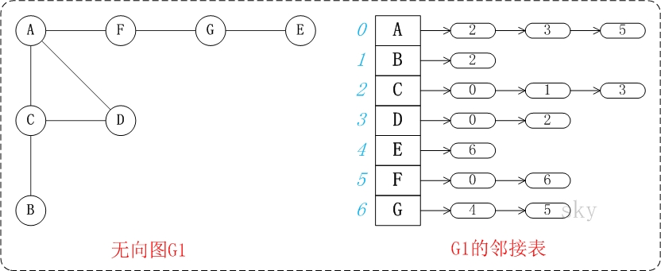

## 邻接表无向图(二)之 C++详解

来源：[http://www.cnblogs.com/skywang12345/p/3707610.html](http://www.cnblogs.com/skywang12345/p/3707610.html)

2014-05-08 23:52


本章是通过C++实现邻接表无向图。

**`目录`**  

**`1`** . [邻接表无向图的介绍](#anchor1) 
 **`2`** . [邻接表无向图的代码说明](#anchor2) 
 **`3`** . [邻接表无向图的完整源码](#anchor3)

转载请注明出处：[http://www.cnblogs.com/skywang12345/](http://www.cnblogs.com/skywang12345/)

更多内容：[数据结构与算法系列 目录](http://www.cnblogs.com/skywang12345/p/3603935.html)


 

<a name="anchor1"></a>

###  **`邻接表无向图的介绍`** 

邻接表无向图是指通过邻接表表示的无向图。

[](../pictures/graph/basic/07.jpg)

上面的图G1包含了"A,B,C,D,E,F,G"共7个顶点，而且包含了"(A,C),(A,D),(A,F),(B,C),(C,D),(E,G),(F,G)"共7条边。

上图右边的矩阵是G1在内存中的邻接表示意图。每一个顶点都包含一条链表，该链表记录了"该顶点的邻接点的序号"。例如，第2个顶点(顶点C)包含的链表所包含的节点的数据分别是"0,1,3"；而这"0,1,3"分别对应"A,B,D"的序号，"A,B,D"都是C的邻接点。就是通过这种方式记录图的信息的。

<a name="anchor2"></a>

###  **`邻接表无向图的代码说明`** 

**`1. 基本定义`** 


```cpp
#define MAX 100
// 邻接表
class ListUDG
{
    private: // 内部类
        // 邻接表中表对应的链表的顶点
        class ENode
        {
            public:
                int ivex;           // 该边所指向的顶点的位置
                ENode *nextEdge;    // 指向下一条弧的指针
        };

        // 邻接表中表的顶点
        class VNode
        {
            public:
                char data;          // 顶点信息
                ENode *firstEdge;   // 指向第一条依附该顶点的弧
        };

    private: // 私有成员
        int mVexNum;             // 图的顶点的数目
        int mEdgNum;             // 图的边的数目
        VNode mVexs[MAX];

    public:
        // 创建邻接表对应的图(自己输入)
        ListUDG();
        // 创建邻接表对应的图(用已提供的数据)
        ListUDG(char vexs[], int vlen, char edges[][2], int elen);
        ~ListUDG();

        // 打印邻接表图
        void print();

    private:
        // 读取一个输入字符
        char readChar();
        // 返回ch的位置
        int getPosition(char ch);
        // 将node节点链接到list的最后
        void linkLast(ENode *list, ENode *node);
};

```


**`(01)`**  ListUDG是邻接表对应的结构体。 

mVexNum是顶点数，mEdgNum是边数；mVexs则是保存顶点信息的一维数组。

**`(02)`**  VNode是邻接表顶点对应的结构体。 

data是顶点所包含的数据，而firstEdge是该顶点所包含链表的表头指针。

**`(03)`**  ENode是邻接表顶点所包含的链表的节点对应的结构体。 

ivex是该节点所对应的顶点在vexs中的索引，而nextEdge是指向下一个节点的。

**`2. 创建矩阵`** 

这里介绍提供了两个创建矩阵的方法。一个是 **`用已知数据`** ，另一个则 **`需要用户手动输入数据`** 。

**`2.1 创建图(用已提供的矩阵)`** 


```cpp
/*
 * 创建邻接表对应的图(用已提供的数据)
 */
ListUDG::ListUDG(char vexs[], int vlen, char edges[][2], int elen)
{
    char c1, c2;
    int i, p1, p2;
    ENode *node1, *node2;

    // 初始化"顶点数"和"边数"
    mVexNum = vlen;
    mEdgNum = elen;
    // 初始化"邻接表"的顶点
    for(i=0; i<mVexNum; i++)
    {
        mVexs[i].data = vexs[i];
        mVexs[i].firstEdge = NULL;
    }

    // 初始化"邻接表"的边
    for(i=0; i<mEdgNum; i++)
    {
        // 读取边的起始顶点和结束顶点
        c1 = edges[i][0];
        c2 = edges[i][1];

        p1 = getPosition(c1);
        p2 = getPosition(c2);
        // 初始化node1
        node1 = new ENode();
        node1->ivex = p2;
        // 将node1链接到"p1所在链表的末尾"
        if(mVexs[p1].firstEdge == NULL)
          mVexs[p1].firstEdge = node1;
        else
            linkLast(mVexs[p1].firstEdge, node1);
        // 初始化node2
        node2 = new ENode();
        node2->ivex = p1;
        // 将node2链接到"p2所在链表的末尾"
        if(mVexs[p2].firstEdge == NULL)
          mVexs[p2].firstEdge = node2;
        else
            linkLast(mVexs[p2].firstEdge, node2);
    }
}

```


该函数的作用是创建一个邻接表无向图。实际上，该方法创建的无向图，就是上面图G1。调用代码如下： 


```cpp
char vexs[] = {'A', 'B', 'C', 'D', 'E', 'F', 'G'};
char edges[][2] = {
    {'A', 'C'}, 
    {'A', 'D'}, 
    {'A', 'F'}, 
    {'B', 'C'}, 
    {'C', 'D'}, 
    {'E', 'G'}, 
    {'F', 'G'}};
int vlen = sizeof(vexs)/sizeof(vexs[0]);
int elen = sizeof(edges)/sizeof(edges[0]);
ListUDG* pG;

pG = new ListUDG(vexs, vlen, edges, elen);

```


**`2.2 创建图(自己输入)`** 


```cpp
/*
 * 创建邻接表对应的图(自己输入)
 */
ListUDG::ListUDG()
{
    char c1, c2;
    int v, e;
    int i, p1, p2;
    ENode *node1, *node2;

    // 输入"顶点数"和"边数"
    cout << "input vertex number: ";
    cin >> mVexNum;
    cout << "input edge number: ";
    cin >> mEdgNum;
    if ( mVexNum < 1 || mEdgNum < 1 || (mEdgNum > (mVexNum * (mVexNum-1))))
    {
        cout << "input error: invalid parameters!" << endl;
        return ;
    }

    // 初始化"邻接表"的顶点
    for(i=0; i<mVexNum; i++)
    {
        cout << "vertex(" << i << "): ";
        mVexs[i].data = readChar();
        mVexs[i].firstEdge = NULL;
    }

    // 初始化"邻接表"的边
    for(i=0; i<mEdgNum; i++)
    {
        // 读取边的起始顶点和结束顶点
        cout << "edge(" << i << "): ";
        c1 = readChar();
        c2 = readChar();

        p1 = getPosition(c1);
        p2 = getPosition(c2);
        // 初始化node1
        node1 = new ENode();
        node1->ivex = p2;
        // 将node1链接到"p1所在链表的末尾"
        if(mVexs[p1].firstEdge == NULL)
          mVexs[p1].firstEdge = node1;
        else
            linkLast(mVexs[p1].firstEdge, node1);
        // 初始化node2
        node2 = new ENode();
        node2->ivex = p1;
        // 将node2链接到"p2所在链表的末尾"
        if(mVexs[p2].firstEdge == NULL)
          mVexs[p2].firstEdge = node2;
        else
            linkLast(mVexs[p2].firstEdge, node2);
    }
}

```


该函数是读取用户的输入，将输入的数据转换成对应的无向图。

<a name="anchor3"></a>

###  **`邻接表无向图的完整源码`** 

点击查看：[源代码](../source/graph/basic/udg/cplus/ListUDG.cpp)
