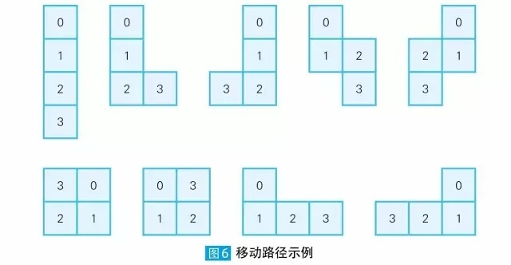
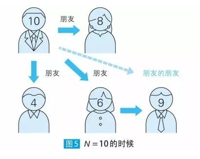
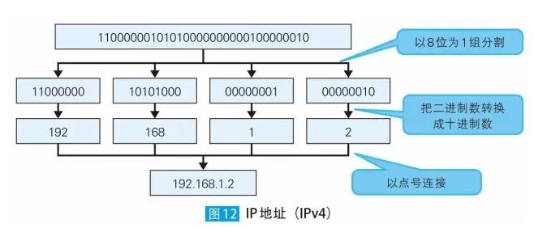

### 14万程序员挑战过的算法趣题#【入门】尝试用编程解决问题（难度系数：★）

优秀的扫地机器人（IQ：80    目标时间：20分钟）

现在有很多制造商都在卖扫地机器人，它非常有用，能为忙碌的我们分担家务负担。不过我们也很难理解为什么扫地机器人有时候会反复清扫某一个地方。

假设有一款不会反复清扫同一个地方的机器人，它只能前后左右移动。举个例子，如果第1 次向后移动，那么连续移动3 次时，就会有以下9 种情况（ 图6 ）。又因为第1 次移动可以是前后左右4 种情况，所以移动3 次时全部路径有9×4 ＝ 36 种。

※ 最初的位置用0 表示，其后的移动位置用数字表示。

问题：求这个机器人移动12 次时，有多少种移动路径？

答案：324932种。

### 14万程序员挑战过的算法趣题#【初级】解决简单问题体会算法（效果难度系数：★★）

朋友的朋友也是朋友吗
（IQ：90    目标时间：25分钟）

“六度空间理论”非常有名。大概的意思是1 个人只需要通过6 个中间人就可以和世界上任何1 个人产生间接联系。本题将试着找出数字的好友（这里并不考虑亲密指数）。

假设拥有同样约数（不包括1）的数字互为“好友”，也就是说，如果两个数字的最大公约数不是1，那么称这两个数互为好友。

从1~N 中任意选取一个“合数”，求从它开始，要经历几层好友，才能和其他所有的数产生联系（所谓的“合数”是指“有除1 以及自身以外的约数的自然数”）。

举个例子，N ＝ 10 时，1~10 的合数是4、6、8、9、10 这5 个。

如果选取的是10，那么10 的好友数字就是公约数为2 的4、6、8这3 个。而9 是6 的好友数字（公约数为3），所以10 只需要经过2 层就可以和9 产生联系（图5 ）。如果选取的是6，则只需经过1 层就可以联系到4、8、9、10 这些数字。因此N ＝ 10 时，无论最初选取的合数是什么，最多经过2 层就可以与其他所有数产生联系。

问题：求从1~N 中选取7 个合数时，最多经过6 层就可以与其他所有数产生联系的最小的N。

答案：55  
满足条件的组合为：  
[4, 26, 39, 33, 55, 35, 49]

### 14万程序员挑战过的算法趣题#【中级】优化算法实现高速处理（难度系数：★★★）

优雅的IP 地址（IQ：100    目标时间：30分钟）

可能大部分读者都清楚，IPv4 中的IP 地址是二进制的32 位数值。不过，这样的数值对我们人类而言可读性比较差，所以我们通常会以8 位为1 组分割，用类似192.168.1.2 这种十进制数来表示它（ 如图 ）。  
这里，我们思考一下十进制数0~9 这10 个数字各出现1 次的IP 地址（像正常情况一样，省略每组数字首位的0。也就是说，不能像192.168.001.002 这样表示，而要像192.168.1.2 这样来表示）

问题[思考]：求用二进制数表示上述形式的IP 地址时，能使二进制数左右对称的IP 地址的个数（用二进制数表示时不省略0，用完整的32 位数表示）。

答案：8个

