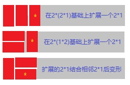

## 剑指offer试题（PHP篇二）

来源：[http://www.cnblogs.com/zlnevsto/p/8452370.html](http://www.cnblogs.com/zlnevsto/p/8452370.html)

2018-02-18 00:08

**`6.旋转数组的最小数字`** 
## 题目描述


把一个数组最开始的若干个元素搬到数组的末尾，我们称之为数组的旋转。 输入一个非递减排序的数组的一个旋转，输出旋转数组的最小元素。 例如数组{3,4,5,1,2}为{1,2,3,4,5}的一个旋转，该数组的最小值为1。 NOTE：给出的所有元素都大于0，若数组大小为0，请返回0。

时间限制：3秒   空间限制：32768K


```php
<?php

function minNumberInRotateArray($rotateArray)
{
    // write code here
    /*
    if(count($rotateArray) == 0){
        return 0;
    }
    $min = min($rotateArray);
    foreach($rotateArray as $k=>$v){
        if($v == $min){
            $arrLeft[] = array_slice($rotateaArray,0,$k+1);
            $arrRight[] = array_slice($rotateArray,$k+1);
        }
    }
    弄了半天不是让输出翻转后的数组。。。。
    */
    if(count($rotateArray)){
        return min($rotateArray);
    }else{
        return 0;
    }
}


```

运行时间：985ms   占用内存：5156k

感悟：

　　这道题告诉我一定要审题审题审题=  =|，本来自己在一味的求解反转后的数组，结果不知什么时候一看，发现只是让求最小数，对于php而言太简单了。。。不过对于这道题，还是要提醒大家细心（汗）。

 
**`7.斐波那契数列`** 
## 题目描述

大家都知道斐波那契数列，现在要求输入一个整数n，请你输出斐波那契数列的第n项。
n<=39

时间限制：1秒   空间限制：32768K

```php
<?php

function Fibonacci($n)
{
    // write code here
    if($n < 0 || $n > 39)
        return false;
    $ret = [];
    for($i = 0; $i <= $n; $i++){
        if($i == 0){
            $ret[$i] = 0;
            continue;
        }elseif($i == 1){
            $ret[$i] = 1;
            continue;
        }
        $ret[$i] = $ret[$i-1]+$ret[$i-2];
    }
    return $ret[$n];
}


```

运行时间：15ms   占用内存：2316k

感悟：

　　这道题，只要理解斐波那契数列，知道用递归来实现就完全ok，再说思路，首先，排除掉不成立的情况，其次，将0和1的特殊情况拿出来单独赋值，最后，就是一般情况的循环递归。

**`8.跳台阶`** 
## 题目描述

一只青蛙一次可以跳上1级台阶，也可以跳上2级。求该青蛙跳上一个n级的台阶总共有多少种跳法。

时间限制：1秒   空间限制：32768K

```php
<?php

function jumpFloor($number)
{
    // write code here
    $arr = [];
    for($i=1;$i<=$number;$i++){
        if($i==1){
            $arr[1]=1;
            continue;
        }
        if($i==2){
            $arr[2]=2;
            continue;
        }
        $arr[$i]=$arr[$i-1]+$arr[$i-2];
    }
    return $arr[$number];
}
```

运行时间：9ms   占用内存：2316k

感悟：

　　唯一的感受。。竟然撞题了= =，不废话，这道题按照一般的思路有些难解，但换种想法，比较倾向于找规律的解法，f(1) = 1, f(2) = 2, f(3) = 3, f(4) = 5，  可以总结出f(n) = f(n-1) + f(n-2)的规律，但是为什么会出现这样的规律呢？假设现在6个台阶，我们可以从第5跳一步到6，这样的话有多少种方案跳到5就有多少种方案跳到6，另外我们也可以从4跳两步跳到6，跳到4有多少种方案的话，就有多少种方案跳到6，其他的不能从3跳到6什么的啦，所以最后就是f(6) = f(5) + f(4)；这样子也很好理解变态跳台阶的问题了，看到这里，你就会惊喜的发现！没错，就是斐波那契数列的问题，不过是少了0那种情况。

**`9.变态跳台阶`** 
## 题目描述

一只青蛙一次可以跳上1级台阶，也可以跳上2级……它也可以跳上n级。求该青蛙跳上一个n级的台阶总共有多少种跳法。

时间限制：1秒   空间限制：32768K

```php
<?php
 
function jumpFloorII($number)
{
    // write code here
    if($number == 1) return 1;
    return pow(2,($number - 1));
}　　
```

运行时间：24ms   占用内存：2936k

感悟：

　　因为n级台阶，第一步有n种跳法：跳1级、跳2级、到跳n级；

　　跳1级，剩下n-1级，则剩下跳法是f(n-1)；

　　跳2级，剩下n-2级，则剩下跳法是f(n-2)，

所以f(n)=f(n-1)+f(n-2)+...+f(1)，因为f(n-1)=f(n-2)+f(n-3)+...+f(1)，所以f(n)=2*f(n-1)

所以，f(n)=2的n-1次方。

当然，还要知道php的pow(x,y)函数，返回 x 的 y 次方。

**`10.矩形覆盖`** 
## 题目描述

我们可以用2*1的小矩形横着或者竖着去覆盖更大的矩形。请问用n个2*1的小矩形无重叠地覆盖一个2*n的大矩形，总共有多少种方法？

时间限制：1秒   空间限制：32768K

```php
<?php

function rectCover($number)
{
    // write code here
    if($number==0){
        return 0;
    }
     $arr = [];
    for($i=1;$i<=$number;$i++){
        if($i==1){
            $arr[1]=1;
            continue;
        }
        if($i==2){
            $arr[2]=2;
            continue;
        }
        $arr[$i]=$arr[$i-1]+$arr[$i-2];
    }
    return $arr[$number];
}
```

运行时间：29ms   占用内存：2928k

感悟：

　　走过的弯路：开始只是简单地将 n 分成奇、偶讨论，并将 2*2 作为基本单元。测试后通不过，代码就不贴出来献丑了。

思路分析：痛定思痛，还是不能够贪小便宜。用归纳法归纳如下，
（1）当 n < 1时，显然不需要用2*1块覆盖，按照题目提示应该返回 0。

（2）当 n = 1时，只存在一种情况。

 

（3）当 n = 2时，存在两种情况。

 

（4）当 n = 3时，明显感觉到如果没有章法，思维难度比之前提升挺多的。


 

... 尝试归纳，本质上 n 覆盖方法种类都是对 n - 1 时的扩展。

可以明确，n 时必定有 n-1时原来方式与2*1的方块结合。也就是说, f(n) = f(n-1) + ?(暂时无法判断)。

（4）如果我们现在归纳 n = 4，应该是什么形式？

4.1）保持原来n = 3时内容，并扩展一个 2*1 方块，形式分别为 “| | | |”、“= | |”、“| = |”

4.2）新增加的2*1 方块与临近的2*1方块组成 2*2结构，然后可以变形成 “=”。于是 n = 4在原来n = 3基础上增加了"| | ="、“= =”。

再自己看看这多出来的两种形式，是不是只比n = 2多了“=”。其实这就是关键点所在...因为，只要2*1或1*2有相同的两个时，就会组成2*2形式，于是就又可以变形了。

所以，自然而然可以得出规律： f(n) = f(n-1) + f(n-2)， (n > 2)。

然后这个时候，你就会惊喜的发现，又回到斐波那契数列了。。。思路不再细说，有需要的朋友可以看7题和8题。


 注：以上均为个人理解，如有错误，请提出，必改正。

