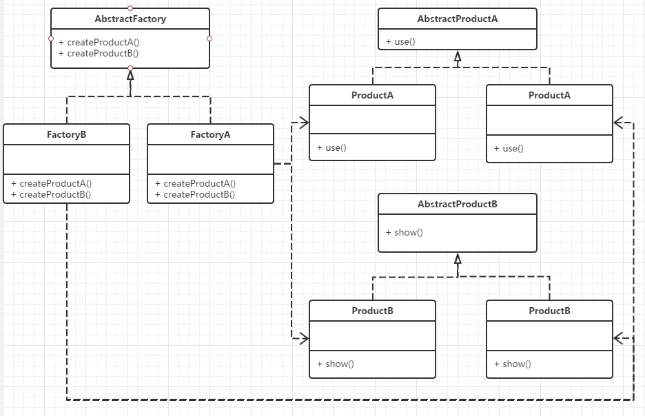
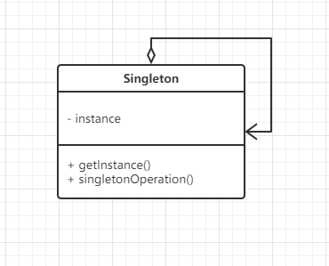
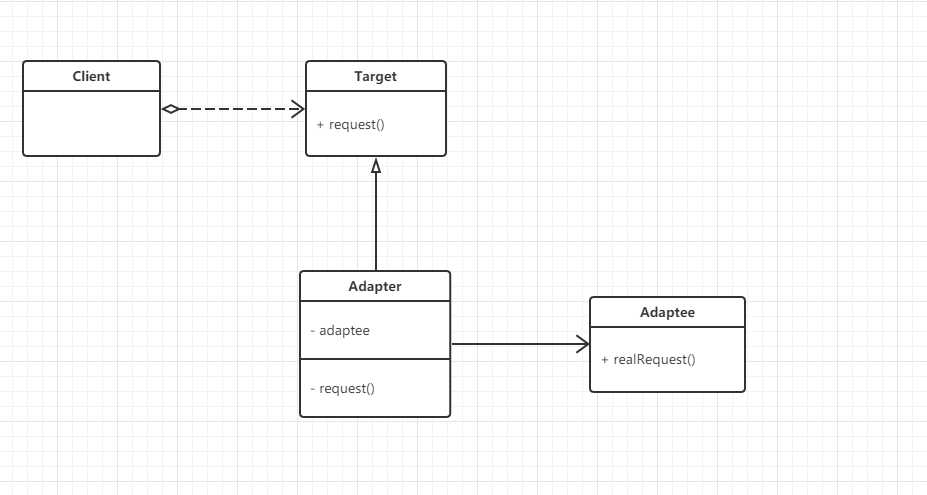
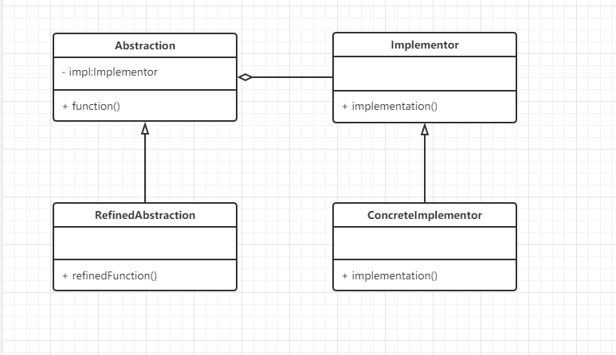

## 工厂模式

工厂模式具体可分为三类模式：简单工厂模式，工厂方法模式，抽象工厂模式；

- - -

#### 1.**简单工厂模式**

又称为静态工厂方法(Static Factory Method)模式，它属于类创建型模式。在简单工厂模式中，可以根据参数的不同返回不同类的实例。简单工厂模式专门定义一个类来负责创建其他类的实例，被创建的实例通常都具有共同的父类。

#### **`角色：`**  
Factory类：负责创建具体产品的实例

Product类：抽象产品类，定义产品子类的公共接口

ConcreteProduct 类：具体产品类，实现Product父类的接口功能，也可添加自定义的功能

**`UML类图：`**


示例代码：


```php
<?php 
//简单工厂模式
class Cat
{
  function __construct()
  {
      echo "I am Cat class <br>";
  }
}
class Dog
{
  function __construct()
  {
      echo "I am Dog class <br>";
  }
}
class Factory
{
  public static function CreateAnimal($name){
      if ($name == 'cat') {
          return new Cat();
      } elseif ($name == 'dog') {
          return new Dog();
      }
  }
}

$cat = Factory::CreateAnimal('cat');
$dog = Factory::CreateAnimal('dog');
```

简单工厂模式最大的优点在于实现对象的创建和对象的使用分离，将对象的创建交给专门的工厂类负责，但是其最大的缺点在于工厂类不够灵活，增加新的具体产品需要修改工厂类的判断逻辑代码，而且产品较多时，工厂方法代码将会非常复杂。

- - -

#### 2.**工厂方法模式**

此模式中，通过定义一个抽象的核心工厂类，并定义创建产品对象的接口，创建具体产品实例的工作延迟到其工厂子类去完成。这样做的好处是核心类只关注工厂类的接口定义，而具体的产品实例交给具体的工厂子类去创建。当系统需要新增一个产品是，无需修改现有系统代码，只需要添加一个具体产品类和其对应的工厂子类，是系统的扩展性变得很好，符合面向对象编程的开闭原则;

#### **`角色：`**  
Product：抽象产品类

ConcreteProduct：具体产品类

Factory：抽象工厂类

ConcreteFactory：具体工厂类

**`UML类图：`**


示例代码：


```php
<?php 
interface Animal{
  public function run();
  public function say();
}
class Cat implements Animal
{
  public function run(){
      echo "I ran slowly <br>";
  }
  public function say(){
      echo "I am Cat class <br>";
  }
}
class Dog implements Animal
{
  public function run(){
      echo "I'm running fast <br>";
  }
  public function say(){
      echo "I am Dog class <br>";
  }
}
abstract class Factory{
  abstract static function createAnimal();
}
class CatFactory extends Factory
{
  public static function createAnimal()
  {
      return new Cat();
  }
}
class DogFactory extends Factory
{
  public static function createAnimal()
  {
      return new Dog();
  }
}

$cat = CatFactory::createAnimal();
$cat->say();
$cat->run();

$dog = DogFactory::createAnimal();
$dog->say();
$dog->run();
    
```

工厂方法模式是简单工厂模式的进一步抽象和推广。由于使用了面向对象的多态性，工厂方法模式保持了简单工厂模式的优点，而且克服了它的缺点。在工厂方法模式中，核心的工厂类不再负责所有产品的创建，而是将具体创建工作交给子类去做。这个核心类仅仅负责给出具体工厂必须实现的接口，而不负责产品类被实例化这种细节，这使得工厂方法模式可以允许系统在不修改工厂角色的情况下引进新产品。

- - -

#### 3.**抽象工厂模式**

提供一个创建一系列相关或相互依赖对象的接口，而无须指定它们具体的类。抽象工厂模式又称为Kit模式，属于对象创建型模式。

此模式是对工厂方法模式的进一步扩展。在工厂方法模式中，一个具体的工厂负责生产一类具体的产品，即一对一的关系，但是，如果需要一个具体的工厂生产多种产品对象，那么就需要用到抽象工厂模式了。

为了便于理解此模式，这里介绍两个概念：


  * **产品等级结构**：产品等级结构即产品的继承结构，如一个抽象类是电视机，其子类有海尔电视机、海信电视机、TCL电视机，则抽象电视机与具体品牌的电视机之间构成了一个产品等级结构，抽象电视机是父类，而具体品牌的电视机是其子类。
  * **产品族 ：**在抽象工厂模式中，产品族是指由同一个工厂生产的，位于不同产品等级结构中的一组产品，如海尔电器工厂生产的海尔电视机、海尔电冰箱，海尔电视机位于电视机产品等级结构中，海尔电冰箱位于电冰箱产品等级结构中。

#### **`角色：`**  
抽象工厂（AbstractFactory）：担任这个角色的是抽象工厂模式的核心，是与应用系统的商业逻辑无关的。

具体工厂（Factory）：这个角色直接在客户端的调用下创建产品的实例，这个角色含有选择合适的产品对象的逻辑，而这个逻辑是与应用系统商业逻辑紧密相关的。

抽象产品（AbstractProduct）：担任这个角色的类是抽象工厂模式所创建的对象的父类，或它们共同拥有的接口

具体产品（Product）：抽象工厂模式所创建的任何产品对象都是一个具体的产品类的实例。

**`UML类图：`**



示例代码：


```php
<?php

interface TV{
  public function open();
  public function watch();
}

class HaierTv implements TV
{
  public function open()
  {
      echo "Open Haier TV <br>";
  }

  public function watch()
  {
      echo "I'm watching TV <br>";
  }
}

interface PC{
  public function work();
  public function play();
}

class LenovoPc implements PC
{
  public function work()
  {
      echo "I'm working on a Lenovo computer <br>";
  }
  public function play()
  {
      echo "Lenovo computers can be used to play games <br>";
  }
}

abstract class Factory{
  abstract public static function createPc();
  abstract public static function createTv();
}

class ProductFactory extends Factory
{
  public static function createTV()
  {
      return new HaierTv();
  }
  public static function createPc()
  {
      return new LenovoPc();
  }
}

$newTv = ProductFactory::createTV();
$newTv->open();
$newTv->watch();

$newPc = ProductFactory::createPc();
$newPc->work();
$newPc->play();
```
## 建造者模式

又名：生成器模式，是一种对象构建模式。它可以将复杂对象的建造过程抽象出来（抽象类别），使这个抽象过程的不同实现方法可以构造出不同表现（属性）的对象。

建造者模式是一步一步创建一个复杂的对象，它允许用户只通过指定复杂对象的类型和内容就可以构建它们，用户不需要知道内部的具体构建细节。例如，一辆汽车由轮子，发动机以及其他零件组成，对于普通人而言，我们使用的只是一辆完整的车，这时，我们需要加入一个构造者，让他帮我们把这些组件按序组装成为一辆完整的车。

#### **`角色：`**  
Builder：抽象构造者类，为创建一个Product对象的各个部件指定抽象接口。

ConcreteBuilder：具体构造者类，实现Builder的接口以构造和装配该产品的各个部件。定义并明确它所创建的表示。提供一个检索产品的接口

Director：指挥者，构造一个使用Builder接口的对象。

Product：表示被构造的复杂对象。ConcreateBuilder创建该产品的内部表示并定义它的装配过程。

包含定义组成部件的类，包括将这些部件装配成最终产品的接口。

**`UML类图：`**


示例代码：


```php
<?php 
/**
* chouxiang builer
*/
abstract class Builder
{
  protected $car;
  abstract public function buildPartA();
  abstract public function buildPartB();
  abstract public function buildPartC();
  abstract public function getResult();
}

class CarBuilder extends Builder
{
  function __construct()
  {
      $this->car = new Car();
  }
  public function buildPartA(){
      $this->car->setPartA('发动机');
  }

  public function buildPartB(){
      $this->car->setPartB('轮子');
  }

  public function buildPartC(){
      $this->car->setPartC('其他零件');
  }

  public function getResult(){
      return $this->car;
  }
}

class Car
{
  protected $partA;
  protected $partB;
  protected $partC;

  public function setPartA($str){
      $this->partA = $str;
  }

  public function setPartB($str){
      $this->partB = $str;
  }

  public function setPartC($str){
      $this->partC = $str;
  }

  public function show()
  {
      echo "这辆车由：".$this->partA.','.$this->partB.',和'.$this->partC.'组成';
  }
}

class Director
{
  public $myBuilder;

  public function startBuild()
  {
      $this->myBuilder->buildPartA();
      $this->myBuilder->buildPartB();
      $this->myBuilder->buildPartC();
      return $this->myBuilder->getResult();
  }

  public function setBuilder(Builder $builder)
  {
      $this->myBuilder = $builder;
  }
}

$carBuilder = new CarBuilder();
$director = new Director();
$director->setBuilder($carBuilder);
$newCar = $director->startBuild();
$newCar->show();
```
## 单例模式

**单例模式**，也叫**单子模式**，是一种常用的[软件设计模式][0]。在应用这个模式时，单例对象的[类][1]必须保证只有一个实例存在。许多时候整个系统只需要拥有一个的全局[对象][2]，这样有利于我们协调系统整体的行为。

> 实现单例模式的思路是：一个类能返回对象一个引用(永远是同一个)和一个获得该实例的方法（必须是静态方法，通常使用getInstance这个名称）；当我们调用这个方法时，如果类持有的引用不为空就返回这个引用，如果类保持的引用为空就创建该类的实例并将实例的引用赋予该类保持的引用；同时我们还将该类的[构造函数][3]定义为私有方法，这样其他处的代码就无法通过调用该类的构造函数来实例化该类的对象，只有通过该类提供的静态方法来得到该类的唯一实例。

> ---维基百科

单例模式的要点有：某个类只能有一个实例；它必须自行创建本身的实例；它必须自行向整个系统提供这个实例。单例模式是一种对象创建型模式。

#### **`角色：`**  
Singleton：单例类

**`UML 类图：`**



示例代码

```php
<?php 

class Singleton
{
  private static $instance;
  //私有构造方法，禁止使用new创建对象
  private function __construct(){}

  public static function getInstance(){
      if (!isset(self::$instance)) {
          self::$instance = new self;
      }
      return self::$instance;
  }
  //将克隆方法设为私有，禁止克隆对象
  private function __clone(){}

  public function say()
  {
      echo "这是用单例模式创建对象实例 <br>";
  }
  public function operation()
  {
      echo "这里可以添加其他方法和操作 <br>";
  }
}

// $shiyanlou = new Singleton();
$shiyanlou = Singleton::getInstance();
$shiyanlou->say();
$shiyanlou->operation();

$newShiyanlou = Singleton::getInstance();
var_dump($shiyanlou === $newShiyanlou);
```

- - -

上述的五个模式均属于创建型模式，接下来将要介绍的六个模式属于结构型模式，在本实验后面的文档将介绍三个，剩下来的留在下一个实验继续介绍。

## 适配器模式

> 在[设计模式][4])中，**适配器模式**（英语：adapter pattern）有时候也称包装样式或者包装(wrapper)。将一个[类][5])的接口转接成用户所期待的。一个适配使得因接口不兼容而不能在一起工作的类工作在一起，做法是将类自己的接口包裹在一个已存在的类中。

> ---维基百科

顾名思义，此模式是源于类似于电源适配器的设计和编码技巧。比如现在有一些类，提供一些可用的接口，但是可能客户端因为不兼容的原因，不能直接调用这些现有的接口，这时就需要一个适配器来作为中转站，适配器类可以向用户提供可用的接口，其内部将收到的请求转换为对适配者对应接口的真是请求，从而实现对不兼容的类的复用。

优点：将目标类和适配者类解耦，通过引入一个适配器类来重用现有的适配者类，而无须修改原有代码。增加了类的透明性和复用性，将具体的实现封装在适配者类中，对于客户端类来说是透明的，而且提高了适配者的复用性。

#### **`角色：`**  
Target：目标抽象类

Adapter：适配器类

Adaptee：适配者类

Client：客户类

**`UML 类图:`**



示例代码：

```php
<?php 

class Adaptee
{
  public function realRequest()
  {
      echo "这是被适配者真正的调用方法";
  }
}

interface Target{
  public function request();
}

class Adapter implements Target
{
  protected $adaptee;
  function __construct(Adaptee $adaptee)
  {
      $this->adaptee = $adaptee;
  }

  public function request()
  {
      echo "适配器转换：";
      $this->adaptee->realRequest();
  }
}

$adaptee = new Adaptee();
$target = new Adapter($adaptee);
$target->request();
```
## 桥接模式

桥接模式是[软件设计模式][6]中最复杂的模式之一，它把事物对象和其具体行为、具体特征分离开来，使它们可以各自独立的变化。事物对象仅是一个抽象的概念。如“圆形”、“三角形”归于抽象的“形状”之下，而“画圆”、“画三角”归于实现行为的“画图”类之下，然后由“形状”调用“画图”。

理解桥接模式，重点需要理解如何将抽象化(Abstraction)与实现化(Implementation)脱耦，使得二者可以独立地变化。桥接模式提高了系统的可扩充性，在两个变化维度中任意扩展一个维度，都不需要修改原有系统。

#### **`角色：`**  
Abstraction：定义抽象的接口，该接口包含实现具体行为、具体特征的Implementor接口

Refined Abstraction：抽象接口Abstraction的子类，依旧是一个抽象的事物名

Implementor：定义具体行为、具体特征的应用接口

ConcreteImplementor：实现Implementor接口

**`UML类图`**



示例代码

```php
<?php 
interface DrawingAPI{
  public function drawCircle($x,$y,$radius);
}

/**
* drawAPI1
*/
class DrawingAPI1 implements DrawingAPI
{
  public function drawCircle($x,$y,$radius)
  {
      echo "API1.circle at (".$x.','.$y.') radius '.$radius.'<br>';
  }
}

/**
* drawAPI2
*/
class DrawingAPI2 implements DrawingAPI
{
  public function drawCircle($x,$y,$radius)
  {
      echo "API2.circle at (".$x.','.$y.') radius '.$radius.'<br>';
  }
}

/**
*shape接口
*/
interface Shape{
  public function draw();
  public function resize($radius);
}

class CircleShape implements Shape
{
  private $x;
  private $y;
  private $radius;
  private $drawingAPI;
  function __construct($x,$y,$radius,DrawingAPI $drawingAPI)
  {
      $this->x = $x;
      $this->y = $y;
      $this->radius = $radius;
      $this->drawingAPI = $drawingAPI;
  }

  public function draw()
  {
      $this->drawingAPI->drawCircle($this->x,$this->y,$this->radius);
  }

  public function resize($radius)
  {
      $this->radius = $radius;
  }
}

$shape1 = new CircleShape(1,2,4,new DrawingAPI1());
$shape2 = new CircleShape(1,2,4,new DrawingAPI2());
$shape1->draw();
$shape2->draw();
$shape1->resize(10);
$shape1->draw();
    
```

- - -

## 装饰器模式

**修饰模式**，是[面向对象编程][7]领域中，一种动态地往一个类中添加新的行为的[设计模式][0]。就功能而言，修饰模式相比生成[子类][8]更为灵活，这样可以给某个对象而不是整个类添加一些功能。

一般来说，给一个对象或者类增加行为的方式可以有两种：


* 继承机制，使用继承机制是给现有类添加功能的一种有效途径，通过继承一个现有类可以使得子类在拥有自身方法的同时还拥有父类的方法。但是这种方法是静态的，用户不能控制增加行为的方式和时机。
* 关联机制，即将一个类的对象嵌入另一个对象中，由另一个对象来决定是否调用嵌入对象的行为以便扩展自己的行为，我们称这个嵌入的对象为装饰器(Decorator)

通过使用修饰模式，可以在运行时扩充一个类的功能。原理是：增加一个修饰类包裹原来的类，包裹的方式一般是通过在将原来的对象作为修饰类的构造函数的参数。装饰类实现新的功能，但是，在不需要用到新功能的地方，它可以直接调用原来的类中的方法。修饰类必须和原来的类有相同的接口。

修饰模式是类继承的另外一种选择。类继承在编译时候增加行为，而装饰模式是在运行时增加行为。

#### **`角色`**  
Component: 抽象构件

ConcreteComponent: 具体构件

Decorator: 抽象装饰类

ConcreteDecorator: 具体装饰类

**`UML 类图`**


示例代码

```php
<?php 
abstract class Component {
  abstract public function operation();
}

class MyComponent extends Component
{
  public function operation()
  {
      echo "这是正常的组件方法 <br>";
  }
}

abstract class Decorator extends Component {
  protected $component;
  function __construct(Component $component)
  {
      $this->component = $component;
  }

  public function operation()
  {
      $this->component->operation();
  }
}

class MyDecorator extends Decorator
{

  function __construct(Component $component)
  {
      parent::__construct($component);
  }

  public function addMethod()
  {
      echo "这是装饰器添加的方法 <br>";
  }

  public function operation()
  {
      $this->addMethod();
      parent::operation();
  }
}

$component = new MyComponent();
$da = new MyDecorator($component);
$da->operation();
```

[0]: https://zh.wikipedia.org/wiki/%E8%BD%AF%E4%BB%B6%E8%AE%BE%E8%AE%A1%E6%A8%A1%E5%BC%8F
[1]: https://zh.wikipedia.org/wiki/%E7%B1%BB
[2]: https://zh.wikipedia.org/wiki/%E5%AF%B9%E8%B1%A1
[3]: https://zh.wikipedia.org/wiki/%E6%9E%84%E9%80%A0%E5%87%BD%E6%95%B0
[4]: https://zh.wikipedia.org/wiki/%E8%AE%BE%E8%AE%A1%E6%A8%A1%E5%BC%8F_(%E8%AE%A1%E7%AE%97%E6%9C%BA
[5]: https://zh.wikipedia.org/wiki/%E7%B1%BB_(%E8%AE%A1%E7%AE%97%E6%9C%BA%E7%A7%91%E5%AD%A6
[6]: https://zh.wikipedia.org/wiki/%E8%BB%9F%E4%BB%B6%E8%A8%AD%E8%A8%88%E6%A8%A1%E5%BC%8F
[7]: https://zh.wikipedia.org/wiki/%E9%9D%A2%E5%90%91%E5%AF%B9%E8%B1%A1%E7%BC%96%E7%A8%8B
[8]: https://zh.wikipedia.org/wiki/%E5%AD%90%E7%B1%BB