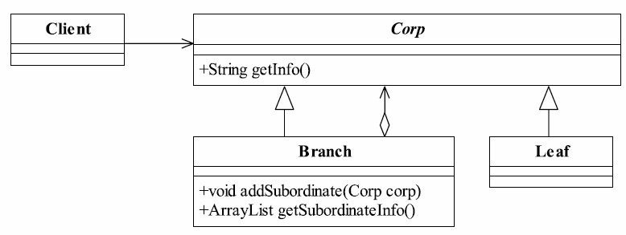
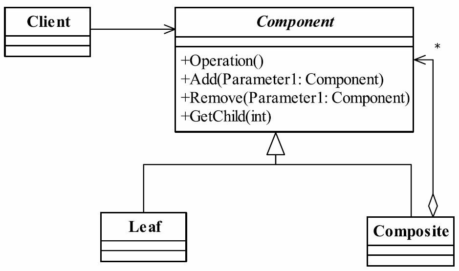
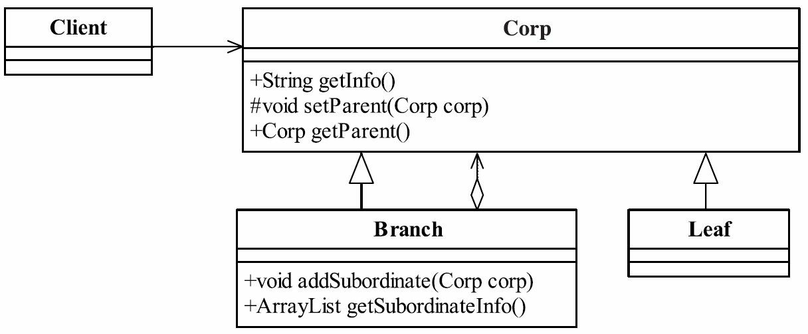

组合模式的定义
组合模式(Composite Pattern)也叫合成模式，有时又叫做部分-整体模式（Part-Whole） ，主要是用来描述部分与整体的关系， 其定义如下：Compose objects into tree structures to represent part-whole hierarchies.Composite lets clients
treat individual objects and compositions of objects uniformly.（ 将对象组合成树形结构以表示“部分-整体”的层次结构，使得用户对单个对象和组合对象的使用具有一致性。 ）

组合模式的通用类图

角色  
● Component抽象构件角色   
定义参加组合对象的共有方法和属性， 可以定义一些默认的行为或属性， 比如我们例子
中的getInfo就封装到了抽象类中。  
● Leaf叶子构件   
叶子对象， 其下再也没有其他的分支， 也就是遍历的最小单位。  
● Composite树枝构件  
树枝对象， 它的作用是组合树枝节点和叶子节点形成一个树形结构。  

组合模式的优点 
● 高层模块调用简单    
一棵树形机构中的所有节点都是Component，局部和整体对调用者来说没有任何区别，
也就是说，高层模块不必关心自己处理的是单个对象还是整个组合结构，简化了高层模块的代码。  
● 节点自由增加  
使用了组合模式后，我们可以看看，如果想增加一个树枝节点、 树叶节点是不是都很容
易，只要找到它的父节点就成，非常容易扩展，符合开闭原则，对以后的维护非常有利。

组合模式的缺点  
组合模式有一个非常明显的缺点， 看到我们在场景类中的定义， 提到树叶和树枝使用时
的定义了吗？直接使用了实现类！这在面向接口编程上是很不恰当的，与依赖倒置原则冲突，读者在使用的时候要考虑清楚， 它限制了你接口的影响范围。  

组合模式的使用场景  
● 维护和展示部分-整体关系的场景， 如树形菜单、 文件和文件夹管理。  
● 从一个整体中能够独立出部分模块或功能的场景。  

组合模式的注意事项  
只要是树形结构，就要考虑使用组合模式，这个一定要记住，只要是要体现局部和整体
的关系的时候，而且这种关系还可能比较深，考虑一下组合模式吧。  

组合模式的扩展   

真实的组合模式   
透明的组合模式   

组合模式的遍历  

