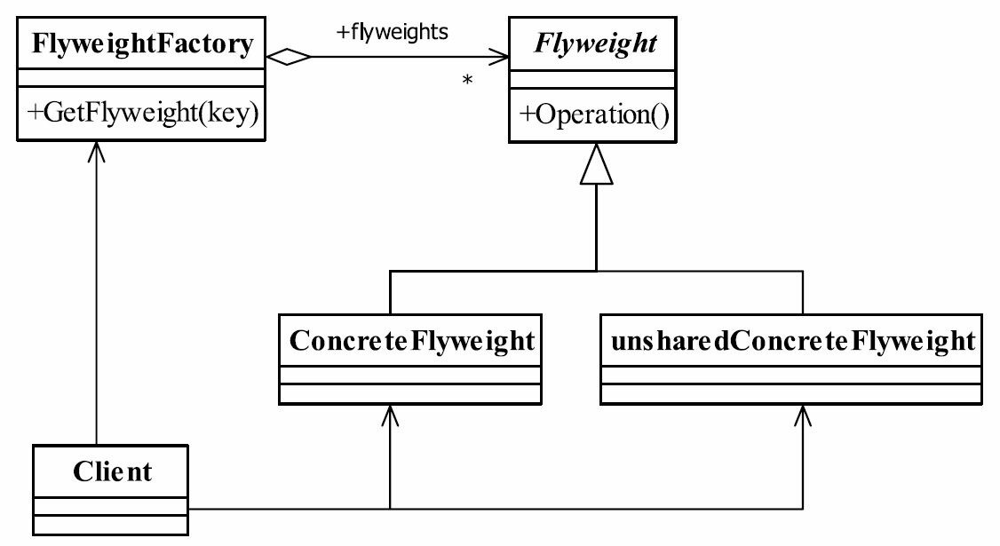

享元模式的定义  
享元模式（Flyweight Pattern）是池技术的重要实现方式，其定义如下：Use sharing to
support large numbers of fine-grained objects efficiently.（使用共享对象可有效地支持大量的细粒度的对象。）
享元模式的定义为我们提出了两个要求：细粒度的对象和共享对象。我们知道分配太多
的对象到应用程序中将有损程序的性能，同时还容易造成内存溢出，那怎么避免呢？就是享元模式提到的共享技术。我们先来了解一下对象的内部状态和外部状态。  
要求细粒度对象，那么不可避免地使得对象数量多且性质相近，那我们就将这些对象的
信息分为两个部分：内部状态（intrinsic）与外部状态（extrinsic）。   
● 内部状态   
内部状态是对象可共享出来的信息，存储在享元对象内部并且不会随环境改变而改变，
如我们例子中的id、postAddress等，它们可以作为一个对象的动态附加信息，不必直接储存在具体某个对象中，属于可以共享的部分。   
● 外部状态   
外部状态是对象得以依赖的一个标记，是随环境改变而改变的、不可以共享的状态，如
我们例子中的考试科目+考试地点复合字符串，它是一批对象的统一标识，是唯一的一个索
引值。   
有了对象的两个状态，我们就可以来看享元模式的通用类图，如图  

元模式角色名称   
● Flyweight——抽象享元角色  
它简单地说就是一个产品的抽象类，同时定义出对象的外部状态和内部状态的接口或实
现。  
● ConcreteFlyweight——具体享元角色   
具体的一个产品类，实现抽象角色定义的业务。该角色中需要注意的是内部状态处理应
该与环境无关，不应该出现一个操作改变了内部状态，同时修改了外部状态，这是绝对不允许的。   
● unsharedConcreteFlyweight——不可共享的享元角色   
不存在外部状态或者安全要求（如线程安全）不能够使用共享技术的对象，该对象一般
不会出现在享元工厂中。   
● FlyweightFactory——享元工厂   
职责非常简单，就是构造一个池容器，同时提供从池中获得对象的方法。   
享元模式的目的在于运用共享技术，使得一些细粒度的对象可以共享，我们的设计确实
也应该这样，多使用细粒度的对象，便于重用或重构。   

享元模式的优点和缺点   
享元模式是一个非常简单的模式，它可以大大减少应用程序创建的对象，降低程序内存
的占用，增强程序的性能，但它同时也提高了系统复杂性，需要分离出外部状态和内部状
态，而且外部状态具有固化特性，不应该随内部状态改变而改变，否则导致系统的逻辑混
乱。   

享元模式的使用场景   
在如下场景中则可以选择使用享元模式。   
● 系统中存在大量的相似对象。   
● 细粒度的对象都具备较接近的外部状态，而且内部状态与环境无关，也就是说对象没
有特定身份。   
● 需要缓冲池的场景。  

享元模式的扩展   

线程安全的问题
线程安全是一个老生常谈的话题，只要使用Java开发都会遇到这个问题，我们之所以要
在今天的享元模式中提到该问题，是因为该模式有太大的几率发生线程不安全  

性能平衡   
尽量使用Java基本类型作为外部状态。在报考系统中，我们不考虑系统的修改风险，完
全可以重新建立一个类作为外部状态，因为这才完全符合面向对象编程的理念。  

最佳实践   
Flyweight是拳击比赛中的特用名词，意思是“特轻量级”，指的是51公斤级比赛，用到设
计模式中是指我们的类要轻量级，粒度要小，这才是它要表达的意思。粒度小了，带来的问题就是对象太多，那就用共享技术来解决。    