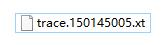
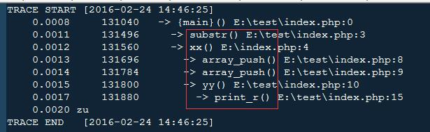
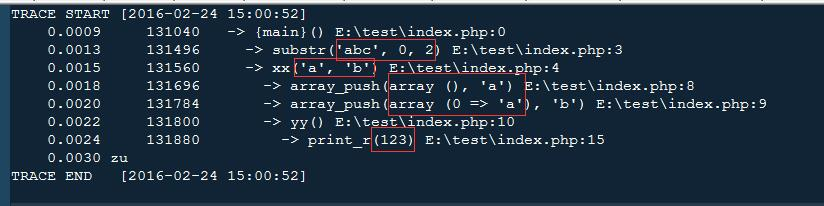
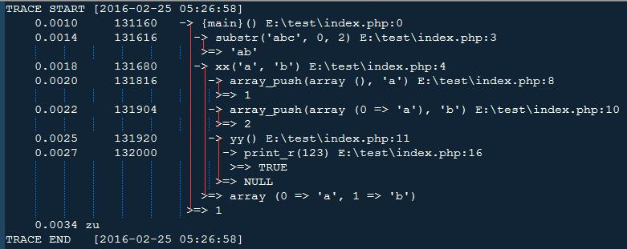

# [PHP Xdebug调试专题][6]

## 1、介绍与安装

Xdebug是一个PHP扩展,安装配置好后,可以自动记录运行了哪些函数,用了多少毫秒,从哪个文件运行到哪个文件等等

它记下来的调试信息很详细,对一些复杂程序跟踪调试有很大的辅助效果,能明显快速地定位问题,缩短调试时间

#### 官方网站:[http://xdebug.org/][7]

#### 官方文档:[http://xdebug.org/docs/all_settings][8]

- - -

### 先确认一下你有没有安装Xdebug

执行phpinfo();如果没有图中这一块内容就是没有安装Xdebug了

### 安装方法

并不是随便下载扩展文件安装就可以的,它针对不同版本的PHP有不同的扩展文件提供给你下载

下面教你通过官方的分析结果来引导你安装

1. 先进入官方网站,然后点击上面横向导航中的[download][9]
1. 进入下载页面后,虽然页面下面有很多版本的下载,如果你不熟悉的话我不建议你下载,没准安装是不能用的,按我接下来说的去安装一般都能妥妥地使用起来

点击[custom installation instructions][10]链接进入自定义安装引导页面
1. 进入自定义安装引导后是下面这样的:

分析需要一段时间,我最短等过几秒的,最长等过60秒左右,有时候也看网络情况吧,毕竟是提交到国外网站,分析完成后会自动显示分析结果,如下图:

另外如果在linux系统环境下执行phpinfo也可以这样的,只是安装流程会比较多,引导你敲各种命令神马的

## 2、记录运行轨迹

先设置以下两项配置

    #开启自动跟踪回溯
    xdebug.auto_trace=on
    
    #设置回溯信息输出目录
    xdebug.trace_output_dir="E:\xdebug"
    

然后通过浏览器访问任何一个http入口脚本,脚本内容可以复制我下面的演示代码:

```php
<?php
$str = 'abc';
$str1 = substr($str, 0, 2);

function xx($a, $b){
    $x = array();
    array_push($x, $a);
    array_push($x, $b);
    yy();
    return $x;
}

function yy(){
    print_r(123);
}
```

运行后就会在回溯信息输出目录下产生类似这样的一个文件 



而打开它文件内容则是这样的:



内容中每一行都显示了在哪个文件的哪一行执行了哪个函数,其中你注意一下第1次出现的array_push函数相对于上一行的xx函数缩进了的,这意思是说array_push函数是在xx函数里面执行的

- - -

换成运行你自己的项目代码,相信就能看到成千上万行回溯代码了,包括调用了哪个对象的哪个方法也是这么看

这个回溯追踪的好处是你如果平时发现页面突然变空白了,怎么输出东西都看不见,于是只要通过这个回溯追踪调试,看看输出信息文件的最后几行调用的函数和文件行号你就大概知道出错位置在哪里了

最后提醒:**它只记录有函数执行的地方,没有函数执行的地方是不会语录的,比如echo,include,isset等语句是不会记录的**,于是你也能从中确认哪些是函数,哪些是语句了

## 3、设置文件名

默认情况下生成的文件名是类似trace.150145005.xt的,我个人觉得这样命名并不友好,起码就算你重复运行其它脚本都是将调试信息记录到这个文件中的,如果想为每个不同的脚本做不同的记录就要先复制备份开,再运行让它产生新的同名文件了

所以我们要通过xdebug.trace_output_name配置项来设置调试信息的文件名

样本配置:

```ini
xdebug.auto_trace=on
xdebug.trace_output_dir="E:\xdebug"
xdebug.collect_params=0
#重点是下面这个,值为%R表示以请求地址来命名,这样不同地址就会有不同的调试信息文件
xdebug.trace_output_name="%R"
```

然后访问http://xxx.com/a.php就会产生_a_php.xt这个文件

而且同一个入口地址不同参数都会不同喔,你试试访问http://xxx.com/a.php?x=y就会产生_a_php_x=y.xt这个文件

下面我列出所有命名参数

参数 | 含义 | 例子 | 命名结果 
-|-|-|-
`%c` | 以URL中文件目录的CRC32运算结果命名 | trace.%c | trace.1258863198.xt 
`%p` | 以进程PID命名 | trace.%p | trace.5174.xt 
`%r` | 以随机数命名 | trace.%r | trace.072db0.xt 
`%s` | 入口脚本名称,实际上我测试结果是不会生成文档,原因暂时不明 | cachegrind.out.%s | `cachegrind.out._home_httpd_html_test_xdebug_test_php`
`%t` | 以时间戳命名 | trace.%t | trace.1179434742.xt 
`%u` | 以毫秒级时间戳命名 | trace.%u | trace.1179434749_642382.xt 
`%H` | 以`$_SERVER['HTTP_HOST']`这个域名命名 | trace.%H | trace.kossu.xt 
`%R` | 以`$_SERVER['REQUEST_URI']`这个URI部分命名 | trace.%R | `trace._test_xdebug_test_php_var=1_var2=2.xt` 
`%U` | 以`$_SERVER['UNIQUE_ID']`这个唯一的请求ID来命名 | trace.%U | trace.TRX4n38AAAEAAB9gBFkAAAAB.xt 
`%S` | 以session_id命名,但前提是cookie中有PHPSESSIONID | trace.%S | trace.c70c1ec2375af58f74b390bbdd2a679d.xt 
`%%` | 以两个百分号命名,我看不懂加这个命名方式有何意义,求教大神啊! | trace.%% | trace.%%.xt

## 4、记录函数参数

有时候你即使有了回溯也看不出"为什么程序会这样调用,怎么计算进来的"

于是可以尝试开启函数参数记录来看看每一次调用函数时,传给那些函数的参数都是什么,那么结果能进一步明了

* 复制如下配置
```ini
xdebug.auto_trace=on
xdebug.trace_output_dir="E:\xdebug"
#通过设置collect_params选项值为3开启参数记录
xdebug.collect_params=3
```
于是跑一趟代码下来,调试信息文件内容就是这样的,看到了吧,函数的括号里多了参数,而没有开启collect_params时函数后面只有一个空括号的

## 5、手动触发记录

### 请求参数触发

如果配置xdebug.auto_trace=on的话,你运行任何PHP文件都会产生回溯记录

但有时候你只需要回溯某一个地址的运行轨迹,可以通过设置xdebug.trace_enable_trigger=on来实现,但前提是要设置xdebug.auto_trace=off(或者删除这个选项))

配置样本:

```ini
xdebug.auto_trace=off
xdebug.trace_enable_trigger=on
xdebug.trace_output_dir="E:\xdebug"
```

这样你访问/index.php不会产生回溯记录,但是你如果修改一下URL参数,加上XDEBUG_TRACE这个参数名,不用参数值,只要有参数名就行了

就是访问这样的/index.php?XDEBUG_TRACE地址,然后就会产生文件了,这就是通过GET参数触发

而通过POST请求也是这样,如果你的POST参数中带有XDEBUG_TRACE才会有回溯

```js
$.ajax({
    url : '/index.php',
    type : 'post',
    data : {
        a : 1,
        XDEBUG_TRACE : 11 //这个值随便设置,如果你不设置就不会POST这个字段上去!
    }
});
```

- - -

### 函数触发

在测试前请先确认配置xdebug.auto_trace=off(关闭自动回溯)

然后找到你要开始追踪回溯的代码位置调用xdebug_start_trace函数,再在要停止追踪回溯的位置调用xdebug_stop_trace函数,这样就会生成回溯信息,并且是对你开始和结束trace函数之间的代码进行记录,其它无关的代码是不记录的

样例代码:

```php
<?php
$str = 'abc';
$str1 = substr($str, 0, 2);
xx('a', 'b');

function xx($a, $b){
    xdebug_start_trace(); //开始记录回溯
    $x = array();
    array_push($x, $a);
    print(222);
    array_push($x, $b);
    xdebug_stop_trace(); //结束记录回溯
    yy();
    return $x;
}

function yy(){
    print_r(123);
}
```

并且要注意,通过函数触发的话并不需要什么配置,你只要开启了扩展就可以,就是只保留zend_extension="xdebug.dll"就可以,其它xdebug的相关配置可以完全不配置,如果有文件名定制需求就再保留xdebug.trace_output_name选项就足够了

然而如果你开启了xdebug.auto_trace其实相当于让PHP启动时就自动执行xdebug_start_trace函数,于是会报错说这个函数已经执行过了,所以为避免麻烦请不要开启xdebug_start_trace

这个调试更加精准,因为如果整个运行周期都回溯下来,起码有成千上万行,查找成为了艰难的事情

而函数触发时就缩小了你需要的范围,查找就快捷了很多!

## 6、记录返回值

记录了函数参数还不足够,想要记录每一次函数的返回值也可以,设置xdebug.collect_return=on以下是我的演示代码:

```php
<?php
$str = 'abc';
$str1 = substr($str, 0, 2);
xx('a', 'b');

function xx($a, $b){
    $x = array();
    array_push($x, $a);
    print(222);
    array_push($x, $b);
    yy();
    return $x;
}

function yy(){
    print_r(123);
}
```

运行后所得出的调试信息如下

其中>=>符号后面的值就是相关函数的返回值,然而并不是每一次>=>的值都是上一行调用的返回值,至于它是属于谁的返回值,还要看我红色线所连接的行

比如>=> array (0 => 'a', 1 => 'b')则表示-> xx('a', 'b') E:\test\index.php:4的返回值,并且大家细心的话一定能发现它们的缩进是一样的


[6]: http://www.cnblogs.com/grimm/p/6589259.html
[7]: http://xdebug.org/
[8]: http://xdebug.org/docs/all_settings
[9]: http://xdebug.org/download.php
[10]: https://xdebug.org/wizard.php