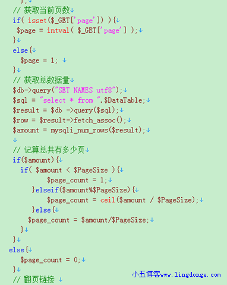

# PHP查询MySQL数据库的四种方法比较

时间:12-07-30 

小五平时使用MySQL的时候是非常多的。有时候要自己写个接口神马的取数据库里面的东西。

老是用别人的代码不是很方便的。比如下面我的一个代码片段，可以从任意CMS里面取文章的URL和标题以及tag，拿 来有什么用呢。

我把文章和Tag取出来，放到工具里面，自动添加内链。



还是切入正题。下面代码转自其它博客。

**1、使用mysql_result()来获取数据**
```php
<?php   
$connection = mysql_connect("localhost", "root", "password"); //连接并选择数据库服务器
mysql_select_db("test", $connection);
$query = "insert into users(user_name)"; //在test数据库里插入一条数据
$query .= "values(‘tuxiaohui’)";
$result = mysql_query($query);
if (!$query) {
    echo "insert data failed!<br>";
} else {
    $query  = "select * from users"; //查询数据
    $result = mysql_query($query, $connection);
    for ($rows_count = 0; $rows_count < 7; $rows_count++) //用mysql_result获得数据并输出，mysql_result() 返回 MySQL 结果集中一个单元的内容。
    {
        echo "用户ID：" . mysql_result($result, $rows_count, "user_id") . "<br>";
        echo "用户名：" . mysql_result($result, $rows_count, "user_name") . "<br>";
    }
}

?> 
```
**2、使用mysql_fetch_row()来获取数据,以数组的形式返回查询结果**
```php
<?php   
$connection = mysql_connect("localhost", "root", "password"); //连接并选择数据库服务器
mysql_select_db("test", $connection);
$query  = "select * from users";
$result = mysql_query($query, $connection);
while ($row = mysql_fetch_row($result)) {
    echo "用户ID：" . $row[0] . "<br>";
    echo "用户名：" . $row[1] . "<br>";
}

?> 
```
**3、使用mysql_fetch_array()来获取数据,同mysql_fetch_row()类似，也是获取结果集中当前行数据，并在调用后自动滑向下一行**
```php
<?php   
$connection = mysql_connect("localhost", "root", "password"); //连接并选择数据库服务器
mysql_select_db("test", $connection);
$query  = "select * from users";
$result = mysql_query($query, $connection);
while ($row = mysql_fetch_array($result)) {
    echo "用户ID：" . $row[0] . "<br>"; //也可以写做$row["user_id"]
    echo "用户名：" . $row[1] . "<br>"; //也可以写做$row["user_name"]
}

?>
```
**4、使用mysql_fetch_object()以对象的形式返回查询结果，也是用于查询数据结果集，返回当前行数据，并自动滑向下一行，不同的是它返回的是一个对象，这个对象的属性集合即为数据的属性集合，而属性上的值则为数据库中当前行该属性上的值**
```php
<?php   
$connection = mysql_connect("localhost", "root", "root"); //连接并选择数据库服务器
mysql_select_db("test", $connection);
$query  = "select * from users";
$result = mysql_query($query, $connection);
while ($row = mysql_fetch_object($result)) {
    echo "用户ID：" . $row->user_id . "<br>"; //通过对象运算符->获得改行数据在其属性上的值。
    echo "用户名：" . $row->user_name . "<br>";
}

?> 
```
**5、综合比较：**

mysql_result()：优点在于使用方便；其缺点在于功能少，一次调用只能获取结果数据集中的一行元素，对较大型的数据库效率较低； 

mysql_fetch_row()：优点在于执行效率在4种方法中最高；不足在于只能用数字作为属性索引来获得属性值，在使用时非常容易出现混淆； 

mysql_fetch_array()：执行效率同样高，同mysql_fetch_row()相差无几，并界可以用属性名方式直接获得属性值，因此在实际应用中最常用； 

mysql_fetch_object()：采用了面向对象思想，在设计思路上更为先进，如果习惯于用面向对象的思路来写程序，则会很自地选择它。其次，该方法的优点还体现在，对于结构较为负责的数据结果，在逻辑上更为清晰。 

学会代码了，以后取数据库的值就方便多了。收藏吧。

[0]: http://www.lingdonge.com/category/coding/php
