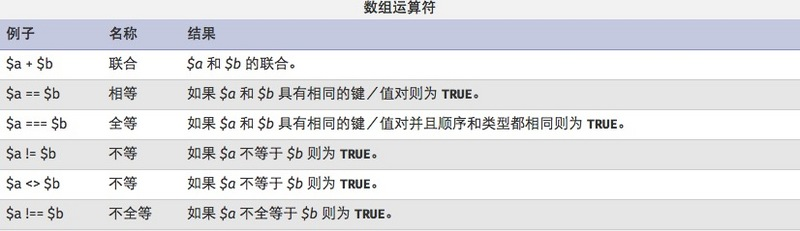

## 概述
<font face=微软雅黑>

要访问一个变量的内容，可以直接使用其名称。如果该变量是一个数组，可以使用变量名称和关键字或索引的组合来访问其内容。

像其他变量一样，使用运算符=可以改变数组元素的内容。数组单元可以通过 array[key] 语法来访问。



## 数组的基本操作

### php定义数组：

```php
    <?php  
        $array = array();  
        $array["key"] = "values";  
    ?> 
```

在PHP中声明数组的方式主要有两种：

1.用array()函数声明数组，  
2.直接为数组元素赋值。

```php
    <?php
        //array数组
        $users = array('phone','computer','dos','linux');
        echo $users;//只会打印出数据类型Array
        print_r($users);//Array ( [0] => phone [1] => computer [2] => dos [3] => linux )
    
        $numbers = range(1,5);//创建一个包含指定范围的数组
        print_r($numbers);//Array ( [0] => 1 [1] => 2 [2] => 3 [3] => 4 [4] => 5 )
        print_r(true);//1
        var_dump(false);//bool(false)
    
    //print_r可以把字符串和数字简单地打印出来，数组会以Array开头并已键值形式表示，print_r输出布尔值和null的结果没有意义，因此用var_dump更合适
    
    //通过循环来显示数组里所有的值
        for($i = 0 ;$i < 5;$i++){
            echo $users[$i];
            echo '<br/>';
        }
    
    //通过count/sizeof统计数组中单元数目或对象中的属性个数
    
        for($i = 0; $i < count($users);$i++){
            echo $users[$i];
            echo '<br/>';
        }
    //还可以通过foreach循环来遍历数组，这种好处在于不需要考虑key
        foreach($users as $value){
            echo $value.'<br/>';//点号为字符串连接符号
        }
    //foreach循环遍历 $key => $value；$key和$value是变量名，可以自行设置
        foreach($users as $key => $value){
            echo $key.'<br/>';//输出键
        }
    ?>
```

### 创建自定义键的数组

```php
    <?php
    
        //创建自定义键的数组
        $ceo = array('apple'=>'jobs','microsoft'=>'Nadella','Larry Page','Eric');
        //如果不去声明元素的key,它会从零开始
        print_r($ceo);//Array ( [apple] => jobs [microsoft] => Nadella [0] => Larry Page [1] => Eric )
    
        echo $ceo['apple'];//jobs
    
         //php5.4起的用法
        $array = [
            "foo" => "bar",
            "bar" => "foo",
        ];
    
        print_r($array);//Array ( [foo] => bar [bar] => foo ) 
    
    ?>    
```

从php5.4 起可以使用短数组定义语法，用 [] 替代 array()。有点类似于javascript中数组的定义。

### each()的使用

```php
    <?php
        //通过为数组元素赋值来创建数组
        $ages['trigkit4'] = 22;
        echo $ages.'<br/>';//Array
        //因为相关数组的索引不是数字，所以无法通过for循环来进行遍历操作，只能通过foreach循环或list()和each()结构
    
        //each的使用
        //each返回数组中当前的键/值对并将数组指针向前移动一步
        $users = array('trigkit4'=>22,'mike'=>20,'john'=>30);
        //print_r(each($users));//Array ( [1] => 22 [value] => 22 [0] => trigkit4 [key] => trigkit4 )
    
       //相当于：$a = array([0]=>trigkit4,[1]=>22,[value]=>22,[key]=>trigkit4);
        $a = each($users);//each把原来的数组的第一个元素拿出来包装成新数组后赋值给$a
        echo $a[0];//trigkit4
    
        //!!表示将真实存在的数据转换成布尔值
        echo !!each($users);//1
    
    ?>  
```

each的指针指向第一个键值对，并返回第一个数组元素，获取其键值对，并包装成新数组

### list()的使用

list用来把数组用的值赋给一些变量，看下面例子：

```php
    <?php
    
        $a = ['2','abc','def'];
        list($var1,$var2) = $a;
        echo $var1.'<br/>';//2
        echo $var2;//abc
    
        $a = ['name'=>'trigkit4','age'=>22,'0'=>'boy'];
        //list只认识key为数字的索引
        list($var1,$var2) = $a;
    
        echo $var1;//boy
    
    ?>
```

注：list只认识key为数字的索引

## 数组元素的排序

    反向排序:sort()、asort()和 ksort()都是正向排序,当然也有相对应的反向排序. 
    实现反向:rsort()、arsort()和 krsort()。
    
    array_unshift()函数将新元素添加到数组头,array_push()函数将每个新元素添加到数组 的末尾。
    array_shift()删除数组头第一个元素,与其相反的函数是 array_pop(),删除并返回数组末 尾的一个元素。
    array_rand()返回数组中的一个或多个键。
    
    函数shuffle()将数组个元素进 行随机排序。
    函数 array_reverse()给出一个原来数组的反向排序
    

## 数组的各类API的使用

    count()和 sizeof()统计数组下标的个数 
    array_count_values()统计数组内下标值的个数

```php
    <?php
        $numbers = array('100','2');
        sort($numbers,SORT_STRING);//按字符串排序，字符串只比较第一位大小
        print_r($numbers);//Array ( [0] => 100 [1] => 2 )
    
        $arr = array('trigkit4','banner','10');
        sort($arr,SORT_STRING);
        print_r($arr);//Array ( [0] => 10 [1] => banner [2] => trigkit4 )
    
        shuffle($arr);
        print_r($arr);//随机排序
    
        $array = array('a','b','c','d','0','1');
        array_reverse($array);
        print_r($array);//原数组的反向排序。 Array ( [0] => a [1] => b [2] => c [3] => d [4] => 0 [5] => 1 )
    
    
        //数组的拷贝
        $arr1  = array( '10' , 2);
        $arr2  =  &$arr1 ;
        $arr2 [] =  4 ;  // $arr2 被改变了,$arr1仍然是array('10', 3)
        print_r($arr2);//Array ( [0] => 10 [1] => 2 [2] => 4 )
    
        //asort的使用
        $arr3  = & $arr1 ;//现在arr1和arr3是一样的
        $arr3 [] =  '3' ;
        asort($arr3);//对数组进行排序并保留原始关系
        print_r($arr3);// Array ( [1] => 2 [2] => 3 [0] => 10 )
    
        //ksort的使用
        $fruits = array('c'=>'banana','a'=>'apple','d'=>'orange');
        ksort($fruits);
        print_r($fruits);//Array ( [a] => apple [c] => banana [d] => orange )
    
       //unshift的使用
        array_unshift($array,'z');//开头处添加一元素
        print_r($array);//Array ( [0] => z [1] => a [2] => b [3] => c [4] => d [5] => 0 [6] => 1 )  
    
        //current(pos)的使用
        echo current($array);//z;获取当前数组中的当前单元
    
        //next的使用
        echo next($array);//a;将数组中的内部指针向前移动一位
    
        //reset的使用
        echo reset($array);//z;将数组内部指针指向第一个单元
    
        //prev的使用
        echo next($array);//a;
        echo prev($array);//z;倒回一位
    
        //sizeof的使用
        echo sizeof($array);//7；统计数组元素的个数
    
        //array_count_values
        $num = array(10,20,30,10,20,1,0,10);//统计数组元素出现的次数
        print_r(array_count_values($num));//Array ( [10] => 3 [20] => 2 [30] => 1 [1] => 1 [0] => 1 ) 
    
    ?>    
```

current()：每个数组都有一个内部指针指向他的当前单元，初始指向插入到数组中的第一个元素

## for循环遍历

```php
    <?php
        $value = range(0,120,10);
        for($i=0;$i<count($value);$i++){
            print_r($value[$i].' ');//0 10 20 30 40 50 60 70 80 90 100 110 120 
        }
    ?>
```

## 数组的实例

### array_pad函数的使用

```php
    <?php
        //array_pad函数，数组数组首尾选择性追加
        $num = array(1=>10,2=>20,3=>30);
        $num = array_pad($num,4,40);
        print_r($num);//Array ( [0] => 10 [1] => 20 [2] => 30 [3] => 40 )
    
        $num = array_pad($num,-5,50);//array_pad(array,size,value)
        print_r($num);//Array ( [0] => 50 [1] => 10 [2] => 20 [3] => 30 [4] => 40 ) 
    ?>
```

size:指定的长度。整数则填补到右侧，负数则填补到左侧。

### unset()的使用

```php
     <?php
        //unset()的使用
        $num = array_fill(0,5,rand(1,10));//rand(min,max)
        print_r($num);//Array ( [0] => 8 [1] => 8 [2] => 8 [3] => 8 [4] => 8 ) 
        echo '<br/>';
    
        unset($num[3]);
        print_r($num);//Array ( [0] => 8 [1] => 8 [2] => 8 [4] => 8 ) 
    ?>
```

### array_fill()的使用

```php
    <?php
        //array_fill()的使用
        $num = range('a','e');
        $arrayFilled = array_fill(1,2,$num);//array_fill(start,number,value)
        echo '<pre>';
    
        print_r($arrayFilled);
    
    ?>
```

### array_combine()的使用

```php
    <?PHP
        $number = array(1,2,3,4,5);
        $array = array("I","Am","A","PHP","er");
        $newArray = array_combine($number,$array);
        print_r($newArray);//Array ( [1] => I [2] => Am [3] => A [4] => PHP [5] => er ) 
    ?> 
```

### array_splice()删除数组成员

```php
    <?php
        $color = array("red", "green", "blue", "yellow");
        count ($color); //得到4
        array_splice($color,1,1); //删除第二个元素
        print_r(count ($color)); //3
        echo $color[2]; //yellow
        echo $color[1]; //blue
    ?>  
```

### array_unique删除数组中的重复值

```php
    <?php
        $color=array("red", "green", "blue", "yellow","blue","green");
        $result = array_unique($color);
        print_r($result);//Array ( [0] => red [1] => green [2] => blue [3] => yellow ) 
    ?> 
```

### array_flip()交换数组的键值和值

```php
    <?PHP
        $array = array("red","blue","red","Black");
        print_r($array);
        echo "<br />";
        $array = array_flip($array);//
        print_r($array);//Array ( [red] => 2 [blue] => 1 [Black] => 3 ) 
    ?> 
```

### array_search()搜索数值

```php
    <?php
       $array = array("red","blue","red","Black");
       $result=array_search("red",$array)//array_search(value,array,strict)
        if(($result === NULL)){
            echo "不存在数值red";
        }else{
            echo "存在数值 $result";//存在数值 0 
        }
    ?>
```

    

</font>