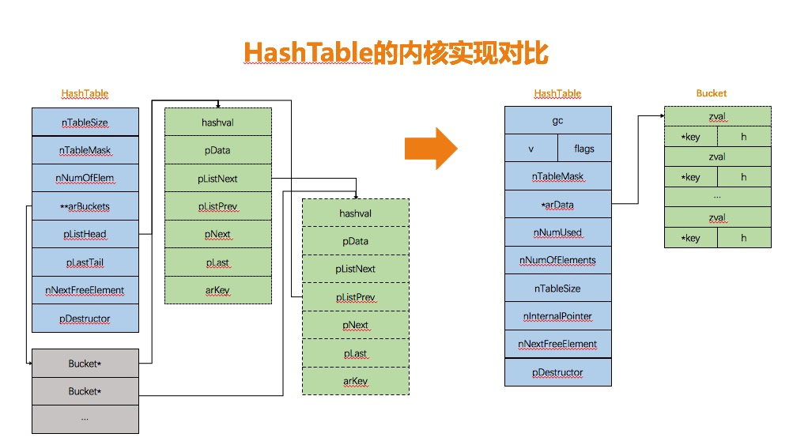
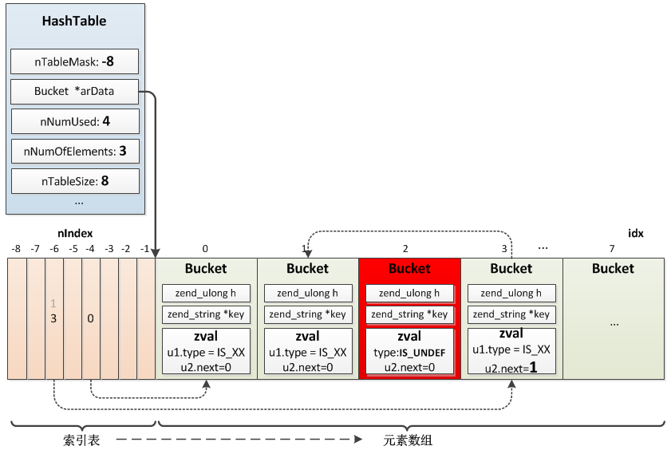

# PHP哈希表内核实现 

NX 

[2018-03-21][0]

[PHP][1]

毫无疑问，Hash表是php语言最重要的数据结构。  
话不多说，看一下php7中HashTable的定义：

## HashTable 结构定义


```c
typedef struct _zend_array HashTable;  
struct _zend_array {  
    zend_refcounted_h gc;               ／* gc引用计数 *／  
    union {  
        struct {  
            ZEND_ENDIAN_LOHI_4(  
                zend_uchar    flags,  
                zend_uchar    _unused,  
                zend_uchar    nIteratorsCount,  
                zend_uchar    consistency)  
        } v;  
        uint32_t flags;                    /* 哈希表的标记信息，包括类型标志，迭代器计数等 */  
    } u;  
    uint32_t          nTableMask;        /* 散列表掩码 */  
    Bucket            * arData;           /* Bucket数组首指针 */  
    uint32_t          nNumUsed;          /* 已用Bucket计数 */  
    uint32_t          nNumOfElements;    /* 有效元素计数，nNumOfElements = nNumUsed - UNDEF(Bucket.val) */  
    uint32_t          nTableSize;        /* 哈希表总大小 */  
    uint32_t          nInternalPointer;  /* 内部指针，提供给迭代器使用，默认用于标注第一个有效的元素在Bucket数组中的位置 */  
    zend_long         nNextFreeElement;  /* 下一个可用的数值索引,如:arr[] = 1;arr["a"] = 2;nNextFreeElement = 1; */  
    dtor_func_t       pDestructor;       /* 无效Bucket value的销毁函数指针 */  
};
```

其中arData指向了哈希表中元素的实际存储位置，其他字段用于计数，定位hash key，执行迭代等辅助操作。

Bucket的结构也比较简洁，包含三个信息，元素的key， value，以及相应的hash值：


```c
typedef struct _Bucket {  
    zval              val;              /* HashTable value */  
    zend_ulong        h;                /* hash value (or numeric index) for key */  
    zend_string      *key;              /* string key or NULL for numerics */  
} Bucket;
```

如下图所示，与PHP5不同的是，HashTable的数据结构发生的巨大的变化，取消了原有按key映射双向链表的模式，而采用一维数组统一管理。

 

好处在于：

* 加速寻值定位，直接利用hash值计算得到索引，在一维数组上通过指针运算定位元素，效率更高。
* 数组的结构形式能够很好的利用cpu cache的性能，减少cpu cache命中失败的次数。(延伸阅读：[cpu cache line][2] )
* 简化Bucket的管理，不需要双向链表维持插入顺序，利用数组的天然优势，减少了Bucket结构的冗余信息，指针内存以及分配操作。

既然arData并不是按key映射的散列表，那么映射函数是如何将key与arData中的value建立映射关系的呢？实际上这个散列表也在arData中，比较特别的是散列表在ht->arData内存之前，分配内存时这个散列表(散列表)与Bucket数组一起分配。arData向后移动到了Bucket数组的起始位置，并不是申请内存的起始位置，这样散列表可以由arData指针向前移动访问到，即arData[-1]、arData[-2]、arData[-3]……  
散列表的结构是uint32_t，它保存的是value在Bucket数组中的位置。

## 源码分析

先看一段简单的PHP代码：


```
$arr["a"] = 1;  
$arr["b"] = 2;  
$arr["c"] = 3;  
$arr["d"] = 4;  
unset($arr["c"]);
```

在PHP7的内核实现中，其对应的表示如下：

 

有了整体的数据结构支持，我们详细的来看一下，常见哈希表操作(包括外部接口与内部调整)的具体实现方式。PHP7的哈希表实现针对不同的操作场景提供了不同的操作接口，比如数值key插入，字符串key插入等，根据语法分析过程生产的opcode和操作数的不同，在zend_vm_execute的入口函数中会调用不同的哈希表接口处理。

本文只选择字符串类型插入的过程来分析，帮助加深对哈希表实现的理解，对于需要特别区分的地方，会单独描述。

### 初始化：void zend_hash_real_init_ex(HashTable *ht, int packed)


```c
static zend_always_inline void zend_hash_real_init_ex(HashTable *ht, int packed)  
{  
    HT_ASSERT_RC1(ht);  
    ZEND_ASSERT(!((ht)->u.flags & HASH_FLAG_INITIALIZED));  
    if (packed) {                   /*压缩数组，针对hash key为完美连续自然数的场景优化，参考https://phpinternals.net/docs/hash_flag_packed*/  
         HT_SET_DATA_ADDR(ht, pemalloc(HT_SIZE(ht), GC_FLAGS(ht) & IS_ARRAY_PERSISTENT));  /*分配Bucket数组及散列表*/  
         (ht)->u.flags |= HASH_FLAG_INITIALIZED | HASH_FLAG_PACKED;  
         HT_HASH_RESET_PACKED(ht); ／*压缩数组直接使用整数key作为hash索引，进一步减少了定位开销，所以也就不要前置的散列表*／  
   } else {  
        (ht)->nTableMask = -(ht)->nTableSize;  
        HT_SET_DATA_ADDR(ht, pemalloc(HT_SIZE(ht), GC_FLAGS(ht) & IS_ARRAY_PERSISTENT));  
        (ht)->u.flags |= HASH_FLAG_INITIALIZED;  
        if (EXPECTED(ht->nTableMask == (uint32_t)-8)) { /*初始化散列表*/  
              Bucket *arData = ht->arData;  
              HT_HASH_EX(arData, -8) = -1;  
              HT_HASH_EX(arData, -7) = -1;  
              ...  
              HT_HASH_EX(arData, -1) = -1;  
       } else {  
             HT_HASH_RESET(ht);  
       }  
  }  
}
```

初始化的操作主要完成了Bucket首地址arData的设置与散列表的初始赋值。  
取Bucket头指针的宏定义，可见分配内存时，申请了物理上连续，逻辑上分开的两段内存，即散列表与Bucket数组。


```
#define HT_SET_DATA_ADDR(ht, ptr) do {  
        (ht)->arData = (Bucket*)(((char*)(ptr)) + HT_HASH_SIZE((ht)->nTableMask));  
} while (0)  
  
#define HT_HASH_SIZE(nTableMask) \ 取nTableMask的负数  
        (((size_t)(uint32_t)-(int32_t)(nTableMask)) * sizeof(uint32_t))
```

### 添加元素: `zval *_zend_hash_add_or_update_i(HashTable *ht, zend_string *key, zval *pData, uint32_t flag ZEND_FILE_LINE_DC)`


```c
static zend_always_inline zval *_zend_hash_add_or_update_i(HashTable *ht, zend_string *key, zval *pData, uint32_t flag ZEND_FILE_LINE_DC)  
{  
    zend_ulong h;  
    uint32_t nIndex;  
    uint32_t idx;  
    Bucket *p;  
    IS_CONSISTENT(ht);  
    HT_ASSERT_RC1(ht);  
    if (UNEXPECTED(!(ht->u.flags & HASH_FLAG_INITIALIZED))) {  
        CHECK_INIT(ht, 0);  
        if (!ZSTR_IS_INTERNED(key)) {  
            zend_string_addref(key);                          //为key添加引用计数  
            ht->u.flags \&= ~HASH_FLAG_STATIC_KEYS;   //非内部key  
            zend_string_hash_val(key);                      //计算key的hash值 time 33算法  
        }  
        goto add_to_hash;  
    } else if (ht->u.flags & HASH_FLAG_PACKED) {  
        zend_hash_packed_to_hash(ht);                     //转换为非自然序的形式，重构散列表  
        if (!ZSTR_IS_INTERNED(key)) {  
            zend_string_addref(key);  
            ht->u.flags \&= ~HASH_FLAG_STATIC_KEYS;  
            zend_string_hash_val(key);  
        }  
    } else if ((flag & HASH_ADD_NEW) == 0) {          //添加新元素  
        p = zend_hash_find_bucket(ht, key, 0);        //按key寻找  
        if (p) {                                                      //如果找到了数据，就detroy掉老数据，然后用传入的data覆盖掉旧数据  
            zval *data;  
            if (flag & HASH_ADD) {  
                if (!(flag & HASH_UPDATE_INDIRECT)) {  
                    return NULL;  
                }  
                ZEND_ASSERT(&p->val != pData);  
                data = &p->val;  
                if (Z_TYPE_P(data) == IS_INDIRECT) {  
                    data = Z_INDIRECT_P(data);  
                    if (Z_TYPE_P(data) != IS_UNDEF) {  
                        return NULL;  
                    }  
                } else {  
                    return NULL;  
                }  
            } else {  
                ZEND_ASSERT(&p->val != pData);  
                data = &p->val;  
                if ((flag & HASH_UPDATE_INDIRECT) && Z_TYPE_P(data) == IS_INDIRECT) {  
                    data = Z_INDIRECT_P(data);  
                }  
            }  
            if (ht->pDestructor) {  
                ht->pDestructor(data);  
            }  
            ZVAL_COPY_VALUE(data, pData);  
            return data;  
        }  
        if (!ZSTR_IS_INTERNED(key)) {  
            zend_string_addref(key);  
            ht->u.flags &= ~HASH_FLAG_STATIC_KEYS;  
        }  
    } else if (!ZSTR_IS_INTERNED(key)) {  
        zend_string_addref(key);  
        ht->u.flags &= ~HASH_FLAG_STATIC_KEYS;  
        zend_string_hash_val(key);  
    }  
    ZEND_HASH_IF_FULL_DO_RESIZE(ht);        /* If the Hash table is full, resize it */  
add_to_hash:  
    idx = ht->nNumUsed++;                                //获取存储位置，idx  
    ht->nNumOfElements++;                                //有效计数+1  
    if (ht->nInternalPointer == HT_INVALID_IDX) {  
        ht->nInternalPointer = idx; 首次插入，更新nInternalPointer  
    }  
    zend_hash_iterators_update(ht, HT_INVALID_IDX, idx);  
    p = ht->arData + idx;  
    p->key = key;  
    p->h = h = ZSTR_H(key);  
    ZVAL_COPY_VALUE(&p->val, pData);                  //value赋值  
    nIndex = h | ht->nTableMask;                        //计算idx在散列表的位置  
    Z_NEXT(p->val) = HT_HASH(ht, nIndex);         // 拉链，指向当前散列表上标记的元素， #define Z_NEXT(zval) (zval).u2.next  
    HT_HASH(ht, nIndex) = HT_IDX_TO_HASH(idx);  //更新散列表元素值  
    return &p->val;  
}
```

针对插入过程，除去一些初始化检查，压缩数组类型变化及是否需要扩容check操作，比较核心的是goto标记add_to_hash位置开始的内容：  
首先按照插入顺序，放入Buckdet数组下一个可以位置，哈希表计数更新。以此位置为索引，填充传入的value。当发生碰撞，采用头插法，(zval).u2.next记录下一个相同散列值元素的位置。最后更新散列表中的索引值。

## 扩容resize: zend_hash_do_resize(HashTable *ht)


```c
static void ZEND_FASTCALL zend_hash_do_resize(HashTable *ht)  
{  
  IS_CONSISTENT(ht);  
    HT_ASSERT_RC1(ht);  
    if (ht->nNumUsed > ht->nNumOfElements + (ht->nNumOfElements >> 5)) {        /* additional term is there to amortize the cost of compaction */  
        zend_hash_rehash(ht);  
    } else if (ht->nTableSize < HT_MAX_SIZE) {                                      /* Let's double the table size */  
        void *new_data, *old_data = HT_GET_DATA_ADDR(ht);                            //获取索引数组的头指针  
        uint32_t nSize = ht->nTableSize + ht->nTableSize;                            //计算新表容量  
        Bucket *old_buckets = ht->arData;  
        new_data = pemalloc(HT_SIZE_EX(nSize, -nSize), GC_FLAGS(ht) & IS_ARRAY_PERSISTENT);  
        ht->nTableSize = nSize;  
        ht->nTableMask = -ht->nTableSize;  
        HT_SET_DATA_ADDR(ht, new_data);                                                         //重置Bucket首指针  
        memcpy(ht->arData, old_buckets, sizeof(Bucket) * ht->nNumUsed);         //由于Bucket数组按照插入顺序放置元素，直接拷贝旧数据到新表  
        pefree(old_data, GC_FLAGS(ht) & IS_ARRAY_PERSISTENT);                       //释放旧数据  
        zend_hash_rehash(ht);                                                                       //rehash，重新计算索引  
    } else {  
        zend_error_noreturn(E_ERROR, "Possible integer overflow in memory allocation (%u * %zu + %zu)", ht->nTableSize * 2, sizeof(Bucket) + sizeof(uint32_t), sizeof(Bucket));  
    }  
}
```

比较简单，_double size_ =》_alloc memory_ =》_rehash_

## rehash: zend_hash_rehash(HashTable *ht）


```c
ZEND_API int ZEND_FASTCALL zend_hash_rehash(HashTable *ht)  
{  
    Bucket *p;  
    uint32_t nIndex, i;  
    IS_CONSISTENT(ht);  
    if (UNEXPECTED(ht->nNumOfElements == 0)) {  
        if (ht->u.flags & HASH_FLAG_INITIALIZED) {  
            ht->nNumUsed = 0;  
            HT_HASH_RESET(ht);  
        }  
        return SUCCESS;  
    }  
    HT_HASH_RESET(ht);             //重置所有索引数组值为-1  
    i = 0;  
    p = ht->arData;  
    if (HT_IS_WITHOUT_HOLES(ht)) { //没有UNDEF的value，遍历Bucket数组，计算索引值，并填充索引数组  
        do {  
            nIndex = p->h | ht->nTableMask;  
            Z_NEXT(p->val) = HT_HASH(ht, nIndex);  
            HT_HASH(ht, nIndex) = HT_IDX_TO_HASH(i);  
            p++;  
        } while (++i < ht->nNumUsed);  
    } else {  
        do {  
            if (UNEXPECTED(Z_TYPE(p->val) == IS_UNDEF)) {  
                uint32_t j = i;  
                Bucket *q = p;  
                if (EXPECTED(ht->u.v.nIteratorsCount == 0)) {       //没有迭代器在使用  
                    while (++i < ht->nNumUsed) {  
                        p++;  
                        if (EXPECTED(Z_TYPE_INFO(p->val) != IS_UNDEF)) { //有效的数据重新拷贝到前一个位置，并重置索引，无效的跳过，被后面的有效值覆盖掉  
                            ZVAL_COPY_VALUE(&q->val, &p->val);  
                            q->h = p->h;  
                            nIndex = q->h | ht->nTableMask;  
                            q->key = p->key;  
                            Z_NEXT(q->val) = HT_HASH(ht, nIndex);  
                            HT_HASH(ht, nIndex) = HT_IDX_TO_HASH(j);  
                            if (UNEXPECTED(ht->nInternalPointer == i)) {  
                                ht->nInternalPointer = j;  
                            }  
                            q++;  
                            j++;  
                        }  
                    }  
                } else {  
                    uint32_t iter_pos = zend_hash_iterators_lower_pos(ht, 0);  
                    while (++i < ht->nNumUsed) {  
                        p++;  
                        if (EXPECTED(Z_TYPE_INFO(p->val) != IS_UNDEF)) {  
                            ZVAL_COPY_VALUE(&q->val, &p->val);  
                            q->h = p->h;  
                            nIndex = q->h | ht->nTableMask;  
                            q->key = p->key;  
                            Z_NEXT(q->val) = HT_HASH(ht, nIndex);  
                            HT_HASH(ht, nIndex) = HT_IDX_TO_HASH(j);  
                            if (UNEXPECTED(ht->nInternalPointer == i)) {  
                                ht->nInternalPointer = j;  
                            }  
                            if (UNEXPECTED(i == iter_pos)) { //更新迭代器的信息  
                                zend_hash_iterators_update(ht, i, j);  
                                iter_pos = zend_hash_iterators_lower_pos(ht, iter_pos + 1);  
                            }  
                            q++;  
                            j++;  
                        }  
                    }  
                }  
                ht->nNumUsed = j;  
                break;  
            }  
            nIndex = p->h | ht->nTableMask;  
            Z_NEXT(p->val) = HT_HASH(ht, nIndex);  
            HT_HASH(ht, nIndex) = HT_IDX_TO_HASH(i);  
            p++;  
        } while (++i < ht->nNumUsed);  
    }  
    return SUCCESS;  
}
```

rehash首先重置散列表到初始状态，如果当前哈希表内没有被标记为UNDEF的value，那么从Bucket数组的首地址开始遍历，重新设置散列表，并执行头插。  
如果哈希表里有标记为UNDEF的value，则在遍历的过程中，忽略掉UNDEF的value，并使用下一个有效的value，覆盖当前UNDEF的value，同时完成散列表的更新和碰撞拉链。  
如果当前哈希表有关联的迭代器，还需要把迭代器里的position更新为新的索引值。

## 查找的入口：Bucket *zend_hash_find_bucket(const HashTable *ht, zend_string *key, zend_bool known_hash)


```c
static zend_always_inline Bucket *zend_hash_find_bucket(const HashTable *ht, zend_string *key, zend_bool known_hash)  
{  
    zend_ulong h;  
    uint32_t nIndex;  
    uint32_t idx;  
    Bucket *p, *arData;  
    if (known_hash) {                //hash值是否已经保存在string的字段中  
        h = ZSTR_H(key);  
    } else {  
        h = zend_string_hash_val(key);  
    }  
    arData = ht->arData;  
    nIndex = h | ht->nTableMask;  
    idx = HT_HASH_EX(arData, nIndex); //计算Bucket数组中的idx  
    while (EXPECTED(idx != HT_INVALID_IDX)) {  
        p = HT_HASH_TO_BUCKET_EX(arData, idx);  
        if (EXPECTED(p->key == key)) {  /* check for the same interned string */  
            return p;                       //key的内存地址一样  
        } else if (EXPECTED(p->h == h) &&  
             EXPECTED(p->key) &&  
             EXPECTED(zend_string_equal_content(p->key, key))) {//key的内容一样  
            return p;  
        }  
        idx = Z_NEXT(p->val);  
    }  
    return NULL;  
}
```

哈希表的查找过程也比较简单：_locate bucket_ =》_search for collision chain_ =》_compare key and return value_

## 删除的入口： zend_hash_del(HashTable *ht, zend_string *key)


```c
ZEND_API int ZEND_FASTCALL zend_hash_del(HashTable *ht, zend_string *key)  
{  
    zend_ulong h;  
    uint32_t nIndex;  
    uint32_t idx;  
    Bucket *p;  
    Bucket *prev = NULL;  
    IS_CONSISTENT(ht);  
    HT_ASSERT_RC1(ht);  
    h = zend_string_hash_val(key);  
    nIndex = h | ht->nTableMask;  
    idx = HT_HASH(ht, nIndex);  
    while (idx != HT_INVALID_IDX) {  
        p = HT_HASH_TO_BUCKET(ht, idx);  
        if ((p->key == key) ||  
            (p->h == h &&  
             p->key &&  
             zend_string_equal_content(p->key, key))) { //找到当前元素，并标记前驱节点  
            _zend_hash_del_el_ex(ht, idx, p, prev);  
            return SUCCESS;  
        }  
        prev = p;  
        idx = Z_NEXT(p->val);  
    }  
    return FAILURE;  
}  
static zend_always_inline void _zend_hash_del_el_ex(HashTable *ht, uint32_t idx, Bucket *p, Bucket *prev)  
{  
    if (!(ht->u.flags & HASH_FLAG_PACKED)) { //非压缩数组  
        if (prev) {                            //有前驱节点，前驱节点的后继指向当前节点的后继  
            Z_NEXT(prev->val) = Z_NEXT(p->val);  
        } else {                               //否则，更新散列表中的值为后继节点的idx  
            HT_HASH(ht, p->h | ht->nTableMask) = Z_NEXT(p->val);  
        }  
    }  
    if (HT_IDX_TO_HASH(ht->nNumUsed - 1) == idx) {  
        //如果删除的是Bucket数组中最后一个填充的元素，循环往前忽略掉UNDEF的Bucket  
        do {  
            ht->nNumUsed--;  
        } while (ht->nNumUsed > 0 && (UNEXPECTED(Z_TYPE(ht->arData[ht->nNumUsed-1].val) == IS_UNDEF)));  
    }  
    ht->nNumOfElements--;  
    if (HT_IDX_TO_HASH(ht->nInternalPointer) == idx || UNEXPECTED(ht->u.v.nIteratorsCount)) {  
        uint32_t new_idx;                       //删除的是nInternalPointer位置的元素  
        new_idx = idx = HT_HASH_TO_IDX(idx);  
        while (1) {  
            new_idx++;  
            if (new_idx >= ht->nNumUsed) {  
                new_idx = HT_INVALID_IDX;  
                break;  
            } else if (Z_TYPE(ht->arData[new_idx].val) != IS_UNDEF) { //找到第一个非UNDEF的元素为foreach的起点  
                break;  
            }  
        }  
        if (ht->nInternalPointer == idx) {  
            ht->nInternalPointer = new_idx;  
        }  
        zend_hash_iterators_update(ht, idx, new_idx); //更新迭代器的位置  
    }  
    if (p->key) {  
        zend_string_release(p->key); //释放key  
    }  
    if (ht->pDestructor) {         //当前的value设为undef，如果Destructor不为空，destory掉老的value  
        zval tmp;  
        ZVAL_COPY_VALUE(&tmp, &p->val);  
        ZVAL_UNDEF(&p->val);  
        ht->pDestructor(&tmp);  
    } else {  
        ZVAL_UNDEF(&p->val);  
    }  
}
```
在执行元素的删除时，首先按照hash find的方式，查找的目标key所在的Bucket，因为涉及到collision chain的调整，所以还需要标记一下当前节点的前驱节点。  
真正在执行元素删除时，如果有前驱节点，则把前驱节点的后继指向下一个节点，否则直接更新散列表的值为后继节点的位置。  
如果发现删除的元素是Bucket数组中的最后一个元素，此时会在Bucket数组中回溯，忽略掉UNDEF的value。相当于执行一次已删除元素的清理。  
如果删除的是nInterPointer位置的元素，还需要更新一下这个值，指向第一个非UNDEF的元素位置，为foreach的起点，保证foreach的正确性。  
最后如果设置的destructor则执行对于的销毁操作，并把当前的value置为UNDEF。

[0]: /2018/03/21/php-hashtable/
[1]: /tags/PHP/
[2]: http://cenalulu.github.io/linux/all-about-cpu-cache/