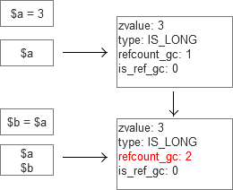
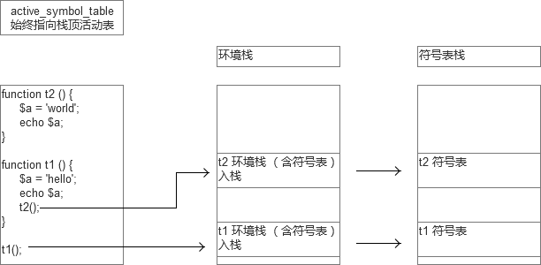
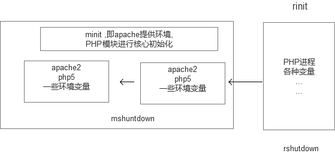

# [PHP_底层分析][0]

 2016年08月26日发布 


### PHP编译特点

**编译型语言**

对于C语言，C++，编译成机器码(二进制)来运行。  
Java语言，把.java 编译成.class， 称为bytecode(字节码)，由jvm来运行

**解释型语言**

解释器解释执行。 典型的如： linux shell

解释器逐行来执行命令

**PHP执行**

PHP是先编译后执行

PHP稍有特殊，虽然是一个脚本语言，但不是靠解释器解释。而是zend虚拟机执行，屏蔽了操作系统的区别。

PHP代码编译成 opcode，由zend虚拟机来执行opcode。

但是opcode ,PHP脚本一结束，opcode就清除了。


> opcode 能否缓存

PHP本身不支持，但是apc，xcache等加速器，实现了这样的效果。


### 变量的底层实现

PHP底层是C语言来实现的，C语言是强类型，而PHP是弱类型语言，是如何实现的

PHP的源码包：

    |__ ext
    |__ main
    |__ pear
    |__ sapi
    |__ tests
    |__ TSRM
    |__ Zend
    |__ .gdbinit
    

最核心的是Zend,这是zend虚拟的实现。包括栈，数据类型，编译器等.  
最重要的main，PHP的一些内建函数，最重要的函数都在该目录下.  
最大的一个目录 ext， PHP的扩展.

PHP的大部分功能，都是以extenstion形式来完成的。  
如果自身开发了一个扩展，也放入ext目录下。

弱类型语言变量的实现

```c
/* zend.h  */
struct _zval_struct {
    zvalue_value value;  /* 值 */
    zend_uint refcount__gc;
    zend_uchar type; /* 活动类型 */
    zend_uchar is_ref__gc;    
}
```

PHP中的一个变量，zend虚拟机中，使用的是 `_zval_struct` 的结构体来描述，变量的值也是一个就结构体来描述.

`_zval_struct`的结构体是由 四个字段/域 (可以理解成关联数组)

zvalue_value value; /* 值 */ PHP变量的值，存储这个字段中。

具体存储的位置：

```c
/* value 值 是一个 联合 */
/* zend.h */
typedef union _zval_value {
    long lval; /* long value */
    double dval; /* double value */
    struct {
        char * val;
        int len;
    } str;
    HashTable *ht; /* hash table 指针 */
    zend_object_value obj;
} zvalue_value;
```

> Zend对变量的表示

zend实现了 zval结构体

```c
{
    value: [联合体] /* 联合体的内容可能是C语言中的long,double,hashtable(*ht),obj, 联合体只能是其中一种类型，是一个枚举 */
    type: 变量类型 , /* IS_NULL,IS_BOOL,IS_STRING, IS_LONG,IS_DOUBLE,IS_ARRAY,IS_OBJECT,IS_RESOURCE */
    refcount_gc
    is_ref_gc 
}
```

C语言中类型对应PHP中的数据类型：

    long -> int
    double -> double
    hashtable -> array
    struct -> string
    obj -> object
    

例如：

```
$a = 3;
{
    value: [long lval = 3]
    type: IS_LONG
}


$a = 3.5;
{
    value: [double dval = 3.5]
    type: IS_DOUBLE
}
```
### 变量类型的实现

zend_uchar type; /* 活动类型 */可以根据上下文环境来强制转换。  
例如：需要echo 的时候 就转换成 string  
需要加减运算就 转换成 int

PHP 中有8种数据类型，为什么`zval->value` 联合体中，只有5种 ?  
1: NULL，直接 `zval->type = IS_NULL`, 就可以表示，不必设置 value 的值。  
2：BOOL， `zval->type = IS_BOOL`. 再设置 `zval.value.lval = 1/0`; (C语言中没有布尔值，都是通过1，0，来表示)  
3: resource ，资源型，往往是服务器上打开一个接口，如果 文件读取接口。 `zval->type = IS_RESOURCE`, `zval->type.lval =` 服务器上打开的接口编号。

```c
struct {
    char * val;
    int len;
} str;
```

PHP中，字符串类型，长度是已经缓存的，调用strlen时，系统可以直接返回其长度，不需要计算。

```php
$b = 'hello';

/**
 * 
 * {
 *     union_zvalue {
 *      // 字符串的指针
 *         struct{
 *             char: 'hello';
 *             len: 5 
 *         } str;
 *     }
 *     type: IS_STRING;
 *  refcount_gc: 1,
 *  is_ref_gc: 0 
 * }
 * 
 */
 
//在PHP中字符串的长度，是直接体现在其结构体中,所以调用strlen(); 速度非常快，时间复杂度为0(1)

echo strlen($b);
```

### 符号表

符号表`symbol_table`，变量的花名册

符号表是什么?

符号表示一张哈希表(哈希结构理解成关联数组)  
里面存储了变量名-> 变量zval结构体的地址

```c
struct _zend_executor_globals {
    ...
    ...
    HashTable * active_symbol_table /* 活动符号表 */
    HashTable symbol_table /* 全局符号表 */
    HashTable included_files; /* files already included */
}
```

- - -

```php
// 变量花名册
$a = 3;
$b = 1.223;
$c = 'hello';

/**
 * 
 * 生成了3个结构体
 * 同时，全局符号表，中多了三条记录
 * 
 * a ---> 0x123 ---> 结构体 { 3 }
 * b ---> 0x21a ---> 结构体 { 1.223 }
 * c ---> 0x1A0 ---> 结构体 { hello }
 *
 */
 
 // 变量声明 
 // 第一：结构体生成
 // 第二：符号表中多了记录，变量的花名册
 // 第三：指向结构体 
```

### 传值赋值

传值赋值发生了什么

在传值赋值时：  
以：$a = 3; $b = $a;为例：  
并没有再次产生结构体，而是2个变量共用1个结构体  
此时，2个变量，指向同1个结构体  
`refcount_gc` 值为 2 (如果没有指针指引，会有垃圾回收机制清除)



### 写时复制

cow写时复制特性

```php
$a = 3;
$b = $a;

/**
 * 
 * 是否产生了2 个结构体?
 * 不是，共用1个， refcount_gc = 2;
 *  
 */

$b = 5;

echo $a, $b; // 3, 5
// $a,$b 指向同一个结构体，那么，修改$b或$a，对方会不会受干扰 ? 没有干扰到对方。具有写时复制的特性 
```

如果有一方修改，将会造成结构体的分裂

结构体一开始共用，到某一方要修改值时，才分裂。这种特性称为：COW 。**`Copy On Write`**。


### 引用赋值

引用赋值发生了什么

当引用赋值时，双方共用一个结构体(`is_ref_gc=1`)

关系图例展示：


### 强制分裂

```php
<?php

// 强制分裂

$a = 3;
/**
 * {
 *         value: 3;
 *         type: IS_LONG;
 *       refcount_gc: 1;
 *         is_ref_gc: 0;
 * }
 */
$b = $a;
/**
 * {
 *         value: 3;
 *    type: IS_LONG;
 *    refcount_gc: 2;
 *    is_ref_gc: 0;
 * }
 */
$c = &$a;
// 不会按照 底下结构体变化
/**
 *    {
 *         value: 3;
 *    type: IS_LONG;
 *    refcount_gc: 3;  
 *    is_ref_gc: 1; 
 * } 
 */    

// 正确的结构体变化
// 如果is_ref_gc  0->1 的过程中(从0到1,表示想引用变量)。refcount_gc>1。多个变量共享一个变量值。将会产生强制分裂
/**
 * // $a $c 结构体 
 *    {
 *    value: 3;
 *    type: IS_LONG;
 *    refcount_gc: 2;  
 *    is_ref_gc: 1; 
 * } 
 * 
 * // $b 结构体
 * {
 *    value: 3;
 *    type: IS_LONG;
 *    refcount_gc: 1;  
 *    is_ref_gc: 0; 
 * }
 *  
 */      

$c = 5;
// a c
/**
 * value: 5
 * type: IS_LONG; 
 * refcount_gc: 2;
 * is_ref_gc: 1;
 */
 
 // b
/**
 * value: 3
 * type: IS_LONG;
 * refcount_gc: 1;
 * is_ref_gc: 0;
 */    

echo $a, $b, $c; // 5 , 3 , 5 
```

引用数组时的一些奇怪现象

```php
// 引用数组时的怪现象
    
$arr = array(0, 1, 2, 3);

$tmp = $arr;

$arr[1] = 11;

echo $arr[1]; // 1

// 数组不会比较细致的检查，多维数组存在。 因此，判断的时候，只会判断外面 一层的 结构体。
```


数组不会比较细致的检查

```php
// 先 引用 后 赋值
$arr = array(0, 1, 2, 3);

$x = &$arr[1];

$tmp = $arr;

$arr[1] = 999;

echo $tmp[1]; // 999 . hash表中的zvalue结构体中会变成引用类型。  // 只去关注外面一层结构体，而不去关注 hash表中的值。


echo '<br/>';

// 先赋值，后引用
$arr = array(0, 1, 2, 3);

$tmp = $arr;

$x = &$arr[1];

$arr[1] = 999;

echo $tmp[1]; // 1     
```

### 循环数组

循环数组时的怪现象

```php
// 循环数组时的怪现象
$arr = array(0, 1, 2, 3);

foreach ( $arr as $v ) {
    
}

var_dump(current($arr));  // 数组指针停留在数组结尾处， 取不到值. false

echo '<br/>';

$arr = array(0, 1, 2, 3);

foreach ( $arr as $val=>$key ) { // foreach 使用的 $arr 是   $arr的副本.
    $arr[$key] = $val;  // 修改之后，就会产生分裂。 foreach 遍历的是 $arr 的副本。 但是原数组的指针已经走了一步. 
} 

var_dump(current($arr)); // 1
```

- - -

```php
$arr = array('a', 'b', 'c', 'd');

foreach ( $arr as &$val ) {  // 该foreach 会导致 $val = &$arr[3];
    
}

foreach ( $arr as $val ) {
    print_r($arr);
    echo '<br/>';
}
// 两个问题： 
// 数组使用时，要慎用引用。
// foreach 使用后，不会把数组的内部指针重置, 使用数组时，不要假想内部指针指向数组头部. 也可以在foreach 之后 reset(); 指针。
```

### 符号表与作用域

当执行到函数时，会生成函数的“执行环境结构体”，包含函数名，参数，执行步骤，所在的类（如果是方法），以及为这个函数生成一个符号表。  
符号表统一放在栈上，并把active_symbol_table指向刚产生的符号表。

```c
// Zend/zend_compiles.h 文件中

// 源码：
struct _zend_execute_data {
    struct _zend_op *opline;
    zend_function_state function_state;
    zend_op_array *op_array;
    zval *object;
    HashTable *symbol_table;
    struct _zend_execute_data *prev_execute_data;
    zval *old_error_reporting;
    zend_bool nested;
    zval **original_return_value;
    zend_class_entry *current_scope;
    zend_class_entry *current_called_scope;
    zval *current_this;
    struct _zend_op *fast_ret; /* used by FAST_CALL/FAST_RET (finally keyword) */
    zval *delayed_exception;
    call_slot *call_slots;
    call_slot *call;
};
```

- - -

```c
// 简化：

struct _zend_execute_data {
    ...
    zend_op_array *op_array;     // 函数的执行步骤. 如果是函数调用。是函数调用的后的opcode
    HashTable *symbol_table; // 此函数的符号表地址
    zend_class_entry *current_scope; // 执行当前作用域
    zval * current_this;  // 对象 调用 this绑定 
    zval * current_object;  // object 的指向
    ...
}
```



一个函数调用多次，会有多少个`*op_array` ?  
**一个函数产生 一个`*op_array`**. 调用多次，会产生多个 环境结构体， 会依次入栈，然后顺序执行。  
调用多少次，就会入栈多少次。不同的执行环境，靠 唯一的 `*op_array` 来执行。

函数什么时候调用， 函数编译后的 opcode 什么时候执行。

```php
$age = 23;

function t() {
    $age = 3;
    echo $age;
}

t();

/**
 * t 函数 在执行时，根据函数的参数，局部变量等，生成一个执行环境结构体。
 * 结构体 入栈，函数编译后的 opcode， 称为 op_array （就是执行逻辑）。开始执行， 以入栈的环境结构体为环境来执行。
 * 并生成此函数的 符号表， 函数寻找变量， 就在符号表中寻找。即局部变量。(一个环境结构体，就对应一张符号表)
 * 
 * 
 * 注意： 函数可能调用多次。栈中可能有某函数的多个执行环境 入栈。但是 op_array 只有一个。
 * 
 */
```

### 静态变量

静态变量的实现

```c
// Zend/zend_compile.h  
struct _zend_op_array {
    /* Common elements */
    zend_uchar type;
    const char *function_name;
    zend_class_entry *scope;
    zend_uint fn_flags;
    union _zend_function *prototype;
    zend_uint num_args;
    zend_uint required_num_args;
    zend_arg_info *arg_info;
    /* END of common elements */

    zend_uint *refcount;

    zend_op *opcodes;
    zend_uint last;

    zend_compiled_variable *vars;
    int last_var;

    zend_uint T;

    zend_uint nested_calls;
    zend_uint used_stack;

    zend_brk_cont_element *brk_cont_array;
    int last_brk_cont;

    zend_try_catch_element *try_catch_array;
    int last_try_catch;
    zend_bool has_finally_block;

    /* static variables support */
    HashTable *static_variables;

    zend_uint this_var;

    const char *filename;
    zend_uint line_start;
    zend_uint line_end;
    const char *doc_comment;
    zend_uint doc_comment_len;
    zend_uint early_binding; /* the linked list of delayed declarations */

    zend_literal *literals;
    int last_literal;

    void **run_time_cache;
    int  last_cache_slot;

    void *reserved[ZEND_MAX_RESERVED_RESOURCES];
};
```

- - -

```c
// 简化
struct _zend_op_array {
    ... 
    HashTable *static_variables;    // 静态变量
    ...
}
```

编译后的 `op_array` 只有一份。 静态变量并没有存储在符号表(symbol_table)中.而是存放在`op_array`中。

```php
function t() {
    
    static $age = 1;
    
    return $age += 1;
    
}

echo t();
echo t();
echo t();

// 静态变量 不再和 执行的结构体， 也不再和 入栈的符号表有关。
```


### 常量

```c
// Zend/zend_constants.h
// 常量结构体 
typedef struct _zend_constant {
    zval value; // 变量结构体
    int flags; // 标志，是否大小写敏感等
    char *name; // 常量名
    uint name_len; // 
    int module_number; // 模块名
} zend_constant;
```

#### define函数的实现

define函数当然是 调用`zend_register_constant`声明的常量  
具体如下：Zend/zend_builtin_functions.c

// 源码：

```c
ZEND_FUNCTION(define)
{
    char *name;
    int name_len;
    zval *val;
    zval *val_free = NULL;
    zend_bool non_cs = 0;
    int case_sensitive = CONST_CS;
    zend_constant c;

    if (zend_parse_parameters(ZEND_NUM_ARGS() TSRMLS_CC, "sz|b", &name, &name_len, &val, &non_cs) == FAILURE) {
        return;
    }

    if(non_cs) {
        case_sensitive = 0;
    }

    /* class constant, check if there is name and make sure class is valid & exists */
    if (zend_memnstr(name, "::", sizeof("::") - 1, name + name_len)) {
        zend_error(E_WARNING, "Class constants cannot be defined or redefined");
        RETURN_FALSE;
    }

repeat:
    switch (Z_TYPE_P(val)) {
        case IS_LONG:
        case IS_DOUBLE:
        case IS_STRING:
        case IS_BOOL:
        case IS_RESOURCE:
        case IS_NULL:
            break;
        case IS_OBJECT:
            if (!val_free) {
                if (Z_OBJ_HT_P(val)->get) {
                    val_free = val = Z_OBJ_HT_P(val)->get(val TSRMLS_CC);
                    goto repeat;
                } else if (Z_OBJ_HT_P(val)->cast_object) {
                    ALLOC_INIT_ZVAL(val_free);
                    if (Z_OBJ_HT_P(val)->cast_object(val, val_free, IS_STRING TSRMLS_CC) == SUCCESS) {
                        val = val_free;
                        break;
                    }
                }
            }
            /* no break */
        default:
            zend_error(E_WARNING,"Constants may only evaluate to scalar values");
            if (val_free) {
                zval_ptr_dtor(&val_free);
            }
            RETURN_FALSE;
    }
    
    c.value = *val;
    zval_copy_ctor(&c.value);
    if (val_free) {
        zval_ptr_dtor(&val_free);
    }
    c.flags = case_sensitive; /* non persistent */
    c.name = str_strndup(name, name_len);
    if(c.name == NULL) {
        RETURN_FALSE;
    }
    c.name_len = name_len+1;
    c.module_number = PHP_USER_CONSTANT;
    if (zend_register_constant(&c TSRMLS_CC) == SUCCESS) {
        RETURN_TRUE;
    } else {
        RETURN_FALSE;
    }
}
```

- - -

```c
// 关键代码：

c.value = *val;
zval_copy_ctor(&c.value);
if (val_free) {
    zval_ptr_dtor(&val_free);
}
c.flags = case_sensitive; /* 大小写敏感 */
c.name = str_strndup(name, name_len);
if(c.name == NULL) {
    RETURN_FALSE;
}
c.name_len = name_len+1;
c.module_number = PHP_USER_CONSTANT; /* 用户定义常量 */
if (zend_register_constant(&c TSRMLS_CC) == SUCCESS) {
    RETURN_TRUE;
} else {
    RETURN_FALSE;
}
```

常量就一个符号(哈希)表. 都使用一个符号表。所以全局有效。

常量的生成

```c
int zend_register_constant(zend_constant *c TSRMLS_DC) {
    ...
    ...
    zend_hash_add(EG(zend_constants), name, c->name_len, (vaid*)c,sizeof(zend_constant, NULL) == FAILURE);
    ...
    ...
}
```

对象定义常量

```php
class Dog {
    
    public $name = 'kitty';
    
    public function __toString () {
        return $this->name;
    }
    
}

$dog = new Dog();


define('DOG', $dog);

print_r(DOG);

/**
 * define 值为对象时，会把对象装成标量来存储，需要类有 __toString魔术方法
 */    
```

### 对象

对象的底层实现

Zend/zend.h

```c
struct _zval_struct {
    /* Variable information */
    zvalue_value value;        /* value */
    zend_uint refcount__gc;
    zend_uchar type;    /* active type */
    zend_uchar is_ref__gc;
};

// zvalue
typedef union _zvalue_value {
    long lval;                    /* long value */
    double dval;                /* double value */
    struct {
        char *val;
        int len;
    } str;
    HashTable *ht;                /* hash table value */
    zend_object_value obj;
    zend_ast *ast;
} zvalue_value;

// 在 zend.h 中 查看到 `zend_object_value obj;`  是以zend_object_value 定义. 在Zend/zend_types.h 文件中继续查看

// Zend/zend_types.h
```

定义`zend_object_value` 结构体

```c
typedef struct _zend_object_value {
    zend_object_handle handle;
    const zend_object_handlers *handlers;
} zend_object_value;
```

通过new出来的对象，返回的是什么。是`zend_object_value.` 并不是真正的对象，而是对象的指针。

返回的 handle再次指向对象。

每次new一个对象，对象就存入一张hash表中。(形象的称之为对象池)


对象存储时的特点：

```php
// 对象

class Dog {
    public $leg = 4;
    public $wei = 20;
}

$dog = new Dog();

// $dog 是一个对象么?
// 严格说，并不是对象.
/**
 * {
 *     handle --指向-->  [hash表 {leg: 4, wei: 20}] // hash表中存在 对象    
 * }
 */
 
$d2 = $dog;

$d2->leg = 5;

echo $dog->leg, '`', $d2->leg; // 5`5

// 对象并不是 引用赋值. 主要原因  zval 结构体 是再次指向一个hash表中的 对象池
$d2 = false;

echo $dog->leg; // 5
```


### 内存分层

内存管理与垃圾回收

PHP封装了对系统内存的请求  
不要直接使用malloc直接请求内存


PHP函数需要内存的时候，是通过`emalloc`,`efree`.   
`emalloc`,`efree`向 `mm_heap`索要空间。

zend 中底层都离不开hash表。PHP中的HashTable太强大。


PHP 底层 所有的变量都是 放在 `zend_mm_heap` 中。 然后通过 各自的hash表来指向或跟踪。

> zend虚拟机的运行原理

* PHP语法实现
```
    Zend/zend_language_scanner.l
    Zend/zend_language_parser.y
```
* OPcode编译
```
    Zend/zend.compile.c
```
* 执行引擎
```
    Zend/zend_vm_*
    Zend/zend_execute.c
```

> 以apache模块运行时的流程



[0]: /a/1190000006725176
[1]: /t/php/blogs
[2]: /u/alogy