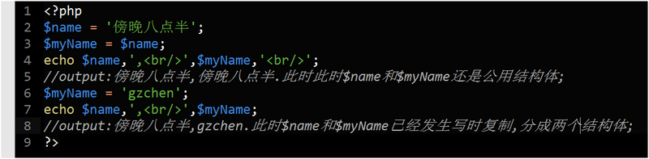
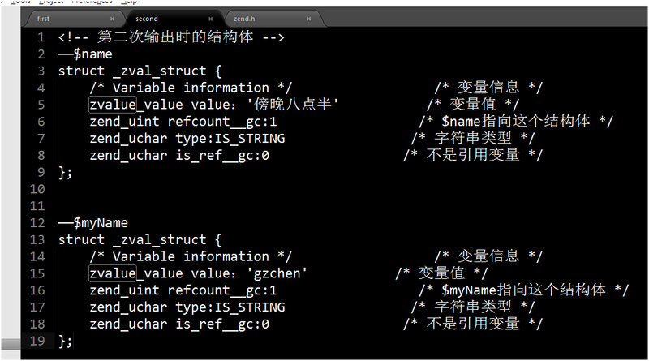

# [PHP底层分析：关于写时复制(cow)][0]

 2016年04月12日发布 

想要走到技术的天花板，那么学习过程中在于知其然且知其所以然。

今天我们来讨论一下PHP底层的写时复制(也称写时分裂)。

首先我们先来看看一段代码：

两段代码的输出结果相信各位都知道，但是我们今天讲讲这之中发生了什么。

下图是PHP存储变量的结构体(为方便讲解已写了注释)，zend.h在Zend目录下。

可以看到，该结构体存储了关于变量值，有几个变量指向该结构体，变量类型，是否为引用变量等信息。

那么第一次打印发生了什么呢？变量的信息进入了一个结构体，相关如下：

$name = ‘傍晚八点半’;  
$myName = $name;

此时$name和$myName共用一个结构体的，refcount__gc为2，

我们发现，$myName = $name;这个过程中并没有主动变成两个结构体(这也算PHP内部实现优化的一种，只用一个结构体，省了内存)。

那么当代码运行到 $myName = ‘gzchen’; 的时候，结构体如何变化呢？由于第一次输出时是两个变量共用结构体，那么此时更改其中一个变量，会不会导致两个值一起变化呢？纯粹从结构体的逻辑来看，是有可能的，毕竟大家共用着这个结构体嘛。

那么我们看下第二次打印是怎么样的情况，相关变化如下：

并没有按照我们所想的将$name和$myName同时改成’gzchen’，而是复制多了一份结构体出来，两个结构体分别对应着$name和$myName。

这个就是写时复制(Copy-on-write，COW)在作怪，他没有在$myName = $name;赋值的时候就分裂成两个结构体，而是在我们改写其中一个变量时发生效果，属于一种慢复制（也称慢分裂）。

伪代码如下：

我们再看下另外一段代码：

输出为’b’，中途发生了什么？

其实foreach遍历过程中，并不是直接操作$arr(原数组)的，而是会将$arr复制出一个$arrcopy(实际上是一个副本，我这里以$arrcopy代替）,foreach在遍历过程中操作的其实一直是$arrcopy，大概的流程是这样：

和上面举得例子其实是一个道理，我们可以看出，刚开始($arr = $arrcopy)还是共用一个结构体的，但是$arr[$k] = $v又再次赋值，发生了写时复制，结构体就分裂了。

然后前面说过foreach操作的是$arrcopy,所以$arr的结构体指针就被停留在第一位了（因为结构体不一样了，$arrcopy没办法同步给$arr赋值了）。

其实这类技术通常只会在面试中用到，日常开发会用这种写法的人终究还是少数，暂时看不明白的朋友也不用太在意，只要知道有”写时复制”这个情况出现就行了。

[0]: /a/1190000004926603
[1]: /t/php/blogs
[2]: /u/gzchen