# 十五张思维导图带你快速学习PHP语言基础

## 0x00 PHP 简介

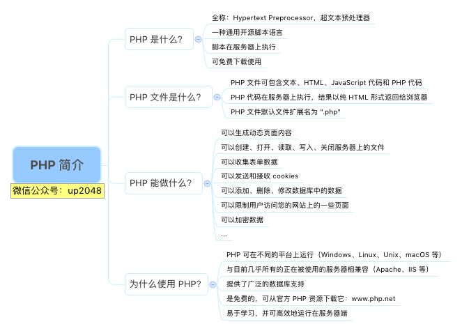

## 0x01 PHP 安装

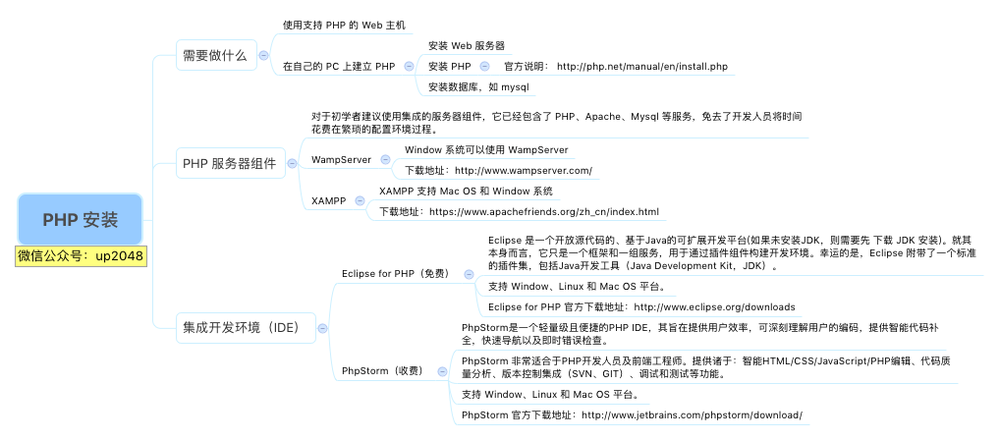

## 0x02 PHP 语法

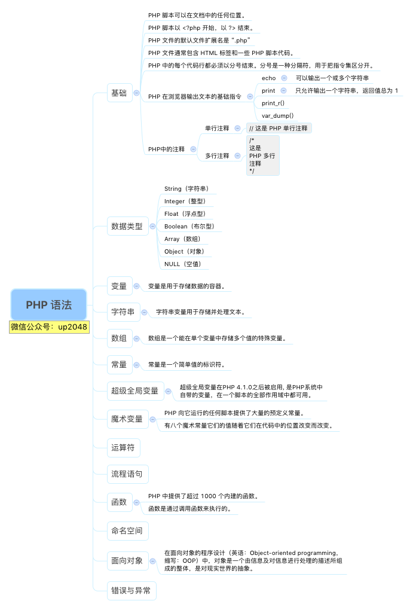

## 0x03 PHP 数据类型

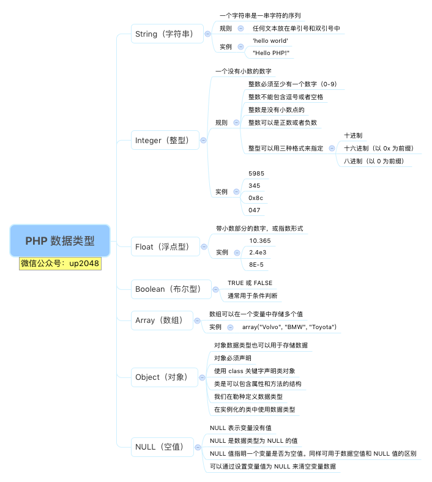

## 0x04 PHP 变量

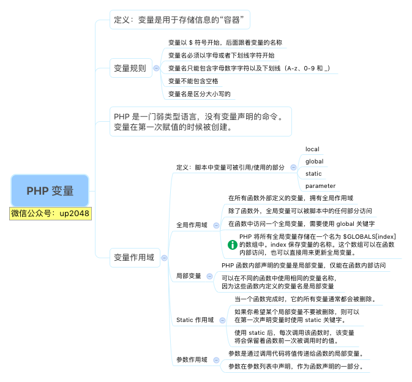

## 0x05 PHP 数组

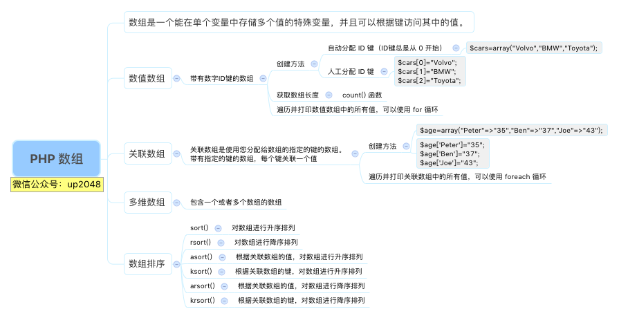

## 0x06 PHP 常量

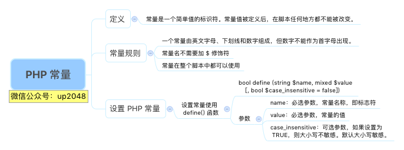

## 0x07 PHP 超级全局变量

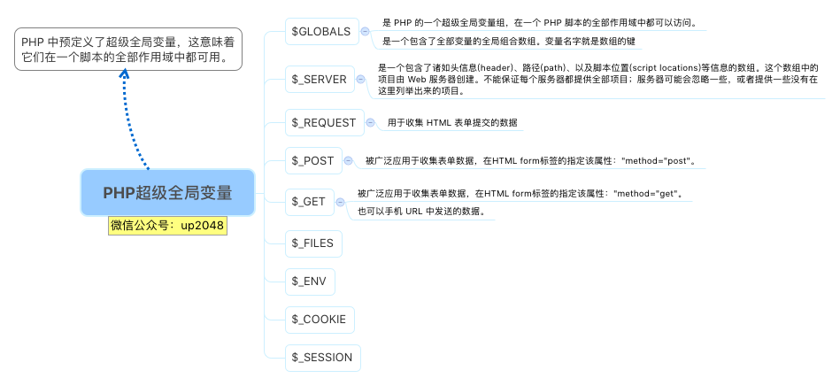

## 0x08 PHP 魔术变量

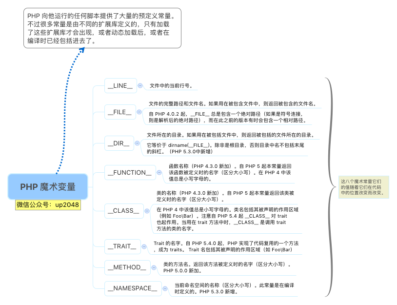

## 0x09 PHP 运算符

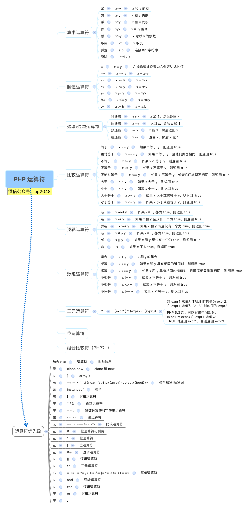

## 0x0A PHP 流程语句

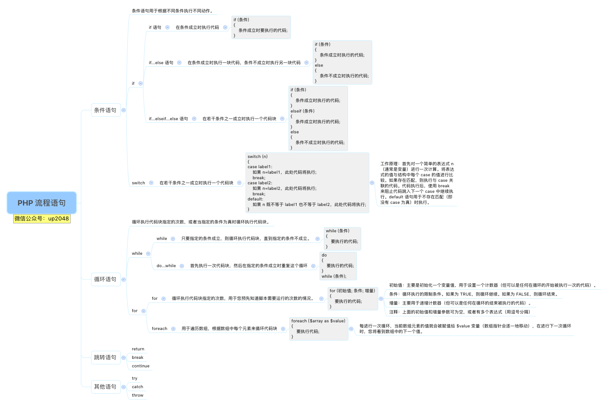

## 0x0B PHP 函数

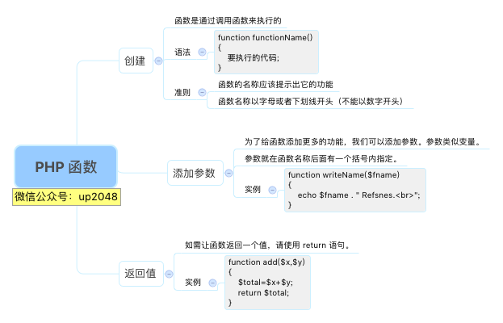

## 0x0C PHP 命名空间

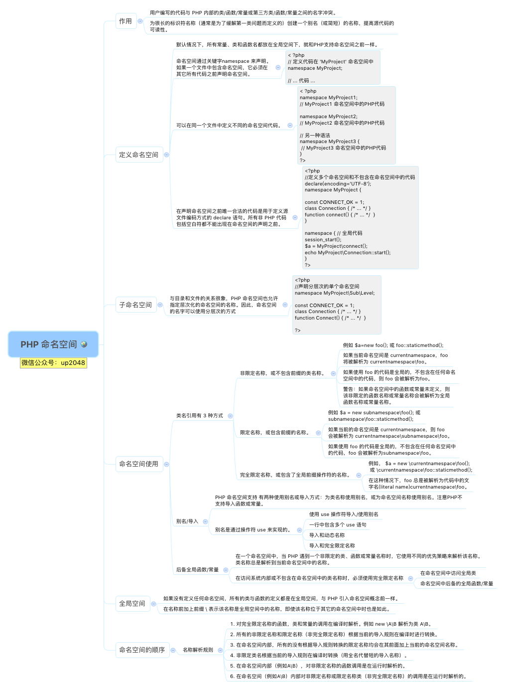

## 0x0D PHP 面向对象

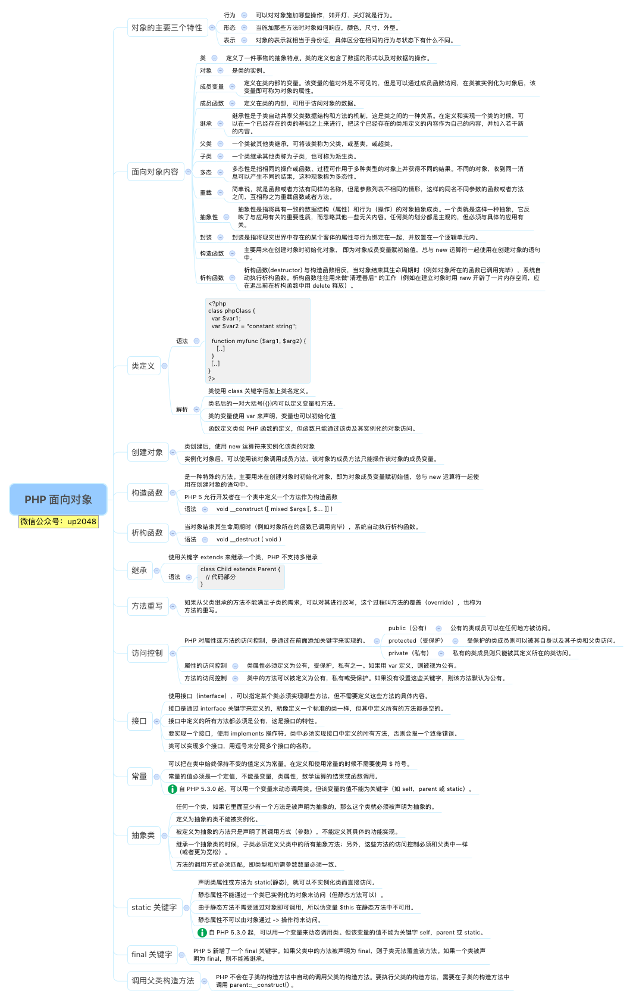

## 0x0E PHP 错误与异常

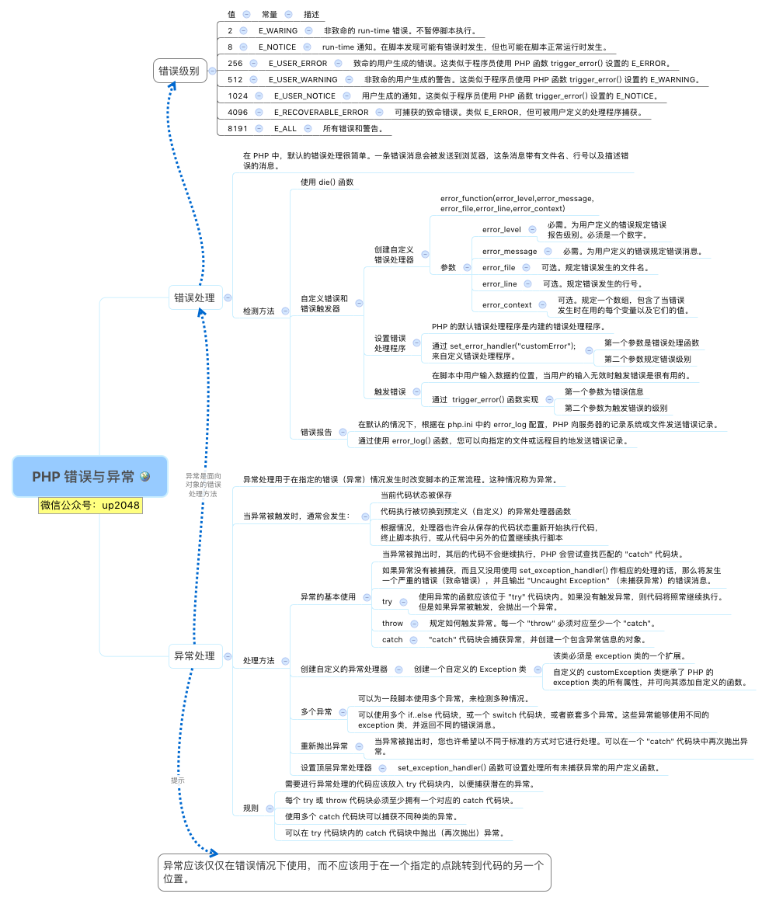

