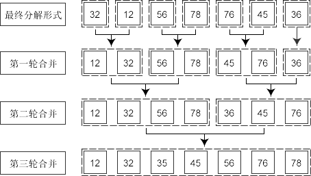

###  请填充代码，使mySort()能使传入的参数按照从小到大的顺序显示出来。

```js
    function mySort() {
        var tags = new Array();
        for (var i = 0; i < arguments.length; i++) {
            tags.push(arguments[i]);
        }
        tags.sort(function sortNum(a, b) {
            return a - b;
        });
        return tags;
    }
    
    var result = mySort(50, 11, 16, 32, 24, 99, 57, 100);
    console.info(result);
```

###  冒泡排序

```js
    function bubbleSort(arr) {
        for (var i = 0; i < arr.length; i++) {
            for (var j = 0; j < arr.length - i; j++) {
                var temp = 0;
                // ">" 从小到大排序
                // "<" 从大到小排序
                if (arr[j] > arr[j + 1]) {
                    temp = arr[j];
                    arr[j] = arr[j + 1];
                    arr[j + 1] = temp;
                }
            }
        }
        return arr;
    }
```


###  快速排序

```js
     function quickSort(elements) {
        if (elements.length <= 1) {
            return elements;
        }
        var pivotIndex = Math.floor(elements.length / 2);
        var pivot = elements.splice(pivotIndex, 1)[0];
        var left = [];
        var right = [];
        for (var i = 0; i < elements.length; i++) {
            if (elements[i] < pivot) {
                left.push(elements[i]);
            } else {
                right.push(elements[i]);
            }
        }
        return quickSort(left).concat([pivot], quickSort(right));
    }
```


###  插入排序

```js
    insertSort = function (elements) {
        var i = 1,
            j, step, key, len = elements.length;
        for (; i < len; i++) {
            step = j = i;
            key = elements[j];
            while (--j > -1) {
                if (elements[j] > key) {
                    elements[j + 1] = elements[j];
                } else {
                    break;
                }
            }
            elements[j + 1] = key;
        }
        return elements;
    };
```


###  二分查找-递归方法

```js
    function binarySearch(arr, key, leftIndex, rightIndex) {
        if (leftIndex > rightIndex) {
            return -1;
        }
        var mid = parseInt((leftIndex + rightIndex) / 2);
        if (arr[mid] == key) {
            return mid;
        } else if (arr[mid] > key) {
            rightIndex = mid - 1;
            return binarySearch(arr, key, leftIndex, rightIndex);
        } else if (arr[mid] < key) {
            leftIndex = mid + 1;
            return binarySearch(arr, key, leftIndex, rightIndex);
        }
    }
```


###  二分查找-非递归方法

```js
    function binarySearch(arr, key) {
        var leftIndex = 0,
            rightIndex = arr.length - 1;
        while (leftIndex <= rightIndex) {
            var mid = parseInt((leftIndex + rightIndex) / 2);
            if (arr[mid] == key) {
                return mid;
            } else if (arr[mid] < key) {
                leftIndex = mid + 1;
            } else if (arr[mid] > key) {
                rightIndex = mid - 1;
            } else {
                return -1;
            }
        }
    }
```

### 归并排序

#### 1.1 算法描述

归并排序是建立在归并操作上的一种有效的排序算法。该算法是采用分治法（Divide and Conquer）的一个典型的应用。 合并排序法是将两个（或两个以上）有序表合并成一个新的有序表，即把待排序序列分为若干个子序列，每个子序列是有序的。然后再把有序子序列合并为整体有序序列。 将已有序的子序列合并，得到完全有序的序列；即先使每个子序列有序，再使子序列段间有序。若将两个有序表合并成一个有序表，称为2-路归并。



#### 1.2 算法分析

* 时间复杂度：O (nlogn)
* 空间复杂度：O (n)

#### 1.3 算法实现

```js
    function merge(leftArr, rightArr){  
        var result = [];  
        while (leftArr.length > 0 && rightArr.length > 0){  
          if (leftArr[0] < rightArr[0])  
            result.push(leftArr.shift()); //把最小的最先取出，放到结果集中   
          else   
            result.push(rightArr.shift());  
        }   
        return result.concat(leftArr).concat(rightArr);  //剩下的就是合并，这样就排好序了  
    }  
    
    function mergeSort(array){  
        if (array.length == 1) return array;  
        var middle = Math.floor(array.length / 2);       //求出中点  
        var left = array.slice(0, middle);               //分割数组  
        var right = array.slice(middle);  
        return merge(mergeSort(left), mergeSort(right)); //递归合并与排序  
    }  
    
    var arr = mergeSort([32,12,56,78,76,45,36]);
    console.log(arr);   // [12, 32, 36, 45, 56, 76, 78]
```
